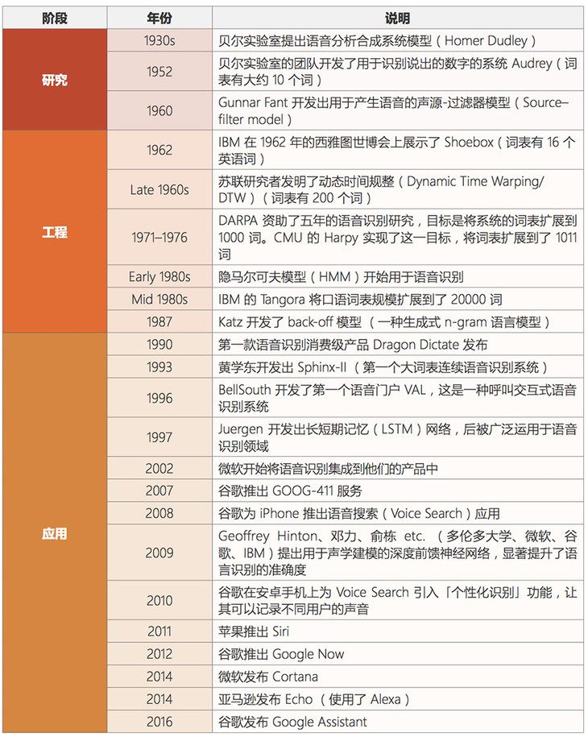
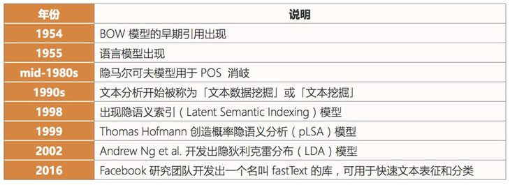
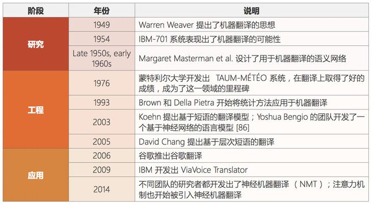

# 人工智能概述

# 1 概述

人工智能（Artificial Intelligence），英文缩写为AI。它是研究、开发用于模拟、延伸和扩展人的智能的理论、方法、技术及应用系统的一门新的技术科学。

人工智能是计算机科学的一个分支，它企图了解智能的实质，并生产出一种新的能以人类智能相似的方式做出反应的智能机器，该领域的研究包括机器人、语言识别、图像识别、自然语言处理和专家系统等。人工智能从诞生以来，理论和技术日益成熟，应用领域也不断扩大，可以设想，未来人工智能带来的科技产品，将会是人类智慧的“容器”。人工智能可以对人的意识、思维的信息过程的模拟。人工智能不是人的智能，但能像人那样思考、也可能超过人的智能。

# 2 人工智能的三次浪潮

- 1956 Artificial Intelligence提出
- 1950-1970 符号主义流派：专家系统占主导地位
  - 1950：图灵设计国际象棋程序
  - 1962：IBM 的跳棋程序战胜人类高手（人工智能第一次浪潮）
- 1980-2000统计主义流派：主要用统计模型解决问题
  - 1993： SVM模型
  - 1997：IBM 深蓝战胜象棋选手卡斯帕罗夫（人工智能第二次浪潮）
- 2010-至今神经网络、深度学习、大数据流派
  - 2006 DNN（深度神经网络）
  - 2016：Google AlphaGO 战胜围棋选手李世石（人工智能第三次浪潮）

# 3 人工智能发展必备三要素

- **数据**（data）
- **算法**（algorithm）
- **计算力**（computing power）
  - CPU GPU TPU
  - 计算力之CPU、GPU对比：
    - CPU主要适合I\O密集型的任务
    - GPU主要适合计算密集型任务

## 3.1 什么类型的程序适合在GPU上运行

- **计算密集型的程序。**
  - 所谓计算密集型（Compute-intensive）的程序，就是其大部分运行时间花在了寄存器运算上，寄存器的速度和处理器的速度相当，从寄存器读写数据几乎没有延时。可以做一下对比，读内存的延迟大概是几百个时钟周期；读硬盘的速度就不说了，即便是SSD, 也实在是太慢了。　　

- **易于并行的程序。**
  - GPU其实是一种SIMD（Single Instruction Multiple Data）架构， 他有成百上千个核，每一个核在同一时间最好能做同样的事情。

# 4 机器学习概述

机器学习，它正是这样一门学科，它致力于研究如何通过计算（CPU和GPU计算）的手段，利用经验来改善（计算机）系统自身的性能。

它是人工智能的核心，是使计算机具有智能的根本途径，应用遍及人工智能各领域。

数据+ 机器学习算法= 机器学习模型

有了学习算法我们就可以把经验数据提供给它，它就能基于这些数据产生模型。

## 4.1 人工智能、机器学习、深度学习的关系

- **机器学习是人工智能的一个实现途径**
- **深度学习是机器学习的一个方法发展而来**

# 5 人工智能主要分支

## 5.1 概述

通讯、感知与行动是现代人工智能的三个关键能力。以此人工智能主要有三个分支：

- **计算机视觉（CV）**
- 自然语言处理（NLP）
  - 在 NLP 领域中，将覆盖文本挖掘/分类、机器翻译和语音识别。
- **机器人**

## 5.2 计算机视觉

**计算机视觉（CV）是指机器感知环境的能力**。这一技术类别中的经典任务有图像形成、图像处理、图像提取和图像的三维推理。**物体检测和人脸识别是其比较成功的研究领域。**

**当前阶段：**

计算机视觉现已有很多应用，这表明了这类技术的成就，也让我们将其归入到应用阶段。随着深度学习的发展，机器甚至能在特定的案例中实现超越人类的表现。但是，**这项技术离社会影响阶段还有一定距离，那要等到机器能在所有场景中都达到人类的同等水平才行（感知其环境的所有相关方面）。**

**发展历史：**

## 5.3 语音识别

**语音识别是指识别语音（说出的语言）并将其转换成对应文本的技术**。相反的任务（文本转语音/TTS）也是这一领域内一个类似的研究主题。

**当前阶段：**

语音识别已经处于应用阶段很长时间了。最近几年，随着大数据和深度学习技术的发展，语音识别进展颇丰，现在已经非常接近社会影响阶段了。

语音识别领域仍然面临着**声纹识别**和**「鸡尾酒会效应」**等一些特殊情况的难题。

现代语音识别系统严重依赖于云，**在离线时可能就无法取得理想的工作效果。**

发展历史：

## 5.4 文本挖掘/分类

**这里的文本挖掘主要是指文本分类，该技术可用于理解、组织和分类结构化或非结构化文本文档。**其涵盖的主要任务有句法分析、情绪分析和垃圾信息检测。

**当前阶段：**

我们将这项技术归类到应用阶段，因为现在有很多应用都已经集成了基于文本挖掘的情绪分析或垃圾信息检测技术。文本挖掘技术也在智能投顾的开发中有所应用，并且提升了用户体验。

**文本挖掘和分类领域的一个瓶颈出现在歧义和有偏差的数据上。**

**发展历史：**

## 5.5 机器翻译

**机器翻译(MT)是利用机器的力量自动将一种自然语言(源语言)的文本翻译成另一种语言（目标语言）。**

**当前阶段：**

机器翻译是一个见证了大量发展历程的应用领域。该领域最近由于神经机器翻译而取得了非常显著的进展，但仍然没有全面达到专业译者的水平；但是，我们相信在大数据、云计算和深度学习技术的帮助下，机器翻译很快就将进入社会影响阶段。

在某些情况下，**俚语和行话等内容的翻译会比较困难**（受限词表问题）。

**专业领域的机器翻译（比如医疗领域）表现通常不好**。

发展历史：

## 5.6 机器人

**机器人学（Robotics）研究的是机器人的设计、制造、运作和应用，以及控制它们的计算机系统、传感反馈和信息处理。**

**机器人可以分成两大类:固定机器人和移动机器人。**固定机器人通常被用于工业生产（比如用于装配线）。常见的移动机器人应用有货运机器人、空中机器人和自动载具。机器人需要不同部件和系统的协作才能实现最优的作业。其中在硬件上包含传感器、反应器和控制器；另外还有能够实现感知能力的软件，比如定位、地图测绘和目标识别。

**当前阶段：**

自上世纪「Robot」一词诞生以来，人们已经为工业制造业设计了很多机器人。工业机器人是增长最快的应用领域，它们在 20 世纪 80 年代将这一领域带入了应用阶段。在安川电机、Fanuc、ABB、库卡等公司的努力下，我们认为进入 21 世纪之后，机器人领域就已经进入了社会影响阶段，此时各种工业机器人已经主宰了装配生产线。此外，软体机器人在很多领域也有广泛的应用，比如在医疗行业协助手术或在金融行业自动执行承销过程。

但是，法律法规和「**机器人威胁论**」可能会妨碍机器人领域的发展。还有**设计和制造机器人需要相对较高的投资**。

**发展历史**：

