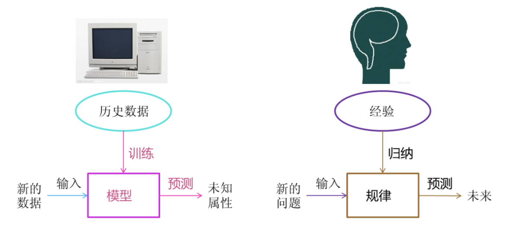
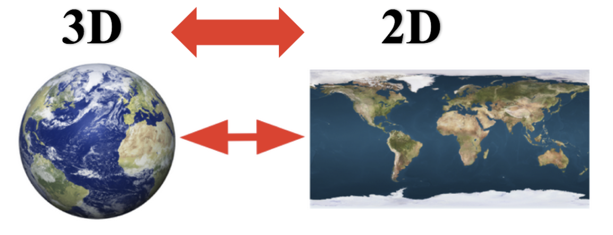
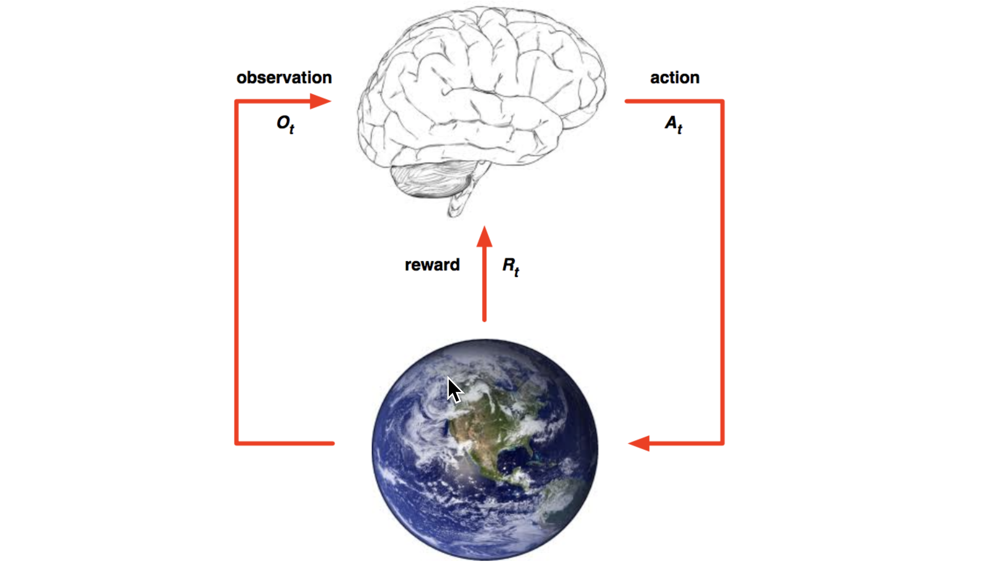
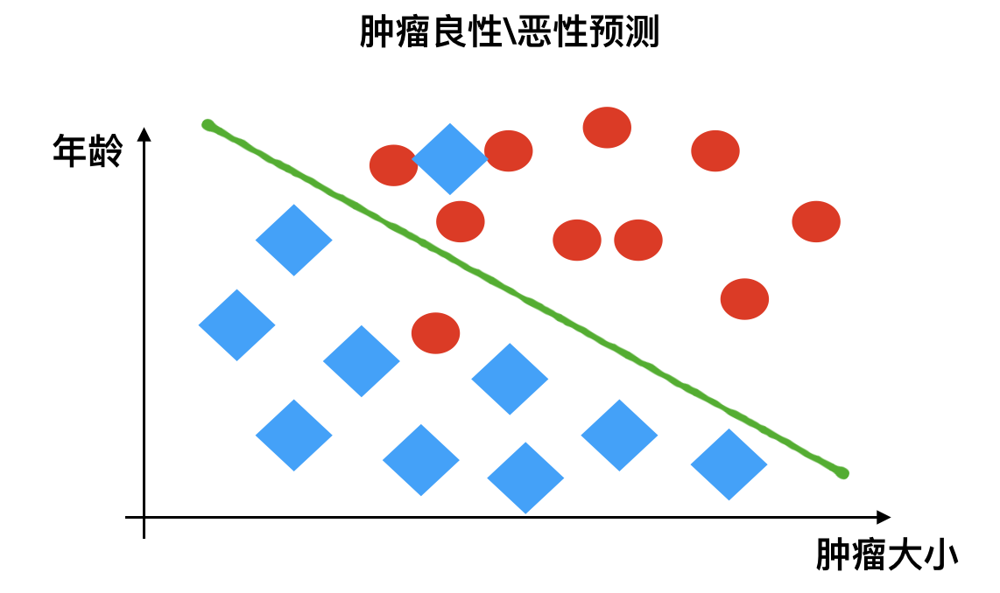

# 机器学习概述

# 1 什么是机器学习

机器学习是从**数据**中**自动分析获得模型**，并利用**模型**对未知数据进行预测。



# 2 机器学习工作流程


- 机器学习工作流程总结
  - **1.获取数据**
  - **2.数据基本处理**
  - **3.特征工程**
  - **4.机器学习（模型训练）**
  - 5.模型评估
    - 结果达到要求，上线服务
    - 没有达到要求，重新上面步骤

## 2.1 获取到的数据集介绍

- 在数据集中一般：
  - 一行数据我们称为一个**样本**
  - 一列数据我们成为一个**特征**
  - 有些数据有**目标值（标签值）**，有些数据没有目标值
- **数据类型构成：**
  - 数据类型一：特征值+目标值（目标值是连续的和离散的）
  - 数据类型二：只有特征值，没有目标值
- **数据分割：**
  - 机器学习一般的数据集会划分为两个部分：
    - 训练数据：用于训练，**构建模型**
    - 测试数据：在模型检验时使用，用于**评估模型是否有效**
  - 划分比例：
    - 训练集：70% 80% 75%
    - 测试集：30% 20% 25%

## 2.2 数据基本处理

 即对数据进行缺失值、去除异常值等处理。

## 2.3 特征工程

#### 2.3.1 什么是特征工程

特征工程（Feature Engineering）是使用**专业背景知识和技巧处理数据**，**使得特征能在机器学习算法上发挥更好的作用的过程**。

- 意义：会直接影响机器学习的效果

#### 2.3.2 为什么需要特征工程

> 机器学习领域的大神Andrew Ng（吴恩达）老师说“Coming up with features is difficult, time-consuming, requires expert knowledge. “Applied machine learning” is basically feature engineering. ”
>
> 注：业界广泛流传：数据和特征决定了机器学习的上限，而模型和算法只是逼近这个上限而已。

#### 2.3.3 特征工程包含内容

- 特征提取
- 特征预处理
- 特征降维

#### 2.3.4 特征工程类别介绍

- 特征提取
  - 将任意数据（如文本或图像）转换为可用于机器学习的数字特征


- 特征预处理
  - 通过**一些转换函数**将特征数据**转换成更加适合算法模型**的特征数据过程


- 特征降维
  - 指在某些限定条件下，**降低随机变量（特征）个数**，得到**一组“不相关”主变量**的过程



## 2.4 机器学习算法分类

| 算法                                       | In                     | Out        | 目的               | 案例                 |
| ------------------------------------------ | ---------------------- | ---------- | ------------------ | -------------------- |
| **监督学习（supervised learning）**        | 有标签                 | 有反馈     | 预测结果           | 猫狗分类 房价预测    |
| **无监督学习（unsupervised learning）**    | 无标签                 | 无反馈     | 发现潜在结构       | “物以类聚，人以群分” |
| **半监督学习（Semi-Supervised Learning）** | 部分有标签，部分无标签 | 有反馈     | 降低数据标记的难度 |                      |
| **强化学习（reinforcement learning）**     | 决策流程及激励系统     | 一系列行动 | 长期利益最大化     | 学下棋               |

### 2.4.1  监督学习

- 定义：
  - 输入数据是由特征值和目标值所组成。
    - 函数的输出可以是一个连续的值——称为回归；
    - 函数的输出可以是有限个离散值——称作分类。

#### 2.4.1.1 回归问题

例如：预测房价，根据样本集拟合出一条连续曲线。


#### 2.4.1.2 分类问题

例如：根据肿瘤特征判断良性还是恶性，得到的是结果是“良性”或者“恶性”，是离散的。


### 2.4.2 无监督学习

- 定义：
  - 输入数据是由特征值组成，没有目标值；
  - 输入数据没有被标记，也没有确定的结果。样本数据类别未知；
  - 需要根据样本间的相似性对样本集进行类别划分。

举例：

 

- **有监督，无监督算法对比：**
  - 监督学习
    - 输入数据有特征值，有目标值
      - 目标值连续：回归
      - 目标值分散：分类
  - 无监督学习
    - 输入的数据有特征值，无目标值

### 2.4.3 半监督学习

- 定义：
  - 训练集同时包含有标记样本数据和未标记样本数据。

举例：

- **监督学习训练方式：**


- **半监督学习训练方式**


### 2.4.4 强化学习

- 定义：
  - 实质是make decisions 问题，即自动进行决策，并且可以做连续决策。

举例：

小孩想要走路，但在这之前，他需要先站起来，站起来之后还要保持平衡，接下来还要先迈出一条腿，是左腿还是右腿，迈出一步后还要迈出下一步。

小孩就是 **agent**，他试图通过采取**行动**（即行走）来操纵**环境**（行走的表面），并且从**一个状态转变到另一个状态**（即他走的每一步），当他完成任务的子任务（即走了几步）时，孩子得到**奖励**（给巧克力吃），并且当他不能走路时，就不会给巧克力。

主要包含五个元素：agent, action, reward, environment, observation；



强化学习的目标就是**获得最多的累计奖励**。

### 2.4.5 监督学习和强化学习的对比

|          | 监督学习                                                     | 强化学习                                                     |
| :------- | :----------------------------------------------------------- | :----------------------------------------------------------- |
| 反馈映射 | 输出的是之间的关系，可以告诉算法什么样的输入对应着什么样的输出。 | 输出的是给机器的反馈 reward function，即用来判断这个行为是好是坏。 |
| 反馈时间 | 做了比较坏的选择会**立刻反馈给算法**。                       | 结果**反馈有延时**，有时候可能需要走了很多步以后才知道以前的某一步的选择是好还是坏。 |
| 输入特征 | 输入是**独立同分布**的。                                     | 面对的输入总是在变化，每当算法做出一个行为，它影响下一次决策的输入。 |

#### 2.4.5.1 独立同分布

- **独立**：每次抽样之间没有关系，不会相互影响。
  - 举例：给一个骰子，每次抛骰子抛到几就是几，这是独立；如果我要抛骰子两次之和大于8，那么第一次和第二次抛就不独立，因为第二次抛的结果和第一次相关。

- **同分布**：每次抽样，样本服从同一个分布。
  - 举例：给一个骰子，每次抛骰子得到任意点数的概率都是六分之一，这个就是同分布。

- **独立同分布**：每次抽样之间独立而且同分布
  - 在概率统计理论中，**如果变量序列或者其他随机变量有相同的概率分布，并且互相独立，那么这些随机变量是独立同分布。**
  - 在西瓜书中解释是：**输入空间中的所有样本服从一个隐含未知的分布，训练数据所有样本都是独立地从这个分布上采样而得。**


**机器学习领域的重要假设**：独立同分布即假设**训练数据和测试数据是满足相同分布的，它是通过训练数据获得的模型能够在测试集获得好的效果的一个基本保障。**


**目前发展**：

- 机器学习并不总要求独立同分布，在不少问题中要求样本数据采样自同一个分布是因为希望用训练数据集得到的模型可以合理的用于测试数据集，使用独立同分布假设能够解释得通。

- 目前**一些机器学习内容已经不再囿于独立同分布假设下，一些问题会假设样本没有同分布**。

## 2.5 模型评估

模型评估是模型开发过程不可或缺的一部分。它有助于发现表达数据的最佳模型和所选模型将来工作的性能如何。

按照**数据集的目标值不同**，可以把模型评估分为**分类模型评估和回归模型评估。**

### 2.5.1 分类模型评估



- 准确率
  - 预测正确的数占样本总数的比例。
- 其他评价指标：精确率、召回率、F1-score、AUC指标等

### 2.5.2 回归模型评估


**均方根误差（Root Mean Squared Error，RMSE）**

- RMSE是一个衡量回归模型误差率的常用公式。 不过，它仅能比较误差是相同单位的模型。

$$
RMSE=\sqrt[2]{\frac{\sum\limits_{i=1}^n{(p_i-a_i)}}{n}}
$$

a = actual target

p = predicted target

举例：

```
假设上面的房价预测，只有五个样本，对应的
真实值为：100,120,125,230,400
预测值为：105,119,120,230,410
```

那么使用均方根误差求解得：
$$
RMSE=\sqrt[2]{\frac{[(100-105)^2+(120-119)^2+5^2+0^2+10^2]}{5}}
=5.495
$$


其他评价指标：

- 相对平方误差（Relative Squared Error，RSE）；
- 平均绝对误差（Mean Absolute Error，MAE）；
- 相对绝对误差（Relative Absolute Error，RAE）；

### 2.5.3 拟合

模型评估用于评价训练好的的模型的表现效果，其表现效果大致可以分为两类：过拟合、欠拟合。

在训练过程中，你可能会遇到如下问题：

**训练数据训练的很好啊，误差也不大，为什么在测试集上面有问题呢？**

当算法在某个数据集当中出现这种情况，可能就出现了拟合问题。

#### 2.5.3.1 欠拟合


因为机器学习到的天鹅特征太少了，导致区分标准太粗糙，不能准确识别出天鹅。

**欠拟合（under-fitting）**：**模型学习的太过粗糙**，连**训练集中的样本数据特征关系都没有学出来**。

#### 2.5.3.2 过拟合


机器已经基本能区别天鹅和其他动物了。然后，很不巧已有的天鹅图片全是白天鹅的，于是机器经过学习后，会认为天鹅的羽毛都是白的，以后看到羽毛是黑的天鹅就会认为那不是天鹅。

**过拟合**（over-fitting）：所建的机器学习模型或者是深度学习模型在训练样本中**表现得过于优越**，导致在**测试数据集中表现不佳**。