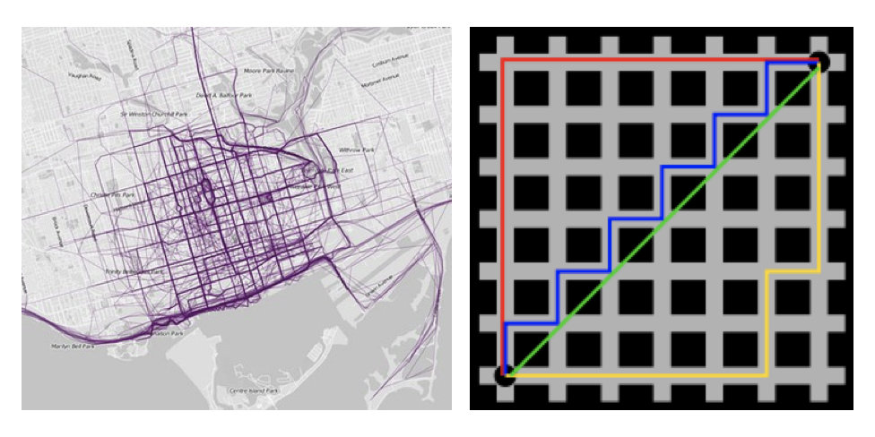
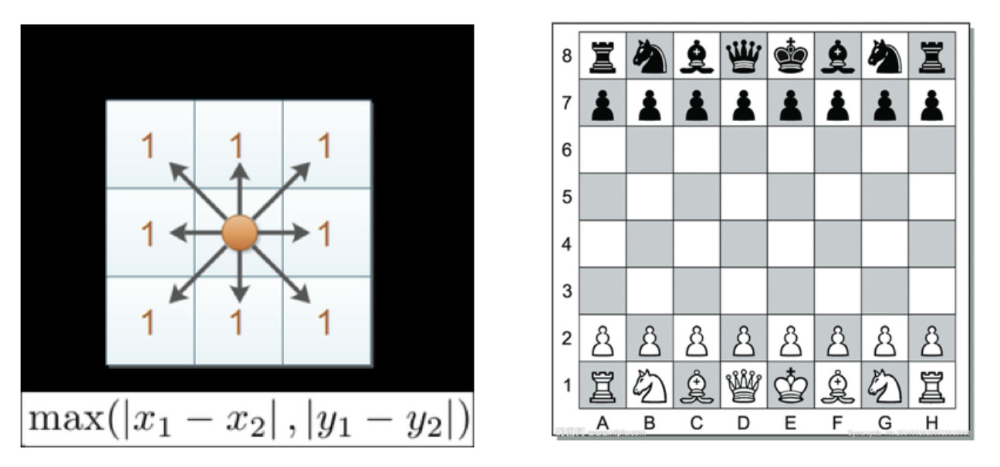
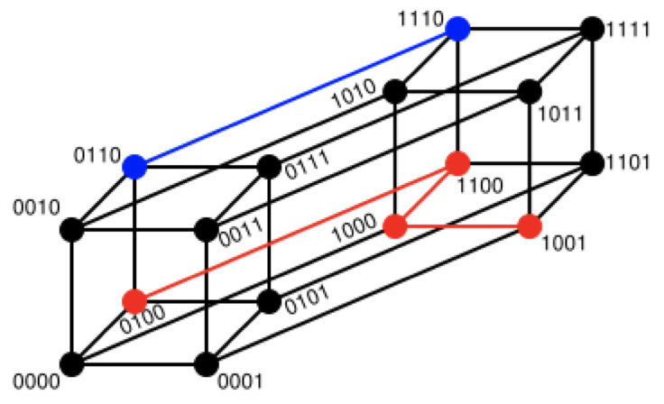
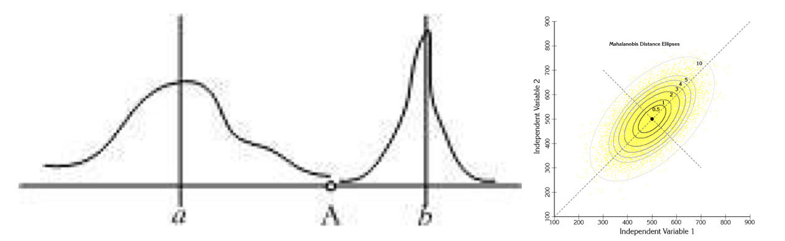
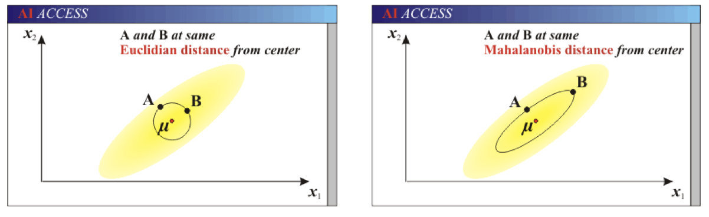
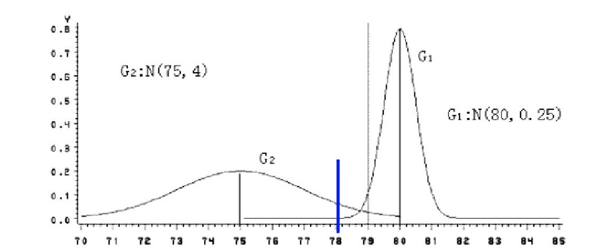

# 距离度量

# 1 距离公式的基本性质

在机器学习过程中，对于函数`dist()`，若它是一"距离度量" （distance measure），则需满足一些基本性质:

- 非负性：$dist(X_i,X_j) >= 0$
- 同一性：$dist(x_i,x_j)=0$，当且仅当：$X_i = X_j$
- 对称性：$dist(x_i,x_j)=dist(x_j,x_i)$
- 直递性：$dist(x_i,x_j) <= dist(x_i,x_k) +dist(x_k,x_j)$
  - 直递性常被直接称为“三角不等式”。

# 2 常见的距离公式

## 2.1 欧式距离

欧氏距离（Euclidean Distance）是最容易直观理解的距离度量方法，我们小学、初中和高中接触到的两个点在空间中的距离一般都是指欧氏距离。

**二维平面上点$a(x_1,y_1)$与$b(x_2,y_2)$间的欧式距离**：
$$
d_{12}=\sqrt[2]{(x_1-x_2)^2+(y_1-y_2)^2}
$$


**三维平面上点$a(x_1,y_1,z_1)$与$b(x_2,y_2,z_2)$间的欧式距离**：
$$
d_{12}=\sqrt[2]{(x_1-x_2)^2+(y_1-y_2)^2+(z_1-z_2)^2}
$$


**n维平面上点$a(x_{11},x_{12},...,x_{1n})$与$a(x_{21},x_{22},...,x_{2n})$间的欧式距离**：
$$
d_{12}=\sqrt[2]{\sum\limits_{k=1}^n{(x_{1k}-x_{2k})^2}}
$$


举例:

```
X=[[1,1],[2,2],[3,3],[4,4]];
经计算得:
d = 1.4142    2.8284    4.2426    1.4142    2.8284    1.4142
```

## 2.2 曼哈顿距离

在曼哈顿街区要从一个十字路口开车到另一个十字路口，驾驶距离显然不是两点间的直线距离。这个实际驾驶距离就是“曼哈顿距离（Manhattan Distance）”。曼哈顿距离也称为“城市街区距离”（City Block distance）。



**二维平面上点$a(x_1,y_1)$与$b(x_2,y_2)$间的曼哈顿距离**：
$$
d_{12}=|x_1-x_2|+|y_1-y_2|
$$
**三维平面上点$a(x_1,y_1,z_1)$与$b(x_2,y_2,z_2)$间的曼哈顿距离**：
$$
d_{12}=|x_1-x_2|+|y_1-y_2|+|z_1-z_2|
$$
**n维平面上点$a(x_{11},x_{12},...,x_{1n})$与$a(x_{21},x_{22},...,x_{2n})$间的曼哈顿距离**：
$$
d_{12}=\sum\limits_{k=1}^n{|x_{1k}-x_{2k}|}
$$
举例:

```
X=[[1,1],[2,2],[3,3],[4,4]];
经计算得:
d =   2     4     6     2     4     2
```

## 2.3 切比雪夫距离

国际象棋中，国王可以直行、横行、斜行，所以国王走一步可以移动到相邻8个方格中的任意一个。国王从格子(x1,y1)走到格子(x2,y2)最少需要多少步？这个距离就叫切比雪夫距离（Chebyshev Distance）。



**二维平面上点$a(x_1,y_1)$与$b(x_2,y_2)$间的切比雪夫距离**：
$$
d_{12}=max(|x_1-x_2|,|y_1-y_2|)
$$


**三维平面上点$a(x_1,y_1,z_1)$与$b(x_2,y_2,z_2)$间的切比雪夫距离**：
$$
d_{12}=max(|x_1-x_2|,|y_1-y_2|,|z_1-z_2|)
$$


**n维平面上点$a(x_{11},x_{12},...,x_{1n})$与$a(x_{21},x_{22},...,x_{2n})$间的切比雪夫距离**：
$$
d_{12}=max(|x_{1i}-x_{2i}|)
$$
举例:

```
X=[[1,1],[2,2],[3,3],[4,4]];
经计算得:
d =   1     2     3     1     2     1
```

## 2.4 闵可夫斯基距离

闵氏距离（Minkowski Distance）不是一种距离，而是一组距离的定义，是对多个距离度量公式的概括性的表述。

两个n维变量a(x11,x12,…,x1n)与b(x21,x22,…,x2n)间的闵可夫斯基距离定义为：
$$
d_{12}=\sqrt[p]{\sum\limits_{k=1}^n{|x_{1k}-x_{2k})|^p}}
$$
其中p是一个变参数：

- 当p=1时，就是曼哈顿距离；
- 当p=2时，就是欧氏距离；
- 当p→∞时，就是切比雪夫距离。

根据p的不同，闵氏距离可以表示某一类/种的距离。

**小结：**

1 闵氏距离，包括曼哈顿距离、欧氏距离和切比雪夫距离，都存在明显的缺点:

e.g. 二维样本(身高[单位:cm],体重[单位:kg]),现有三个样本：a(180,50)，b(190,50)，c(180,60)。

a与b的闵氏距离（无论是曼哈顿距离、欧氏距离或切比雪夫距离）等于a与c的闵氏距离。但实际上身高的10cm并不能和体重的10kg划等号。

**2 闵氏距离的缺点：**

 **(1)将各个分量的量纲(scale)，也就是“单位”相同的看待了;**

 **(2)未考虑各个分量的分布（期望，方差等）可能是不同的。**

## 2.5 标准化欧氏距离

标准化欧氏距离（Standardized EuclideanDistance）是针对欧氏距离的缺点而作的一种改进。

思路：既然数据各维分量的分布不一样，那先将各个分量都“标准化”到均值、方差相等。

**标准化欧式距离公式**：
$$
d_{12}=\sqrt[2]{\sum\limits_{k=1}^n{(\frac{x_{1k}-x_{2k}}{S_k})^2}}
$$


- $S_k$表示各个维度的标准差

如果将方差的倒数看成一个权重，也可称之为加权欧氏距离（Weighted Euclidean distance）。

举例:

```
X=[[1,1],[2,2],[3,3],[4,4]];（假设两个分量的标准差分别为0.5和1）
经计算得:
d =   2.2361    4.4721    6.7082    2.2361    4.4721    2.2361
```

## 2.6 余弦距离

几何中，夹角余弦可用来衡量两个向量方向的差异；机器学习中，借用这一概念来衡量样本向量之间的差异，就是余弦距离（Cosine Distance）。

- 二维空间中向量A(x1,y1)与向量B(x2,y2)的夹角余弦公式：
  $$
  \cosθ=\frac{x_1x_2 + y_1y_2}{\sqrt[]{x_1^2+y_1^2}\sqrt[]{x_2^2+y_2^2}}
  $$
  

- 两个n维样本点a(x11,x12,…,x1n)和b(x21,x22,…,x2n)的夹角余弦为：
  $$
  \cosθ=\frac{a*b}{|a||b|}
  $$
  

即：
$$
\cosθ=\frac{\sum\limits_{k=1}^n{x_{1k}x_{2k}}}{\sqrt[]{\sum\limits_{k=1}^n{x_{1k}^2}}\sqrt[]{\sum\limits_{k=1}^n{x_{2k}^2}}}
$$
夹角余弦取值范围为[-1,1]。余弦越大表示两个向量的夹角越小，余弦越小表示两向量的夹角越大。当两个向量的方向重合时余弦取最大值1，当两个向量的方向完全相反余弦取最小值-1。

举例:

```
X=[[1,1],[1,2],[2,5],[1,-4]]
经计算得:
d =   0.9487    0.9191   -0.5145    0.9965   -0.7593   -0.8107
```

## 2.7 汉明距离【了解】

两个等长字符串s1与s2的汉明距离(Hamming Distance)为：将其中一个变为另外一个所需要作的最小字符替换次数。

例如:


```
  The Hamming distance between "1011101" and "1001001" is 2. 
  The Hamming distance between "2143896" and "2233796" is 3. 
  The Hamming distance between "toned" and "roses" is 3.
```



```
随堂练习：
求下列字符串的汉明距离：

  1011101与 1001001 　

  2143896与 2233796 
　
  irie与 rise
```

**汉明重量**：是字符串相对于同样长度的零字符串的汉明距离，也就是说，它是字符串中非零的元素个数：对于二进制字符串来说，就是 1 的个数，所以 11101 的汉明重量是 4。因此，如果向量空间中的元素a和b之间的汉明距离等于它们汉明重量的差a-b。

应用：汉明重量分析在包括信息论、编码理论、密码学等领域都有应用。比如在信息编码过程中，为了增强容错性，应使得编码间的最小汉明距离尽可能大。但是，如果要比较两个不同长度的字符串，不仅要进行替换，而且要进行插入与删除的运算，在这种场合下，通常使用更加复杂的编辑距离等算法。

举例:


```
X=[[0,1,1],[1,1,2],[1,5,2]]
注：以下计算方式中，把2个向量之间的汉明距离定义为2个向量不同的分量所占的百分比。

经计算得:
d =   0.6667    1.0000    0.3333
```

## 2.8 杰卡德距离【了解】

杰卡德相似系数(Jaccard similarity coefficient)：两个集合A和B的交集元素在A，B的并集中所占的比例，称为两个集合的杰卡德相似系数，用符号J(A,B)表示：
$$
J(A,B) = \frac{|A⋂B|}{|A⋃B|}
$$
杰卡德距离(Jaccard Distance)：与杰卡德相似系数相反，用两个集合中不同元素占所有元素的比例来衡量两个集合的区分度：
$$
J_δ(A,B)=1-J(A,B)=\frac{|A⋃B|-|A⋂B|}{|A⋃B|}
$$
举例:

```
X=[[1,1,0],[1,-1,0],[-1,1,0]]
注：以下计算中，把杰卡德距离定义为不同的维度的个数占“非全零维度”的比例
经计算得:
d =   0.5000    0.5000    1.0000
```

## 2.9 马氏距离【了解】

下图有两个正态分布图，它们的均值分别为a和b，但方差不一样，则图中的A点离哪个总体更近？或者说A有更大的概率属于谁？显然，A离左边的更近，A属于左边总体的概率更大，尽管A与a的欧式距离远一些。这就是马氏距离的直观解释。



马氏距离(Mahalanobis Distance)是基于样本分布的一种距离。

马氏距离是由印度统计学家马哈拉诺比斯提出的，表示数据的协方差距离。它是一种有效的计算两个位置样本集的相似度的方法。

与欧式距离不同的是，它考虑到各种特性之间的联系，即独立于测量尺度。

**马氏距离定义：**设总体G为m维总体（考察m个指标），均值向量为μ=（μ1，μ2，… ...，μm，）`,协方差阵为∑=（σij）,

则样本X=（X1，X2，… …，Xm，）`与总体G的马氏距离定义为：
$$
d^2(X,G)=(X-µ)´∑^{-1}(X-µ)
$$
当m=1时，
$$
d^2(x,G)=\frac{(x-µ)^´(x-µ)}{σ^2}=\frac{(x-µ)^2}{σ^2}
$$
马氏距离也可以定义为两个服从同一分布并且其协方差矩阵为∑的随机变量的差异程度：如果协方差矩阵为单位矩阵，马氏距离就简化为欧式距离；如果协方差矩阵为对角矩阵，则其也可称为正规化的欧式距离。

**马氏距离特性：**

1.**量纲无关**，排除变量之间的相关性的干扰；

2.**马氏距离的计算是建立在总体样本的基础上的**，如果拿同样的两个样本，放入两个不同的总体中，最后计算得出的两个样本间的马氏距离通常是不相同的，除非这两个总体的协方差矩阵碰巧相同；

3 .计算马氏距离过程中，**要求总体样本数大于样本的维数**，否则得到的总体样本协方差矩阵逆矩阵不存在，这种情况下，用欧式距离计算即可。

4.还有一种情况，满足了条件总体样本数大于样本的维数，但是协方差矩阵的逆矩阵仍然不存在，比如三个样本点（3，4），（5，6），（7，8），这种情况是因为这三个样本在其所处的二维空间平面内共线。这种情况下，也采用欧式距离计算。

**欧式距离&马氏距离：**



举例：

已知有两个类G1和G2，比如G1是设备A生产的产品，G2是设备B生产的同类产品。设备A的产品质量高（如考察指标为耐磨度X），其平均耐磨度μ1=80，反映设备精度的方差σ2(1)=0.25;设备B的产品质量稍差，其平均耐磨损度μ2=75，反映设备精度的方差σ2(2)=4.

今有一产品G0，测的耐磨损度X0=78，试判断该产品是哪一台设备生产的？

直观地看，X0与μ1（设备A）的绝对距离近些，按距离最近的原则，是否应把该产品判断设备A生产的？

考虑一种相对于分散性的距离，记X0与G1，G2的相对距离为d1，d2,则：
$$
d_1^2(x_0)=\frac{(x_0-μ_1)^2}{σ^2}=\frac{(78-80)^2}{0.25}=16=4^2
$$

$$
d_2^2(x_0)=\frac{(x_0-μ_2)^2}{σ^2(2)}=\frac{(78-75)^2}{4}=2.25=1.5^2
$$

因为d2=1.5 < d1=4，按这种距离准则，应判断X0为设备B生产的。

设备B生产的产品质量较分散，出现X0为78的可能性较大；而设备A生产的产品质量较集中，出现X0为78的可能性较小。

这种相对于分散性的距离判断就是马氏距离。



# 3 “连续属性”和“离散属性”的距离计算

我们常将属性划分为"连续属性"（continuous attribute）和"离散属性" （categorical attribute），前者在定义域上有无穷多个可能的取值，后者在定义域上是有限个取值.

- 若属性值之间存在序关系，则可以将其转化为连续值，例如：身高属性“高”“中等”“矮”，可转化为{1, 0.5, 0}。
- 闵可夫斯基距离可以用于有序属性。
- 若属性值之间不存在序关系，则通常将其转化为向量的形式，例如：性别属性“男”“女”，可转化为`{(1,0),(0,1)}`。