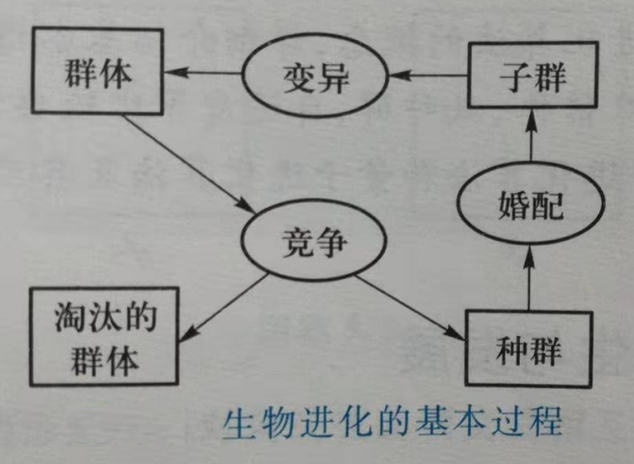

# 进化算法概述

# 1 进化算法的概念

**进化算法**（evolutionary algorithms，EA）是基于自然选择和自然遗传等生物进化机制的一种搜索算法。

- 生物进化是通过繁殖、变异、竞争和选择实现的；
- 进化算法则主要通过选择、重组和变异这三种操作实现优化问题的求解。

进化算法是一个“算法族”，包括遗传算法（genetic algorithms，GA）、遗传规划（genetic programming）、进化策略（evolution strategies）和进化规划（evolution programming）等。进化算法的基本框架是遗传算法所描述的框架。

与普通算法一样，进化算法也是一种迭代算法。不同的是在最优解的搜索过程中，普通算法搜索算法是从某个单一的初始点开始搜索，而进化算法是从原问题的一组解出发改进到另一组较好的解，再从这组改进的解出发进一步改进。而且，进化算法不是直接对问题的具体参数进行处理，而是要求当原问题的优化模型建立后，还必须对原问题的解进行编码。

进化算法再搜索过程中利用结构化和随机化的信息，使最满足目标的决策获得最大的生存可能，是一种概率型算法。再进化搜索中用目标函数值的信息可以不必用目标函数的导数信息或与具体问题相关的特殊知识，因而进化算法具有广泛的应用性，高度的非线性，易修改性和可并行性。因此，与传统的基于微积分的方法和穷举法等优化算法相比，进化算法是一种具有高鲁棒性和广泛适用性的全局优化方法，具有自组织、自适应、自学习的特性，能够不受问题性质的限制，能适应不同的环境和不同的问题，有效地处理传统优化算法难以解决的大规模复杂优化问题。

# 2 进化算法的生物学背景

进化算法类似于生物进化，需要经过长时间的成长演化，最后收敛到最优化问题的一个或者多个解。

“适者生存”揭示了大自然生物进化中得一个规律：最适合自然环境得群体往往产生了更大得后代群体。

生物得遗传物质得主要载体是**染色体**（chromosome），DNA是其中最主要得遗传物质。染色体中基因得位置称作**基因座**，而基因所取得值又叫做**等位基因**。基因和基因座决定了染色体得特征，也决定了生物个体（individual）得性状。

# 3 进化算法的设计原则

一般来说，进化算法的**求解包括以下几个步骤**：

1. 给定一组初始解；
2. 评价当前这组解的性能；
3. 从当前这组解中选择一定数量的解作为迭代后的解的基础；
4. 在对其进行操作，得到迭代后的解；
5. 若这些解满足要求则停止，否则将这些迭代得到的解作为当前解重新操作。

**设计进化算法的基本原则**：

- **适用性**原则：指该算法能适用的问题种类，它取决于算法所需的限制和假定。
  - 优化问题不同，则相应的处理方式也不同。
- **可靠性**原则：指算法对于所设计的问题，以适当的精度求解其中大多数问题的能力。
  - 因为演化计算的结果带有一定的随机性和不确定性，所以，再设计算法时应尽量经过较大样本的检验，以确认算法是否具有较大的可靠度。
- **收敛性**原则：指算法能否收敛到全局最优。
  - 再收敛的前提下，希望算法具有较快的收敛速度。
- **稳定性**原则：指算法对其控制参数及问题的数据的敏感度。
  - 如果算法对其控制参数或问题的数据十分敏感，则依据它们取值的不同，将可能产生不同的结果，甚至过早地收敛到某一局部最优解。所以在设计算法时应尽量使得算法对一组固定的控制参数能在较广泛的问题的数据范围内解题，而且对一组给定的问题数据，算法对其控制参数的微小扰动不很敏感。
- **生物类比**原则：
  - 因为进化算法的设计思想是基于生物演化过程的，所以那些在生物界被认为是有效的方法及操作可以通过类比的方法引入到算法中，有时会带有较好的结果。