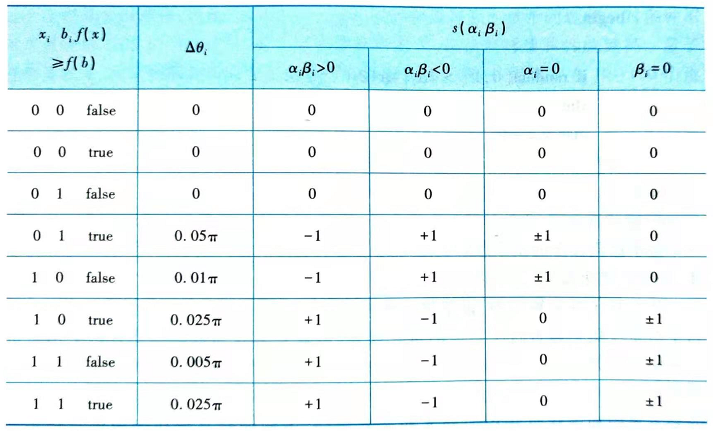

# 量子进化算法及其应用

**量子计算**（quantum computing）是物理学中的量子力学和计算机科学相结合的产物，是一种新兴的计算理论。

**量子计算理论**是一种新型的计算理论，利用量子叠加（superposition）、纠缠（entangle）和干涉（interference）等量子态所特有的特性，并通过量子并行计算（quantum parallelism）求解问题。

理论上已经证明：进化算法能在概率意义上以随机的方式寻求问题的最优解。但在实际应用中也存在着容易产生早熟、收敛速度慢、局部寻优能力差等缺点。

# 1 量子进化算法的基本概念

**量子进化算法**（quantum evolutionary algorithm，QEA），是一种基于量子位、量子叠加态等量子机制的进化算法。

## 1.1 量子位

**量子位**又称为**量子比特**（Q-bit），是量子计算中保存信息的最小单元。一个量子位可能处于状态`|0>`，也可能处于状态`|1>`，还可以是两种状态的线性叠加。因此，一个量子位可以表示为：$|\psi> = \alpha|0> + \beta|1>$。

- $\alpha$和$\beta$：为复数，分别表示状态`|0>`和`|1>`的概率幅，且满足正交性，即满足$|\alpha|^2 + |\beta|^2 = 1$。
- $|\alpha|^2$和$|\beta|^2$表示该量子位处于状态`|0>`和`|1>`的概率大小。

区别于经典比特，量子比特可以处于0、1两个本征态的任意叠加状态，而且对量子比特的操作过程中，两态的叠加振幅可以相互干涉，称为**量子干涉**。对于每个叠加分量进行的变换相当于一种经典计算，并且这些经典计算同时完成，并按一定概率振幅叠加起来，给出量子计算的计算结果，称为量子**并行计算**。

## 1.2 量子个体

**量子个体**即**量子染色体**，在量子进化算法中染色体的编码不是用确定的值（如传统的字符串、二进制、浮点数等）表示，而是采用量子位或者概率幅表示。在量子力学里，**概率幅（量子幅）**是一个描述例子的量子行为的复函数。因此，一个染色体长度为m的量子个体可表示为：
$$
\begin{bmatrix}
	\alpha_1 & \alpha_2 & \cdots & \alpha_m \\
	\beta_1 & \beta_2 & \cdots & \beta_m    \\
\end{bmatrix}
$$
其中，$|\alpha_i|^2 + |\beta_i|^2 = 1, i = 1, 2, ..., m$

因此，一个长度为m的量子个体能够基于概率同时表示$2^m$中状态。基于量子比特表示于传统表示方法相比提供了一种更好的多样性，因为它能表示量子态的叠加。一个量子个体可以表示若干个量子位状态的叠加，从而一个小种群的量子个体可以对应于传统表示方法下的很大数量的个体。同时，量子门操作的存在使得量子遗传算法有着很强的全局搜索能力。另一方面，随着量子遗传算法的收敛，各个量子位上的取1和取0的概率幅趋于1，由量子旋转门驱动的搜索过程自动地由全局搜索变为局部搜索，这些特征正式量子算法内在的概率机制所决定的。

# 2 基本量子进化算法

基本量子进化算法在量子位和量子个体的基础上，主要包含了六个基本要素：染色体编码、初始化种群（initialization）、量子观测（observation）、进化操作（evolutionary operation）、量子评价（evaluation）、量子更新（updating）等。

## 2.1 染色体编码

### 2.1.1 二进制编码

基于二进制编码的初始化种群的基本步骤是：令t=0，随机初始化种群$P(t) = \{p_1^t, \cdots, p_n^t\}$，$p_j^t$为第t代种群中的第j个个体，且
$$
p_j^t = 
\begin{bmatrix}
	\alpha_1^t & \alpha_2^t & \cdots & \alpha_m^t \\
	\beta_1^t & \beta_2^t & \cdots & \beta_m^t    \\
\end{bmatrix}
$$
表示一个量子染色体，m为量子染色体的长度。

二进制编码中一个量子位表示两种状态，实现简单，但是只适用于能用二进制编码解决的问题，有一定的局限性。

### 2.1.2 多进制编码

根据二进制编码的特点，可以用两个量子位表示4个状态，以此类推，用n个量子位表示$2^n$个状态。多进制编码是将二进制编码扩展到n维，每一维都代表一个量子比特，通常用一个量子矩阵表示。矩阵的每一行即一个二进制编码表示，矩阵由n列这样的二进制编码组成，采用多个量子位来表示一个多状态基因，对实际问题的编码设计通用性好且实现简单。

### 2.1.3 概率符合位表示

概率符合位表示从另一个角度提出了一种多状态表示方法。一种n个状态的染色体可表示为：$[p_0, p_1, p_2, \cdots, p_{n-1}]^T$，其中$p_0 + p_1 + p_2 + \cdots + p_{n-1} = 1$，其中$p_0, p_1, p_2, \cdots, p_{n-1}$分别表示0， 1， ..., n-1的概率。在这种编码下，通过产生一个均匀随机数$r \in [0, 1]$，以轮盘赌方式确定观测值并采用一种基于概率值的特有方法进行更新操作。

## 2.2 初始化种群

## 2.2.1 种群规模

#### 2.2.1.1 固定种群规模

传统的遗传算法种染色体与解之间是一对一关系，而量子进化算法则可以采用一个染色体表示多解，因此算法可以用较小的种群规模表示多个问题解。

对多种不同规模种群QEA的实验证明，量子染色体种群越大，算法解的鲁棒性就越高。

量子进化算法中，固定种群规模的设定依赖于具体的应用问题，一般设定在10~100个量子染色体之间。

#### 2.2.1.2 可变种群规模

可变种群规模就是在算法迭代过程中，随机或者按照一定原则选择其中的优良种群以进行下一次迭代。该算法中，初始种群仅包含n个路径生成矩阵，且每个矩阵的每个元素均用量子位表示。该算法运行中，量子位表示矩阵生成若干个可行路径矩阵，进行交叉、变异、矩阵内各行随即移动等操作，生成新的个体。种群更新时，选取若干个最优个体，并随机选择一个个体以保持种群多样性。该算法充分利用了量子位表示方法可以表示多个解的特性，保持解种群的分散特性。

### 2.2.2 染色体初始值

#### 2.2.2.1 基本染色体初始值

基本量子进化算法中，量子染色体由量子位组成，并且所有的量子位的初始值均设为$\begin{bmatrix} \frac{1}{\sqrt{2}} & \frac{1}{\sqrt{2}}\end{bmatrix}$。这种初始化方法十分简单，但是量子染色体的初始值没有考虑到具体的应用问题，因此优化效果有一定的局限性。

#### 2.2.2.2 两阶段初始化

量子位的初始值对量子进化算法的性能有着显著的影响，由此提出了一种两阶段的符合量子遗传算法框架。在第一阶段中随机初始化量子位，经过若干次量子进化搜索后，将得到的优良结果用于第二阶段量子遗传算法的初始值，进行进一步的解空间的全局搜索。这里初始解空间的设计主要依靠对问题解决方案的正确把握，并总结出相应的先验知识。

## 2.3 量子观测

在基本量子进化算法中，**量子观测一般采用如下方法**：根据$p_j^t$中概率幅的取值情况构造长度为m的二进制串$r_j^t$。构造方法：产生$[0, 1]$上的一个随机数s，若$s > |\alpha_i^t|^2$，则对应取值为1，否则为0.由此得到二进制串种群$R(t)$。

**量子观测的结果和作用**就是将只有在量子计算机中才能观测的信息转换成在二进制计算机中能表示的信息。这一过程将导致具有$2^m$个状态的量子染色体蜕变成一个确定的状态，在量子理论中被称为**量子坍塌（collapse）**。

其中常用的量子观测过程伪代码如下：

```
procedure observe(x)
begin
	i <- 0
	whhile(i < m) do
	begin
		i <- i+1
		if random[0, 1] > |α_i|*|α_i| or |β_i|*|β_i|
		then x_i <- 1
		else x_i <- 0
	end
end
```

## 2.4 进化操作

量子进化操作的基本思想就是对通过量子观测所得到的$R(t)$中的个体进行交叉、变异的进化操作，生成新的$R(t)$。

基本量子进化算法中，由于量子旋转门（quantum rotating gate）更新实际上就相当于对量子染色体进行了相应的进化操作，因此一般认为这些操作可以采用也可以省略。但是，只采用量子旋转门而没有交叉、变异等遗传操作，仍然可能陷于局部极小。基本得量子进化操作主要是量子交叉和量子变异。量子交叉和量子变异的基本思想和进化算法的交叉和变异相同，不同的只是操作的对象是量子染色体。

## 2.5 量子评论

量子评论即根据实际的应用问题，对$R(t)$各个体进行评价并保留最优个体b。该过程与遗传算法等进化算法中的评价适应度函数过程相同。

## 2.6 量子更新

量子更新可以采用很多种方法，例如量子异或门、量子Hadamard变换门等各种量子门。目前应用最多的是采用量子旋转门$U(\theta)$来更新$R(t)$。

### 2.6.1 量子门

在量子更新过程中，量子门是最终实现进化操作的执行机构，最常用的为量子旋转门，进化过程由量子旋转门更新量子位概率幅来实现:
$$
\begin{bmatrix}
	\alpha_i^\prime \\
	\beta_i^\prime
\end{bmatrix}
= 
U(\theta_i) 
\begin{bmatrix}
	\alpha_i \\
	\beta_i
\end{bmatrix}
=
\begin{bmatrix}
	\cos\!(\theta_i) & -\sin\!(\theta_i) \\
	\sin\!(\theta_i) & \cos\!(\theta_i)
\end{bmatrix}
\begin{bmatrix}
	\alpha_i \\
	\beta_i
\end{bmatrix}
$$
其中，$[\alpha_i, \beta_i]^T$：为dii个量子位概率幅，且满足$\theta_i = s(\alpha_i, \beta_i)\Delta\theta_i$。这里的$\theta_i$为旋转角，$s(\alpha_i, \beta_i)$为旋转方向。一般采用查Lookup表确定$\theta_i = s(\alpha_i, \beta_i)\Delta\theta_i$。

Lookup表的典型结构如下表所示。



注：

- $x_i$、$b_i$：分别代表当前二进制解决方案和最优解决方案的第i位；
- $f(x)$：是x的适应度值；
- $\theta_i$：控制着当前解往最优解收敛的速度；
- $s(\alpha_i, \beta_i)$：控制着旋转的方法。

借助于Lookup表，上述过程可用伪代码表示如下：

```
procedure update(q)
begin
	i <- 0
	whhile(i < m) do
	begin
		i <- i+1
		determine θ_i with the lookup table
		obtain(α_i^`, β_i^`) as [α_i^`, β_i^`]^T = U(θ)[α_i, β_i]^T
	end
	q <= q^`
end
```

通过Update操作，量子进化算法完成了一次量子更新，也相当于经典算法中进行一次交叉、变异等进化操作。

### 2.6.2 量子进化更新机制

为什么Update操作能引导当前解收敛到最优解？由于$|\alpha_i|^2 + |\beta_i|^2 = 1$，我们可以想象它们位于一个单位圆中。如果当前条件位$x_i = 0, b_i = 1, f(x) > f(b)$，那么为了获取一个更好的量子染色体，$x_i$取0的概率应该增大，也就是说$random[0, 1] > |\alpha_i|^2$的概率应该变小，即$|\alpha_i|^2$的值应该增大。因此，如果$(\alpha_i, \beta_i)$在一、三象限，$\theta_i$应该顺时针转动，反之，应当逆时针转动，这样当前二进制解决方案就会进一步解进最优解。