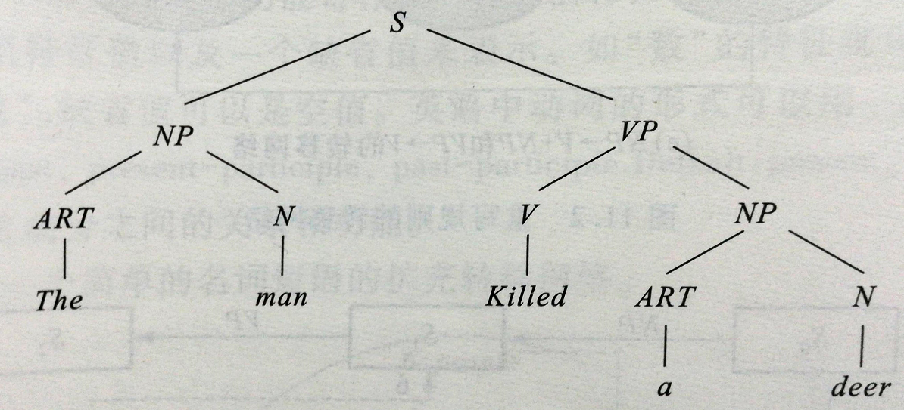
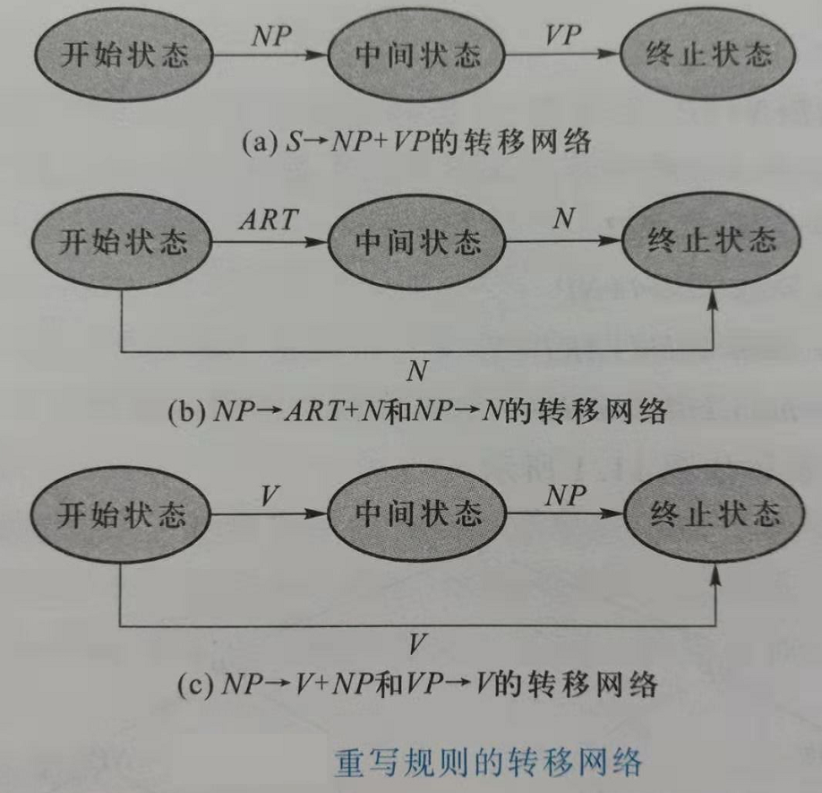
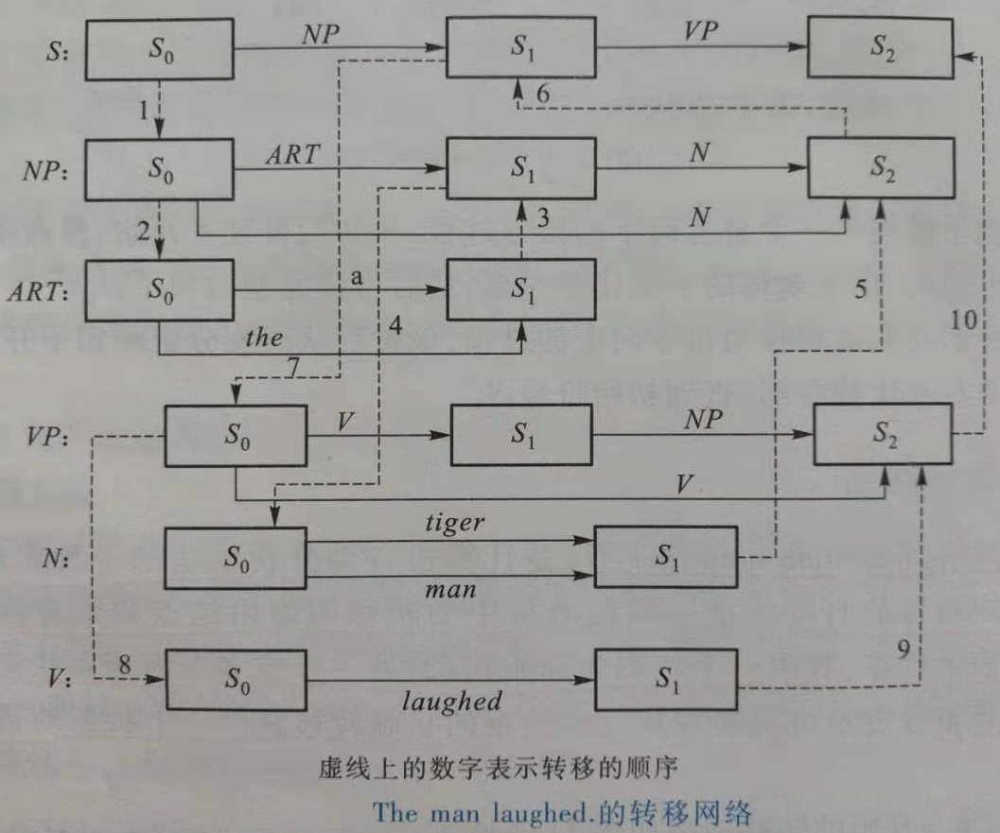
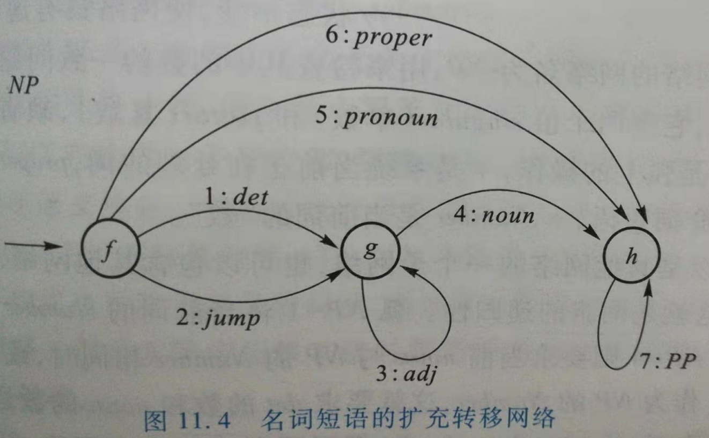

# 句法分析

**句法分析**是对句子或短语结构进行分析，以确定构成句子的各个词、短语之间的关系以及各自在句子中的作用等，将这些关系用层次结构加以表达，并对句法结构进行规范化。

分析自然语言的方法主要分为两类：

- 基于规则的方法
  - 如：乔姆斯基的形式文法
- 基于统计的方法

# 1 乔姆斯基的形式文法

在计算机科学中，**形式语言**是某个字母表上一些有限字串的集合，而**形式文法**是描述这个集合的一种方法。形式文法之所以这样命名，是因为它与人类自然语言中的文法相似的缘故。

**形式文法描述形式语言的基本想法**是，从一个特殊的初始符号出发，不断的应用一些产生式规则，从而生成出一个字串的集合。

**产生式规则**指定了某些符号组合如何被另外一些符号组合替换。

最常见的文法分类是乔姆斯基（N.Chomsky）在1950年根据形式文法中所使用的规则集提出的。它定义了下列四种形式的文法：

- 0型文法：短语结构文法；
- 1型文法：上下文有关文法；
- 2型文法：上下文无关文法；
- 3型文法：正则文法

型号愈高所受约束愈多，能表达的语言集就越小，也就是说型号越高描述能力就越弱。但由于上下文无关文法和正则文法能够高效率地实现，称为四类文法中最重要的两种文法类型。

## 1.1 短语结构文法：0型文法

因为短语结构文法对产生式规则的两边不作任何限制，所以是一种非受限文法，是乔姆斯基体系中生成能力最强的一种形式文法，能够描述任何语言。

**使用范围**：短语结构文法是描述自然语言和程序设计语言强有力的形式化工具，可用于计算机上对被分析句子的形式化进行描述和分析。

短语结构文法**形式化定义**：`G = (T, N, S, P)`

- T：终结符的集合，终结符是指被定义的那个语言的词（或符号）；
- N：非终结符号的集合，这些符号是专门用来描述文法的，不能出现在最终生成的句子中；
  - T和N不相交，$T \cap N = \oslash$，T和N共同组成了符号集$V = T \cup N$
- $S \in N$是起始符；
- P：产生式规则集；P中每条产生式规则表示为：$a \rightarrow b$
  - $ a \in V^+b, \in V^*, a \neq b$
  - $V^*$表示有V中的符号所构成的全部符号串（包括空符号串$\oslash$）的集合；
  - $V^+$表示$V^*$中除了空符号串$\oslash$之外的一切符号串的集合。

在短语结构文法中，**基本运算**是把一个符号串重写为另一个符号串。如果$a \rightarrow b$是一条产生式规则，那么就可以通过用b来置换a，重写任何一个包含子串a的符号串，这个过程记为$\Rightarrow$.

短语结构文法G生成的语言记为L(G)。以不同的顺序使用产生式规则，可以从同一符号产生去多不同的串。**一个符号串属于L(G)必须满足一下两个条件**：

- 该符号串只包含终结符；
- 该符号串能根据短语结构文法G从起始符S推导出来。

短语结构文法的**标准型**为$A \rightarrow \xi, A \rightarrow BC, A \rightarrow \oslash, AB \rightarrow CD$，其中，$\xi \in (T \cup N), A,B,C,D \in N, \oslash$是空字。

例如：

> G = (T, N, S, P)
>
> T = {the, man, killed, a, deer, likes}
>
> N = {S, NP, VP, N, ART, V, prep, PP}
>
> S = S
>
> P：
>
> (1) $S \rightarrow NP + VP$
>
> (2) $NP \rightarrow N$
>
> (3) $NP \rightarrow ART + N$
>
> (4) $VP \rightarrow V$
>
> (5) $VP \rightarrow V + NP$
>
> (6) $ART \rightarrow the | a$
>
> (7) $N \rightarrow man | deer$
>
> (8) $V \rightarrow killed | likes$

都短语结构文法中的产生式做某些限制，就得到上下文有关文法、上下文无法文法和正则文法。

## 1.2 上下文无关文法：1型文法

自然语言一般是一种与上下文有关的语言，需要用上下文有关文法描述。

**上下文有关文法是一种满足以下约束的短语结构文法**：对于一条形式为$x \rightarrow y$的产生式，y的长度（即符号串y中的符号个数）总是大于或等于x的长度，而且$x, y \in V^*$。

例如：

> $AB \rightarrow CDE$是上下文有关文法中一条合法的产生式，但是$ABC \rightarrow DE$不是合法的产生式。

这一约束可以保证上下文有关文法是递归的。这样，如果编写一个程序，在读入一个字符串后能最终判断这个字符串是否为由这种文法所定义的语言中的一个句子。

上下文有关：指的是对非终结符进行替换时需要考虑该符号所处的上下文环境，但要求规则的右部符号的个数不少于左部，以确保语言的递归性。

例如：

> 对于产生式$aAb \rightarrow ayb$，($A \in N, y \neq \oslash$, a和b不能同时为$\oslash$)，当y替换A时，智能在上下文为a和b时才可进行。

## 1.3 上下文无关文法：2型文法

在上下文无关文法中，每条产生式规则的左侧必须是一个单独的非终结符。每一条规则采用$A \rightarrow x$形式，其中，$A \in N, x \in V^*$。在这个体系中，规则被应用时不依赖于符号A所处的上下文，因此称为上下文无关文法。

由于上下文无关文法的句法分析远比上下文相关文法分析简单、有效，因此，人们希望在增强上下文无关语言的句法分析基础上，实现自然语言的自动理解。比如，扩充转移网络（ATN）。

## 1.4 正则文法（有限状态文法）：3型文法

正则文法分为两种：

- 左线性文法：所有的规则必须采用$A \rightarrow Bt$或$A \rightarrow t$的形式。
- 右线性文法：所有规则必须写成$A \rightarrow tB$或$A \rightarrow t$的形式。

注：$A, B \in N, t \in T$，即A、B都是单独的非终结符，t是单独的终结符。

# 2 句法分析树

在对一个句子分析的过程中，常用树形图来表示分析句子各成分间关系的过程，这种树形图称为句法分析树。句法分析过程就是构造句法分析树的过程，即将每个输入的合法语句转换为一颗句法分析树。

例如：

> 利用上下文无关文法分析下面的句子：The man killed a deer.
>
> 由重写规则得：
> $$
> \begin{array}{rl}
> S & \rightarrow NP + VP \\
>   & \rightarrow ART + N + VP \\
>   & \rightarrow The \quad man + VP \\
>   & \rightarrow The \quad man + V + NP \\
>   & \rightarrow The \quad man \quad killed + NP \\
>   & \rightarrow The \quad man \quad killed + ART + N \\
>   & \rightarrow The \quad man \quad killed \quad a \quad deer
> \end{array}
> $$
> 对应得句法分析树如图：
>
> 

上述例子描了一个**自上向下的推导**过程：从初始符号S开始，然后不断地选择合适的重写规则，用该规则的右部代替左部，最后得到完整的句子。

另一种形式的推导称为**自下向上的推导**过程，该过程从所要分析的句子开始，然后用重写规则的左部代替右部，直到初始符号S。

# 3 转移网络

转移网络（transition network，TN）是计算机自动分析语法的一种实现形式，用于计算机内语言的自动生成。

句法分析中的转移网络由结点和带有标记的弧组成。

- 结点表示状态，其中一个状态为起始状态，另一个或多个为结束状态。
- 弧对应于符号。该符号表示可以实现从一个给定的状态转移到另一个状态的条件和转移方向。

用转移网络分析一个句子，首先从句子S开始启动。如果句子的表示形式和转移网络的部分结构（NP）匹配，那么控制会转移到和NP相关的网络部分。这样，转移网络进入中间状态，然后检查VP短语。在VP的转移网络中，假设整个VP匹配成功，则控制会转移到终止状态，并结束。



例如，

> 句子The man laughed.的状态转移网络如图：
>
> 
>
> 注：图中的虚线段表示网络中状态的控制流。
>
> 1. 首先，当控制在句子$S_0$发现NP时，会通过虚线1移动到NP转移网络。
>
> 2. 如果在NP转移网络的$S_0$又发现了ART，那么通过虚线2进入ART网络；
>
> 3. 在ART网络选择the，然后通过虚线3返回NP转移网络的$S_1$。
> 4. 现在，在NP转移网络的$S_1$找到N，通过弧4转移到转移网络N的初始节点$S_0$。
> 5. 该过程一直这样进行下去，知道通过弧10抵达句子的转移网络$S_2$。

# 4 扩充转移网络

1970年，美国人工智能专家伍兹（W . woods）提出扩充转移网络（augmented transition network，ATN）。ATN就是用上下文无关文法的扩充来实现上下文相关文法。ATN是自然语言语法的一种多功能表示及语言自动分析的一种崭新的方法，ANT对自然语言处理领域产生了重要影响，并曾成功地应用于有限领域的问题应答系统中，如LUNAR程序。

ATN是由一组网络构成，每个网络都有一个网络名，每条弧上的条件扩充为条件加上操作。这种条件和操作采用寄存器的方法来实现，在分析树的各个成分结构上都放上寄存器，用来存放句法功能和句法特征，条件和操作将对它们不断地进行访问和设置。ATN弧上的标记也可以是其他网络的标记名，因此，ATN是一种递归网络。

ATN的每个结点都有一个寄存器。每个寄存器由两部分组成：

- 上边部分是句法特征寄存器：每一维特征都由一个特征名和一组特征值以及一个缺型值来表示。
  - 如“数”的特征维可有两个特征值“单数”和“复数”，缺型值可以是空值。
  - 英语中动词的形式可以用一维特征来表示：Form:present, past, present-participle,past-participle.Default:present。
- 下半部分是句法功能寄存器：反映了句法成分之间的关系和功能。

**原理**：ATN就是用上下文无关文法的扩充来实现上下文相关文法，它用一组寄存器存放语法分析信息，每走一步都要测试一下当前情况，并根据测试结果决定做什么动作，最后把寄存器中的信息综合起来，即得到被分析句子的语法结构。

例如：一个简单的名词短语的扩充转移网络：



网络中弧上的条件C和操作A如下所示：

> $NP-1: f \xrightarrow{det.} g$：当前词为限定词，网络状态由f转移至g
>
> $A: Number \leftarrow *.Number$：使NP的特征“数”的特征值等于当前，输入限定词的特征“数”的特征值
>
> $NP-2: f \xrightarrow{jump} g$：网络状态直接由f转移至g，不对应句法成分和输入词汇
>
> $NP-3: g \xrightarrow{adj} g$：当前词为形容词，进入子网络，本层网络状态不变
>
> $NP-4: g \xrightarrow{noun} h$：当前词为名词网络状态由g转移至h
>
> $C: Number = *.Number \quad or \quad \oslash$：如果当前名词数与NP的数相同或者NP的数为空
>
> $A: Number \leftarrow *.Number$：使NP的特征“数”的特征值等于当前输入名词的特征“数”的特征值
>
> $NP-5: f \xrightarrow{pronoun} h$：当前词为代词，网络状态由f转移至h
>
> $C: Number = *.Number \quad or \quad \oslash$：如果当前名词数与NP的数相同或者NP的数为空
>
> $A: Number \leftarrow *.Number$：使NP的特征“数”的特征值等于当前输入代词的特征“数”的特征值
>
> $NP-6: f \xrightarrow{proper} h$：当前词为专用词，网络状态由f转移至h
>
> $A: Number \leftarrow *.Number$：使NP的特征“数”的特征值等于当前输入专用词的特征“数”的特征值
>
> $NP-7: h \xrightarrow{pp} h$：进入子网络，介词短语网络，本层网络状态不变，使网络具有递归性
>
> 注：
>
> - 该扩充转移网络的网络名为NP，用来检查其中的数的一致问题。
> - 其中用到的特征值Number(数)，它的两个值singular(单数)和plural(复数)，缺省值是$\oslash$（空）。
> - C是弧上的条件， A是弧上的操作，\*是系统当前正在处理的词，proper是专有名词，det是限定词，PP是介词短语，$*.Number$是当前词的“数”

网络NP可以是其他网络的一个子网络，也可以包含其他网络，如其中的PP就是一个子网络，这就是**网络的递归性**。


**BNF描述**：ATN有一种描述语言，该语言不仅刻画了转移网络的结构，并且指明了每一步应该做什么。该语言的BNF描述大致如下：

```
<ATN> ::= <状态弧>{<状态弧>};
<状态弧> ::= <状态> <弧>{<弧>}
<弧> ::=CAT<范畴> <分析动作>
|PUSH<状态> <分析动作>
|TST<标号> <分析动作>
|POP<表达式> <测试>
<分析动作> ::= <测试>{<动作>}<结束动作>
<动作> ::=SETR<寄存器> <表达式>
|SENDR<寄存器> <表达式>
|LIFTR<寄存器> <表达式>
<结束动作> ::=TO<状态>
|JUMP<状态>
<表达式> ::=GETR<寄存器> | *
|GETF<特性>
|APPEND<寄存器> <表达式>
|BUILD<片段>{<寄存器>}
```

说明：

- `<范畴>`：指基本词类范畴，如形容词、副词。
- PUSH：是进入下一层名为<状态>的网络。
- POP：是判断本层网络是否已达终结状态并准备返回上层网络。
- TST：是对当前弧进行测试，但不一定是根据弧的名字，也可以根据其他条件。
- SETR：把一个值送入指定的寄存器。
- GETR：给出指定寄存器的当前值。
- GETF：给出当前被加工部分的某个特性。
- `*`：是输入语句当前正被加工的部分。
- SENDR：把一个值送入下层网络。
- LIFTR：把一个值送入上层网络。
- TO：表示移动输入语句的指针，并在指定的节点上处理该语句的下一成分。
- JUMP：不移动输入语句指针，在指定节点上继续处理语句的当前成分。
-  APPEND：把一个值附加到当前寄存器的值中去。
- BUILD：把有关寄存器中的内容综合起来。
- `<片段>`：即综合所得的值。
- `<测试>`：即测试某个条件所得结果，为T或F。
- `<标号>`：也是一个状态,可以为空。