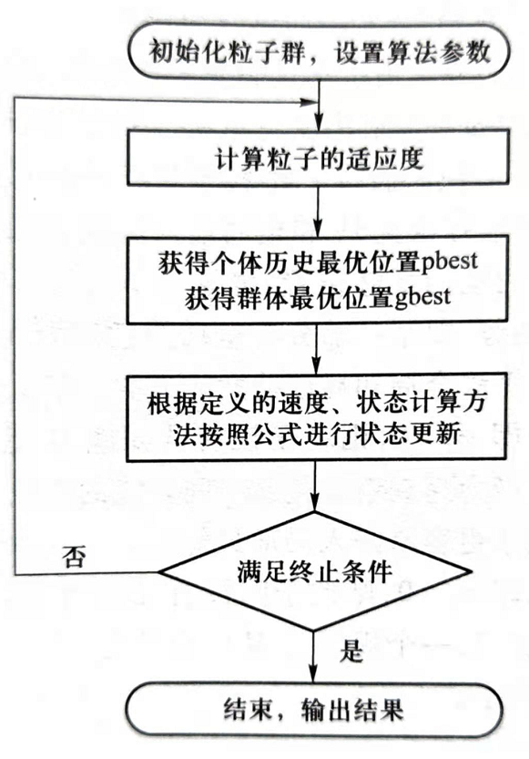

# 粒子群优化算法

# 1 粒子群优化算法的基本原理

**粒子群优化**（particle swarm optimization，PSO）是一种仿生优化算法，利用并改进了生物学家的生物群体模型，使粒子能够飞向解空间并在最优解处降落。PSO算法是一种基于群智能理论的全局优化算法，通过群体中粒子间的合作与竞争产生的群体智能指导优化搜索。

PSO算法与其他进化算法相似，也是基于群体的，根据对环境的适应度将群体中的个体移动到好的区域，然而它不像其他演化算法那样对个体适用演化算子，而是将每个个体看作n维搜索空间中一个没有体积质量的粒子，在搜索空间中以一定的速度飞行。

在粒子群优化算法中，在n维连续搜索空间中，对粒子群中的第i（i = 1, 2, ..., m）个粒子，定义：

- $x^i(k) = \left[x_1^i \quad x_2^i \quad \cdots \quad x_n^i \right]$：n维当前位置向量，表示搜索空间中粒子的当前位置；
- $p^i(k) = \left[p_1^i \quad p_2^i \quad \cdots \quad p_n^i \right]$：n维最优位置向量（pbest）， 表示该粒子至今所获得的具有最优适应度$f_p^i(k)$的位置；
  - $p^g(k) = \left[p_1^g \quad p_2^g \quad \cdots \quad p_n^g \right]$：n维群体经历过的最优位置（gbest）
- $v^i(k) = \left[v_1^i \quad v_2^i \quad \cdots \quad v_n^i \right]$：n维速度向量，表示该粒子的搜索方向。

则基本的PSO算法为：$v_j^i(k + 1) = \omega(k)v_j^i(k) + \varphi_1 rand(0, a_1)(p_j^i(k) - x_j^i(k)) + \varphi_2 rand(0, a_2)(p_j^g(k) - x_j^i(k))$

- $v_j^i(k + 1) = x_j^i(k) + v_j^i(k + 1)$
- i = 1, 2, ..., m；j = 1, 2, ..., n

注：

- 右边第一部分$\omega(k)v_j^i(k)$：是粒子在前一时刻的速度；
  - $\omega$：惯性权重因子
- 右边第二部分$\varphi_1 rand(0, a_1)(p_j^i(k) - x_j^i(k))$：为个体“认知（cognition）”分量，表示粒子本身的思考，将现有的位置和曾经经历过的最优位置相比；
- 右边第三部分$\varphi_2 rand(0, a_2)(p_j^g(k) - x_j^i(k))$：是群体“社会（social）”分量，表示粒子间的信息共享和相互合作。
  - $\varphi_1$、$\varphi_2$：加速度常数，均为非负值
    - 分别控制个体认知分量和群体社会分量相对贡献的学习率。
  - $rand(0, a_1)$和$rand(0, a_2)$：为$\left[0, a_1\right]$、$\left[0, a_2\right]$范围内的具有均匀分布的随机数，$a_1$与$a_2$为相应的控制参数。
    - 引入这两个函数将增加认知和社会搜索方向的随机性和算法多样性。

基于学习率$\varphi_1$、$\varphi_2$，Kennedy给出以下4种类型的PSO模型：

- $\varphi_1 > 0, \varphi_2 > 0$：PSO全模型
- $\varphi_1 > 0, \varphi_2 = 0$：PSO认知模型
- $\varphi_1 = 0, \varphi_2 > 0$：PSO社会模型
- $\varphi_1 = 0, \varphi_2 > 0，且 g\neq i$：PSO无私模型

标准的粒子群优化算法分为两个版本：全局版和局部版。局部版和全局版的差别在于，用局部领域内最优邻居的状态代替整个群体的最优状态。全局版的收敛速度比较快，但容易陷入局部极值点，而局部版搜索到的解可能更优，但速度较慢。

**粒子群优化算法的流程**如下：

1. 初始化每个粒子，即在允许范围内随机设置每个粒子的初始位置和速度。
2. 评价每个粒子的适应度，计算每个粒子的目标函数。
3. 设置每个粒子的$P_i$。对每个粒子，将其适应度与其经历过的最好位置$P_i$进行比较，如果优于$P_i$，则将其作为该粒子的最好位置$P_i$。
4. 设置全局最优值$P_g$。对每个粒子，将其适应度与群体经历过的最好位置进$P_g$行比较，如果优于$P_g$，则将其作为当前群体的最好位置$P_g$。
5. 根据PSO式子更新粒子的速度和位置。
6. 检查终止条件。如果未达到设定条件（预设误差或者迭代的次数），则返回第2步。

粒子群优化算法的流程图如下：

