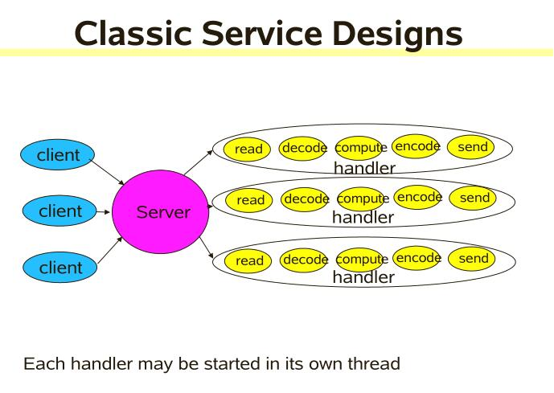
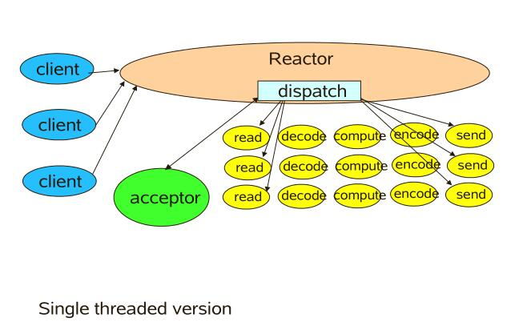
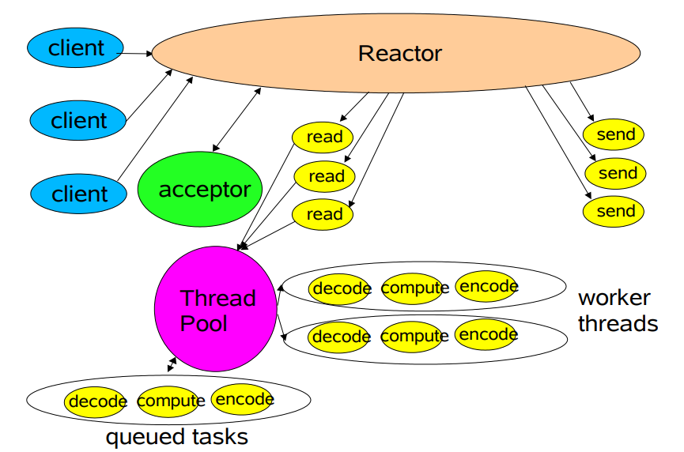
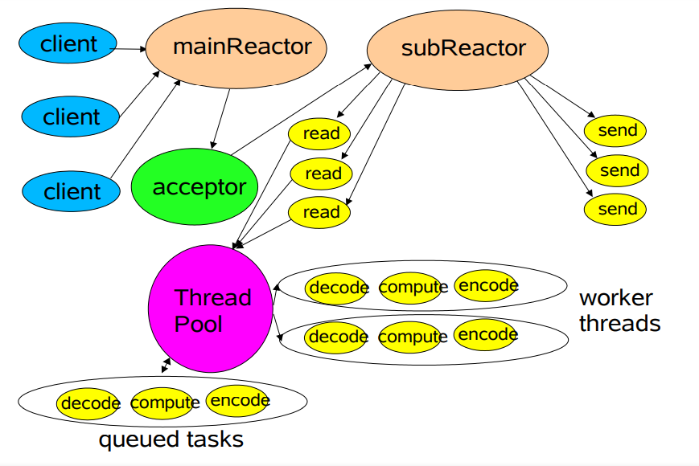

# Reactor模式

# 1概述

## 1.1 定义

Reactor pattern（反应器设计模式）是一种为处理并发服务请求，并将请求提交到一个或者多个服务处理程序的事件设计模式。当请求抵达后，服务处理程序使用解多路分配策略，然后同步地派发这些请求至相关的请求处理程序。

## 1.2 Reactor的组成

- Reactor线程：负责响应IO事件，并且分发事件到不同的Handler处理器。
- Handlers处理器：非阻塞地执行业务逻辑。

## 1.3 在开源项目中的使用

- Redis
- Nginx
- Netty

#  2 入门案例

## 2.1 一对一线程

### 2.1.1 一对一线程方案实现



```java
class Server implements Runnable {
    public void run() {
        try {
            //创建服务端连接
            ServerSocket ss = new ServerSocket(PORT);
            //不停创建线程处理新的请求
            while (!Thread.interrupted())
                new Thread(new Handler(ss.accept())).start();// single-threaded, or a thread pool
        } catch (IOException ex) {
            //异常处理
        }
    }

    //处理请求的handler
    static class Handler implements Runnable {
        final Socket socket;

        Handler(Socket s) {
            socket = s;
        }
        public void run() {
            try {
                byte[] input = new byte[MAX_INPUT];
                socket.getInputStream().read(input);
                byte[] output = process(input);
				socket.getOutputStream().write(output);             
            } catch (IOException ex) {
                //异常处理
            }
        }
        private byte[] process(byte[] cmd) {
            //业务处理
        }
    }
}
```

### 2.1.2 一对一线程方案的问题

每到来一个请求，系统都会分配一个线程去处理，当系统请求量瞬间暴增时，会直接把系统拖垮。因为在高并发情况下，系统创建的线程数量是有限的。

## 2.2 优化方案：使用线程池及其缺点

线程池的使用使得线程可以被复用，大大降低创建线程和销毁线程的时间。然而，线程池并不能很好满足高并发线程的需求，当海量请求到来时，线程池中的工作线程达到饱和状态，这时可能就导致请求被抛弃，无法完成客户端的请求。

## 2.3 优化方案：单线程版Reactor

参见：http://gee.cs.oswego.edu/dl/cpjslides/nio.pdf

可以将一次完整的请求切分成几个小的任务，每一个小任务都是非阻塞的；对于读写操作，使用NIO对其进行读写；不同的任务将被分配到与其相关联的处理器上进行处理，每个处理器都是通过异步回调机制实现。

单线程版的Reactor模式如下图所示。对于客户端的所有请求，都有一个专门的线程去进行处理，这个线程无限循环去监听是否有客户的请求到来，一旦收到客户端的请求，就将其分发给相应的处理器进行处理。



```java
package com.zh.reactormode;

import java.io.IOException;
import java.net.InetSocketAddress;
import java.nio.ByteBuffer;
import java.nio.channels.SelectionKey;
import java.nio.channels.Selector;
import java.nio.channels.ServerSocketChannel;
import java.nio.channels.SocketChannel;
import java.util.Iterator;
import java.util.Set;

class Reactor implements Runnable {
    final Selector selector;
    final ServerSocketChannel serverSocket;

    Reactor(int port) throws IOException { //Reactor初始化
        // 创建一个Selector
        selector = Selector.open();
        // 创建一个ServerSocketChannel
        serverSocket = ServerSocketChannel.open();
        // 将监听的端口绑定到Channel
        serverSocket.socket().bind(new InetSocketAddress(port));
        //设置Channel为非阻塞
        serverSocket.configureBlocking(false);
		// 在Selector上注册自己感兴趣的时事件，可以是连接事件，也可以是读写事件。
        //分步处理,第一步,接收accept事件
        SelectionKey sk = serverSocket.register(selector, SelectionKey.OP_ACCEPT);
        // 绑定回调对象Acceptor
        sk.attach(new Acceptor());
    }
	
    public void run() {
        try {
            while (!Thread.interrupted()) {//无限循环等待网络请求的到来
                // 此代码会阻塞直到有绑定到selector的请求类型对应的请求到来
                selector.select();
                Set selected = selector.selectedKeys();
                Iterator it = selected.iterator();
                // 遍历SelectionKeys，一旦收到事件，处理分发到对应的handler
                while (it.hasNext()) {
                    //Reactor负责dispatch收到的事件
                    dispatch((SelectionKey) (it.next()));
                }
                // 清空事件
                selected.clear();
            }
        } catch (IOException ex) { 
            // 处理异常
        }
    }

    void dispatch(SelectionKey k) {
        Runnable r = (Runnable) (k.attachment());
        //调用之前注册的callback对象
        if (r != null) {
            r.run();//没有创建新的线程
        }
    }

    // inner class
    class Acceptor implements Runnable {
        public void run() {
            try {
                // 获取SocketChannel
                SocketChannel channel = serverSocket.accept();
                // 如果SocketChannel不为空，则创建一个handler进行相应处理。
                if (channel != null)
                    new Handler(selector, channel);
            } catch (IOException ex) { 
                // 处理异常
            }
        }
    }
}
```

Handler：

```java
package com.zh.reactormode;

import com.zh.reactormode.config.SystemConfig;

import java.io.IOException;
import java.nio.ByteBuffer;
import java.nio.channels.SelectionKey;
import java.nio.channels.Selector;
import java.nio.channels.SocketChannel;

class Handler implements Runnable {
    final SocketChannel channel;
    final SelectionKey sk;
    ByteBuffer input = ByteBuffer.allocate(SystemConfig.INPUT_SIZE);
    ByteBuffer output = ByteBuffer.allocate(SystemConfig.SEND_SIZE);
    static final int READING = 0, SENDING = 1;
    int state = READING;

    Handler(Selector selector, SocketChannel c) throws IOException {
        channel = c;
        // 设置SocketChannel为非阻塞
        c.configureBlocking(false);
        // Optionally try first read now
        sk = channel.register(selector, 0);

        // 将Handler作为callback对象，以处理事件
        sk.attach(this);
        // 第二步,注册Read就绪事件
        sk.interestOps(SelectionKey.OP_READ);
        // 唤醒阻塞在selector.select上的线程，让该线程及时去处理其他事情
        selector.wakeup();
    }

    boolean inputIsComplete() {
        /* ... */
        return false;
    }

    boolean outputIsComplete() {
        /* ... */
        return false;
    }

    void process() {
        /* ... */
        return;
    }
	// 针对不同的请求事件进行处理
    public void run() {
        try {
            if (state == READING) {
                read();
            } else if (state == SENDING) {
                send();
            }
        } catch (IOException ex) { 
            /* ... */ 
        }
    }

    void read() throws IOException {
        channel.read(input);
        if (inputIsComplete()) {

            process();

            state = SENDING;
            // Normally also do first write now

            //第三步,接收write就绪事件
            sk.interestOps(SelectionKey.OP_WRITE);
        }
    }

    void send() throws IOException {
        channel.write(output);

        //write完就结束了, 关闭select key
        if (outputIsComplete()) {
            sk.cancel();
        }
    }
}
```

### 2.3.1 单线程版的Reactor的问题

## 2.4 优化方案：线程池版本的Reactor

将Handler处理器的执行放入线程池，多线程进行业务处理。



```java
package com.zh.reactormode;


import com.zh.reactormode.config.SystemConfig;

import java.io.IOException;
import java.nio.ByteBuffer;
import java.nio.channels.SelectionKey;
import java.nio.channels.Selector;
import java.nio.channels.SocketChannel;
import java.util.concurrent.ExecutorService;
import java.util.concurrent.Executors;

class MthreadHandler implements Runnable {
    final SocketChannel channel;
    final SelectionKey selectionKey;
    ByteBuffer input = ByteBuffer.allocate(SystemConfig.INPUT_SIZE);
    ByteBuffer output = ByteBuffer.allocate(SystemConfig.SEND_SIZE);
    static final int READING = 0, SENDING = 1;
    int state = READING;

    ExecutorService pool = Executors.newFixedThreadPool(2);
    static final int PROCESSING = 3;

    MthreadHandler(Selector selector, SocketChannel c) throws IOException {
        channel = c;
        c.configureBlocking(false);
        // Optionally try first read now
        selectionKey = channel.register(selector, 0);

        //将Handler作为callback对象
        selectionKey.attach(this);

        //第二步,注册Read就绪事件
        selectionKey.interestOps(SelectionKey.OP_READ);
        selector.wakeup();
    }

    boolean inputIsComplete() {
       /* ... */
        return false;
    }

    boolean outputIsComplete() {

       /* ... */
        return false;
    }

    void process() {
       /* ... */
        return;
    }

    public void run() {
        try {
            if (state == READING) {
                read();
            }
            else if (state == SENDING) {
                send();
            }
        } catch (IOException ex) { /* ... */ }
    }


    synchronized void read() throws IOException {
        // ...
        channel.read(input);
        if (inputIsComplete()) {
            state = PROCESSING;
            //使用线程pool异步执行
            pool.execute(new Processer());
        }
    }

    void send() throws IOException {
        channel.write(output);

        //write完就结束了, 关闭select key
        if (outputIsComplete()) {
            selectionKey.cancel();
        }
    }

    synchronized void processAndHandOff() {
        process();
        state = SENDING;
        // or rebind attachment
        //process完,开始等待write就绪
        selectionKey.interestOps(SelectionKey.OP_WRITE);
    }

    class Processer implements Runnable {
        public void run() {
            processAndHandOff();
        }
    }
}
```

##  2.5 优化方案：一个Reactor多个Selector

 

- 将不同的处理程序绑定到不同的IO事件
- 可能需要仔细同步以进行协调

```java
package com.zh.reactormode;

import java.io.IOException;
import java.net.InetSocketAddress;
import java.net.Socket;
import java.nio.channels.SelectionKey;
import java.nio.channels.Selector;
import java.nio.channels.ServerSocketChannel;
import java.nio.channels.SocketChannel;
import java.util.Iterator;
import java.util.Set;

class MthreadReactor implements Runnable {

    //subReactors集合, 一个selector代表一个subReactor
    Selector[] selectors=new Selector[2];
    int next = 0;
    final ServerSocketChannel serverSocket;

    MthreadReactor(int port) throws IOException { //Reactor初始化
        // 打开一个选择器。这个新的选择器的是通过调用系统级默认SelectorProvider对象openSelector方法来创建的。
        selectors[0]= Selector.open();
        selectors[1]= Selector.open();
        serverSocket = ServerSocketChannel.open();
        serverSocket.socket().bind(new InetSocketAddress(port));
        //非阻塞
        serverSocket.configureBlocking(false);

        //分步处理,第一步,接收accept事件
        SelectionKey sk = serverSocket.register(selectors[0], SelectionKey.OP_ACCEPT);
        //attach callback object, Acceptor
        sk.attach(new Acceptor());
    }

    public void run() {
        try {
            while (!Thread.interrupted()) {
                for (int i = 0; i <2 ; i++) {
                    selectors[i].select();
                    Set selected =  selectors[i].selectedKeys();
                    Iterator it = selected.iterator();
                    while (it.hasNext()) {
                        //Reactor负责dispatch收到的事件
                        dispatch((SelectionKey) (it.next()));
                    }
                    selected.clear();
                }

            }
        } catch (IOException ex) { 
            /* ... */ 
        }
    }

    void dispatch(SelectionKey k) {
        Runnable r = (Runnable) (k.attachment());
        // 调用之前注册的callback对象
        if (r != null) {
            r.run();
        }
    }

    class Acceptor { // ...
        public synchronized void run() throws IOException {
            SocketChannel connection = serverSocket.accept(); //主selector负责accept
            if (connection != null)  {
                new Handler(selectors[next], connection); //选个subReactor去负责接收到的connection
            }
            if (++next == selectors.length) next = 0;
        }
    }
}
```

