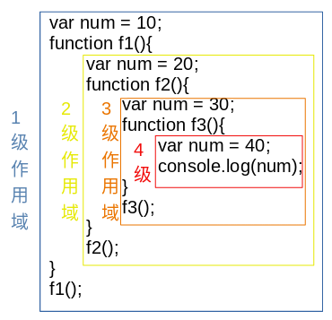

# JavaScript闭包

# 1 JS闭包有关的基础知识


## 1.1 定义函数的两种方式


### 1.1.1 函数声明


> function 函数名(){
> 	//函数体
> }


### 1.1.2 函数表达式


把一个函数给一个变量，此时形成了函数表达式


> var 变量 = 匿名函数；


## 1.2 回调函数


### 1.2.1 把函数作为其它函数的参数使用


```javascript
function f1(fn){
    fn();
}
function f2(){
    console.log("我是一个回调函数！");
}
f1(f2);
```


### 1.2.2 把函数作为返回值使用


```javascript
function f1(){
    console.log("f1函数调用了");
    return function(){
        console.log("这是用作返回值的一个函数！");
    }
}
var fr = f1();
fr();
```


## 1.3 作用域&作用域链


### 1.3.1 局部变量和全局变量


#### 1.3.1.1 声明位置不同


局部变量：在函数内部使用var声明的变量。


全局变量：在函数外部使用var声明的变量。


#### 1.3.1.2 作用域不同


局部变量：函数内部。


全局变量：当前页面。


#### 1.3.1.3 生存期不同


局部变量生存期：函数


全局变量生存期：页面


### 1.3.2 块级作用域


- ES5没有块级（也就是大括号`{}`内部）作用域。
  - 比如if语句的块`{}`内部声明的变量，在外部也是可以使用的。
- 函数的块`{}`除外。
- ES6是有块级作用域的。


### 1.3.3 隐式全局变量和全局变量


在函数内部没有使用var声明的变量就是隐式全局变量。


全局变量是不能被删除的，隐式全局变量是可以被删除的。


### 1.3.4 作用域链


作用域的优先级是：本级作用域 > 上级作用域


调用顺序是：先本级查找，如果没有找到，在到上级作用域查找。





# 2 JS中的闭包


## 2.1 简单的闭包


闭包是指函数可以使用函数之外定义的变量。


```html
<!DOCTYPE html>
<html lang="en">
<head>
	<meta charset="utf-8">
	<title>闭包</title>
</head>
<body>
	<script type="text/javascript">
		var num = 1;//全局变量
		function f1(){
			alert(num);
		}
		f1();
	</script>
</body>
</html>
```


## 2.2 复杂的闭包：如何在外部读取局部变量


- 在函数的内部，再定义一个函数
  - 函数2被包括在函数1内部，1内部的所有局部变量，对函数2都是可见的。
  - JS特有的“作用域链”结构（父对象的所有变量，对子对象都是可见的，反之则不成立）
- 把内部函数作为返回值。


```html
<!DOCTYPE html>
<html lang="en">
<head>
	<meta charset="utf-8">
	<title>闭包</title>
</head>
<body>
	<script type="text/javascript">		
		function f1(){
			var num = 1;
			//第一步：在函数的内部，再定义一个函数，在内部函数中操作外部函数的局部变量
			function f2(){
				alert(num);
			}
			//第二步：把内部函数作为返回值。
			return f2;
		}
		var result = f1();
		result();
	</script>
</body>
</html>
```


## 2.3 闭包的理解


- 闭包是指函数可以使用函数之外定义的变量。
- 推广：
  - 闭包就是能够读取其它函数内部变量的函数。
  - 可以把闭包简单理解成：定义在一个函数内部的函数。
  - 闭包是将函数内部和函数外部连接起来的一座桥梁。


# 3 闭包的用途和缺点


## 3.1 闭包的用途


- 使用闭包可以读取函数内部的变量。
  - 例如：《复杂的闭包：如何在外部读取局部变量》中的示例
- **使用闭包可以让函数中的局部变量的值始终保持在内存中**。


```javascript
<!DOCTYPE html>
<html lang="en">
<head>
	<meta charset="utf-8">
	<title>使用闭包可以让函数中的局部变量的值始终保持在内存中</title>
</head>
<body>
	<script type="text/javascript">	
		var numAdd;	
		function f1(){
			var num = 100;//局部变量，应该在函数f1()执行完成之后被删除
			numAdd = function(){
				num += 1;
			}
			//闭包第一步：在函数的内部，再定义一个函数
			function f2(){
				alert(num);
			}
			//闭包第二步：把内部函数作为返回值。
			return f2;
		}
		var result = f1();
		result();//输出：100
		numAdd();
		//闭包使得函数内部的局部变量的值始终保持在内存中
		result();//输出：101	说明num并没有被删除
	</script>
</body>
</html>
```


## 3.2 闭包的缺点


- 闭包会使得函数中的变量都被保存在内存中，内存消耗很大，所以不能滥用闭包，否则会造成网页的性能问题，在IE中可能导致内存的泄露。
- 闭包会在父函数外部改变父函数内部变量的值。


# 4 闭包的应用


## 4.1 使用闭包实现计数器


需求：统计数值，且该计数器在所有函数中都是可用的。


### 4.1.1 使用全局变量实现计数器功能


```javascript
<!DOCTYPE html>
<html lang="en">
<head>
	<meta charset="utf-8">
	<title>闭包的应用-计数器</title>
</head>
<body>
	<script type="text/javascript">
		//如下代码可以实现计数器的功能，但是有个问题：
		//	因为count是个全局变量,所以可以随意修改count的值
		var count = 0;//统计数值
		function add(){
			count += 1;
			alert(count);
		}
		add();//1
		add();//2
		add();//3
	</script>
</body>
</html>
```


### 4.1.2 使用局部变量实现计数器功能


```javascript
<!DOCTYPE html>
<html lang="en">
<head>
	<meta charset="utf-8">
	<title>闭包的应用-计数器</title>
</head>
<body>
	<script type="text/javascript">
		function add(){
			var count = 0;//统计数值
			return function(){
				count += 1;
				alert(count);
			}
		}
		var result = add();
		result();//1
		result();//2
		result();//3
	</script>
</body>
</html>
```


## 4.2 使用闭包实现点赞功能


```javascript
<!DOCTYPE html>
<html lang="en">
<head>
	<meta charset="utf-8">
	<title>闭包的应用-点赞</title>
	<style type="text/css">
		ul{
			list-style: none;
		}
		li{
			float: left;
			margin-left: 10px;
		}
		img{
			width: 200px;
			height: 180px;
		}
		input{
			margin-left: 30%;
		}
	</style>
</head>
<body>
	<ul>
		<li><br><input type="button" value="赞（0）"></li>
		<li><br><input type="button" value="赞（0）"></li>
		<li><br><input type="button" value="赞（0）"></li>
	</ul>
	<script type="text/javascript">
		//获取input按钮
		var btns = document.getElementsByTagName('input');
		//使用闭包缓存数据的功能
		function setValue(){
			var value = 1;
			return function(){
				this.value = "赞（" + (value++) + "）";
			}
		}
		//遍历每个按钮
		for (var i = 0; i < btns.length; i++) {
			//注册点击事件
			btns[i].onclick = setValue();
		}
	</script>
</body>
</html>
```
