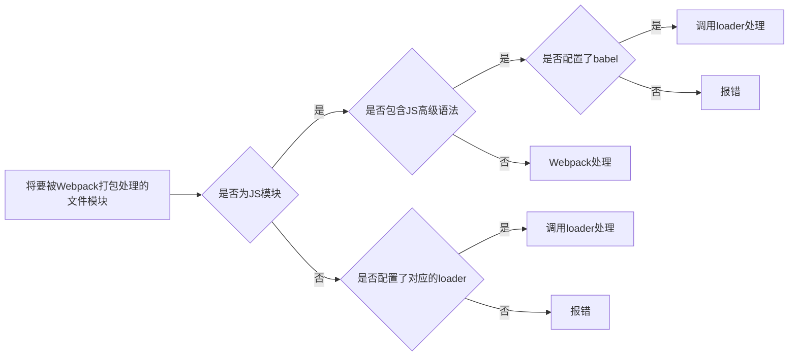

# 前端资源加载、打包工具——Webpack

# 1 Webpack介绍

Webpack 是一个前端资源加载/打包工具。它将根据模块的依赖关系进行静态分析，然后将这些模块按照指定的规则生成对应的静态资源。

webpack 提供了友好的模块化支持，以及代码压缩混淆、 处理 js 兼容问题、 性能优化等强大的功能，从而让程序员把工作的重心放到具体的功能实现上，提高了开发效率和项目的可维护性。

Webpack 可以将多种静态资源 js、css、less 转换成一个静态文件，减少了页面的请求。

# 2 Webpack的基本使用

## 2.1 创建列表隔行变色项目

1. 新建项目空白目录，然后运行 `npm init -y` 命令，以初始化包管理配置文件 `package.json`
2. 新建 `src` 源代码目录
3. 新建`src/index.html`首页
4. 初始化首页基本的结构
5. 运行 `npm install jquery -S` 命令，以安装 jQuery
6. 通过模块化的形式，实现列表隔行变色效果

## 2.2 在项目中安装和配置 webpack

- 运行 `npm install webpack webpack-cli -D` 命令，安装 webpack 相关的包

- 在项目根目录中，创建名为 `webpack.config.js` 的 webpack 配置文件

- 在 webpack 的配置文件中，初始化如下基本配置：

    - ```javascript
        module.exports = {
            mode: 'development' // mode 用来指定构建模式
        }
        ```

- 在 `package.json` 配置文件中的 scripts 节点下，在原有test下新增 dev 脚本如下：

    - script 节点下的脚本，可以通过 `npm run 脚本名称` 执行，如`npm run dev`

    - ```javascript
        "scripts": {
            "test": "echo \"Error: no test specified\" && exit 1",
            "dev": "webpack"
        }
        ```

- 在终端中运行 `npm run dev` 命令，启动 webpack 进行项目打包。

## 2.3 配置打包的入口与出口

webpack 的 4.x 版本中默认约定：

- 打包的入口文件为 `src/index.js`
- 打包的输出文件为 `dist/main.js`

如果要修改打包的入口与出口，可以在 `webpack.config.js` 中新增如下配置信息：

```javascript
const path = require('path') // 导入 node.js 中专门操作路径的模块
module.exports = {
    entry: path.join(__dirname, './src/index.js'), 		// 打包入口文件的路径
    output: {
        path: path.join(__dirname, './dist'), // 输出文件的存放路径
        filename: 'bundle.js' // 输出文件的名称
    }
}
```

## 2.4 配置 webpack 的自动打包功能

1. 运行 `npm install webpack-dev-server -D` 命令，安装支持项目自动打包的工具

2. 修改 `package.json`中scripts中的dev节点如下：

    1. script节点下的脚本，可以通过 `npm run 脚本名称`执行

    2. ```json
        "scripts": {
        	"dev": "webpack-dev-server"
        }
        ```

3. 将 `src/index.html` 中， script 脚本的引用路径，修改为 `/buldle.js`

4. 运行 `npm run dev` 命令，重新进行打包。

5. 在浏览器中访问终端中给出的网址（如http://localhost:8080，端口号是可能不同），查看自动打包效果。

注意：

- webpack-dev-server 会启动一个实时打包的 http 服务器。
- webpack-dev-server 打包生成的输出文件，默认放到了项目根目录中，而且是虚拟的、看不见的

## 2.5 配置 html-webpack-plugin 生成预览页面

1. 运行 `npm install html-webpack-plugin -D` 命令，安装生成预览页面的插件。

2. 修改 `webpack.config.js` 文件头部区域，添加如下配置信息：

    1. ```javascript
        // 导入生成预览页面的插件，得到一个构造函数
        const HtmlWebpackPlugin = require('html-webpack-plugin')
        const htmlPlugin = new HtmlWebpackPlugin({ // 创建插件的实例对象
            template: './src/index.html', // 指定要用到的模板文件
            filename: 'index.html' // 指定生成的文件的名称，该文件存在于内存中，在目录中不显示
        })
        ```

3. 修改 `webpack.config.js `文件中向外暴露的配置对象，新增如下配置节点：

    1. ```javascript
        module.exports = {
        	plugins: [ htmlPlugin ] // plugins 数组是 webpack 打包期间会用到的一些插件列表
        }
        ```

## 2.6 配置自动打包相关的参数

自动打包相关的参数在`package.json`中的配置：

```json
"scripts": {
	"dev": "webpack-dev-server --open --host 127.0.0.1 --port 8888"
},
```

参数说明：

- `--open`：打包完成后自动打开浏览器页面
- `--host`：配置 IP 地址
- `--port`：配置端口

运行 `npm run dev` 命令，重新进行打包。则会自动在浏览器访问：`http://127.0.0.1:8888/`，默认显示的项目更目录`./src/index.html`的内容。

# 3 Webpack中的加载器

## 3.1 通过 loader 打包非 js 模块

在实际开发过程中，Webpack默认只能打包处理以` .js` 后缀名结尾的模块，其他非 `.js` 后缀名结尾的模块，Webpack默认处理不了， 需要调用 loader 加载器才可以正常打包，否则会报错！

loader 加载器可以协助 webpack 打包处理特定的文件模块，比如：

- `less-loader`：可以打包处理 .less 相关的文件
- `sass-loader`：可以打包处理 .scss 相关的文件
- `url-loader`：可以打包处理 css 中与 url 路径相关的文件

## 3.2 loader 的调用过程



## 3.3 Webpack 中加载器的基本使用

### 3.3.1 打包处理 css 文件

1. 运行 `npm i style-loader css-loader -D` 命令，安装处理 css 文件的 loader
2. 在 `webpack.config.js` 的 module下rules 数组中，添加 loader 规则如下：

```javascript
// 所有第三方文件模块的匹配规则
module: {
    rules: [
    	{ test: /\.css$/, use: ['style-loader', 'css-loader'] }
    ]
}
```

参数说明：

- test 表示匹配的文件类型
- use 表示对应要调用的 loader
    - 注意：use 数组中指定的 loader 顺序是固定的
    - 注意：多个 loader 的调用顺序是：从后往前调用

### 3.3.2 打包处理 less 文件

1. 运行 `npm i less-loader less -D` 命令
2. 在 `webpack.config.js` 的 module下rules 数组中，添加 loader 规则如下：

```javascript
// 所有第三方文件模块的匹配规则
module: {
    rules: [
    	{ test: /\.less$/, use: ['style-loader', 'css-loader', 'less-loader'] }
    ]
}
```

### 3.3.3 打包处理 scss 文件

1. 运行 `npm i sass-loader node-sass -D` 命令
2. 在` webpack.config.js` 的 module下rules 数组中，添加 loader 规则如下：

```javascript
// 所有第三方文件模块的匹配规则
module: {
    rules: [
    	{ test: /\.scss$/, use: ['style-loader', 'css-loader', 'sass-loader'] }
    ]
}
```

### 3.3.4 配置 postCSS 自动添加 css 的兼容前缀

1. 运行 `npm i postcss-loader autoprefixer -D` 命令

2. 在项目根目录中创建 postcss 的配置文件 `postcss.config.js`，并初始化如下配置：

    1. ```javascript
        const autoprefixer = require('autoprefixer') // 导入自动添加前缀的插件
        module.exports = {
        	plugins: [ autoprefixer ] // 挂载插件
        }
        ```

3. 在 webpack.config.js 的 module -> rules 数组中，修改 css 的 loader 规则如下：

    1. ```javascript
        module: {
            rules: [
            	{ test:/\.css$/, use: ['style-loader', 'css-loader', 'postcss-loader'] }
            ]
        }
        ```

### 3.3.5 打包样式表中的图片和字体文件

1. 运行 `npm i url-loader file-loader -D` 命令
2. 在 `webpack.config.js` 的 module下rules 数组中，添加 loader 规则如下：

```javascript
module: {
    rules: [
        {
            test: /\.jpg|png|gif|bmp|ttf|eot|svg|woff|woff2$/,
            use: 'url-loader?limit=16940'
        }
    ]
}
```

说明：

- 其中` ?` 之后的是 loader 的参数项。
- limit 用来指定图片的大小，单位是字节(byte)，只有小于 limit 大小的图片，才会被转为 base64 图片

### 3.3.6 打包处理 js 文件中的高级语法

1. 安装babel转换器相关的包： `npm i babel-loader @babel/core @babel/runtime -D`

2. 安装babel语法插件相关的包： `npm i @babel/preset-env @babel/plugin-transformruntime @babel/plugin-proposal-class-properties –D`

3. 在项目根目录中，创建 babel 配置文件 `babel.config.js` 并初始化基本配置如下：

    1. ```javascript
        module.exports = {
            presets: [ '@babel/preset-env' ],
            plugins: [ '@babel/plugin-transform-runtime', '@babel/plugin-proposalclass-properties’ ]
        }
        ```

4. 在 `webpack.config.js` 的 module下rules 数组中，添加 loader 规则如下：

    1. ```javascript
        // exclude 为排除项，表示 babel-loader 不需要处理 node_modules 中的 js 文件
        { test: /\.js$/, use: 'babel-loader', exclude: /node_modules/ }
        ```