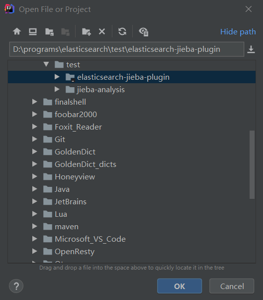
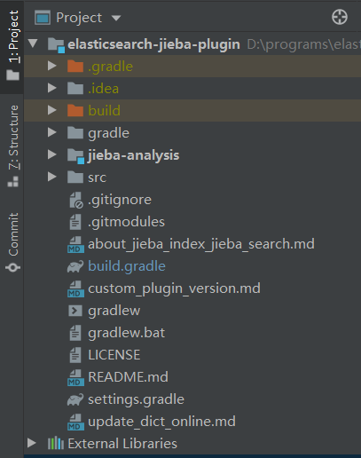
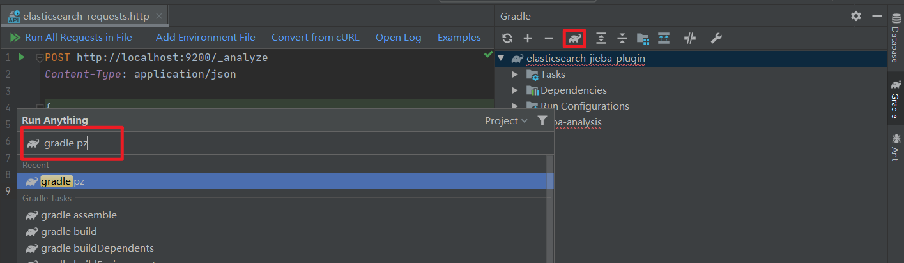

# ElasticSearch插件

# 1 分词器插件

## 1.1 IK分词器

### 1.1.1 测试分词器

在添加文档时会进行分词，索引中存放的就是一个一个的词（term），当你去搜索时就是拿关键字去匹配词，最终找到词关联的文档。

测试当前索引库使用的分词器，发送POST请求：

```http
POST http://localhost:9200/_analyze
Content-Type: application/json

{
  "text":"测试分词器，后边是测试内容：spring cloud实战"
}

###
```

返回结果如下：

```json
{
    "tokens": [
        {
            "token": "测",
            "start_offset": 0,
            "end_offset": 1,
            "type": "<IDEOGRAPHIC>",
            "position": 0
        },
        {
            "token": "试",
            "start_offset": 1,
            "end_offset": 2,
            "type": "<IDEOGRAPHIC>",
            "position": 1
        },
        ......
    ]
}
```

因为当前索引库使用的分词器对中文就是单字分词，所以将 “测试” 这个词拆分成两个单字“测”和“试”。

### 1.1.2 安装IK分词器

下载IK分词器：（Github地址：https://github.com/medcl/elasticsearch-analysis-ik/releases）

下载zip包并解压此zip包，并将解压的文件拷贝到ElasticSearch安装目录的plugins下的ik目录下，

测试当前索引库使用的分词器，发送POST请求：http://localhost:9200/_analyze，参数为：`{"text":"测试分词器，后边是测试内容：spring cloud实战","analyzer":"ik_max_word" }`，返回结果如下：

```json
{
    "tokens": [
        {
            "token": "测试",
            "start_offset": 0,
            "end_offset": 2,
            "type": "CN_WORD",
            "position": 1
        },
        {
            "token": "分词器",
            "start_offset": 2,
            "end_offset": 5,
            "type": "CN_WORD",
            "position": 2
        },
        ......
    ]
}
```

### 1.1.3 两种分词模式

ik分词器有两种分词模式：

- `ik_max_word`：会将文本做最细粒度的拆分，比如会将“中华人民共和国人民大会堂”拆分为“中华人民共和国、中华人民、中华、华人、人民共和国、人民、共和国、大会堂、大会、会堂等词语。
- `ik_smart`：会做最粗粒度的拆分，比如会将“中华人民共和国人民大会堂”拆分为中华人民共和国、人民大会堂。

### 1.1.4 自定义词库

如果要让分词器支持一些专有词语，可以自定义词库。

iK分词器自带一个`Elasticsearch/6.2.1/plugins/ik/config/main.dic`的文件，此文件为词库文件。

则自定义词库的步骤为：

1. 新建自定义词库文件`Elasticsearch/6.2.1/plugins/ik/config/my.dic`，注意文件格式为`utf-8`（不要选择`utf-8 BOM`）。
2. 可以根据`main.dic`内容在其中自定义词汇，比如`测试分词器`。
3. 配置文件`Elasticsearch/6.2.1/plugins/ik/config/IKAnalyzer.cfg.xml`中配置`my.dic`

```xml
<?xml version="1.0" encoding="UTF-8"?>
<!DOCTYPE properties SYSTEM "http://java.sun.com/dtd/properties.dtd">
<properties>
	<comment>IK Analyzer 扩展配置</comment>
	<!--用户可以在这里配置自己的扩展字典 -->
	<entry key="ext_dict">my.dic</entry>
	 <!--用户可以在这里配置自己的扩展停止词字典-->
	<entry key="ext_stopwords"></entry>
	<!--用户可以在这里配置远程扩展字典 -->
	<!-- <entry key="remote_ext_dict">words_location</entry> -->
	<!--用户可以在这里配置远程扩展停止词字典-->
	<!-- <entry key="remote_ext_stopwords">words_location</entry> -->
</properties>
```

重启ElasticSearch，测试分词效果，发送POST请求：http://localhost:9200/_analyze，参数为：`{"text":"测试分词器，后边是测试内容：spring cloud实战","analyzer":"ik_max_word" }`，返回结果如下：

```json
{
    "tokens": [
        {
            "token": "测试分词器",
            "start_offset": 0,
            "end_offset": 5,
            "type": "CN_WORD",
            "position": 0
        },
        {
            "token": "测试",
            "start_offset": 0,
            "end_offset": 2,
            "type": "CN_WORD",
            "position": 1
        },
        ......
    ]
}
```

## 1.2 结巴分词器

### 1.2.1 下载结巴分词插件并导入idea中

因为不同版本的elasticSearch的对应的结巴分词插件的版本也不相同，我们这里的ElasticSearch版本为：7.11.0，但是结巴分词插件的版本最新的为v7.7.0，因为插件作者提供了修改方法以适应其他版本的ElasticSearch，所以我们这里下载最新版的插件。

下载地址：https://github.com/sing1ee/elasticsearch-jieba-plugin.git

```shell
PS D:\programs\elasticsearch\test> git clone https://github.com/sing1ee/elasticsearch-jieba-plugin.git --recursive
Cloning into 'elasticsearch-jieba-plugin'...
remote: Enumerating objects: 151, done.
remote: Counting objects: 100% (151/151), done.
remote: Compressing objects: 100% (85/85), done.
remote: Total 616 (delta 64), reused 113 (delta 40), pack-reused 465Receiving objects:  93% (573/616), 1.39 MiB | 20.00 Receiving objects:  97% (598/616), 1.39 MiB | 20.00 KiB/s
Receiving objects: 100% (616/616), 1.41 MiB | 16.00 KiB/s, done.
Resolving deltas: 100% (274/274), done.
Submodule 'jieba-analysis' (git@github.com:sing1ee/jieba-analysis.git) registered for path 'jieba-analysis'
Cloning into 'D:/programs/elasticsearch/test/elasticsearch-jieba-plugin/jieba-analysis'...
Host key verification failed.
fatal: Could not read from remote repository.

Please make sure you have the correct access rights
and the repository exists.
fatal: clone of 'git@github.com:sing1ee/jieba-analysis.git' into submodule path 'D:/programs/elasticsearch/test/elasticsearch-jieba-plugin/jieba-analysis' failed
Failed to clone 'jieba-analysis'. Retry scheduled
Cloning into 'D:/programs/elasticsearch/test/elasticsearch-jieba-plugin/jieba-analysis'...
Host key verification failed.
fatal: Could not read from remote repository.

Please make sure you have the correct access rights
and the repository exists.
fatal: clone of 'git@github.com:sing1ee/jieba-analysis.git' into submodule path 'D:/programs/elasticsearch/test/elasticsearch-jieba-plugin/jieba-analysis' failed
Failed to clone 'jieba-analysis' a second time, aborting
```

从执行结果可以看出来，插件的子模块没有下载成功，这里作者提供的解决办法是：把自己的ssh pub key，加到github上。我们使用另一种简单的办法

> 1. 使用git下载子模块
>
>    ```shell
>    PS D:\programs\elasticsearch\test> git clone https://github.com/sing1ee/jieba-analysis.git
>    Cloning into 'jieba-analysis'...
>    remote: Enumerating objects: 1, done.
>    remote: Counting objects: 100% (1/1), done.
>    remote: Total 378 (delta 0), reused 0 (delta 0), pack-reused 377R
>    Receiving objects: 100% (378/378), 4.16 MiB | 17.00 KiB/s, done.
>    Resolving deltas: 100% (106/106), done.
>    ```
>
> 2. 把下载好的子模块放到插件根目录下

用idea打开插件项目：





**依赖下载失败问题**：结巴分词插件使用的是Gradle管理项目的，如果发现gradle下载依赖失败的情况，可以把插件项目（和子项目）的`build.gradle`文件中的maven地址的协议名改为https。

```
repositories {
    maven { url "https://maven.aliyun.com/nexus/content/groups/public/" }
    jcenter()
}
```

### 1.2.2 插件的编译、安装和使用

使用idea或者作者提供的方法进行编译，这里使用idea的gradle插件进行编译：



**无法找到主类的问题**：`错误: 找不到或无法加载主类 org.gradle.wrapper.GradleWrapperMain`

- 解决方案：导致错误的原因就是gradle中丢失了 gradle-wrapper.jar包，去别的项目..\android\gradle\wrapper中复制过来（放到项目`gradle/wrapper/`目录下），在重新编译即可。

插件作者提供的教程：https://github.com/sing1ee/elasticsearch-jieba-plugin


### 1.2.5 结巴分析器

结巴分词插件提供3个分析器：

- jieba_index: 用于索引分词，分词粒度较细；

- jieba_search: 用于查询分词，分词粒度较粗；

- jieba_other: 全角转半角、大写转小写、字符分词；

### 1.2.4 结巴分词的使用（python）

测试ElasticSearch版本：7.11.0

```python
from elasticsearch import Elasticsearch
import requests

def create_index():
    """
    创建索引库和映射
    :return:
    """
    es = Elasticsearch()
    body = {
        "settings": {
            "analysis": {
                "filter": {
                    "jieba_stop": {# 停用词过滤器
                        "type": "stop",
                        "stopwords_path": "stopwords/stopwords.txt" # config目录下
                    },
                    "jieba_synonym": {# 同义词词元过滤器
                        "type": "synonym",
                        "synonyms_path": "synonyms/synonyms.txt" # config目录下
                    }
                },
                "analyzer": {
                    "my_jieba_index": {# jieba分词器别名
                        "tokenizer": "jieba_index",
                        "filter": [
                            "lowercase",
                            "jieba_stop",
                            "jieba_synonym"
                        ]
                    },
                    "my_jieba_search": {  # jieba分词器别名
                        "tokenizer": "jieba_search",
                        "filter": [
                            "lowercase",
                            "jieba_stop",
                            "jieba_synonym"
                        ]
                    },
                }
            }
        },
        "mappings":{# 映射配置
            "properties":{
                "source": {
                    "type": "text",# 字段类型
                    "index": True,# 进行此字段索引
                    "analyzer": "my_jieba_index",# 分词器
                    "search_analyzer": "my_jieba_search"# 查询分词器
                },
                "title": {
                    "type": "text",
                    "index": True,
                    "analyzer": "my_jieba_index",
                    "search_analyzer": "my_jieba_search"
                },
            }
        }
    }
    res = es.indices.create(index="jieba_index", body=body)
    print("创建索引：", res)

def delete_index():
    es = Elasticsearch()
    res = es.indices.delete(index="jieba_index")
    print("删除索引：", res)

def insert_document():
    """
    插入文档
    :param document:
    :return:
    """
    es = Elasticsearch()
    document = {
        "source": "错误：文件尚未成功从目录中写入库",
        "title": "出现问题了"
    }
    res = es.index(index="jieba_index", body=document)
    print("插入文档：", res, document)

def search():
    """
    查询
    :param search_body:
    :return:
    """
    es = Elasticsearch()
    search_body = {
        "query": {
            "match": {
                "source": {
                    "query": "好像错误",
                    "operator": "or"
                }
            }
        }
    }
    res = es.search(index="jieba_index", body=search_body)
    print("查询结果", res)

def test_jieba():
    """
    测试结巴分词效果
    :return:
    """
    params = {
          "analyzer" : "my_jieba_index",# 结巴分词自定义别名
          "text" : "黄河之水天上来"
        }
    res = requests.post(url='http://localhost:9200/jieba_index/_analyze', json=params)
    print(res.json())

def get_mapping():
    """
    获取所有索引库的映射
    :return:
    """
    res = requests.get(url='http://localhost:9200/_mapping')
    print(res.json())


if __name__ == "__main__":
    search()

```

