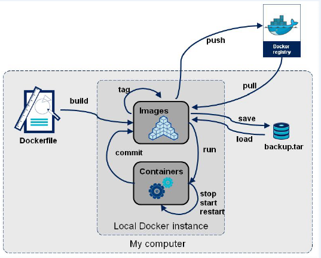

 # Dockerfile

# 1 什么是Dockerfile

Dockerfile是由一系列命令和参数构成的脚本，这些命令应用于基础镜像并最终创建一个新的镜像。

Dockerfile其内部**包含了一条条的指令**，**每一条指令构建一层，因此每一条指令的内容，就是描述该层应当如何构建**。



- 对于开发人员：可以为开发团队提供一个完全一致的开发环境； 
- 对于测试人员：可以直接拿开发时所构建的镜像或者通过Dockerfile文件构建一个新的镜像开始工作了； 
- 对于运维人员：在部署时，可以实现应用的无缝移植。


# 2 常用命令

- `FROM image_name:tag`

  > 定义了使用哪个基础镜像启动构建流程

- `MAINTAINER user_name`

  > 声明镜像的创建者

- `ENV key value`

  > 设置环境变量 (可以写多条)，定义了环境变量，那么在后续的指令中，就可以使用这个环境变量。
  >
  > 格式：
  >
  > ```
  > ENV <key> <value>
  > ENV <key1>=<value1> <key2>=<value2>...
  > ```

- `ARG <参数名>[=<默认值>]`

  > 构建参数，与 ENV 作用一致，不过作用域不一样。ARG 设置的环境变量仅对 Dockerfile 内有效，也就是说只有 docker build 的过程中有效，构建好的镜像内不存在此环境变量。
  >
  > 构建命令 docker build 中可以用 `--build-arg <参数名>=<值>` 来覆盖。

- `RUN command`

  > 用于在docker build时运行程序；
  >
  > 是Dockerfile的核心部分(可以写多条)；

- `CMD <shell 命令>` 或 `CMD ["<可执行文件或命令>","<param1>","<param2>",...] ` 或 `CMD ["<param1>","<param2>",...]`

  > 类似于 RUN 指令，用于运行程序，但二者运行的时间点不同:
  >
  > - CMD 在docker run 时运行。
  > - RUN 是在 docker build。
  >
  > **作用**：为启动的容器指定默认要运行的程序，程序运行结束，容器也就结束。CMD 指令指定的程序可被 docker run 命令行参数中指定要运行的程序所覆盖。
  >
  > **注意**：如果 Dockerfile 中如果存在多个 CMD 指令，仅最后一个生效。
  >
  > **格式**：
  >
  > ```
  > CMD <shell 命令> 
  > CMD ["<可执行文件或命令>","<param1>","<param2>",...] 
  > CMD ["<param1>","<param2>",...]  # 该写法是为 ENTRYPOINT 指令指定的程序提供默认参数
  > ```
  >
  > 推荐使用第二种格式，执行过程比较明确。第一种格式实际上在运行的过程中也会自动转换成第二种格式运行，并且默认可执行文件是 sh。

- `ENTRYPOINT ["<executeable>","<param1>","<param2>",...]`

  > 类似于 CMD 指令，但其不会被 docker run 的命令行参数指定的指令所覆盖，而且这些命令行参数会被当作参数送给 ENTRYPOINT 指令指定的程序。
  >
  > 但是, 如果运行 docker run 时使用了 `--entrypoint` 选项，此选项的参数可当作要运行的程序覆盖 ENTRYPOINT 指令指定的程序。
  >
  > **优点**：在执行 docker run 的时候可以指定 ENTRYPOINT 运行所需的参数。
  >
  > **注意**：如果 Dockerfile 中如果存在多个 ENTRYPOINT 指令，仅最后一个生效。
  >
  > 可以搭配 CMD 命令使用：一般是变参才会使用 CMD ，这里的 CMD 等于是在给 ENTRYPOINT 传参，以下示例会提到。

- `ADD source_dir/file dest_dir/file`

  > 将宿主机的文件复制到容器内，如果是一个压缩文件，将会在复制后自动解压。
  >
  > ADD 指令和 COPY 的使用格式一致（同样需求下，官方推荐使用 COPY）。功能也类似，不同之处如下：
  >
  > - ADD 的优点：在执行 <源文件> 为 tar 压缩文件的话，压缩格式为 gzip, bzip2 以及 xz 的情况下，会自动复制并解压到 <目标路径>。
  > - ADD 的缺点：在不解压的前提下，无法复制 tar 压缩文件。会令镜像构建缓存失效，从而可能会令镜像构建变得比较缓慢。具体是否使用，可以根据是否需要自动解压来决定。

- `COPY source_dir/file dest_dir/file`

  > 复制指令，从上下文目录中复制文件或者目录到容器里指定路径。和ADD相似，但是如果有压缩文件并不能解压。
  >
  > 格式：
  >
  > ```
  > COPY [--chown=<user>:<group>] <源路径1>...  <目标路径>
  > COPY [--chown=<user>:<group>] ["<源路径1>",...  "<目标路径>"]
  > ```
  >
  > - `[--chown=<user>:<group>]`：可选参数，用户改变复制到容器内文件的拥有者和属组。
  >
  > - `<源路径>`：源文件或者源目录，这里可以是通配符表达式，其通配符规则要满足 Go 的 filepath.Match 规则。
  > - `<目标路径>`：容器内的指定路径，该路径不用事先建好，路径不存在的话，会自动创建。
  >
  > 例如：
  >
  > ```
  > COPY hom* /mydir/
  > COPY hom?.txt /mydir/
  > ```

- `WORKDIR path_dir`

  > 指定工作目录。用 WORKDIR 指定的工作目录，会在构建镜像的每一层中都存在。
  >
  > - WORKDIR 指定的工作目录，必须是提前创建好的。
  >
  > - docker build 构建镜像过程中的，每一个 RUN 命令都是新建的一层。只有通过 WORKDIR 创建的目录才会一直存在。

- `VOLUME ["<路径1>", "<路径2>"...]`或`VOLUME <路径>`

  > 定义匿名数据卷。在启动容器时忘记挂载数据卷，会自动挂载到匿名卷。
  >
  > 在启动容器 docker run 的时候，我们可以通过 -v 参数修改挂载点。
  >
  > 作用：
  >
  > 1. 避免重要的数据，因容器重启而丢失，这是非常致命的。
  > 2. 避免容器不断变大。

- `EXPOSE <端口1> [<端口2>...]`

  > 仅仅只是声明端口。
  >
  > 作用：
  >
  > 1. 帮助镜像使用者理解这个镜像服务的守护端口，以方便配置映射。
  > 2. 在运行时使用随机端口映射时，也就是 `docker run -P` 时，会自动随机映射 EXPOSE 的端口。

# 3 使用脚本创建镜像

步骤：

（1）创建目录

```shell
mkdir –p /usr/local/dockerjdk8
```

（2）下载`jdk-8u171-linux-x64.tar.gz`并上传到服务器（虚拟机）中的`/usr/local/dockerjdk8`目录

（3）创建文件Dockerfile： `vim Dockerfile`

```
#依赖镜像名称和ID
FROM centos:7
#指定镜像创建者信息
MAINTAINER zh
#切换工作目录
WORKDIR /usr
RUN mkdir  /usr/local/java
#ADD 是相对路径jar,把java添加到容器中
ADD jdk-8u171-linux-x64.tar.gz /usr/local/java/

#配置java环境变量
ENV JAVA_HOME /usr/local/java/jdk1.8.0_171
ENV JRE_HOME $JAVA_HOME/jre
ENV CLASSPATH $JAVA_HOME/lib/dt.jar:$JAVA_HOME/lib/tools.jar:$JRE_HOME/lib:$CLASSPATH
ENV PATH $JAVA_HOME/bin:$PATH
```

（4）执行命令构建镜像

```shell
docker build -t='jdk1.8' .
```

注意后边的空格和点，不要省略

（5）查看镜像是否建立完成

```
docker images
```