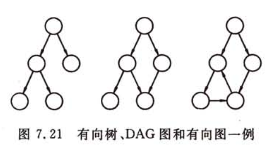
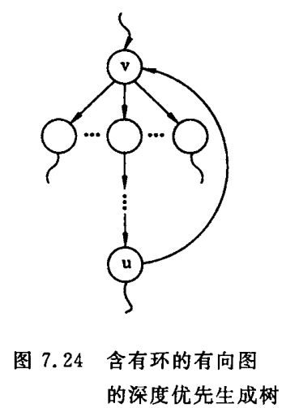
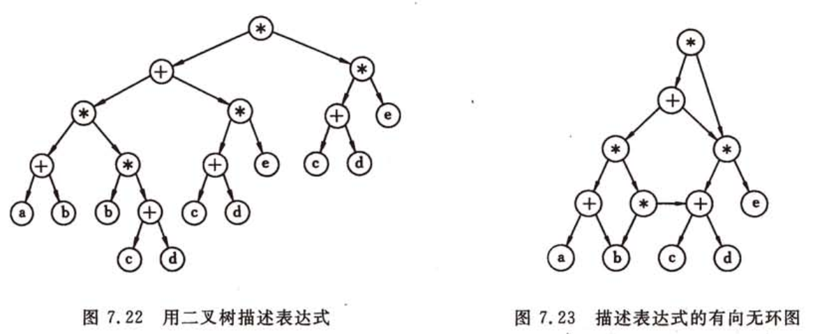
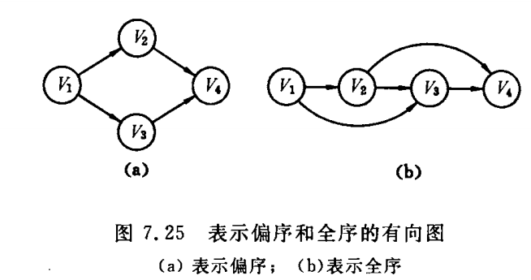
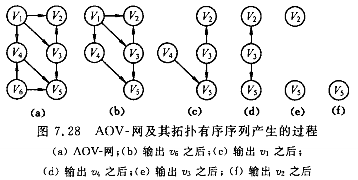
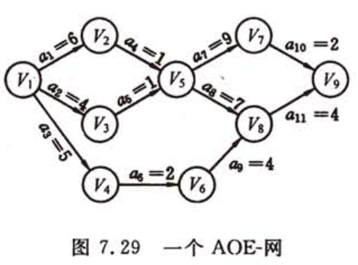

# 有向无环图及其应用

有向无环图（directed acycline graph）：简称DAG图，一个无环的有向图。

DAG图是一类较有向树更一般的特殊的有向图：



**检查一个有向图是否存在环要比无向图复杂**：

- **对于无向图来说**，若深度优先遍历过程中遇到回边（即指向已访问过的顶点的边），则必定存在环；
- **对于有向图来说**，若深度优先遍历过程中遇到回边（即指向已访问过的顶点的边），这条回边有可能是指向深度优先生成森林中另一颗生成树上的顶点的弧。
  - 但是，如果从有向图上某个顶点v出发的遍历，在$dfs(v)$结束之前出现一条从顶点u到顶点v的回边，由于u在生成树上是v的子孙，则有向图中必定存在包含顶点v和u的环。



**有向无环图是描述含有公共子式的表达式的有效工具**：例如下图，分别用二叉树和有向无环图分别描述表达式：
$$
(
	(a+b) * (b * (c+d))
	+ (c + d) * e
)
* 
(
	(c + d) * e
)
$$




从上图可知，若利用有向无环图可实现对相同子式的共享，从而节省存储空间。

**有向无环图也是描述一项工程或系统的进行过程的有效工具**：除了最简单的情况之外，几乎所有的**工程（project）**都可分为若干个称为**活动（activity）**的子工程，而这些子工程之间，通常受着一定条件的约束（如其中某些子工程的开始必须在另一些子工程完成之后）。对整个工程和系统，人们关心的是两个方面的问题：

- 工程能否顺利进行
  - 对应于有向图，为进行拓扑排序的操作。
- 估算整个工程完成所必须的最短时间。
  - 对应于有向图，即为进行求关键路径的操作。

# 1 拓扑排序

**拓扑排序（Topological Sort）**：由某个集合上的一个偏序得到该集合上的一个全序。

**偏序（Partial Order）**：

- 偏序集合（英语：Partiallyordered set，简写poset）是数学中，特别是序理论中，指配备了部分排序关系的集合。 这种排序不必然需要是全部的，就是说不必要保证此集合内的所有对象的相互可比较性。部分排序集合定义了部分排拓扑。
- 若集合X上的关系R是自反的、反对称的和传递的，则称R是集合X上的偏序关系。
  - 自反的：对任意x∈X，有xRx
  - 反对称的：对任意x,y∈X，若xRy，且yRx，则x=y
  - 传递的：对任意x, y,z∈X，若xRy，且yRz，则xRz
  - 称R为X上的偏序关系，通常记作≼。
    - 注意这里的≼不必是指一般意义上的“小于或等于”。
    - 若然有x≼y，我们也说x排在y前面（x precedes y）。

**全序**：设R是集合X上的偏序，如果对每个$x,y \in X$必有xRy或yRx，则称R是集合X上的全序关系。

**直观地看，偏序指集合中仅有部分成员之间可比较，而全序指集合中全体成员之间均可比较**。



若在上图(a)的有向图上认为地加上一个表示$v_2 \le v_3$的弧（符号$\le$表示$v_2$领先于$v_3$），则称(a)表示的亦为全序，且这个全序称为**拓扑有序（Topological Order）**，而由偏序定义得到拓扑有序的操作便是**拓扑排序**。

**AOV-网，顶点表示活动的网（Activity On Vertex Network）**：用顶点表示活动，用弧表示活动间的优先关系的有向图。

- 在网中，若从顶点i到顶点j有一条有向路径，则i是j的**前驱**；j是i的**后继**。若<i,j>是网中一条弧，则i是j的**直接前驱**；j是i的**直接后继**。
- 在AOV-网中，不应该出现有向环，因为存在环意味着某项活动应以自己为先决条件。显然，这是荒谬的。

**判断给定的AOV-网是否存在环**：检测方法是对有向图构造其顶点的拓扑有序序列，若网中所有顶点都在它的拓扑有序序列中，则该AOV-网中必定不存在环。

**进行拓扑排序的方法**：

1. 在有向图中选一个没有前驱的顶点且输出之；
2. 从图中删除该顶点和所有以它为尾的弧。
3. 重复上述两步，直至全部顶点均已输出，或者当前图中不存在无前驱的顶点为止。后一种情况则说明有向图中存在环。



针对上述两步操作，我们可采用邻接表作为有向图的存储结构，且在头结点中增加一个存放顶点入度的数组（indegree）。入度为零的顶点即为没有前驱的顶点，删除顶点及以它为尾 的弧的操作，则可换以弧头顶点的入度减1来实现。

求入度数组的算法：

```c
/*
    原理：对于有向图的邻接表，以来于每个顶点的弧为以此顶点为弧尾的弧，
        每个依赖于此顶点的弧存放了弧头顶点的位置，这个位置代表着以此位置顶点为弧头的一条弧，
        那么弧中这个位置出现的次数，就是以此顶点为弧头的弧的个数
*/
void FindInDegree(ALGraph G, int indegree[]){
    //对各顶点求入度indegree[0..vernum-1]
    int i;
    //初始化顶点的入度数组
    for(i=0; i<G.vexnum; i++){
        indegree[i] = 0;
    }
    ArcNode *p;
    for(i=0; i<G.vexnum; i++){
        p = G.vertices[i].firstarc;
        while (p) {
            indegree[(*p).adjvex]++;
            p = (*p).nextarc;
        }
    }
}
```

为了避免重复检测入度为零的顶点，可另设一栈暂存所有入度为零的顶点，由此可得拓扑排序的算法如下：

```c
Status TopologicalSort(ALGraph G){
    //有向图G采用邻接表存储结构
    //若G无回路，则输出G的顶点的一个拓扑序列并返回OK，否则ERROR
    FindInDegree(G, indegree);//对各顶点求入度indegree[0..vernum-1]
    InitStack(S);
    for(i=0; i<G.vexnum; ++i){//建零入度顶点栈S
        if(!indegree[i]) Push(S, i);
    }
    count = 0;//对输出顶点计数
    while(!StackEmpty(S)){
        Pop(S, &i); printf(i, G.vertices[i].data); ++count;//输出i号顶点并计数
        //对以入度为0的顶点为弧尾的弧的弧头顶点的入度减1
        for(p=G.vertices[i].firstarc; p; p = p->nextarc){
            k = p->adjvex;//对i号顶点的每个邻接点的入度减1
            if(!(--indegree[k])) Push(S, k);//若入度减为0，则入栈
        }//for
    }//while
    if(count < G.vexnum) return ERROR;//该有向图有贿赂回路
    else return OK;
}//TopologicalSort
```

分析上述算法，对有n个顶点和e条弧的有向图而言，其时间复杂度为O(n+e)：

- 建立求各顶点的入度的时间复杂度为O(e)；
- 建零入度顶点栈的时间复杂度为O(n)；
- 在拓扑排序过程中，若有向图无环，则每个顶点进一次栈，出一次栈，入度减1的操作在while语句中总共执行e次。

当有向图中无环时，也可利用深度优先遍历进行拓扑排序，因为图中无环，则由图中某点出发进行深度优先遍历时，最先退出DFS函数的顶点即出度为零的顶点，是拓扑有序序列中最后一个顶点。由此，按退出DFS函数的先后记录下来的顶点序列（如同求强连通分量时finished数组中的顶点序列）即为逆向的拓扑有序序列。

# 2 关键路径

与AOV-网相对应的是**AOE-网（Activity On Edge）**即边表示活动的网。AOE-网是一个带权的有向无环图，其中，顶点表示事件（Event），弧表示活动，权表示活动持续的时间。

通常，AOE-网可用来估算工程的完成时间。

例如，下图是一个假象的有11项活动的AOE-网。其中有9个事件$v_1$、$v_2$、$v_3$、...、$v_9$，每个事件表示在它之前的活动已经完成，在它之后的活动可以开始。如$v_1$表示整个工程开始，$v_9$表示整个工程结束，$v_5$表示$a_4$和$a_5$已经完成，$a_7$和$a_8$可以开始。与每个活动相联系的数是执行该活动所需的时间。比如，活动$a_1$需要6天，$a_2$需要4天等。



由于整个工程只有一个开始点和一个完成点，故在正常的情况（无环）下，网中只有一个入度为零的点（称作**源点**）和一个出度为零的点（叫做**汇点**）。

由于在AOE-网中有些活动可以并行地进行，所以完成工程的最短时间是从开始点到完成点的最长路径的长度（这里所说的路径长度是指路径上各活动持续时间之和，不是路径上弧的数目）。路径长度最长的路径叫做**关键路径（Critical Path）**。假设开始点是$v_1$，从$v_1$到$v_i$的最长路径长度叫做**事件$v_i$的最早发生时间**。这个时间决定了所有以$v_i$为尾的弧所表示的活动的最早开始时间。我们**用e(i)表示活动$a_i$的最早开始时间**。还可以定义一个**活动的最迟开始时间l(i)**，这是在不推迟整个工程完成的前提下，活动$a_i$最迟必须开始进行的时间。两者之差l(i)-e(i)意味着**完成活动$a_i$的时间余量**。我们把l(i)=e(i)的活动叫做**关键活动**。显然关键路径上的所有活动都是关键活动，因此提前完成非关键活动并不能加快工程的进度。

例如上图中的网，从$v_1$到$v_9$的最长路径是（$v_1$， $v_2$， $v_5$， $v_8$， $v_9$），路径长度是18，即$v_9$的最早发生时间是18。而活动$a_6$的最早开始时间是5，最迟开始时间是8，这意味着：如果$a_6$推迟3天开始或者延迟3天完成，都不会影响整个工程的完成。因此，分析关键路径的目的是辨别那些是关键活动，以便争取提高关键活动的功效，缩短整个工期。

由上分析可知，**辨别关键活动就是要找l(i)=e(i)的活动**。为了求得AOE-网中的活动的e(i)和l(i)，首先应求得事件的最早发生时间ve(j)和最迟发生时间vl(j)。如果活动$a_i$由弧<j,k>表示，其持续时间记为dut(<j,k>)，则有如下关系：
$$
e(i) = ve(j)
$$

$$
l(i) = vl(k) -dut(<j, k>)
$$

示例：


> 活动$a_3$由弧<1,4>表示，则
>
> e(3) = ve(1)
> l(3) = vl(4) - dut(<1,4>)=vl(4) -5

**求ve(j)和vl(j)需分两步进行**：

1. 从ve(0) = 0开始向前递推$ve(j) = Max\{ve(i) + dut(<i,j>)\} <i,j> \in T,j=1,2,...,n-1$，其中，T是所有以第j个顶点为头的弧的集合。
   
   > 以邻接表存储方式为例：
   >
   > ```c
   > //遍历零入度栈S
   > while(!StackEmpty(*S)){
   > Pop(S, &i); Push(T, i); ++count;//入栈i号顶点并计数
   > //遍历以当前零入度顶点为弧尾的弧，弧中保存的顶点尾弧头
   > for(p=G.vertices[i].firstarc; p; p = p->nextarc){
   >   k = p->adjvex;
   >   //对i号顶点的每个邻接点的入度减1
   >   if(!(--indegree[k])) 
   >       Push(S, k);//若入度减为0，则入栈
   >   //如果弧尾顶点的最早发生时间 + 当前弧的持续时间 > 当前弧的弧头顶点的最早放生时间
   >   if(ve[i] + *(p->info) > ve[k]) ve[k] = ve[i] + *(p->info);
   > }//for
   > }//while
   > ```
2. 从vl(n-1)=ve(n-1)起向后递推$vl(j) = Min\{vl(j) - dut(<i,j>)\} <i,j> \in S,i=n-2,...,0$，其中，S是所有以第i个顶点为尾的弧的集合。

   >以邻接表存储方式为例：
   >
   >```c
   >//按拓扑逆序求各顶点的vl值
   >while(!StackEmpty(*T)){
   >    //遍历当前顶点的弧
   >    for(Pop(T, &e), p=G.vertices[e].firstarc; p; p=p->nextarc){ 
   >        k = p->adjvex; //当前弧的弧头的位置
   >        int dut = *(p->info);//当前弧的信息，也就是活动持续的时间
   >        //如果 弧头的最晚发生时间 - 当前弧的持续时间 < 当前弧的弧尾顶点的最晚发生时间
   >        if(vl[k]-dut<vl[e]) vl[e] = vl[k] - dut;
   >    }//for
   >}//while
   >```

这两个递推公式的计算必须分别在拓扑有序和逆拓扑有序的前提下进行。也就是说，ve(j-1)必须在$v_j$的所有前驱的最早发生时间求得之后才能确定，而vl(j-1)则必须在$v_j$的所有后继的最迟发生时间求得之后才能确定。因此，可以在拓扑排序的基础上计算ve(j-1)和vl(j-1)。

求关键路径的算法：

1. 输入e条弧<j, k>，建立AOE-网的存储结构；

2. 从源$v_0$出发，令ve[0]=0，按拓扑有序求其余各顶点的最早发生时间$ve[i](1 \le i \le i \le n-1)$。如果得到的拓扑有序序列中顶点个数小于网中顶点数n，则说明网中存在环，不能求关键路径，算法终止；否则执行步骤3。

3. 从汇点$v_n$出发，令$vl[n-1] = ve[n-1]$，按逆拓扑有序求其余各顶点的最迟发生时间$vl[i](n-2 \ge i \ge 2)$；

4. 更具各顶点的ve和vl值，求每条弧s的最早开始时间e(s)和最迟开始时间l(s)。若某条弧满足条件$e(s) = l(s)$，则为关键活动。

   > 求关键活动：
   >
   > ```c
   > //求活动最早发生时间ee和活动最晚发生时间el，以及关键活动
   > for(j=0; j<G.vexnum; ++j){
   >     for(p=G.vertices[j].firstarc; p; p=p->nextarc){
   >         k = p->adjvex; dut = *(p->info);
   >         ee = ve[j]; el = vl[k] -dut;
   >         //如果最早发生时间和最晚发生时间相等，则为关键活动
   >         if(ee == el){
   >             printf("弧<%d, %d>为关键活动,持续时间%d", j, k, dut);
   >         }
   >     }
   > }
   > ```

如上所述，计算各顶点的ve值是在拓扑排序的过程中进行的，需对拓扑排序的算法作如下修改：

1. 在拓扑排序之前设初值，令$ve[i]=0(0 \le i \le n-1)$；
2. 在算法中增加一个计算$v_j$的直接后继$v_k$的最早发生时间的操作：若$ve(j) + dut(<j,k>) \gt ve[k]$，则$ve[k] = ve(j) + dut()$ ；
3. 为了能按拓扑有序序列的顺序计算各顶点的vl值，需记下在拓扑排序的过程中求得的拓扑有序序列，者需要在拓扑排序算法中，增设一个栈以记录拓扑有序序列，则在计算求得各顶点的ve值之后，从栈顶值栈底便为拓扑有序序列。

