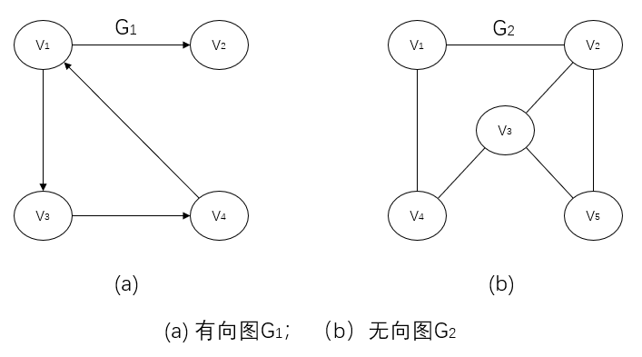
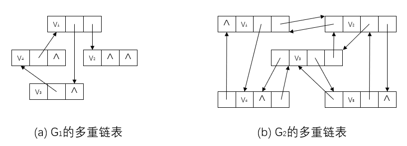
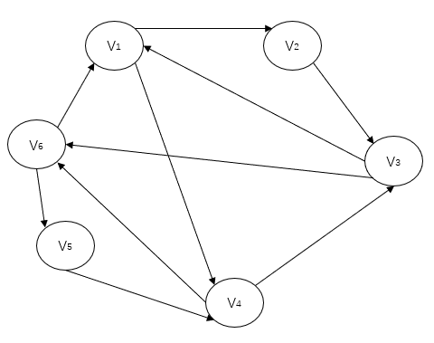
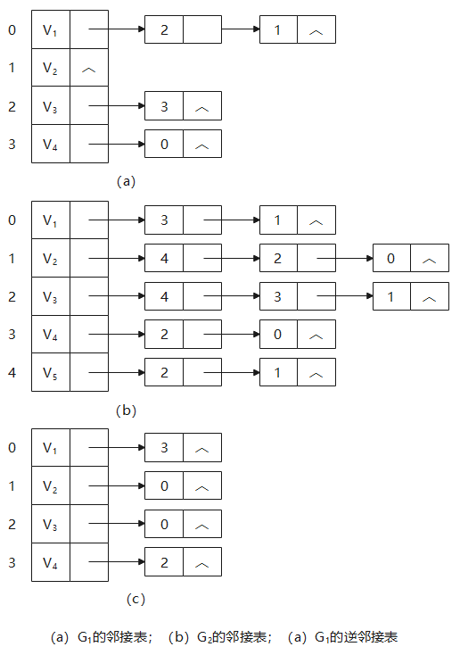
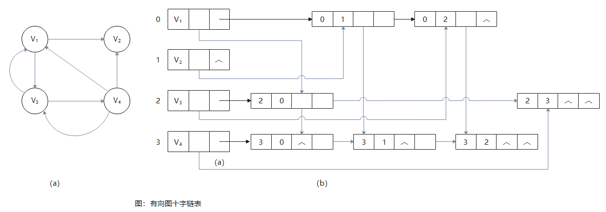
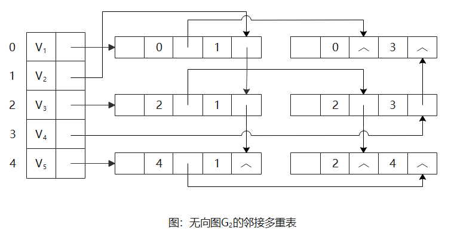

# 图的存储结构

由于图的结构比较复杂，任意两个顶点之间都可能存在联系，因此无法以数据元素在存储区中的物理位置来表示元素之间的关系，即图没有顺序映像的存储结构，但可以借助数组的数据类型表示元素之间的关系。另一方面，用多重链表表视图是自然的事，它是一种最简单的链式映像结构，即以一个由一个数据域和多个指针域组成的节点表示图中的一个顶点，其中数据域存储该顶点的信息，指针域存储指向其邻接点的指针。





# 1 数组表示法

用两个数组分别存储数据元素（顶点）的信息和数据元素之间的关系（边或弧）的信息。

```c
//----------图的数组（邻接矩阵）存储表示----------
#define INFINTY INT_MAX             //最大值
#define MAX_VERTEX_NUM 20           //最大顶点个数
typedef enum {DG, DN, UDG, UDN} GraphKind;    //{有向图，有向网， 无向图， 无向网}
typedef struct ArcCell{
    VRType      adj;        //VRType是顶点关系类型，对无权图，用1或0表示相邻否；对带权图，则为权值类型
    InfoType    *info;      //该弧相关信息的指针
} ArcCell, AdjMatrix[MAX_VERTEX_NUM][MAX_VERTEX_NUM];
typedef struct{
    VertexType      vexs[MAX_VERTEX_NUM];       //顶点向量
    AdjMatrix       arcs;                       //邻接矩阵
    int             vexnum,arcnum;              //图的当前顶点数和弧数
    GraphKind       kind;                       //图的种类标志
}MGraph;
```

以二维数组表示有n个顶点的图时，需存放n个顶点信息和$n^2$个弧信息的存储量。若考虑无向图的邻接矩阵的对称性，则可采用压缩存储的方式只存储入矩阵的下三角（或上三角）元素。
$$
G_1.arcs=\left[
	\begin{array}{cccc} 
		0 & 1 & 1 & 0 \\ 
		0 & 0 & 0 & 0 \\ 
		0 & 0 & 0 & 1 \\ 
		1 & 0 & 0 & 0 
	\end{array} 
\right], 
G_2.arcs=\left[
    \begin{array}{cccc} 
    	0 & 1 & 0 & 1 & 0 \\ 
    	1 & 0 & 1 & 0 & 1 \\ 
    	0 & 1 & 0 & 1 & 1 \\ 
    	1 & 0 & 1 & 0 & 1 \\ 
    	0 & 1 & 1 & 0 & 0 
    \end{array} 
\right]
$$
借助于**邻接矩阵**容易判断任意两个顶点之间是否有边（或弧）相连，并容易求得各个顶点的度。对于无向图，顶点$v_i$得度时邻接矩阵中第i行（或第i列）得元素之和，即
$$
TD(v_i) = \sum_{j=0}^{n-1}A[i][j](n=MAX_VERTEX_NUM)
$$
对于有向图，第i行得元素之和为顶点$v_i$的出度$OD(v_i)$，第j列的元素之和为顶点$v_i$的入度$ID(v_j)$。（对于有向图，邻接矩阵**行为出度，列为入度**）

网的邻接矩阵可以定义为：
$$
A[i][j] = \left\{
	\begin{array}{cc}
		w_{i,j} & 若<v_i,v_j>或(v_i,v_j)\in{VR} \\
		∞ & 反之
	\end{array}
\right.
$$

$$
\left[
    \begin{array}{cccc} 
    	∞ & 5 & ∞ & 7 & ∞ & ∞ \\ 
    	∞ & ∞ & 4 & ∞ & ∞ & ∞ \\
        8 & ∞ & ∞ & ∞ & ∞ & 9 \\
        ∞ & ∞ & 5 & ∞ & ∞ & 6 \\
        ∞ & ∞ & ∞ & 5 & ∞ & ∞ \\
        3 & ∞ & ∞ & ∞ & 1 & ∞ \\
    \end{array}
\right]
$$
构造一个具有n个点和e条边的无向网G的时间复杂度是$O(n^2 + e*n)$，其中对邻接矩阵G.arcs的初始化耗费了$O(n^2)$的时间。

# 2 邻接表

**邻接表**（Adjacency List）是图的一种链式存储结构。在邻接表中，对图中每个顶点建立一个单链表，第i个单链表中的结点表示依附于顶点$v_i$的边（对有向图是以顶点$v_i$为尾得弧）。

**表结点**：每个结点由3个域组成

- adjvex：邻接点域，指示与顶点$v_i$邻接的点在图中的位置
- nextarc：链域，指示下一条边或弧的结点
- info：数据域， 存储和边或弧相关的信息，如权值等

**头结点**：每个链表上附设一个表头结点，表头结点（可以链相接）通常以顺序结构的形式存储，以便随机访问任一顶点的链表。

- data：数据域，存储顶点$v_i$的名或其他有关信息
- firstarc：链域，指向链表中第一个结点

```c
//----------图的邻接表存储表示----------
#define MAX_VERTEX_NUM 20
typedef struct ArcNode{
    int             adjvex;//该弧所指向的顶点的位置
    struct ArcNode  *nextarc;//指向下一条弧的指针
    InfoType        *info;//该弧相关信息的指针
} ArcNode;
typedef struct VNode{
    VertexType      data;//顶点信息
    ArcNode         *firstarc;//指向第一条依附该顶点的弧的指针
}VNode, AdjList[MAX_VERTEX_NUM];
typedef struct {
    AdjList     vertices;
    int         vexnum, arcnum;//图的当前顶点数和弧数
    int         kind;//图的种类标志
} ALGraph;
```

若无向图中有n个顶点、e条边，则它的邻接表需n个头结点和2e个表结点。显然，在边稀疏（$e<<\frac{n(n-1)}{2}$）情况下，用邻接表表示图比邻接矩阵节省存储空间，当和边相关的信息较多时更是如此。

**度的计算方法**：

- **无向图**：在无向图的邻接表中，顶点$v_i$的度恰为第i个链表中的结点数；
- **有向图**：在有向图中，第i个链表中的结点个数只是顶点$v_i$的出度，为求入度，必须遍历整个邻接表。
  - 在所有链表中其邻接点域的值为i的结点的个数是顶点$v_i$的入度。
  - 有时，为了便于确定顶点的入度或以顶点$v_i$为头的弧，可以建立一个有向图的**逆邻接表**，即对每个顶点$v_i$建立一个链接以$v_i$为头的弧的表。



**建立邻接表或逆邻接表的时间复杂度**：

- **输入的顶点信息为顶点的编号**：在建立邻接表或逆邻接表时，若输入的顶点信息即为顶点的编号，则建立邻接表的时间复杂度为$O(n+e)$；
- 输入的顶点信息**不是**顶点的编号：在建立邻接表或逆邻接表时，若输入的顶点信息不是顶点的编号，则需要通过查找才能得到顶点在图中位置，则时间复杂度为$O(n*e)$。

在邻接表上容易找到任一顶点的第一个邻接点和下一个邻接点，但要判定任意两个顶点（$v_i$和$v_j$）之间是否有边或弧相连，则需搜索第i个或第j个链表，因此，不及邻接矩阵方便。

# 3 十字链表

**十字链表**（Orthogonal List）是**有向图**的另一种链式存储结构。可以看成是将有向图的邻接表和逆邻接表结合起来得到的一种链表。在十字链表中，对应于有向图中每一条弧有一个结点，对应于每个顶点也有一个结点。

**弧结点**：

- tailvex：尾域，指示弧尾顶点在图中的位置；
- headvex：头域，指示弧头顶点在图中的位置；
- hlink：链域，指向弧头相同的下一条弧，弧头相同的弧在同一链表上；
- tlink：链域，指向弧尾相同的下一条弧，弧尾相同的弧在同一链表上；
- info：指示该弧相关信息。

**头节点**：顶点结点

- data：存储和顶点相关的信息，如顶点的名称等；
- firstin：指向以该顶点为弧头的第一个弧结点；
- firstout：指向以该节点为弧尾的第一个弧结点。

若将有向图的邻接矩阵看成是稀疏矩阵的话，则十字链表也可以看成是邻接矩阵的链表存储结构，在图的十字链表中，弧结点所在的链表非循环链表，结点之间相对位置自然形成，不一定按顶点需要有序，表头结点即顶点结点，它们之间不是链接，而是顺序存储。



```c
//----------有向图的十字链表存储表示----------
#define MAX_VERTEX_NUM 20
typedef struct ArcBox{
    int             tailvex, headvex;//该弧的尾和头顶点的位置
    struct ArcBox   *hlink, *tlink;//分别尾弧头相同和弧尾相同的弧的链表
    InfoType        *info;//该弧相关信息的指针
} ArcBox;
typedef struct VexNode{
    VertexType      data;
    ArcBox          *firstin, *firstout;//分别指向该顶点第一条入弧和出弧
} vexNode;
typedef struct {
    vexNode     xlist[MAX_VERTEX_NUM];//表头向量
    int         vexnum, arcnum;//有向图的当前顶点数和弧数
} OLGraph;
```

只要输入n个顶点的信息和e条弧的信息，便可建立该有向图的十字链表，其算法如下：

```c
Status CreateDG(OLGraph &G){
    //采用十字链表存储表示，构造有向图G（G.kind = DG）
    scanf(&G.vexnum, &G.arcnum, &G.IncInfo);//IncInfo为0则各弧不含其他信息
    for(i=0; i<G.vexnum; ++i){//构建表头向量
        scanf(&G.xlist[i],data);//输入顶点值
        G.xlist[i].firstin = NULL;G.xlist[i].firsout = NULL;//初始化指针
    }
    for(k=0; k<G.arcnum; ++k){//输入各弧并构造十字链表
        scanf(&v1, &v2);//输入一条弧的始点和终点
        i = LocateVex(G, v1); j = LocateVex(G, v2);//确定v1和v2在G中的位置
        *p = {i, j, G.xlist[j].firstin, G.xlist[i].firstout, NULL};//对弧结点赋值{tailvex, headvex, hlink, tlink, info}
        G.xlist[j].firstin = G.xlist[i].firstout = p;//完成在入弧和出弧链头的插入
        if(IncInfo) Input(*p->info);//若弧含有相关信息，则输入
    }
}//CreateDG
```

在十字链表中既容易找到以$v_i$为尾的弧，也容易找到以$v_i$为头的弧，因而容易求得顶点的出度和入度（或需要，可在建立十字链表的同时求出）。

上边代码显示出，建立十字链表的时间复杂度和建立邻接表是相同的。在某些有向图的应用中，十字链表是很有用的工具。

# 4 邻接多重表

**邻接多重表**（Adjacency Multilist）是**无向图**的另一个链式存储结构。虽然邻接表是无向图的一种很有效的存储结构，在邻接表中容易求得顶点和边的各种信息。但是，在邻接表中每一条边$(v_i, v_j)$有两个结点，分别在第i个和第j个链表中，这给某些图的操作带来了不便。例如在某些图的应用问题中需要对边进行某种操作，如对已被搜索过的边作记号或删除一条边等，此时需要找到表示同一条边的两个结点。因此，在进行这一类操作的无向图的问题中采用邻接多重表作存储结构更为适宜。

**邻接多重表**：每一条边用一个结点表示，每个顶点也用一个结点表示。

**边**：

- mark：标志域，可用以标记该条边是否被搜索过；
- ivex和jvex：为该边依附的两个顶点在图中的位置；
- ilink：指向下一条依附于顶点ivex的边；
- jlink：指向下一条依附于顶点jvex的边；
- info：为指向和边相关的各种信息的指针域。

**顶点**：

- data：存储和该顶点相关的信息；
- firstedge：指示第一条依附于该顶点的边。



在邻接多重表中，所有依附于同一顶点的边串联在同一链表中，由于每条边依附于两个顶点，则每个边结点同时链接在两个链表中。可见，对无向图而言，其邻接多重表和邻接表的差别，仅仅在于同一条边在邻接表中用两个结点表示，而在邻接多重表中只有一个结点。因此，除了在边结点中增加一个标志域外，邻接多重表所需的存储量和邻接表相同。在邻接多重表上，各种基本操作的实现亦和邻接表相似。

邻接多重表的类型说明如下：

```c
//----------无向图的邻接多重表存储表示----------
#define MAX_VERTEX_NUM 20
typedef enum {unvisited, visited} VisitIf;
typedef struct EBox{
    VisitIf         mark;//访问标记
    int             ivex, jvex;//该边依附的两个顶点的位置
    struct EBox     *ilink, *jlink;//分别指向依附这两个顶点的下一条边
    InfoType        *info;
} EBox;
typedef struct VexBox{
    VertexType      data;
    EBox            *firstedge;//指向第一条依附该顶点的边
} VexBox;
typedef struct {
    VexBox      adjmulist[MAX_VERTEX_NUM];
    int         vexnum, edgenum;//无向图的当前顶点数和边数
} AMLGraph;
```

