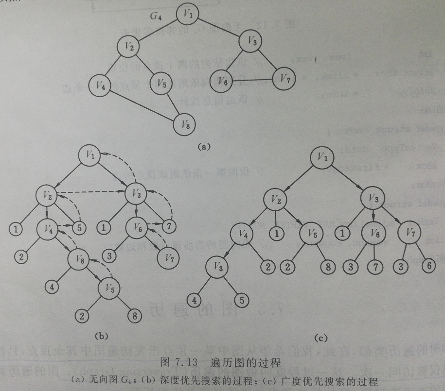

# 图的遍历

**图的遍历**（Traversing Graph）：从图中某一顶点出发访遍图中其余顶点，且使每一个顶点仅被访问一次，这一过程称为图的遍历。

图的遍历算法是求解图的连通性问题、拓扑排序和求关键路径等算法的基础。

图的遍历要比树的遍历复杂得多。因为图得任一顶点都可能和其余得顶点相邻接。所以在访问了某个顶点之后，可能沿着某条路路径搜索之后，又回到该顶点上。为了避免同一顶点被访问多次，在遍历图得过程中，必须记下每个已访问过的顶点。为此，我们可以设一个辅助数组visitid[0..n-1]，它的初始值置为“假”或者零，一旦访问了顶点$v_i$，便置visited[i]为“真”或者被访问时的次序号。

通常有两种遍历图的路径：深度优先搜索和广度优先搜索。它们对于无向图和有向图都适用。

# 1 深度优先搜索

**深度优先搜索**（Depth_First Search）遍历类似于树的先根遍历，是树的先根遍历的推广。

**深度优先遍历的过程**：

1. 假设初始状态是图中所有顶点未曾被访问，则深度优先搜索可从图中某个顶点v出发，访问此顶点；
2. 然后依次从v的未被访问的邻接点出发深度优先遍历图，直至图中所有和v有路径相通的顶点都被访问到；
3. 若此时图中尚有顶点未被访问，则另选图中一个未曾被访问的顶点作起始点，重复上述过程，直至图中所有顶点都被访问到为止。



说明：图中以带箭头的粗实线表示遍历时的访问路径，以带箭头的虚线表示回溯的路径。图中的小圆圈表示已被访问过的邻接点，大圆圈表示访问的邻接点。

**深度优先遍历的过程示例**：

> 上图中无向图$G_4$为例，深度优先搜索遍历图的过程如图7.13(b)所示。
>
> 1. 假设从顶点$v_1$出发进行搜索；
> 2. 在访问了顶点$v_1$之后，选择邻接点$v_2$。因为$v_2$未曾访问，则从$v_2$出发进行搜索。以此类推，接着从$v_4$、$v_8$、$v_5$出发进行搜索。
> 3. 在访问了$v_5$之后，由于$v_5$的邻接点都已被访问，则搜索回到$v_8$。由于同样的理由，搜索继续回到$v_4$、$v_2$直至$v_1$；
> 4. 此时由于$v_1$的另一个邻接点未被访问，则搜索又从$v_1$到$v_3$，再继续进行下去。
>
> 由此，得到的顶点访问序列为：$v_1 \rightarrow v_2 \rightarrow v_4 \rightarrow v_8 \rightarrow v_5 \rightarrow v_3 \rightarrow v_6 \rightarrow v_7$

显然，这是一个递归的过程。为了在遍历过程中便于区分顶点是否已被访问，需附设访问标志数组visited[0..n-1]，其初始值为“false”，一旦某个顶点被访问，则其相应的分量置为“true”。

```c
//----------图的深度优先遍历----------
Boolean visited[MAX];//访问标志数组
Status (*VisitFunc)(int v);//函数变量

void DFSTraverse(Graph G, Status (*Visit)(int v)) {
    VisitFunc = Visit;//对图G作深度优先遍历
    for(v=0; v<G.vexnum; ++v) visited[v] = FALSE;//访问标志数组初始化
    for(v=0; v<G.vexnum; ++v)
        if(!visited[v]) DFS(G, v);//对尚未访问的顶点调用DFS
}

void DFS(Graph G, int v){
   //从第v个顶点出发递归深度优先遍历图G
    visited[v] = TRUE;  VisitFunc(v);//访问第v个顶点
    for(w=FirstAdjVex(G, v); w>=0; w=NextAdjVex(G, v, w))
        if(!visited[w]) DFS(G, w);//对v的尚未访问的邻接顶点w递归调用DFS
}
```

分析上述算法，在遍历图时，对图中每个顶点至多调用一次DFS函数，因为一旦某个顶点被标志成已被访问，就不再从它出发进行搜索。因此，**遍历图的过程实质上是对每个顶点查找其邻接点的过程**。其耗费的时间则取决于所采用的存储结构。

- **二维数组表示邻接矩阵**：
  - 当用二维数组表示邻接矩阵作图的存储结构时，查找每个顶点的邻接点所需时间为$O(n^2)$，其中n为图中顶点数。
- **邻接表**：深度优先遍历图的时间复杂度为$O(n + e)$。
  - 当以邻接表作图的存储结构时，找邻接点所需时间为$O(e)$，其中e为无向图中边的数或有向图中弧的数。

# 2 广度优先搜索

**广度优先搜索**（Breadth_First Search）遍历类似于树的按层次遍历的过程。

**广度优先遍历图的过程**：

1. 假设从图中某个顶点v出发，在访问了v之后依次访问v的各个未曾访问过的邻接点；
2. 然后分别从这些邻接点出发依次访问它们的邻接点，并使“先被访问的顶点的邻接点”先于“后被访问的顶点的邻接点”被访问，直至图中所有已被访问的顶点的邻接点都被访问到。
3. 若此时图中尚有顶点未被访问，则另选图中一个未被访问的顶点作起始点，重复上述过程，直至图中所有顶点都被访问到为止。
4. 换句话说，广度优先遍历图的过程是以v为起始点，由近至远，依次访问和v有路径相通且路径长度为1、2、...的顶点。

**广度优先遍历图的过程示例**：

> 对上图$G_4$进行广度优先搜索遍历的过程如图7.13(c)所示。
>
> 1. 首先访问$v_1$和$v_1$的邻接点$v_2$和$v_3$；
> 2. 然后依次访问$v_2$的邻接点$v_4$和$v_5$及$v_3$的邻接点$v_6$和$v_7$，
> 3. 最后访问$v_4$的邻接点$v_8$。
> 4. 由于这些顶点的邻接点均已被访问，并且图中所有顶点都被访问，由此完成了图的遍历。
>
> 得到的顶点访问序列为：$v_1 \rightarrow v_2 \rightarrow v_3 \rightarrow v_4 \rightarrow v_5 \rightarrow v_6 \rightarrow v_7 \rightarrow v_8$

和深度优先搜索类似，在遍历的过程中也需要一个访问标志数组。并且，为了顺次访问路径长度为2、3、...的顶点，需附设队列以存储已被访问的路径长度为1、2、...的顶点。

```c
//----------图的广度优先遍历----------
void BFSTraverse(Graph G, Status (*Visit)(int v)){
    //按广度优先非递归遍历图G。使用辅助队列Q和访问标志数组visited。
    for(v=0; v<G.vexnum; ++v) visited[v] = FALSE;//访问标志数组初始化
    InitQueue(Q);//置空的辅助队列Q
    for(v=0; v<G.vexnum; ++v){
        if(!visited[v]){
            visited[v] = TRUE;  Visit(v);
            EnQueue(Q, v);//v入队列
            while(!QueueEmpty(Q)){
                DeQueue(Q, u);
                for(w=FirstAdjVex(G, v); w>=0; w=NextAdjVex(G, v, w))
                    if(!visited[w]){//w为u的尚未访问的邻接顶点
                        visited[v] = TRUE;  Visit(v);
                        EnQueue(Q, w);
                    }//if
            }//while
        }//if
    }//for
}//BFSTraverse
```

遍历图的过程实质上是通过边或弧找邻接点的过程，因此广度优先搜索遍历图的时间复杂度和深度优先遍历相同，两者不同之处仅仅在于对顶点访问的顺序不同。

