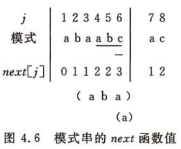

# 串的模式匹配算法

# 1 一般方法

# 2 KMP算法

假设主串为'$s_1s_2...s_3$'，模式串为'$p_1p_2...p_3$'，为了实现算法的改进，需要解决下述问题：当匹配过程中产生“失配“（即$s_i \neq p_i$）时，模式串”向右滑动“可行的距离多远，换句话说，当主串中第i个字符与模式中第j个字符”失配“（即比较不等）时，主串中第i个字符（i指针不回溯）应与模式中哪个字符再比较？

假设此时对应与模式中第k（k < j）个字符继续比较，则模式中前k-1个字符的子串必须满足下列关系式，且不可能存在$k` \lt k$满足下列关系式：（式-1）'$p_1p_2...p_{k-1}$' = '$s_{i-k+1}s_{i-k+2}...s_{i-1}$'

而已经得到的”部分匹配“的结果是：（式-2）'$p_{j-k+1}p_{j-k+2}...p_{j-1}$' = '$s_{i-k+1}s_{i-k+2}...s_{i-1}$'

由（式-1）和（式-2）推出下列等式：（式-3）'$p_1p_2...p_{k-1}$' ='$p_{j-k+1}p_{j-k+2}...p_{j-1}$'



```c
void get_next(SString T, int next[]){
    //求模式串T的next函数值并存入数组next。
    int i = 1, j = 0; next[1] = 0;
    while (i<T[0]) {
        if(j == 0 || T[i] == T[j]) {
            ++i; ++j;
            next[i] = j;
        }else{
            j = next[j];
        }
    }
}
```

