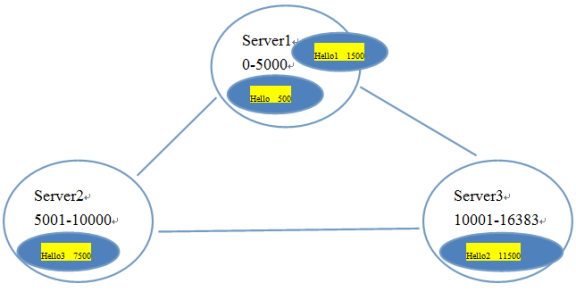

# Redis入门

# 1 Redis 简介

Redis（Remote Dictionary Server ，即远程字典服务）是一个由Salvatore Sanfilippo写的key-value存储系统。
Redis是一个开源的使用ANSI C语言编写、遵守BSD协议、支持网络、可基于内存亦可持久化的日志型、Key-Value数据库，并提供多种语言的API。
它通常被称为数据结构服务器，因为值（value）可以是 字符串(String), 哈希(Hash), 列表(list), 集合(sets) 和 有序集合(sorted sets)等类型。

Redis是一个开源的内存中的数据结构存储系统，它可以用作：**数据库、缓存和消息中间件**。

Redis 内置了复制（Replication），LUA脚本（Lua scripting）， LRU驱动事件（LRU eviction），事务（Transactions） 和不同级别的磁盘持久化（Persistence），并通过 Redis哨兵（Sentinel）和自动分区（Cluster）提供高可用性（High Availability）。

数据库的工作模式按存储方式可分为：硬盘数据库和内存数据库。Redis 将数据储存在内存里面，读写数据的时候都不会受到硬盘 I/O 速度的限制，所以速度极快。

Redis采用的是基于内存的采用的是**单进程单线程**模型的 **KV 数据库**，**由C语言编写**，官方提供的数据是可以达到100000+的QPS（每秒内查询次数）。这个数据不比采用单进程多线程的同样基于内存的 KV 数据库 Memcached 差！


# 2 Redis 安装和运行
## 2.1 Redis安装
Redis是c语言开发的。
安装redis需要c语言的编译环境。如果没有gcc需要在线安装。yum install gcc-c++

- 第一步：redis的源码包上传到linux系统。
- 第二步：解压缩redis。
- 第三步：编译。进入redis源码目录。make
- 第四步：安装。`make install PREFIX=/usr/local/redis`
  - PREFIX参数指定redis的安装目录。一般软件安装到/usr目录下


## 2.2 Redis服务端启动

- **前端启动**：
  - 在redis的安装目录下直接启动redis-server
    - `./redis-server`
- **后台启动**：
  - 把/root/redis-3.0.0/redis.conf复制到/usr/local/redis/bin目录下
    - `cp redis.conf /usr/local/redis/bin/`
  - 修改配置文件：redis.conf
    - `vim redis.conf`
  - 修改：`daemonize yes`
  - 用配置文件启动：`./redis-server redis.conf`
  - 查看redis进程：`ps aux|grep redis`
    - 使用`ps aux|grep redis`查找进程，无论如何都有结果，因为有一个时grep自己这个进程。
## 2.3 Redis-cli客户端启动

- **本地连接**：
  - `./redis-cli`
  - 默认连接端口号为6379的本地redis服务。
- **远程连接**：
  -  `./redis-cli -h 192.168.25.153 -p 6379`
    - `-h`：连接的服务器的地址
    - `-p`：服务的端口号


**关闭redis客户端**：` ./redis-cli shutdown`
# 3 Redis的5种数据类型及操作

- 这里说的数据类型是value的数据类型
- Redis中所有的数据都是字符串。
  - 在redis中所有的key和value都是字符串
- 命令不区分大小写，key是区分大小写的。
- Redis是单线程的。
- Redis中不适合保存内容大的数据。


## 3.1 共用命令

- **设置**：`set hello world`
- **获取所有key**：`keys *`
- **获取所有h开头的key**：`keys  h*`
- **删除**：`del hello`


## 3.2 string

- key-value（做缓存）


**get、set**

- `set test 123`
- incr：加一（生成id）
  - `incr test`
  - 此时：value必须是一个可以转换成数值类型的字符串
- decr：减一


## 3.3 hash

- key-fields-values（做缓存）
- 相当于一个key对应一个map，map中还有key-value
- 使用hash对key进行归类。

> hset：向hash中添加内容
> `hset hash1 field1 1`
> `hset hash1 field2 2`
> `hset hash1 field3 3`
> hget：从hash中取内容
> `hget hash1 field1`
> 查看hash里面所有的key：`hkeys hash1`
> 查看hash里面所有的value：`hvals hash1`
> 查看hash里面所有的key和value：`hgetall hash1`


## 3.4 list

- 有顺序可重复
- 可以模拟队列和栈
  - 队列：先进先出
  - 栈：先进后出

```shell
192.168.25.153:6379> lpush list1 a b c d
(integer) 4
192.168.25.153:6379> lrange list1 0 -1
1) "d"
2) "c"
3) "b"
4) "a"
192.168.25.153:6379> rpush list1 1 2 3 4
(integer) 8
192.168.25.153:6379> lrange list1 0 -1
1) "d"
2) "c"
3) "b"
4) "a"
5) "1"
6) "2"
7) "3"
8) "4"
192.168.25.153:6379> 
192.168.25.153:6379> lpop list1 
"d"
192.168.25.153:6379> lrange list1 0 -1
1) "c"
2) "b"
3) "a"
4) "1"
5) "2"
6) "3"
7) "4"
192.168.25.153:6379> rpop list1
"4"
192.168.25.153:6379> lrange list1 0 -1
1) "c"
2) "b"
3) "a"
4) "1"
5) "2"
6) "3"
```


## 3.5 set

- 元素无顺序，不能重复

```shell
192.168.25.153:6379> sadd set1 a b c c c d
(integer) 4
192.168.25.153:6379> smembers set1
1) "b"
2) "c"
3) "d"
4) "a"
192.168.25.153:6379> srem set1 a
(integer) 1
192.168.25.153:6379> smembers set1
1) "b"
2) "c"
3) "d"
```


## 3.6 SortedSet（zset）

- 有顺序，不能重复
- 在这几个数据类型中最复杂最耗性能，能不用就不用。

```shell
192.168.25.153:6379> zadd zset1 2 a 5 b 1 c 6 d
(integer) 4
192.168.25.153:6379> zrange zset1 0 -1
1) "c"
2) "a"
3) "b"
4) "d"
192.168.25.153:6379> zrem zset1 a
(integer) 1
192.168.25.153:6379> zrange zset1 0 -1
1) "c"
2) "b"
3) "d"
192.168.25.153:6379> zrevrange zset1 0 -1
1) "d"
2) "b"
3) "c"
192.168.25.153:6379> zrange zset1 0 -1 withscores
1) "c"
2) "1"
3) "b"
4) "5"
5) "d"
6) "6"
192.168.25.153:6379> zrevrange zset1 0 -1 withscores
1) "d"
2) "6"
3) "b"
4) "5"
5) "c"
6) "1"
```


# 4 Key命令
**设置key的过期时间：**

- `expire key second`：设置key的过期时间
- `ttl key`：查看key的有效期
  - `-1`是永久保存
  - `-2`是这个key不存在的
- `persist key`：清除key的过期时间。Key持久化。

```shell
192.168.25.153:6379> expire Hello 100
(integer) 1
192.168.25.153:6379> ttl Hello
(integer) 77
```


## 5 Redis的持久化方案
**指出**：

- redis的所有数据都是保存到内存中的。
- redis操作磁盘的频率越高，性能越低。

**持久化方案：**

- **Rd**b：
  - 快照形式，定期把内存中当前时刻的数据保存到磁盘。
  - Redis默认支持的持久化方案。
  - 一般只用Rdb方式。
- **aof**：
  - append only file。
  - 默认不开启
    - 可以在`redis.conf`中配置开启。
  - 把所有对redis数据库操作的命令，增删改操作的命令保存到文件中。
  - 数据库恢复时把所有的命令执行一遍即可。
- **指出**：两套方案同时开启的，redis会用aof来恢复数据。


**`redis.conf`中的配置之Rdb的配置：**

```
#

# Save the DB on disk:

#

#   save <seconds> <changes>

#

#   Will save the DB if both the given number of seconds and the given

#   number of write operations against the DB occurred.

#

#   In the example below the behaviour will be to save:

#   after 900 sec (15 min) if at least 1 key changed

#   after 300 sec (5 min) if at least 10 keys changed

#   after 60 sec if at least 10000 keys changed

#

#   Note: you can disable saving completely by commenting out all "save" lines.

#

#   It is also possible to remove all the previously configured save

#   points by adding a save directive with a single empty string argument

#   like in the following example:

#

#   save ""

save 900 1
save 300 10
save 60 10000

# The filename where to dump the DB

dbfilename dump.rdb

# The working directory.

#

# The DB will be written inside this directory, with the filename specified

# above using the 'dbfilename' configuration directive.

#

# The Append Only File will also be created inside this directory.

#

# Note that you must specify a directory here, not a file name.

dir ./
```


**redis.conf中的配置之aof的配置：（关闭状态）**

```
# By default Redis asynchronously dumps the dataset on disk. This mode is

# good enough in many applications, but an issue with the Redis process or

# a power outage may result into a few minutes of writes lost (depending on

# the configured save points).

#

# The Append Only File is an alternative persistence mode that provides

# much better durability. For instance using the default data fsync policy

# (see later in the config file) Redis can lose just one second of writes in a

# dramatic event like a server power outage, or a single write if something

# wrong with the Redis process itself happens, but the operating system is

# still running correctly.

#

# AOF and RDB persistence can be enabled at the same time without problems.

# If the AOF is enabled on startup Redis will load the AOF, that is the file

# with the better durability guarantees.

#

# Please check http://redis.io/topics/persistence for more information.

appendonly no

# The name of the append only file (default: "appendonly.aof")

appendfilename "appendonly.aof"
```


# 5 Redis分布式集群的搭建
## 5.1 redis-cluster架构图

**redis-cluster投票:容错**


**架构细节:**

- 所有的redis节点彼此互联(PING-PONG机制)，内部使用二进制协议优化传输速度和带宽。
- 节点的fail是通过集群中超过半数的节点检测失效时才生效。
- 客户端与redis节点直连，不需要中间proxy层。客户端不需要连接集群所有节点，连接集群中任何一个可用节点即可
- redis-cluster把所有的物理节点映射到[0-16383]slot上，cluster 负责维护node<->slot<->value

**哈希槽**：固定数值[0-16383]，不是用槽来保存数据，而是根据槽来决定数据保存到哪个节点上，以及在查找时用于定位数据。

**指出**：

- redis集群中最多有16384个节点
- 节点之间并不传递数据，所以节点个数的增长对集群的增长阻力影响不大。
- 每个节点保存的数据是不同的，集群中一个节点挂了，这个集群就挂了。
- 要实现集群的高可用，可以为节点设置备份机。

## 5.2 Redis集群保存数据和定位数据的原理

Redis 集群中内置了 16384 个哈希槽，当需要在 Redis 集群中放置一个 key-value 时，redis 先对 key 使用 CRC16 算法算出一个结果，然后把结果对 16384 求余数，这样每个 key 都会对应一个编号在 0-16383 之间的哈希槽，redis 会根据节点数量大致均等的将哈希槽映射到不同的节点


## 5.3 Redis集群的搭建
**指出**：

- Redis集群中至少应该有三个节点。要保证集群的高可用，需要每个节点有一个备份机。
  - Redis集群至少需要6台服务器。
  - 2个节点，如果一个节点挂了，剩下1个节点投票很难超过半数，所以说集群最少的3个节点。如果考虑到高可用的话，需要6台服务器。
  - 只有主节点分配槽。从节点也就是备份节点是不分配哈希槽的。
-  搭建节点之前需要保证每个redis里边没有数据。
- **分布式搭建**：可以使用一台虚拟机运行6个redis实例，需要修改redis的端口号7001-7006。

### 5.3.1 分布式集群环境的搭建

1. **使用ruby脚本搭建分布式。**
  1. 需要ruby的运行环境。
        1. 安装ruby：
      1. `yum install ruby`
      1. `yum install rubygems`
2. 安装ruby脚本运行使用的包。


```shell
[root@localhost ~]# gem install redis-3.0.0.gem 
Successfully installed redis-3.0.0
1 gem installed
Installing ri documentation for redis-3.0.0...
Installing RDoc documentation for redis-3.0.0...

[root@localhost ~]# cd redis-3.0.0/src
[root@localhost src]# ll *.rb
-rwxrwxr-x. 1 root root 48141 Apr  1  2015 redis-trib.rb
```


### 5.3.2 搭建步骤
**需要**：

- 需要6台redis服务器，搭建分布式集群。
- 需要6个redis实例。
- 需要运行在不同的端口7001-7006。


**第一步**：创建6个redis实例，每个实例运行在不同的端口。需要修改`redis.conf`配置文件。配置文件中还需要把cluster-enabled yes前的注释去掉。

- 复制第一份redis：`[root@localhost local]# cp -r redis/bin redis-cluster/redis-7001`
- 去掉`cluster-enabled yes`前的注释

```
# Normal Redis instances can't be part of a Redis Cluster; only nodes that are

# started as cluster nodes can. In order to start a Redis instance as a

# cluster node enable the cluster support uncommenting the following:

#
cluster-enabled yes
```

- 修改端口号：

```
# Accept connections on the specified port, default is 6379.

# If port 0 is specified Redis will not listen on a TCP socket.

port 7001
```


- 删掉`redis/bin`下面的一下类似文件
  - `appendonly.aof`
  - `dump.rdb`
  - `nodes.conf`
- 复制其他redis，并修改端口号

```shell
[root@localhost redis-cluster]# cp -r redis-7001  redis-7002 
[root@localhost redis-cluster]# cp -r redis-7001  redis-7003
[root@localhost redis-cluster]# cp -r redis-7001  redis-7004
[root@localhost redis-cluster]# cp -r redis-7001  redis-7005
[root@localhost redis-cluster]# cp -r redis-7001  redis-7006
```


**第二步：启动每个redis实例**

- 利用批处理开启每个实例：redis-cluster/start-all-redis.sh


```shell
cd redis-7001/bin
./redis-server redis.conf
cd ../../
cd redis-7002/bin
./redis-server redis.conf
cd ../../
cd redis-7003/bin
./redis-server redis.conf
cd ../../
cd redis-7004/bin
./redis-server redis.conf
cd ../../
cd redis-7005/bin
./redis-server redis.conf
cd ../../
cd redis-7006/bin
./redis-server redis.conf
cd ../../
```

- 为批处理文件开启执行权限
  - `[root@localhost redis-cluster]# chmod u+x start-all-redis.sh`
- 查看redis开启状态
  - `[root@localhost redis-cluster]# ps aux|grep redis`


**第三步：使用ruby脚本搭建集群**

- `./redis-trib.rb create --replicas 1 192.168.25.10:7001 192.168.25.10:7002 192.168.25.10:7003 192.168.25.10:7004 192.168.25.10:7005 192.168.25.10:7006` 
  - `--replicas 1`：一个主节点一个从节点


### 5.3.3 创建关闭分布式集群的脚本
```shell
[root@localhost redis-cluster]# vim shutdow-all.sh
redis-7001/bin/redis-cli -p 7001 shutdown
redis-7002/bin/redis-cli -p 7002 shutdown
redis-7003/bin/redis-cli -p 7003 shutdown
redis-7004/bin/redis-cli -p 7004 shutdown
redis-7005/bin/redis-cli -p 7005 shutdown
redis-7006/bin/redis-cli -p 7006 shutdown 
[root@localhost redis-cluster]# chmod u+x shutdow-all.sh
```


## 5.4 分布式集群的使用方法
### 5.4.1 Redis-cli连接集群

- `[root@localhost redis-cluster]# redis01/redis-cli -p 7002 -c`
  - `-c`：代表连接的是redis集群
  - 不加`-c`的时候，查询其他redis的时候会跳转不过去，报错。
- 连接从任何节点都可以，即使是从节点也可以


### 5.4.2 重建分布式集群
如果搭建的集群坏掉了，要重新搭建分布式集群，需要删掉每个节点上的一下文件

- `appendonly.aof`
- `dump.rdb`
- `nodes.conf`
### 5.4.3 修改分布式集群
后期分布式集群的节点都是可以调的，比如加入节点，加入备份机等


