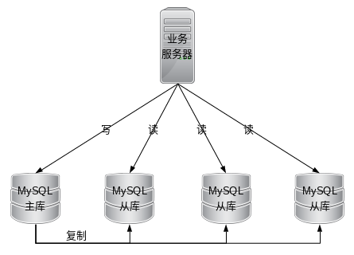

# 读写分离

# 1 概述

## 1.1 为什么需要读写分离

面对日益增加的系统访问量，数据库的吞吐量面临着巨大瓶颈。 对于同一时刻**有大量并发读操作和较少写操作类型的应用系统**来说，将数据库拆分为主库和从库，主库负责处理事务性的增删改操作，从库负责处理查询操作，能够有效的避免由数据更新导致的行锁，使得整个系统的查询性能得到极大的改善。

## 1.2 核心概念

- **主库**：添加、更新以及删除数据操作所使用的数据库，目前仅支持单主库。

- **从库**：查询数据操作所使用的数据库，可支持多从库。

- **主从同步**：将主库的数据异步的同步到从库的操作。由于主从同步的异步性，从库与主库的数据会短时间内不一致。

- **负载均衡策略**：通过负载均衡策略将查询请求疏导至不同从库。

## 1.3 读写分离的基本原理

读写分离的**基本原理是将数据库的读写操作分散到不同的节点上**，基本架构如下图所示：

通过一主多从的配置方式，可以将查询请求均匀的分散到多个数据副本，能够进一步的提升系统的处理能力。

使用多主多从的方式，不但能够提升系统的吞吐量，还能够提升系统的可用性，可以达到在任何一个数据库宕机，甚至磁盘物理损坏的情况下仍然不影响系统的正常运行。

与将数据根据分片键打散至各个数据节点的水平分片不同，**读写分离则是根据SQL语义的分析，将读操作和写操作分别路由至主库与从库。**

# 2 读写分离基本实现

## 2.1 实现思路

1. 数据库服务器搭建主从集群，一主一从、一主多从都合一
2. 数据库主机负责读写操作，从机只负责读操作
3. 数据库主机通过复制将数据同步到从机，每台数据库服务器都存储了所有的业务数据
4. 业务服务器将写操作发给数据库主机，将读操作发给数据库从机

## 2.2 主从复制实现方法

- 数据库的主从复制机制（master-slave）
    - 需要注意：一个master多个slave会增大master的负担。
- 使用Canal
    - Canal是阿里开源的一款基于MySQL数据库binlog的增量订阅和消费组件。

## 2.3 主从复制的问题

读写分离的实现逻辑并不复杂，但是在实际应用的过程中需要应对复制延迟带来的复杂性。

> 说明：以mysql为例，主从复制的延迟可能达到1s，如果有大量的数据同步，延迟1分钟以上也是
> 有可能的，主从复制的延迟会带来一个问题：如果业务服务器将数据库写入到数据库主服务器后立
> 刻进行读取，此时读操作访问的是从机，主机还没有将数据复制过来，到从机读取的数据不是最新
> 的数据，业务上就会有问题。例如 用户注册成功后，立即登录，提示用户不存在。

应对方案：

- 写操作完成后的读操作指定发给数据库的主服务器。(需要和业务进行强绑定，对业务的
    侵入和影响较大)
- 读取从机失败后在读取一次主机。(需要对底层数据库访问API进行封装)
- 关键性业务读写操作全部指向主机，非关键性业务采用读写分离。