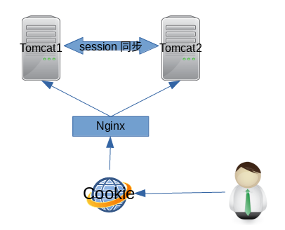
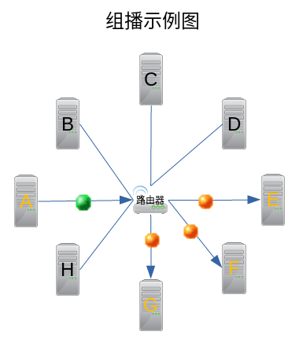
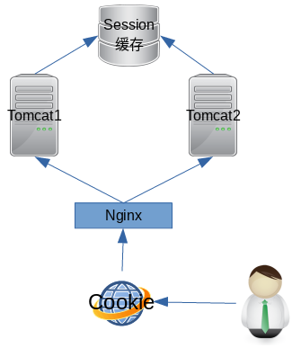
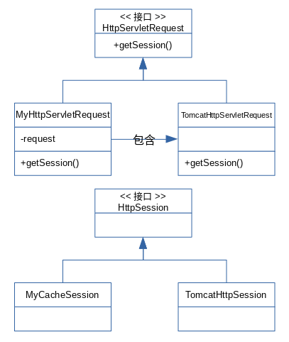

# 分布式Session

# 1 概述

## 1.1 为什么需要分布式Session解决方案？

服务内部默认的会话id，只在同一个服务器之间生效，不同服务器都一个不同会话id，那么会导致会话不一致，这显然不适合当前分布式和集群系统环境，所以分布式和集群系统下的身份认证解决方案很必要也很重要。

## 1.2 解决方案


1. 使用session内部共享机制，session同步，实现复杂；
2. 使用数据库存储sessionID；
3. 使用redis，可靠性比较高；
4. 客户端cookie加密。
5. JWT（Json web token）

# 1 Session工作原理


## 1.1 Tomcat中所有的session都保存在哪里？

Tomcat本地的ConcurrentHashMap中（本地缓存），以sessionId为key。

调试：

`HttpSession session = request.getSession();` 

生成sessionid：org.apache.catalina.util.

```java
/**
  * Generate and return a new session identifier.
  */
public String generateSessionId() {

    byte random[] = new byte[16];

    // Render the result as a String of hexadecimal digits
    StringBuilder buffer = new StringBuilder();

    int resultLenBytes = 0;

    while (resultLenBytes < sessionIdLength) {
        getRandomBytes(random);
        for (int j = 0;
             j < random.length && resultLenBytes < sessionIdLength;
             j++) {
            byte b1 = (byte) ((random[j] & 0xf0) >> 4);
            byte b2 = (byte) (random[j] & 0x0f);
            if (b1 < 10)
                buffer.append((char) ('0' + b1));
            else
                buffer.append((char) ('A' + (b1 - 10)));
            if (b2 < 10)
                buffer.append((char) ('0' + b2));
            else
                buffer.append((char) ('A' + (b2 - 10)));
            resultLenBytes++;
        }
    }

    if (jvmRoute != null) {
        buffer.append('.').append(jvmRoute);
    }

    return buffer.toString();
}
```

`org.apache.catalina.session.StandardSession` 

```java
/**
  * Set the session identifier for this session.
  *
  * @param id The new session identifier
  */
@Override
public void setId(String id) {

    if ((this.id != null) && (manager != null))
        manager.remove(this);

    this.id = id;

    if (manager != null)
        manager.add(this);
    tellNew();
}
```

监听器：把这个新session通知给session监听器

```java
/**
  * Inform the listeners about the new session.
  */
public void tellNew() {

    // Notify interested session event listeners
    fireSessionEvent(Session.SESSION_CREATED_EVENT, null);

    // Notify interested application event listeners
    Context context = (Context) manager.getContainer();
    Object listeners[] = context.getApplicationLifecycleListeners();
    if (listeners != null) {
        HttpSessionEvent event =
            new HttpSessionEvent(getSession());
        for (int i = 0; i < listeners.length; i++) {
            if (!(listeners[i] instanceof HttpSessionListener))
                continue;
            HttpSessionListener listener =
                (HttpSessionListener) listeners[i];
            try {
                fireContainerEvent(context,
                                   "beforeSessionCreated",
                                   listener);
                listener.sessionCreated(event);
                fireContainerEvent(context,
                                   "afterSessionCreated",
                                   listener);
            } catch (Throwable t) {
                ExceptionUtils.handleThrowable(t);
                try {
                    fireContainerEvent(context,
                                       "afterSessionCreated",
                                       listener);
                } catch (Exception e) {
                    // Ignore
                }
                manager.getContainer().getLogger().error
                    (sm.getString("standardSession.sessionEvent"), t);
            }
        }
    }

}
```

session保存： `org.apache.catalina.session.ManagerBase` 

```java
/**
  * The set of currently active Sessions for this Manager, keyed by
  * session identifier.
  */
protected Map<String, Session> sessions = new ConcurrentHashMap<String, Session>();
```


```java
/**
  * Add this Session to the set of active Sessions for this Manager.
  *
  * @param session Session to be added
  */
@Override
public void add(Session session) {

    sessions.put(session.getIdInternal(), session);
    int size = getActiveSessions();
    if( size > maxActive ) {
        synchronized(maxActiveUpdateLock) {
            if( size > maxActive ) {
                maxActive = size;
            }
        }
    }
}
```


## 1.2 Tomcat是怎么追踪到请求是属于哪个session的？

通过cookie：产生会话时向浏览器发送存有sessionid的cookie，后续请求都带上这个cookie。

## 1.3 Session是不是在用户登录时才产生？

不是，会话是用来追踪多个请求的，登录只是明确会话的主人是谁（把用户信息存放到Session中），Session是在程序调用 `request.getSession();` 时产生的，如果程序不调用，则没有Session。

# 2 集群架构那些事


## 2.1 单体应用无法扛起快速增长的用户访问量时，我们该怎么办？


1. 更换更好的机器
2. 用多台服务器一起来服务。

## 2.2 作为架构师，该从那些方面来考量这些办法？

**成本**：

- 高性能服务器价格昂贵：30万/台
- 普通服务器价格便宜：3万/台

**性能**：

- 高性能服务器：10000并发
- 普通服务器：1000并发

**可用性**：

- 高性能服务器：99.99%
- 普通服务器：99.99999999%

**扩展性**：

- 高性能服务器：不好扩展了
- 普通服务器：可随用户量的增减而增减机器

### 2.2.1 集群是最优选择

一起来完成一项繁重任务的多台机器就够成一个集群。

集群中的每个台机器都做同样的工作，无差别。

# 3 反向代理-负载均衡


## 3.1 反向代理的职责和要求

**反向代理的职责**：

- 接受用户请求；
- 再分发给集群的机器处理。

**对反向代理的要求**：

- 并发负载能力强
- 能均衡分发请求

## 3.2 反向代理-负载均衡的可选方式


- 硬件：常见的有NetScaler、F5、Radware和Array等
  - 价格比较高昂，但也提供了高可用性和高稳定性，同时还提供了专业的技术服务。没有专业IT团队的大企业采用。
- 软件：流行的有LVS、haproxy、nginx
  - 三种软件负载均衡器都为开源软件。
  - 小企业、互联网公司必选。

# 4 Session丢失问题

服务器使用反向代理-负载均衡，当我们在一台服务器上登录之后，当我们刷新界面后被分配到其它服务器上而造成Session不一致或丢失的问题。

# 5 Session一致性解决方案

## 5.1 基于Nginx的ip_hash的负载均衡

较大分布式环境下可选。

### 5.1.1 优点


- 配置简单，对应用无侵入性，不需要修改代码；
- 只要hash属性是均匀的，多台web-server的负载是均衡的；
- 便于服务器水平扩展；
- 安全性较高

### 5.1.2 缺点


- 服务器重启会造成session丢失；

  - session时存储在服务器的，当服务器重启，session自然丢失。
- 水平扩展过程中也会造成部分session丢失；

  - 因为对客户ip进行hash之后需要对服务器集群中服务器数量取模来确定目标服务器，在服务器变化前后，取模运算的结果将发生变化，从而导致客户访问的服务器不一样而导致session丢失。
- 客户机ip变化的话会造成session丢失；

  - 因为ip_hash是根据ip来确定业务服务器的，当用户ip变化，会导致用户ip变化前后访问的服务器不一样，从而导致session丢失。
- 存在单点负载高的风险

  - hash算法并不是一个绝对均衡分配的算法

## 5.2 服务器session复制

小型分布式环境下首选。



### 5.2.1 启用Tomcat的Session复制


1. 修改`server.xml`中的Cluster节点；

> 打开所有需要Session复制Tomcat配置文件server.xml中的`<Cluster className="org.apache.catalina.ha.tcp.SimpleTcpCluster"/>`配置（也就是取消注释）


2. 修改应用`web.xml`，增加节点`<distributable/>`

> 在应用的`web.xml`的根标签web-app下增加一个`<distributable/>`空标签。

### 5.2.2 服务器Session复制优缺点


#### 5.2.2.1 优点


- 对应用无侵入性，不需要修改代码
- 能适应各种负载均衡策略
- 服务器重启或宕机不会造成session丢失
- 安全性较高

#### 5.2.2.2 缺点


- Session同步会有一定的延迟
- 占用内网宽带资源
- 受制于内存资源，水平扩展能力差
- 服务器数量较多GG
- 序列化反序列化消耗CPU性能

### 5.2.3 Tomcat的Session复制原理

IP网络数据传输有三种方式：单播、组播和广播。

Tomcat使用组播进行不同服务器之间的session复制。

224.0.1.0~228.255.255.255为用户可用的组播地址。



## 5.3 session统一缓存

大型分布式环境下首选。

使用memcached，效率比redis高。但是在秒杀场景中不适用memecached，memecached进行decr和incr时，传递数量值大于库存的时候，默认为0。



### 5.3.1 统一缓存实现原理

我们的业务代码中要用session都是通过request去获取的，业务代码只管使用session对象，它们不关心它的存取。

那我们可用把Tomcat生成的request替换成我们的自己实现的request，再提供给业务代码使用，在我们自己实现的request中实现自己的session的生成、存取、失效操作。



### 5.3.2 使用redis作为统一缓存


#### 5.3.2.1 加入依赖：redis client和spring session

普通java web：

- `https://repo1.maven.org/maven2/org/springframework/session/spring-session-data-redis/1.2.1.RELEASE/spring-session-data-redis-1.2.1.RELEASE.jar`
- `https://repo1.maven.org/maven2/redis/clients/jedis/2.8.1/jedis-2.8.1.jar`


maven：

```xml
<!-- https://mvnrepository.com/artifact/org.springframework.session/spring-session-data-redis -->
<dependency>
    <groupId>org.springframework.session</groupId>
    <artifactId>spring-session-data-redis</artifactId>
    <version>1.2.1.RELEASE</version>
</dependency>
<!-- https://mvnrepository.com/artifact/redis.clients/jedis -->
<dependency>
    <groupId>redis.clients</groupId>
    <artifactId>jedis</artifactId>
    <version>2.8.1</version>
</dependency>
```


#### 5.3.2.2 增加filter

通过filter，替换servlet容器默认的session管理实现。

在`web.xml`的根标签web-app下加入springSessionRepositoryFilter（实现了request和session）的配置

```xml
<!-- Spring session配置 -->
<filter>
    <filter-name>springSessionRepositoryFilter</filter-name>
    <filter-class>org.springframework.web.filter.DelegatingFilterProxy</filter-class>
</filter>
<filter-mapping>
    <filter-name>springSessionRepositoryFilter</filter-name>
    <url-pattern>/*</url-pattern>
</filter-mapping>
```


#### 5.3.2.3 修改spring配置文件

修改spring配置文件，在容器中注入spring session和redis相关的bean。

```xml
<bean class="org.springframework.session.data.redis.config.annotation.web.http.RedisHttpSessionConfiguration">
    <property name="maxInactiveIntervalInSeconds" value="3600" />
</bean>
<bean id="jedisPoolConfig" class="redis.clients.jedis.JedisPoolConfig">
    <property name="maxTotal" value="100" />
    <property name="maxIdle" value="10" />
</bean>
<bean id="jedisConnFactory"
      class="org.springframework.data.redis.connection.jedis.JedisConnectionFactory">
    <property name="hostName" value="localhost" />
    <property name="port" value="6379" />
    <property name="timeout" value="3000" />
    <property name="poolConfig" ref="jedisPoolConfig" />
    <property name="usePool" value="true" />
</bean>
```


### 5.3.3 Session统一缓存的优缺点


#### 5.3.3.1 优点


- 能适应各种负载均衡策略；
- 服务器重启或宕机不会造成session丢失；
- 安全性较高；
- 扩展能力强；
- 适合集群数量大时使用；

#### 5.3.3.2 缺点


- 对应用有侵入，需要增加相关配置；
- 增加一次网络开销，用户体验降低；
- 序列化反序列化消耗CPU性能。

### 5.3.4 使用Session统一缓存需要注意的点


- 放在session中的对象是可序列化的；
- SpringSessionRepositoryFilter的顺序要在其他获取session的filter之前；
- Session的失效时间由redis节点失效时间决定，原有的配置不起作用；
- 登出的时候，一定要保证显式调用了`session.invalidate();`。

### 5.3.5 统一缓存的另一种实现方式：`tomcat-redis-session-manager`

此方案最简单之处就在于无需修改项目，只需要修改Tomcat的`context.xml`配置文件即可。

#### 5.3.5.1 依赖包

注意：安装包需要放在Tomcat根目录下lib文件夹下。

- `tomcat-redis-session-manager-1.1.jar`
- `jedis-2.1.0.jar`
- `commons-pool-1.6.jar`

#### 5.3.5.2 `context.xml`


```xml
<?xml version="1.0" encoding="UTF-8"?>
<!-- Licensed to the Apache Software Foundation (ASF) under one or more contributor 
	license agreements. See the NOTICE file distributed with this work for additional 
	information regarding copyright ownership. The ASF licenses this file to 
	You under the Apache License, Version 2.0 (the "License"); you may not use 
	this file except in compliance with the License. You may obtain a copy of 
	the License at http://www.apache.org/licenses/LICENSE-2.0 Unless required 
	by applicable law or agreed to in writing, software distributed under the 
	License is distributed on an "AS IS" BASIS, WITHOUT WARRANTIES OR CONDITIONS 
	OF ANY KIND, either express or implied. See the License for the specific 
	language governing permissions and limitations under the License. --><!-- The contents of this file will be loaded for each web application -->
<Context>

	<!-- Default set of monitored resources -->
	<WatchedResource>WEB-INF/web.xml</WatchedResource>

	<!-- Uncomment this to disable session persistence across Tomcat restarts -->
	<!-- <Manager pathname="" /> -->

	<!-- Uncomment this to enable Comet connection tacking (provides events 
		on session expiration as well as webapp lifecycle) -->
	<!-- <Valve className="org.apache.catalina.valves.CometConnectionManagerValve" 
		/> -->
	<!-- tomcat-redis-session共享配置 -->
	<Valve className="com.orangefunction.tomcat.redissessions.RedisSessionHandlerValve" />
	<Manager className="com.orangefunction.tomcat.redissessions.RedisSessionManager"
		host="193.112.76.19" 
		port="6379" 
		database="0" 
		password="root"
		maxInactiveInterval="60" />
</Context>
```


## 5.4 使用关系型数据库存储sessionID


### 5.4.1 优点

使用数据库来保存session，就算服务器宕机了也没事，session照样在。

### 5.4.2 缺点


- 程序需要定制；
- 每次请求都进行数据库读写开销不小(使用内存数据库可以提高性能，宕机就会丢失数据。可供选择的内存数据库有BerkeleyDB,Mysql的内存表);
- 数据库是一个单点，当然可以做数据库的高可用（HA）来解决这个问题。

## 5.5 客户端cookie加密

用 Cookie 取代 Session，这样服务器端不需要保存应用状态，节省服务器资源，而加密密钥则在服务器端共享，所有的客户端都是用同一个密钥。不过加密解密本身也会消耗计算资源，所以这种方法，可能只是把一个空间问题变成了一个时间问题。

### 5.5.1 使用加密cookie解决Session共享问题实现思路


#### 5.5.1.1 存储过程


1. 将要保存的Javabean转换成Json字符串；
2. 使用DES（对称加密算法）加密Json字符串；
3. 设置到根域名的cookie中：`cookie.setDomain("zh.com");`

#### 5.5.1.2 解析过程


1. 遍历所有cookie；
2. 找到对应的cookie；
3. 使用DES解密Json字符串；
4. 把Json字符串还原成Javabean。

## 5.6 JWT(JsonWebToken)

JSON Web Token (JWT)是一个开放标准(RFC 7519)，它定义了一种紧凑的、自包含的方式，用于作为JSON对象在各方之间安全地传输信息。该信息可以被验证和信任，因为它是数字签名的。

使用场景：

- Authorization (授权) : 这是使用JWT的最常见场景。一旦用户登录，后续每个请求都将包含JWT，允许用户访问该令牌允许的路由、服务和资源。单点登录是现在广泛使用的JWT的一个特性，因为它的开销很小，并且可以轻松地跨域使用。
- Information Exchange (信息交换) : 对于安全的在各方之间传输信息而言，JWT无疑是一种很好的方式。因为JWT可以被签名，例如，用公钥/私钥对，你可以确定发送人就是它们所说的那个人。另外，由于签名是使用头和有效负载计算的，您还可以验证内容没有被篡改。