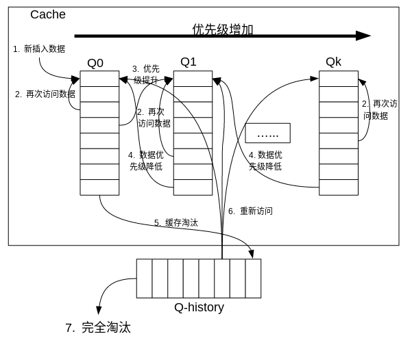

# 缓存算法

# 1 LRU最近最少使用

## 1.1 概述

LRU（Least Recently Used），即最近最少使用。

**LRU算法的设计原则**：==如果一个数据在最近一段时间没有被访问到，那么在将来它被访问的可能性也很小==。也就是说，当限定的空间已存满数据时，应当把最久没有被访问到的数据淘汰。

LFU（Least Frequently Used）最少使用算法和LRU算法的不同之处，LRU的淘汰规则是基于访问时间，而LFU是基于访问次数的。

## 1.2 使用数组来缓存数据

### 1.2.1 LRU算法实现思路

1. 用一个数组来存储数据，用另一个数组来记录缓存数组对应位置数据的年龄（新访问的数据年龄为0）；
2. 每次插入数据项的时候，如果数组未满，则新的数据项插入到数组中，其年龄置为0；当插入数据的时候数组已满，则将年龄最大的数据项淘汰，然后将新数据放到淘汰的数据项的位置，并将对应位置的数据的年龄置为0；
3. 每次访问的数据项如果存在于缓存数组中，则将此数据项对应的年龄置为0，其他数据项对应的年龄自增；如果访问的数据不在缓存数组，则可以根据条件把数据插入缓存数组中。

## 1.3 使用链表来缓存数据

### 1.3.1 LRU算法的实现思路

1. 利用一个链表来缓存数据，并定义一个容量；
2. 每次插入新数据的时候将新数据插入到链表的头部；
3. 插入新数据的时候如果缓存已满，则将链表尾部结点异除；
4. 每次数据被访问（缓存命中），则把命中数据移动到链表头部。

### 1.3.2 评价

**命中率**：当存在热点数据时，LRU的效率很好，但偶发性的、周期性的批量操作会导致LRU命中率急剧下降，缓存污染情况比较严重。

**复杂度**：简单

**代价**：需要遍历链表，找到命中的数据块索引，然后需要将数据移到头部。

## 1.4 LinkedHashMap

### 1.4.1 概述

相比于HashMap，LinkedHashMap虽然增加了时间和空间上的开销，但是通过维护一个运行于所有条目的双向链表，LinkedHashMap保证了元素迭代的顺序。该迭代顺序可以是插入顺序或者是访问顺序。

LinkedHashMap可以认为是HashMap+LinkedList，即它既使用HashMap操作数据结构，又使用LinkedList维护插入元素的先后顺序。

LinkedHashMap中本身就实现了一个方法removeEldestEntry用于判断是否需要移除最不常读取的数据，方法默认是直接返回false，不会移除元素，如果要实现LRU算法需要重写该方法。即当缓存满后就移除最不常用的数据。

```java
/**
 * Constructs an empty <tt>LinkedHashMap</tt> instance with the
 * specified initial capacity, load factor and ordering mode.
 *
 * @param  initialCapacity the initial capacity
 * @param  loadFactor      the load factor
 * @param  accessOrder     the ordering mode - <tt>true</tt> for
 *         access-order, <tt>false</tt> for insertion-order
 * @throws IllegalArgumentException if the initial capacity is negative
 *         or the load factor is nonpositive
 */
public LinkedHashMap(int initialCapacity,
                     float loadFactor,
                     boolean accessOrder) {//true：使用access-order访问顺序模式，否则使用insertion-order插入顺序模式
    super(initialCapacity, loadFactor);
    this.accessOrder = accessOrder;
}
```

### 1.4.2 入门案例

```java
package com.zh.cacheAlgorithm.lru;

import java.util.LinkedHashMap;
import java.util.Map;

public class UseLinkedHashMap<K, V> {
	private static final float hashLoadFactory = 0.75f;
	private LinkedHashMap<K, V> map;
	private int cacheSize;

	public UseLinkedHashMap(int cacheSize) {
		this.cacheSize = cacheSize;
		int capacity = (int) Math.ceil(cacheSize / hashLoadFactory) + 1;
		map = new LinkedHashMap<K, V>(capacity, hashLoadFactory, true) {
			private static final long serialVersionUID = 1;

			@Override
			protected boolean removeEldestEntry(Map.Entry eldest) {
				return size() > UseLinkedHashMap.this.cacheSize;
			}
		};
	}

	public synchronized V get(K key) {
		return map.get(key);
	}

	public synchronized void put(K key, V value) {
		map.put(key, value);
	}

	public synchronized void clear() {
		map.clear();
	}

	public synchronized int usedSize() {
		return map.size();
	}

	public void print() {
		for (Map.Entry<K, V> entry : map.entrySet()) {
			System.out.print(entry.getValue() + "--");
		}
		System.out.println();
	}
}
```

# 2 LRU-K

## 2.1 概述

LRU-K中的K代表最近使用的次数，因此LRU可以认为是LRU-1。

LRU-K算法的**主要设计目的**：解决LRU算法“缓存污染”的问题

LRU-K算法的**核心思想**：将“最近使用过1次”的判断标准扩展为“最近使用过K次”。

相比LRU，LRU-K需要多维护一个队列，用于记录所有缓存数据被访问的历史。只有当数据的访问次数达到K次的时候，才将数据放入缓存。当缓存中需要淘汰数据时，LRU-K会淘汰第K次访问时间距当前时间最大的数据。

## 2.2 实现思路

1. 数据被第一次访问的时候，被加入到历史纪录表，记录其最后访问时间，设置其访问次数为1；
2. 在此访问该数据的时候，如果其最后访问时间与当前时间间隔大于一个预定的时间阀值（比如30s），则将其访问次数置为1；否则将其访问次数加1，如果访问次数大于等于K后，将数据保存到缓存队列中，并将缓存中的数据按照时间顺序重新排序。
3. 当缓存中的数据被再次访问后，缓存数据重新排序；
4. 当缓存需要淘汰数据的时候，直接淘汰缓存中的末尾数据即可，即：淘汰“倒数第K次访问离现在最久”的数据。

## 2.3 评价

**命中率**：LRU-K降低了“缓存污染”带来的问题，命中率比LRU高。

**复杂度**：LRU-K缓存队列是一个优先级队列，算法复杂度和代价比较高。

**代价**：

- 内存消耗比LRU-K大：由于LRU-K还需要记录那些被访问过、但还没有放入缓存的对象，因此内存消耗会比LRU要多；当数据量很大的时候，内存消耗会比较可观。
- CPU消耗比LRU高：LRU-K需要基于时间进行排序（可以等到需要淘汰数据时再排序，也可以即时排序），CPU消耗比LRU要高。

# 3 Two queues

## 3.1 概述

Two queues算法类似于LRU-2，不同点在于Two queues将LRU-2算法中的访问历史队列改为FIFO缓存队列，则Two queues算法有两个缓存队列，一个是FIFO队列，一个是LRU队列。

当数据第一次访问时，Two queues算法将数据缓存在FIFO队列里面，当数据第二次被访问时，则将数据从FIFO队列移到LRU队列里面，两个队列各自按照自己的方法淘汰数据。

**FIFO**队列：先进先出的队列，最先缓存的数据，最早被淘汰，JQuery框架内部就是用的这种模型。

**LRU**队列：双链表结构，每次有新数据存入，直接放在链表头；每次被访问的数据，也转移到链表头；当需要淘汰数据的时候，直接淘汰链表尾部数据即可。

## 3.2 评价

**命中率**：Two queues算法的命中率要高于LRU。

**复杂度**：需要两个队列，但两个队列本身都比较简单。

**代价**：

- Two queues的代价是FIFO和LRU的代价之和。
- Two queues算法和LRU-2算法命中率类似，内存消耗也比较接近，但对于最后缓存的数据来说，2Q会减少一次从原始存储读取数据或者计算数据的操作。

# 4 Multi Queue

## 4.1 概述

Multi Queue算法**根据访问频率将数据划分为多个队列，不同的队列具有不同的访问优先级**。

Multi Queue的核心思想是：**优先缓存访问次数多的数据**。

## 4.2 算法实现思路



详细的算法结构图如下，Q0，Q1....Qk代表不同的优先级队列，Q-history代表从缓存中淘汰数据，但记录了数据的索引和引用次数的队列。

1. 新插入的数据放入Q0；
2. 每个队列按照LRU进行管理，当数据的访问次数达到一定次数f后，根据根据优先级计算公式（$k = QueueNum(f)$，一般为$log2(f)$）计算除其优先级等级，如果需要提升优先级时，将数据从当前队列中删除，加入到更高级队列的头部；
3. Multi Queue为每一个缓存关联一个过期时间expireTime（一种逻辑时间，通过访问次数来定义）。当某个优先级队列插入一个新的数据项的时候，我们必须设置此数据项的过期时间$expireTime=currentTime+lifeTime$（这里的lifeTime是一个可调节的量，它规定了缓存块在队列中不接任何一次访问可驻留的时间）。每一次访问都会检查所有队列的队首元素的过期时间，将队首元素的过期时间与当前时间相比较，如果过期时间超过了当前时间，就将该队尾元素移动到次一级队列的队首，并且重新设置它的过期时间expireTime，同时它的访问频率（次数）也要减半；
4. 需要淘汰数据时，从最低级队列按照LRU淘汰。淘汰数据时，将数据从缓存中删除，将数据索引加入Q-history头部。如果数据在Q-history中被重新访问，则重新计算其优先级，移到目标队列头部。Q-history按照LRU淘汰数据的索引。

## 4.3 评价

**命中率**：Multi Queue降低了“缓存污染”带来的问题，命中率比LRU要高。

**复杂度**：Multi Queue需要维护多个队列，且需要维护每个数据的访问时间，复杂度比LRU高。

**代价**：

- Multi Queue需要记录每个数据的访问时间，需要定时扫描所有队列，代价比LRU要高。

- 虽然Multi Queue的队列看起来数量比较多，但由于所有队列之和受限于缓存容量的大小，因此这里多个队列长度之和和一个LRU队列是一样的，因此队列扫描性能也相近。

# 5 FIFO先进先出

## 5.1 概述

FIFO（First in First out），先进先出。其实在操作系统的设计理念中很多地方都利用到了先进先出的思想，比如作业调度（先来先服务）。

**FIFO Cache设计核心原则**：==如果一个数据最先进入缓存中，则应该最早淘汰掉==。也就是说，当缓存满的时候，应当把最先进入缓存的数据给淘汰掉。

## 5.2 使用链表实现思路

1. 利用一个双向链表保存数据；
2. 新的数据添加到链表末尾，如果Cache存满数据，则把链表头部数据删除，然后把新的数据添加到链表末尾；
3. 在访问数据的时候，如果在Cache中存在该数据的话，则返回对应的value值；否则返回-1。
4. 如果想提高访问效率，可以利用hashmap来保存每个key在链表中对应的位置。

# 6 LFU最少使用

## 6.1 概述

LFU（Least Frequently Used）最近最少使用算法。

**依据的思路**：==如果一个数据在最近一段时间内使用次数很少，那么在将来一段时间内被使用的可能性也很小==。

LFU和LRU算法的不同之处，LRU的淘汰规则是基于访问时间，而LFU是基于访问次数的。

## 6.2 实现思路

1. 利用一个数组存储数据项，用HashMap存储每个数据项在数组中对应的位置，然后为每个数据项设计一个访问频次；
   - 可以利用小顶堆+HashMap，小顶堆插入、删除操作都能达到O(logn)时间复杂度。
2. 当数据项被命中时，访问频次自增，在淘汰的时候淘汰访问频次最少的数据。
3. 淘汰数据的时候，通过选择算法得到应该淘汰的数据项在数组中的索引，并将该索引位置的内容替换为新来的数据内容即可。