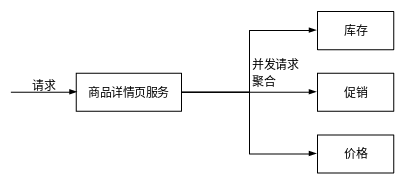

# 异步并发概述

在Java中，如使用Tomcat，一个请求会分配一个线程进行请求处理，该线程负责获取数据、拼装数据或模板，然后返回给前端。

- 同步调用：在同步调用获取数据接口的情况下（等待依赖系统返回数据），整个线程是一直被占用并阻塞的。如果有大量的这种请求，则每个请求占用一个线程，但线程一直处于阻塞，降低了系统的吞吐量，这将导致应用的吞吐量下降。
- 异步/协程：在调用依赖的服务响应比较慢时，让出线程和CPU来处理下一个请求，当依赖的服务返回后再分配响应的线程来继续处理。
  - 协程：Java不支持协程，虽然有些Java框架号称支持，但还是高层API的封装。
  - 异步：Java开源框架HttpAsyncClient、Dubbo、Thrift等。

在开发应用系统过程中，通过异步并发并不能使响应变得更快，更多是为了提升吞吐量、对请求更细粒度控制，或是通过多依赖服务并发调用降低服务响应时间。当一个线程在处理任务时，通过Fork多个线程来处理任务并等待这些线程的处理结果，这种应用并不是真正的异步。异步是针对CPU和IO的，当IO没有就绪时要让出CPU来处理其他任务，这才是异步。