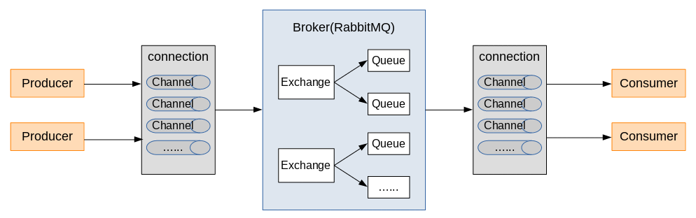

# RabbitMQ入门

# 1 概述

## 1.1 简介

MQ全称为Message Queue，即消息队列，RabbitMQ是由erlang语言开发，基于AMQP（Advanced Message Queuing Protocol 高级消息队列协议）协议实现的消息队列，它是一种应用程序之间的通信方法，消息队列在分布式系统开发中应用非常广泛。RabbitMQ官方地址：[http://www.rabbitmq.com/](http://www.rabbitmq.com/)

其他消息队列：ActiveMQ，RabbitMQ，ZeroMQ，Kafka，MetaMQ，RocketMQ、Redis

## 1.2 消息队列常应用场景

### 1.2.1 任务异步处理

将不需要同步处理的并且耗时长的操作由消息队列通知消息接收方进行异步处理。提高了应用程序的响应时间。

### 1.2.2 系统解耦合

MQ相当于一个中介，生产方通过MQ与消费方交互，它将应用程序进行解耦合。

## 1.3 为什么使用RabbitMQ

1. 使得简单，功能强大。
2. 基于AMQP协议。
3. 社区活跃，文档完善。
4. 高并发性能好，这主要得益于Erlang语言。
5. Spring Boot默认已集成RabbitMQ

## 1.4 AMQP

AMQP，即Advanced Message Queuing Protocol，一个提供统一消息服务的应用层标准高级消息队列协议，是应用层协议的一个开放标准，为面向消息的中间件设计。基于此协议的客户端与消息中间件可传递消息，并不受客户端/中间件不同产品，不同的开发语言等条件的限制。Erlang中的实现有RabbitMQ等。

## 1.5 JMS

JMS即Java消息服务（Java Message Service）应用程序接口，是一个Java平台中关于面向消息中间件（MOM）的API，用于在两个应用程序之间，或分布式系统中发送消息，进行异步通信。Java消息服务是一个与具体平台无关的API，绝大多数MOM提供商都对JMS提供支持。

## 1.6 RabbitMQ的工作原理

**组成部分说明**：

- Broker：消息队列服务进程，此进程包括两个部分：Exchange和Queue。
  - Exchange：消息队列交换机，按一定的规则将消息路由转发到某个队列，对消息进行过虑。
  - Queue：消息队列，存储消息的队列，消息到达队列并转发给指定的消费方。
- Producer：消息生产者，即生产方客户端，生产方客户端将消息发送到MQ。
- Consumer：消息消费者，即消费方客户端，接收MQ转发的消息。

**消息发布流程：**

1. 生产者和Broker建立TCP连接。
2. 生产者和Broker建立通道。
3. 生产者通过通道消息发送给Broker，由Exchange将消息进行转发。
4. Exchange将消息转发到指定的Queue（队列）

**消息接收流程：**

1. 消费者和Broker建立TCP连接
2. 消费者和Broker建立通道
3. 消费者监听指定的Queue（队列）
4. 当有消息到达Queue时Broker默认将消息推送给消费者。
5. 消费者接收到消息。

## 1.7 消息队列的两种模型push和pull的对比
- **push**：推送方式，当有新的消息，Broker将新消息推送给consumer。
    - 缺点：慢消费。指broker给consumer推送一堆consumer无法处理的消息，consumer不是reject就是error，然后来回踢皮球。
- **pull**：拉取方式，consumer会定时去Broker拉取消息，如果拉取失败，直接return。
    - 缺点：消息延迟与盲等。pull是消费方主动定时去拉去消息，由于消息的不确定性，所以会造成会多无用的请求。
- **RocketMQ的设计方案**：长轮询，来平衡推拉模型各自的缺点。
    - 基本思路是：消费者如果尝试拉取失败，不是直接return，而是把连接挂在那里wait，服务端如果有新的消息到来，把连接notify起来。但海量的长连接block对系统的开销还是不容小觑的，还是要合理的评估时间间隔，给wait加一个时间上限。

# 2 RabbitMQ安装（待完成）

# 3 入门案例（待完成）

