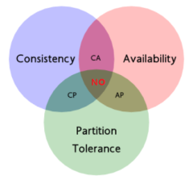

# 分布式中的CAP定理

现如今，对于多数大型互联网应用，分布式系统（distributed system）正变得越来越重要。分布式系统的最大难点，就是各个节点的状态如何同步。CAP 定理是这方面的基本定理，也是理解分布式系统的起点。

CAP理论由 Eric Brewer 在ACM研讨会上提出，而后CAP被奉为分布式领域的重要理论。分布式系统的CAP理论，首先把分布式系统中的三个特性进行了如下归纳：

- **Consistency（一致性）**：数据一致更新，所有数据的变化都是同步的
- **Availability（可用性）**：在集群中一部分节点故障后，集群整体是否还能响应客户端的读写请求
- **Partition tolerance（分区容忍性）**：某个节点的故障，并不影响整个系统的运行

CAP定理又称CAP原则，指的是在一个分布式系统中， Consistency（一致性）、 Availability（可用性）、Partition tolerance（分区容错性），三者不可得兼。

| **选择** | **说明** |
| :---: | :---: |
| **CA** | 放弃分区容错性，加强一致性和可用性，其实就是传统的关系型数据库的选择 |
| **AP** | 放弃一致性（这里说的一致性是强一致性），追求分区容错性和可用性，这是很多分布式系统设计时的选择，例如很多NoSQL系统就是如此 |
| **CP** | 放弃可用性，追求一致性和分区容错性，基本不会选择，网络问题会直接让整个系统不可用 |

需要明确一点的是，在一个分布式系统当中，分区容忍性和可用性是最基本的需求，所以在分布是系统中，我们的系统最当关注的就是A（可用性）P（容忍性），通过补偿的机制寻求数据的一致性。
