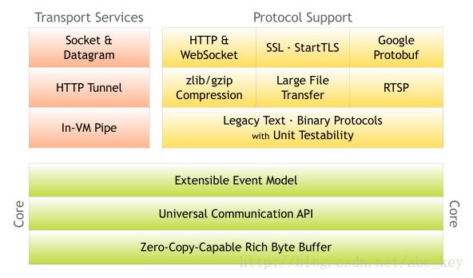

# Netty

## 1.1 为什么选择Netty


我们为什么选择Netty，原因无他，简单。我们再也不必去编写复杂的代码逻辑去实现通信，我们再也不需要去考虑性能问题，不需要考虑便解码问题，半包读写问题等，这些强大的Netty已经帮我们实现好了，我们只需要使用即可。


David John Wheeler说过“在计算机科学中的所有问题都可以通过间接的方法解决。”作为一个NIO client-server框架，Netty提供了这样的一个间接的解决方法。Netty提供了高层次的抽象来简化TCP和UDP服务器的编程，但是你仍然可以使用底层地API。


Netty是最流行的NIO框架，它的健壮性、功能、性能、可定制性和可扩展性在同类框架中都是首屈一指的。它已经得到成百上千的商用项目的验证，如Hadoop的RPC框架Avro、以及JMS框架、强大的RocketMQ、还有主流的分布式通信框架Dubbox等等。


## 1.2 Netty简介


Netty是基于Java NIO的网络应用框架。


Netty是一个NIO client-server(客户端服务器)框架，使用Netty可以快速开发网络应用，例如服务器和客户端协议。Netty提供了一种新的方式来使开发网络应用程序，这种新的方式使得它很容易使用和有很强的扩展性。Netty的内部实现是很复杂的，但是Netty提供了简单易用的api从网络处理代码中解耦业务逻辑。**Netty是完全基于NIO实现的，所以整个Netty都是异步的。**


网络应用程序通常需要有较高的可扩展性，无论是Netty还是其他的基于Java NIO的框架，都会提供可扩展性的解决方案。Netty中一个关键组成部分是它的异步特性，本章将讨论同步(阻塞)和异步(非阻塞)的IO来说明为什么使用异步代码来解决扩展性问题以及如何使用异步。


## 1.3 Netty架构组成



## 1.4 Netty特性
|  **Development Area** | **Netty Features**                                           |
| --------------------: | :----------------------------------------------------------- |
|          Design(设计) | - 各种传输类型，阻塞和非阻塞套接字统一的API<br/>- 使用灵活<br/>- 简单但功能强大的线程模型<br/>- 无连接的DatagramSocket支持<br/>- 链逻辑，易于重用 |
| Ease of Use(易于使用) | - 提供大量的文档和例子<br/>- 除了依赖jdk1.6+，没有额外的依赖关系。某些功能依赖jdk1.7+，其特性可能有相关依赖，但都是可选的。 |
|     Performance(性能) | - 比Java APIS更好的吞吐量和更低的延迟<br/>- 因为线程池和重用所有消耗较少的资源<br/>- 尽量减少不必要的内存拷贝 |
|    Robustness(鲁棒性) | 鲁棒性，可以理解为健壮性<br/>- 链接快或慢或超载不会导致更多的OutOfMemoryError<br/>- 在高速的网络程序中不会有不公平的read/write |
|      Security(安全性) | - 完整的SSL/TLS和StartTLS支持<br/>- 可以在如Applet或OSGI这些受限制的环境中运行 |
|       Community(社区) | - 版本发布频繁<br/>- 社区活跃                                |


# 2 入门案例


## 2.1 NIO通信步骤


1. 创建ServerSocketChannel，为它配置非阻塞模式
2. 绑定监听，配置TCP参数，录入backlog大小等
3. 创建一个独立的IO线程，用于轮询多数复用器Selector
4. 创建Selector，将之前创建的ServerSocketChannel注册到Selector上，并设置监听标志位`SelectionKey.ACCEPT`
5. 启动IO线程，在循环体中执行`Selector.select()`方法，轮询就绪的通道
6. 当轮询到处于就绪的通道时，需要进行判断操作位，如果是ACCEPT状态，说明是新的客户端接入，则调用accept方法接收新的客户端。
7. 设置新接入客户端的一些参数，如非阻塞、并将其通道继续注册到Selector之上，设置监听标识位等
8. 如果轮询的通道位是READ，则进行读取，构造Buffer对象等
9. 更细节的还有数据没发送完成继续发送的问题......


## 2.2 Netty实现通信的步骤


1. 创建两个NIO线程组，一个专门用于网络事件处理（接收客户端的连接），另一个则进行网络通信读写。
2. 创建一个ServerBootstrap对象，配置Netty的一系列参数，例如接收传出数据的缓存大小等等。
3. 创建一个实际处理数据的类ChannelInitializer，进行初始化的准备工作，比如设置接收传出数据的字符集、格式、已经实际处理数据的接口。
4. 绑定端口，执行同步阻塞方法等待服务端启动即可。


[解读Netty示例](http://ifeve.com/netty5-user-guide)


### 2.2.1 代码示例


```java
import io.netty.bootstrap.ServerBootstrap;
import io.netty.channel.ChannelFuture;
import io.netty.channel.ChannelInitializer;
import io.netty.channel.ChannelOption;
import io.netty.channel.EventLoopGroup;
import io.netty.channel.nio.NioEventLoopGroup;
import io.netty.channel.socket.SocketChannel;
import io.netty.channel.socket.nio.NioServerSocketChannel;

public class Server {
	public static void main(String[] args) throws Exception {
		//1 创建线两个线程组 
		//一个是用于处理服务器端接收客户端连接的
		//一个是进行网络通信的（网络读写的）
		EventLoopGroup pGroup = new NioEventLoopGroup();
		EventLoopGroup cGroup = new NioEventLoopGroup();
		
		//2 创建辅助工具类，用于服务器通道的一系列配置
		ServerBootstrap b = new ServerBootstrap();
		b.group(pGroup, cGroup)		//绑定俩个线程组
		.channel(NioServerSocketChannel.class)		//指定NIO的模式
		.option(ChannelOption.SO_BACKLOG, 1024)		//设置tcp缓冲区
		.option(ChannelOption.SO_SNDBUF, 32*1024)	//设置发送缓冲大小
		.option(ChannelOption.SO_RCVBUF, 32*1024)	//这是接收缓冲大小
		.option(ChannelOption.SO_KEEPALIVE, true)	//保持连接
		.childHandler(new ChannelInitializer<SocketChannel>() {
			@Override
			protected void initChannel(SocketChannel sc) throws Exception {
				//3 在这里配置具体数据接收方法的处理
				sc.pipeline().addLast(new ServerHandler());
			}
		});
		
		//4 进行绑定 
		ChannelFuture cf1 = b.bind(8765).sync();
		//ChannelFuture cf2 = b.bind(8764).sync();
		//5 等待关闭
		cf1.channel().closeFuture().sync();
		//cf2.channel().closeFuture().sync();
		pGroup.shutdownGracefully();
		cGroup.shutdownGracefully();
	}
}
```


对于`ChannelOption.SO_BACKLOG`的解释：


> 服务器段TCP内核模块维护有2个队列，我们称之为A，B吧。
> 客户端向服务器端connect的时候，会发送带有SYN标志的包（第一次握手），
> 服务器收到客户端发来的SYN时，向客户端发送SYN_ACK确认（第二次握手），
> 此时TCP内核模块把客户端连接加入到A队列中，然后服务器收到客户端发来的ACK时（第三次握手），
> TCP内核模块把客户端连接从A队列移到B队列，连接完成，应用程序的accept会返回。
> 也就是说accept从B队列中取出完成三次握手的连接。
> A队列和B队列上都之和是backlog。当A，B队列的长度之和大于backlog时，新连接会被TCP内核拒绝。所以如果backlog过小，可能会出现accept速度跟不上，A，B队列满了，导致新的客户端无法连接。要注意的是：backlog对程序支持的连接数并无影响，backlog影响的只是还没有被accept取出的连接。


```java
import io.netty.buffer.ByteBuf;
import io.netty.buffer.Unpooled;
import io.netty.channel.ChannelFutureListener;
import io.netty.channel.ChannelHandlerAdapter;
import io.netty.channel.ChannelHandlerContext;

public class ServerHandler extends ChannelHandlerAdapter {
	@Override
	public void channelActive(ChannelHandlerContext ctx) throws Exception {
		System.out.println("server channel active... ");
	}

	@Override
	public void channelRead(ChannelHandlerContext ctx, Object msg)
			throws Exception {
			ByteBuf buf = (ByteBuf) msg;
			byte[] req = new byte[buf.readableBytes()];
			buf.readBytes(req);
			String body = new String(req, "utf-8");
			System.out.println("Server :" + body );
        	//服务器端给客户端的响应
			String response = "进行返回给客户端的响应：" + body ;
			ctx.writeAndFlush(Unpooled.copiedBuffer(response.getBytes()));
			//.addListener(ChannelFutureListener.CLOSE);//加上是短连接
	}

	@Override
	public void channelReadComplete(ChannelHandlerContext ctx)
			throws Exception {
		System.out.println("读完了");
		ctx.flush();
	}

	@Override
	public void exceptionCaught(ChannelHandlerContext ctx, Throwable t)
			throws Exception {
		ctx.close();
	}
}
```


```java
import io.netty.bootstrap.Bootstrap;
import io.netty.buffer.Unpooled;
import io.netty.channel.ChannelFuture;
import io.netty.channel.ChannelInitializer;
import io.netty.channel.EventLoopGroup;
import io.netty.channel.nio.NioEventLoopGroup;
import io.netty.channel.socket.SocketChannel;
import io.netty.channel.socket.nio.NioSocketChannel;

public class Client {

	public static void main(String[] args) throws Exception{
		
		EventLoopGroup group = new NioEventLoopGroup();
		Bootstrap b = new Bootstrap();
		b.group(group)
		.channel(NioSocketChannel.class)
		.handler(new ChannelInitializer<SocketChannel>() {
			@Override
			protected void initChannel(SocketChannel sc) throws Exception {
				sc.pipeline().addLast(new ClientHandler());
			}
		});
		
		ChannelFuture cf1 = b.connect("127.0.0.1", 8765).sync();
		//ChannelFuture cf2 = b.connect("127.0.0.1", 8764).sync();
		//发送消息
		Thread.sleep(1000);
		cf1.channel().writeAndFlush(Unpooled.copiedBuffer("777".getBytes()));
		cf1.channel().writeAndFlush(Unpooled.copiedBuffer("666".getBytes()));
		//cf2.channel().writeAndFlush(Unpooled.copiedBuffer("888".getBytes()));
		Thread.sleep(2000);
		cf1.channel().writeAndFlush(Unpooled.copiedBuffer("888".getBytes()));
		//cf2.channel().writeAndFlush(Unpooled.copiedBuffer("666".getBytes()));
		
		cf1.channel().closeFuture().sync();
		//cf2.channel().closeFuture().sync();
		group.shutdownGracefully();		
	}
}
```


```java
import io.netty.buffer.ByteBuf;
import io.netty.buffer.Unpooled;
import io.netty.channel.ChannelHandlerAdapter;
import io.netty.channel.ChannelHandlerContext;
import io.netty.channel.ChannelPromise;
import io.netty.util.ReferenceCountUtil;

public class ClientHandler extends ChannelHandlerAdapter{
	@Override
	public void channelActive(ChannelHandlerContext ctx) throws Exception {
        //当通道激活的时候...
	}

	@Override
	public void channelRead(ChannelHandlerContext ctx, Object msg) throws Exception {
		try {
			ByteBuf buf = (ByteBuf) msg;
			
			byte[] req = new byte[buf.readableBytes()];
			buf.readBytes(req);
			
			String body = new String(req, "utf-8");
			System.out.println("Client :" + body );
			String response = "收到服务器端的返回信息：" + body;
		} finally {
			//ByteBuf是一个引用计数对象，这个对象必须显示地调用release()方法来释放。
			ReferenceCountUtil.release(msg);
		}
	}

	@Override
	public void channelReadComplete(ChannelHandlerContext ctx) throws Exception {
        //读完毕...
	}

	@Override
	public void exceptionCaught(ChannelHandlerContext ctx, Throwable cause)
			throws Exception {
		ctx.close();
	}
}
```


# 3 Netty核心技术之（TCP拆包和粘包问题）


熟悉tcp编程的可能都知道，无论是服务器端还是客户端，当我们读取或者发送数据的时候，都需要考虑TCP底层的粘包/拆包机制。


TCP是一个“流”协议，所谓流就是没有界限的传输数据。大家可以想象下如果河里的水就好比数据，他们是连成一片的，没有分界线，TCP底层并不了解上层的业务数据具体的含义，它会根据TCP缓存区的实际情况进行包的划分，也就是说，在业务上，我们一个完整的包可能会被TCP分成多个包进行发送，也可能把多个小包封装成一个大的数据包发送出去，这就是所谓的TCP粘包、拆包问题。


分析TCP粘包、拆包问题的产生原因：


1. 应用程序write写入的字节大小大于套接口发送缓存区的大小
2. 进行MSS大小的TCP分段
3. 以太网帧的payload大于MTU进行IP分片


TCP粘包、拆包问题的解决方案：


1. 消息定长，例如每个报文的大小固定为200个字节，如果不够，空位补空格；

     1. FixedLengthFrameDecoder（定长）
2. 在包尾部增加特殊字符进行分割，例如加回车等

     1. 分隔符类DelimiterBasedFrameDecoder（自定义分隔符）
3. 将消息分为消息头和消息体，在消息头中包含表示消息总长度的字段，然后进行业务逻辑的处理。


## 3.1 DelimiterBasedFrameDecoder自定义分隔符


```java
import java.nio.ByteBuffer;

import io.netty.bootstrap.ServerBootstrap;
import io.netty.buffer.ByteBuf;
import io.netty.buffer.Unpooled;
import io.netty.channel.ChannelFuture;
import io.netty.channel.ChannelInitializer;
import io.netty.channel.ChannelOption;
import io.netty.channel.EventLoopGroup;
import io.netty.channel.nio.NioEventLoopGroup;
import io.netty.channel.socket.SocketChannel;
import io.netty.channel.socket.nio.NioServerSocketChannel;
import io.netty.handler.codec.DelimiterBasedFrameDecoder;
import io.netty.handler.codec.FixedLengthFrameDecoder;
import io.netty.handler.codec.string.StringDecoder;
import io.netty.handler.codec.string.StringEncoder;

public class Server {
	public static void main(String[] args) throws Exception{
		//1 创建2个线程，一个是负责接收客户端的连接。一个是负责进行数据传输的
		EventLoopGroup pGroup = new NioEventLoopGroup();
		EventLoopGroup cGroup = new NioEventLoopGroup();
		
		//2 创建服务器辅助类
		ServerBootstrap b = new ServerBootstrap();
		b.group(pGroup, cGroup)
		 .channel(NioServerSocketChannel.class)
		 .option(ChannelOption.SO_BACKLOG, 1024)
		 .option(ChannelOption.SO_SNDBUF, 32*1024)
		 .option(ChannelOption.SO_RCVBUF, 32*1024)
		 .childHandler(new ChannelInitializer<SocketChannel>() {
			@Override
			protected void initChannel(SocketChannel sc) throws Exception {
				//设置特殊分隔符
				ByteBuf buf = Unpooled.copiedBuffer("$_".getBytes());
				sc.pipeline().addLast(new DelimiterBasedFrameDecoder(1024, buf));
				//设置字符串形式的解码
				sc.pipeline().addLast(new StringDecoder());
				sc.pipeline().addLast(new ServerHandler());
			}
		});
		
		//4 绑定连接
		ChannelFuture cf = b.bind(8765).sync();
		
		//等待服务器监听端口关闭
		cf.channel().closeFuture().sync();
		pGroup.shutdownGracefully();
		cGroup.shutdownGracefully();		
	}	
}
```


```java
import io.netty.buffer.Unpooled;
import io.netty.channel.ChannelHandlerAdapter;
import io.netty.channel.ChannelHandlerContext;

public class ServerHandler extends ChannelHandlerAdapter {
	@Override
	public void channelActive(ChannelHandlerContext ctx) throws Exception {
		System.out.println(" server channel active... ");
	}

	@Override
	public void channelRead(ChannelHandlerContext ctx, Object msg) throws Exception {
		String request = (String)msg;
		System.out.println("Server :" + msg);
		String response = "服务器响应：" + msg + "$_";
		ctx.writeAndFlush(Unpooled.copiedBuffer(response.getBytes()));
	}

	@Override
	public void channelReadComplete(ChannelHandlerContext ctx) throws Exception {
		
	}

	@Override
	public void exceptionCaught(ChannelHandlerContext ctx, Throwable t) throws Exception {
		ctx.close();
	}
}
```


```java
import io.netty.bootstrap.Bootstrap;
import io.netty.buffer.ByteBuf;
import io.netty.buffer.Unpooled;
import io.netty.channel.ChannelFuture;
import io.netty.channel.ChannelInitializer;
import io.netty.channel.EventLoopGroup;
import io.netty.channel.nio.NioEventLoopGroup;
import io.netty.channel.socket.SocketChannel;
import io.netty.channel.socket.nio.NioSocketChannel;
import io.netty.handler.codec.DelimiterBasedFrameDecoder;
import io.netty.handler.codec.FixedLengthFrameDecoder;
import io.netty.handler.codec.string.StringDecoder;
import io.netty.handler.codec.string.StringEncoder;

public class Client {
	public static void main(String[] args) throws Exception {		
		EventLoopGroup group = new NioEventLoopGroup();
		
		Bootstrap b = new Bootstrap();
		b.group(group)
		 .channel(NioSocketChannel.class)
		 .handler(new ChannelInitializer<SocketChannel>() {
			@Override
			protected void initChannel(SocketChannel sc) throws Exception {
				//
				ByteBuf buf = Unpooled.copiedBuffer("$_".getBytes());
				sc.pipeline().addLast(new DelimiterBasedFrameDecoder(1024, buf));
				sc.pipeline().addLast(new StringDecoder());
				sc.pipeline().addLast(new ClientHandler());
			}
		});
		
		ChannelFuture cf = b.connect("127.0.0.1", 8765).sync();
		
		cf.channel().writeAndFlush(Unpooled.wrappedBuffer("bbbb$_".getBytes()));
		cf.channel().writeAndFlush(Unpooled.wrappedBuffer("cccc$_".getBytes()));
				
		//等待客户端端口关闭
		cf.channel().closeFuture().sync();
		group.shutdownGracefully();		
	}
}
```


```java
import io.netty.channel.ChannelHandlerAdapter;
import io.netty.channel.ChannelHandlerContext;
import io.netty.util.ReferenceCountUtil;

public class ClientHandler extends ChannelHandlerAdapter{

	@Override
	public void channelActive(ChannelHandlerContext ctx) throws Exception {
		System.out.println("client channel active... ");
	}

	@Override
	public void channelRead(ChannelHandlerContext ctx, Object msg) throws Exception {
		try {
			String response = (String)msg;
			System.out.println("Client: " + response);
		} finally {
			ReferenceCountUtil.release(msg);
		}
	}

	@Override
	public void channelReadComplete(ChannelHandlerContext ctx) throws Exception {
	}

	@Override
	public void exceptionCaught(ChannelHandlerContext ctx, Throwable cause) throws Exception {
		ctx.close();
	}
}
```


## 3.2 FixedLengthFrameDecoder定长


```java
import java.nio.ByteBuffer;
import io.netty.bootstrap.ServerBootstrap;
import io.netty.buffer.ByteBuf;
import io.netty.buffer.Unpooled;
import io.netty.channel.ChannelFuture;
import io.netty.channel.ChannelInitializer;
import io.netty.channel.ChannelOption;
import io.netty.channel.EventLoopGroup;
import io.netty.channel.nio.NioEventLoopGroup;
import io.netty.channel.socket.SocketChannel;
import io.netty.channel.socket.nio.NioServerSocketChannel;
import io.netty.handler.codec.DelimiterBasedFrameDecoder;
import io.netty.handler.codec.FixedLengthFrameDecoder;
import io.netty.handler.codec.string.StringDecoder;
import io.netty.handler.codec.string.StringEncoder;

public class Server {
	public static void main(String[] args) throws Exception{
		//1 创建2个线程，一个是负责接收客户端的连接。一个是负责进行数据传输的
		EventLoopGroup pGroup = new NioEventLoopGroup();
		EventLoopGroup cGroup = new NioEventLoopGroup();
		
		//2 创建服务器辅助类
		ServerBootstrap b = new ServerBootstrap();
		b.group(pGroup, cGroup)
		 .channel(NioServerSocketChannel.class)
		 .option(ChannelOption.SO_BACKLOG, 1024)
		 .option(ChannelOption.SO_SNDBUF, 32*1024)
		 .option(ChannelOption.SO_RCVBUF, 32*1024)
		 .childHandler(new ChannelInitializer<SocketChannel>() {
			@Override
			protected void initChannel(SocketChannel sc) throws Exception {
				//设置定长字符串接收
				sc.pipeline().addLast(new FixedLengthFrameDecoder(5));
				//设置字符串形式的解码
				sc.pipeline().addLast(new StringDecoder());
				sc.pipeline().addLast(new ServerHandler());
			}
		});
		
		//4 绑定连接
		ChannelFuture cf = b.bind(8765).sync();
		
		//等待服务器监听端口关闭
		cf.channel().closeFuture().sync();
		pGroup.shutdownGracefully();
		cGroup.shutdownGracefully();		
	}
}
```


```java
import io.netty.buffer.Unpooled;
import io.netty.channel.ChannelHandlerAdapter;
import io.netty.channel.ChannelHandlerContext;

public class ServerHandler extends ChannelHandlerAdapter {
	@Override
	public void channelActive(ChannelHandlerContext ctx) throws Exception {
		System.out.println(" server channel active... ");
	}

	@Override
	public void channelRead(ChannelHandlerContext ctx, Object msg) throws Exception {
		String request = (String)msg;
		System.out.println("Server :" + msg);
		String response =  request ;
		ctx.writeAndFlush(Unpooled.copiedBuffer(response.getBytes()));
	}

	@Override
	public void channelReadComplete(ChannelHandlerContext ctx) throws Exception {
		
	}

	@Override
	public void exceptionCaught(ChannelHandlerContext ctx, Throwable t) throws Exception {

	}
}
```


```java
import io.netty.bootstrap.Bootstrap;
import io.netty.buffer.ByteBuf;
import io.netty.buffer.Unpooled;
import io.netty.channel.ChannelFuture;
import io.netty.channel.ChannelInitializer;
import io.netty.channel.EventLoopGroup;
import io.netty.channel.nio.NioEventLoopGroup;
import io.netty.channel.socket.SocketChannel;
import io.netty.channel.socket.nio.NioSocketChannel;
import io.netty.handler.codec.DelimiterBasedFrameDecoder;
import io.netty.handler.codec.FixedLengthFrameDecoder;
import io.netty.handler.codec.string.StringDecoder;
import io.netty.handler.codec.string.StringEncoder;

public class Client {
	public static void main(String[] args) throws Exception {		
		EventLoopGroup group = new NioEventLoopGroup();
		
		Bootstrap b = new Bootstrap();
		b.group(group)
		 .channel(NioSocketChannel.class)
		 .handler(new ChannelInitializer<SocketChannel>() {
			@Override
			protected void initChannel(SocketChannel sc) throws Exception {
				sc.pipeline().addLast(new FixedLengthFrameDecoder(5));
				sc.pipeline().addLast(new StringDecoder());
				sc.pipeline().addLast(new ClientHandler());
			}
		});
		
		ChannelFuture cf = b.connect("127.0.0.1", 8765).sync();
		
		cf.channel().writeAndFlush(Unpooled.wrappedBuffer("aaaaabbbbb".getBytes()));
		cf.channel().writeAndFlush(Unpooled.copiedBuffer("ccccccc".getBytes()));
		
		//等待客户端端口关闭
		cf.channel().closeFuture().sync();
		group.shutdownGracefully();		
	}
}
```


```java
import io.netty.channel.ChannelHandlerAdapter;
import io.netty.channel.ChannelHandlerContext;

public class ClientHandler extends ChannelHandlerAdapter{

	@Override
	public void channelActive(ChannelHandlerContext ctx) throws Exception {
		System.out.println("client channel active... ");
	}

	@Override
	public void channelRead(ChannelHandlerContext ctx, Object msg) throws Exception {
		String response = (String)msg;
		System.out.println("Client: " + response);
	}

	@Override
	public void channelReadComplete(ChannelHandlerContext ctx) throws Exception {
	}

	@Override
	public void exceptionCaught(ChannelHandlerContext ctx, Throwable cause) throws Exception {
	}
}
```


# 4 Netty核心技术之（编码器技术）


编解码技术，说白了就是java序列化技术，序列化的目的就两个，第一进行网络传输，第二对象持久化。


虽然我们可以使用java进行对象序列化，netty去传输，但是java序列化的硬伤太多，比如java序列化没法跨语言、序列化后码流太大、序列化性能太低等等...


主流的编解码框架：


- JBoss的Marshalling包
- google的Protobuf
- 基于Protobuf的Kyro
- MessagePack框架


# 5 Netty的UDP实现


UDP是User Datagram Protocol的简称，中文名是用户数据报协议，是OSI（Open System Interconnection，开放式系统互联）参考模型中一种无连接的传输层协议，提供面向事务的简单不可靠信息传送服务。


UDP协议全称是用户数据报协议，在网络中它与TCP协议一样用于处理数据包，是一种无连接的协议。在OSI模型中，在第四层——传输层，处于IP协议的上一层。UDP有不提供数据包分组、组装和不能对数据包进行排序的缺点，也就是说，当报文发送之后，是无法得知其是否安全完整到大的。


UDP用来支持那些需要在计算机之间传输数据的网络应用。包括网络视频会议系统在内的众多的客户/服务器模式的网络应用都需要使用UDP协议。UDP协议从问世至今已经被使用了很多年，虽然其最初的光彩已经被一些类似的协议锁掩盖，但是即使是在今天UDP仍然不失为一项非常使用和可行的网络传输层协议。


```java
import io.netty.bootstrap.Bootstrap;
import io.netty.channel.ChannelOption;
import io.netty.channel.EventLoopGroup;
import io.netty.channel.nio.NioEventLoopGroup;
import io.netty.channel.socket.nio.NioDatagramChannel;


public class Server {
    public void run(int port) throws Exception {
    	EventLoopGroup group = new NioEventLoopGroup();
		try {
		    Bootstrap b = new Bootstrap();
		    b.group(group).channel(NioDatagramChannel.class)
			    .option(ChannelOption.SO_BROADCAST, true)
			    .handler(new ServerHandler());
		    b.bind(port).sync().channel().closeFuture().await();
		} finally {
		    group.shutdownGracefully();
		}
    }

    public static void main(String[] args) throws Exception {
		new Server().run(8765);
		new Server().run(8764);
    }
}
```


```java
import io.netty.buffer.Unpooled;
import io.netty.channel.ChannelHandlerContext;
import io.netty.channel.SimpleChannelInboundHandler;
import io.netty.channel.socket.DatagramPacket;
import io.netty.util.CharsetUtil;
import io.netty.util.internal.ThreadLocalRandom;

public class ServerHandler extends
	SimpleChannelInboundHandler<DatagramPacket> {

    // 谚语列表
    private static final String[] DICTIONARY = { 
    	"只要功夫深，铁棒磨成针。",
	    "旧时王谢堂前燕，飞入寻常百姓家。", 
	    "洛阳亲友如相问，一片冰心在玉壶。",
	    "一寸光阴一寸金，寸金难买寸光阴。",
	    "老骥伏枥，志在千里。烈士暮年，壮心不已!"
    };

    private String nextQuote() {
		int quoteId = ThreadLocalRandom.current().nextInt(DICTIONARY.length);
		return DICTIONARY[quoteId];
    }

    @Override
    public void messageReceived(ChannelHandlerContext ctx, DatagramPacket packet)
	    throws Exception {
		String req = packet.content().toString(CharsetUtil.UTF_8);
		System.out.println(req);
		if ("谚语字典查询?".equals(req)) {
		    ctx.writeAndFlush(
		    		new DatagramPacket(Unpooled.copiedBuffer("谚语查询结果: " + nextQuote(),
		    		CharsetUtil.UTF_8), packet.sender()));
		}
    }

    @Override
    public void exceptionCaught(ChannelHandlerContext ctx, Throwable cause)
	    throws Exception {
		ctx.close();
		cause.printStackTrace();
    }
}
```


```java
import io.netty.bootstrap.Bootstrap;
import io.netty.buffer.Unpooled;
import io.netty.channel.Channel;
import io.netty.channel.ChannelOption;
import io.netty.channel.EventLoopGroup;
import io.netty.channel.nio.NioEventLoopGroup;
import io.netty.channel.socket.DatagramPacket;
import io.netty.channel.socket.nio.NioDatagramChannel;
import io.netty.util.CharsetUtil;

import java.net.InetSocketAddress;


public class Client {

    public void run(int port) throws Exception {
		EventLoopGroup group = new NioEventLoopGroup();
		try {
		    Bootstrap b = new Bootstrap();
		    b.group(group).channel(NioDatagramChannel.class)
			    .option(ChannelOption.SO_BROADCAST, true)
			    .handler(new ClientHandler());
		    Channel ch = b.bind(0).sync().channel();
		    // 向网段内的所有机器广播UDP消息
		    ch.writeAndFlush(new DatagramPacket(Unpooled.copiedBuffer("谚语字典查询?", CharsetUtil.UTF_8), 
		    		new InetSocketAddress("255.255.255.255", port))).sync();
		    if (!ch.closeFuture().await(15000)) {
		    	System.out.println("查询超时!");
		    }
		} finally {
		    group.shutdownGracefully();
		}
    }

    public static void main(String[] args) throws Exception {
    	new Client().run(8765);
    }
}
```


```java
import io.netty.channel.ChannelHandlerContext;
import io.netty.channel.SimpleChannelInboundHandler;
import io.netty.channel.socket.DatagramPacket;
import io.netty.util.CharsetUtil;


public class ClientHandler extends SimpleChannelInboundHandler<DatagramPacket> {

    @Override
    public void messageReceived(ChannelHandlerContext ctx, DatagramPacket msg)
	    throws Exception {
		String response = msg.content().toString(CharsetUtil.UTF_8);
		if (response.startsWith("谚语查询结果: ")) {
		    System.out.println(response);
		    ctx.close();
		}
    }

    @Override
    public void exceptionCaught(ChannelHandlerContext ctx, Throwable cause)
	    throws Exception {
		cause.printStackTrace();
		ctx.close();
    }
}
```


# 6 Netty的WebSocket实现


webSocket将网络套接字引入到了客户端和服务器端，众所周知，我们之前实现聊天功能，可能需要古老的Socket技术，亦或者古老的DWR框架，反向Ajax技术，再有可能就是Comet服务器推技术，H5的webSocket很轻松的可以进行聊天功能实现，Netty和H5的WebSocket结合非常的简单，Netty为我们封装了其协议类，我们可以很方便的进行使用。


ws特点：


- 单一的tcp连接，双方可通信。
- 对代理、防火墙和路由器透明。
- 无头部信息、Cookie和身份验证。
- 无安全开销。
- 通过ping/pong帧保持链路激活。
- 服务器可主动传递消息给客户端，不再需要客户端轮询。


```java
import io.netty.bootstrap.ServerBootstrap;
import io.netty.channel.Channel;
import io.netty.channel.ChannelInitializer;
import io.netty.channel.ChannelPipeline;
import io.netty.channel.EventLoopGroup;
import io.netty.channel.nio.NioEventLoopGroup;
import io.netty.channel.socket.SocketChannel;
import io.netty.channel.socket.nio.NioServerSocketChannel;
import io.netty.handler.codec.http.HttpObjectAggregator;
import io.netty.handler.codec.http.HttpServerCodec;
import io.netty.handler.stream.ChunkedWriteHandler;

public class WebSocketServer {
    public void run(int port) throws Exception {
	EventLoopGroup bossGroup = new NioEventLoopGroup();
	EventLoopGroup workerGroup = new NioEventLoopGroup();
	try {
	    ServerBootstrap b = new ServerBootstrap();
	    b.group(bossGroup, workerGroup)
		    .channel(NioServerSocketChannel.class)
		    .childHandler(new ChannelInitializer<SocketChannel>() {

			@Override
			protected void initChannel(SocketChannel ch)
				throws Exception {
			    ChannelPipeline pipeline = ch.pipeline();
			    pipeline.addLast("http-codec",
				    new HttpServerCodec());
			    pipeline.addLast("aggregator",
				    new HttpObjectAggregator(65536));
			    ch.pipeline().addLast("http-chunked",
				    new ChunkedWriteHandler());
			    pipeline.addLast("handler",
				    new WebSocketServerHandler());
			}
		    });

	    Channel ch = b.bind(port).sync().channel();
	    System.out.println("Web socket server started at port " + port + '.');
	    System.out.println("Open your browser and navigate to http://localhost:" + port + '/');

	    ch.closeFuture().sync();
	} finally {
	    bossGroup.shutdownGracefully();
	    workerGroup.shutdownGracefully();
	}
    }

    public static void main(String[] args) throws Exception {

    	new WebSocketServer().run(8765);
    }
}
```


```java
import static io.netty.handler.codec.http.HttpResponseStatus.BAD_REQUEST;
import static io.netty.handler.codec.http.HttpVersion.HTTP_1_1;
import io.netty.buffer.ByteBuf;
import io.netty.buffer.Unpooled;
import io.netty.channel.ChannelFuture;
import io.netty.channel.ChannelFutureListener;
import io.netty.channel.ChannelHandlerContext;
import io.netty.channel.SimpleChannelInboundHandler;
import io.netty.handler.codec.http.DefaultFullHttpResponse;
import io.netty.handler.codec.http.FullHttpRequest;
import io.netty.handler.codec.http.FullHttpResponse;
import io.netty.handler.codec.http.HttpHeaderUtil;
import io.netty.handler.codec.http.websocketx.CloseWebSocketFrame;
import io.netty.handler.codec.http.websocketx.PingWebSocketFrame;
import io.netty.handler.codec.http.websocketx.PongWebSocketFrame;
import io.netty.handler.codec.http.websocketx.TextWebSocketFrame;
import io.netty.handler.codec.http.websocketx.WebSocketFrame;
import io.netty.handler.codec.http.websocketx.WebSocketServerHandshaker;
import io.netty.handler.codec.http.websocketx.WebSocketServerHandshakerFactory;
import io.netty.util.CharsetUtil;

import java.util.logging.Level;
import java.util.logging.Logger;


public class WebSocketServerHandler extends SimpleChannelInboundHandler<Object> {
    private static final Logger logger = Logger.getLogger(WebSocketServerHandler.class.getName());

    private WebSocketServerHandshaker handshaker;

    @Override
    public void messageReceived(ChannelHandlerContext ctx, Object msg)
	    throws Exception {
		// 传统的HTTP接入
		if (msg instanceof FullHttpRequest) {
		    handleHttpRequest(ctx, (FullHttpRequest) msg);
		}
		// WebSocket接入
		else if (msg instanceof WebSocketFrame) {
		    handleWebSocketFrame(ctx, (WebSocketFrame) msg);
		}
    }

    @Override
    public void channelReadComplete(ChannelHandlerContext ctx) throws Exception {
    	ctx.flush();
    }

    private void handleHttpRequest(ChannelHandlerContext ctx, FullHttpRequest req) throws Exception {
		// 如果HTTP解码失败，返回HHTP异常
		if (!req.decoderResult().isSuccess()
			|| (!"websocket".equals(req.headers().get("Upgrade")))) {
		    sendHttpResponse(ctx, req, new DefaultFullHttpResponse(HTTP_1_1, BAD_REQUEST));
		    return;
		}
	
		// 构造握手响应返回，本机测试
		WebSocketServerHandshakerFactory wsFactory = new WebSocketServerHandshakerFactory("ws://localhost:8080/websocket", null, false);
		handshaker = wsFactory.newHandshaker(req);
		
		if (handshaker == null) {
		    WebSocketServerHandshakerFactory.sendUnsupportedVersionResponse(ctx.channel());
		} else {
		    handshaker.handshake(ctx.channel(), req);
		}
    }

    private void handleWebSocketFrame(ChannelHandlerContext ctx, WebSocketFrame frame) {

		// 判断是否是关闭链路的指令
		if (frame instanceof CloseWebSocketFrame) {
		    handshaker.close(ctx.channel(), (CloseWebSocketFrame) frame.retain());
		    return;
		}
		// 判断是否是Ping消息
		if (frame instanceof PingWebSocketFrame) {
		    ctx.channel().write(new PongWebSocketFrame(frame.content().retain()));
		    return;
		}
		// 本例程仅支持文本消息，不支持二进制消息
		if (!(frame instanceof TextWebSocketFrame)) {
		    throw new UnsupportedOperationException(String.format("%s frame types not supported", frame.getClass().getName()));
		}
	
		// 返回应答消息
		String request = ((TextWebSocketFrame) frame).text();
		if (logger.isLoggable(Level.FINE)) {
		    logger.fine(String.format("%s received %s", ctx.channel(), request));
		}
		ctx.channel().write(
			new TextWebSocketFrame(request + " , 欢迎使用Netty WebSocket服务，现在时刻：" + new java.util.Date().toString()));
    }

    private static void sendHttpResponse(ChannelHandlerContext ctx, FullHttpRequest req, FullHttpResponse res) {
		// 返回应答给客户端
		if (res.status().code() != 200) {
		    ByteBuf buf = Unpooled.copiedBuffer(res.status().toString(), CharsetUtil.UTF_8);
		    res.content().writeBytes(buf);
		    buf.release();
		    HttpHeaderUtil.setContentLength(res, res.content().readableBytes());
		}
	
		// 如果是非Keep-Alive，关闭连接
		ChannelFuture f = ctx.channel().writeAndFlush(res);
		if (!HttpHeaderUtil.isKeepAlive(req) || res.status().code() != 200) {
		    f.addListener(ChannelFutureListener.CLOSE);
		}
    }

    @Override
    public void exceptionCaught(ChannelHandlerContext ctx, Throwable cause)
	    throws Exception {
		cause.printStackTrace();
		ctx.close();
    }
}
```


# 7 最佳实践（数据通信、心跳检测）


## 7.1 实践之数据通信


我们需要了解下在真正项目应用中如何去考虑Netty的使用，大体上对于一些参数设置都是根据服务器性能决定的。这个不是最重要的。


我们需要考虑的问题是两台机器（甚至多台）使用Netty是怎么进行通信，我个人大体上把他分为三种：


1. 第一种，使用长连接通道不断开的形式进行通信，也就是服务器和客户端的通道一直处于开启状态，如果服务器性能足够好，并且我们的客户端数量也比较少的情况下，我还是推荐这种方式的。
2. 第二种，一次性批量提交数据，采用短连接方式。也就是我们会把数据保存在本地临时缓冲区或者临时表里，当达到临界值时进行一次批量提交，又或者根据定时任务轮询提交，这种情况弊端是做不到实时性传输，在对实时性要求不高的应用程序中推荐使用这种。
3. 第三种，我们可以使用一种特殊的长连接，在指定某一时间之内，服务器与某台客户端没有任何通信，则断开连接。下次连接则是客户端向服务器发送请求的时候，再次建立连接。但是这种模式我们需要考虑2个因素：

     1. 如何在超时（即服务器和客户端没有任何通信）后关闭通道？关闭通道后我们又如何再次建立连接？
     2. 客户端宕机时，我们无需考虑，下次客户端重启之后我们就可以与服务器建立连接，但是服务器宕机时，我们的客户端如何与服务器进行连接呢？


# 8 Netty实现文件服务器（基于HTTP协议）


# 9 mina入门基础
