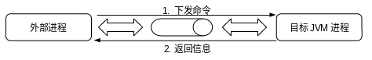

# Attach 机制

# 1 概述

**连接机制（Attach Mechanism）**：虚拟机通过这种技术为监控程序访问虚拟机进程提供了可能。

**连接（Attach）到目标JVM上的过程的本质**就是建立一个进程间的通信通道，通过通道，由客户进程向JVM进程下发命令，JVM进程向客户进行返回数据的过程。



在不同的操作系统上，某些细节可能会有差别，但**连接机制的总体思路是一致**的：由虚拟机本身提供连接接口，一旦有外部程序连接进来，则在双方之间建立通信通道。外部程序可以向虚拟机进程下发命令，待虚拟机执行完命令，在通过这个通道返回结果。

# 2 AttachProvider与VirtualMachine

AttachProvider是连接功能的提供者。当与目标JVM建立连接后，有VirtualMachine向目标JVM发送命令。

在Oracle JDK的实现中，AttachProvider是由抽象类`com.sun.tools.attach.spi.AttachProvider`表示的。一个AttachProvider是拥有无参构造器并实现了抽象方法的AttachProvider类的具体子类。在实现上，它通常依赖与Java虚拟机的具体实现版本。也就是说，一个特定的AttachProvider通常只能够连接到一个特定版本的Java虚拟机上。

```java
package com.sun.tools.attach.spi;

import com.sun.tools.attach.AttachNotSupportedException;
import com.sun.tools.attach.AttachPermission;
import com.sun.tools.attach.VirtualMachine;
import com.sun.tools.attach.VirtualMachineDescriptor;
import java.io.IOException;
import java.io.PrintStream;
import java.util.ArrayList;
import java.util.Collections;
import java.util.Iterator;
import java.util.List;
import java.util.ServiceLoader;

public abstract class AttachProvider {
	private static final Object lock = new Object();
	private static List<AttachProvider> providers = null;

	protected AttachProvider() {
		SecurityManager localSecurityManager = System.getSecurityManager();
		if (localSecurityManager != null) {
			localSecurityManager.checkPermission(new AttachPermission("createAttachProvider"));
		}
	}

	public abstract String name();//AttachProvider名称，该名称通常对应一个虚拟机厂商，但这并不是必须的。

	public abstract String type();//AttachProvider类型，通常对应于不同的连接类型
    
	/*
	 用来实现连接到JVM，它需要在具体子类中实现
	 参数paramString用来标识虚拟机进程的标识符。
	 	如果此标识符不能被具体的AttachProvider正确解析，将抛出AttachNotSupportedException异常。
	 	当paramString被正确解析后，如果AttachProvider检测到与paramString对应的目标JVM不存在，或者目标JVM的类型或版本并不支持此AttachProvider连接机制，该方法抛出AttachNotSupportedException异常。
	*/ 
	public abstract VirtualMachine attachVirtualMachine(String paramString)
			throws AttachNotSupportedException, IOException;

	public VirtualMachine attachVirtualMachine(VirtualMachineDescriptor paramVirtualMachineDescriptor)
			throws AttachNotSupportedException, IOException {
		if (paramVirtualMachineDescriptor.provider() != this) {
			throw new AttachNotSupportedException("provider mismatch");
		}
		return attachVirtualMachine(paramVirtualMachineDescriptor.id());
	}

	public abstract List<VirtualMachineDescriptor> listVirtualMachines();
	// 尝试加载平台上以安装的所有attach provider，AttachProvider类实现加载并实例化在第一次调用此方法。
	public static List<AttachProvider> providers() {
		synchronized (lock) {
			if (providers == null) {
				providers = new ArrayList();

				ServiceLoader localServiceLoader = ServiceLoader.load(AttachProvider.class,
						AttachProvider.class.getClassLoader());

				Iterator localIterator = localServiceLoader.iterator();
				while (localIterator.hasNext()) {
					try {
						providers.add(localIterator.next());
					} catch (Throwable localThrowable) {
						if ((localThrowable instanceof ThreadDeath)) {
							ThreadDeath localThreadDeath = (ThreadDeath) localThrowable;
							throw localThreadDeath;
						}
						System.err.println(localThrowable);
					}
				}
			}
			return Collections.unmodifiableList(providers);
		}
	}
}
```

AttachProvider有自己的名称（name）和类型（type）：

- 名称（name）：
    - 该名称通常对应一个虚拟机厂商，但这并不是必须的。
    - 在Oracle JDK的实现中，名称统一为”sun“。
- 类型（type）：
    - 通常对应于不同的连接类型。
    - 在Solaris平台上，使用了有Solaris系统提供的进程间通信机制”doors“，故其连接类型为”doors“；
    - 在Windows平台上，其连接类型为”windows“；
    - 在Linux平台上，其连接类型为”socket“。

**名称和类型的作用**：在安装了多个AttachProvider的环境中起到区分作用。

AttachProvider类实现加载并实例化在第一次调用`public static List<AttachProvider> providers()`方法。此方法尝试加载平台上以安装的所有attach provider。

在AttachProvider类中所有方法都是线程安全的。

AttachProvider定义了抽象方法`public abstract VirtualMachine attachVirtualMachine(String paramString) throws AttachNotSupportedException, IOException;`，用来实现连接到JVM，它需要在具体子类中实现。

Linux平台上的AttachProvider具体实现为`sun.tools.attach.LinuxAttachProvider`。当程序视图连接目标JVM时，将执行`attachVirtualMachine(String paramString)`方法来达到这一目的。

```java
package sun.tools.attach;

import com.sun.tools.attach.AttachNotSupportedException;
import com.sun.tools.attach.VirtualMachine;
import com.sun.tools.attach.VirtualMachineDescriptor;
import java.io.IOException;

public class LinuxAttachProvider extends HotSpotAttachProvider {
	private static final String JVM_VERSION = "java.property.java.vm.version";

	public String name() {
		return "sun";
	}

	public String type() {
		return "socket";
	}

	public VirtualMachine attachVirtualMachine(String paramString) throws AttachNotSupportedException, IOException {
		checkAttachPermission();

		testAttachable(paramString);//测试目标JVM是否支持attach机制

		return new LinuxVirtualMachine(this, paramString);
	}

	public VirtualMachine attachVirtualMachine(VirtualMachineDescriptor paramVirtualMachineDescriptor)
			throws AttachNotSupportedException, IOException {
		if (paramVirtualMachineDescriptor.provider() != this) {
			throw new AttachNotSupportedException("provider mismatch");
		}
		if ((paramVirtualMachineDescriptor instanceof HotSpotAttachProvider.HotSpotVirtualMachineDescriptor)) {
			assert (((HotSpotAttachProvider.HotSpotVirtualMachineDescriptor) paramVirtualMachineDescriptor)
					.isAttachable());
			checkAttachPermission();
			return new LinuxVirtualMachine(this, paramVirtualMachineDescriptor.id());
		}
		return attachVirtualMachine(paramVirtualMachineDescriptor.id());
	}
}
```

在连接时必须考虑的一点是，目标JVM是否支持attach机制。这可以通过辅助类`sun.jvmstat.monitor.MonitoredVmUtil`的`public static boolean isAttachable(MonitoredVm paramMonitoredVm)`方法进行判断。若目标JVM并不支持连接，那么连接尝试将以失败告终，应用程序抛出AttachNotSupportedException异常。

若目标JVM支持连接机制，那么将顺利重建一个VirtualMachine对象供程序使用。VirtualMachine的作用是向目标JVM发送命令。`com.sun.tools.attach.VirtualMachine`类是抽象类，定义了一些公共的虚拟机操作。其子类，HotSpot虚拟机的`sun.tools.attach.HotSpotVirtualMachine`中定义了大部分功能：

- `void loadAgentLibrary(String paramString1, String paramString2)`：加载代理库
- `Properties getSystemProperties()`：获取系统属性
- `Properties getAgentProperties()`：获取代理属性
- `void localDataDump()`：获取本地数据
- `InputStream remoteDataDump(Object... paramVarArgs)`：获取远程数据
- `InputStream dumpHeap(Object... paramVarArgs)`：获取堆转储
- `InputStream heapHisto(Object... paramVarArgs)`：获取堆直方图
- `InputStream setFlag(String paramString1, String paramString2)`：设置命令行VM选项
- `InputStream printFlag(String paramString)`：打印命令行VM选项

```java
package sun.tools.attach;

import com.sun.tools.attach.AgentInitializationException;
import com.sun.tools.attach.AgentLoadException;
import com.sun.tools.attach.VirtualMachine;
import com.sun.tools.attach.spi.AttachProvider;
import java.io.IOException;
import java.io.InputStream;
import java.util.Properties;

public abstract class HotSpotVirtualMachine extends VirtualMachine {
	private static final int JNI_ENOMEM = -4;
	private static final int ATTACH_ERROR_BADJAR = 100;
	private static final int ATTACH_ERROR_NOTONCP = 101;
	private static final int ATTACH_ERROR_STARTFAIL = 102;

	HotSpotVirtualMachine(AttachProvider paramAttachProvider, String paramString) {
		super(paramAttachProvider, paramString);
	}

	private void loadAgentLibrary(String paramString1, boolean paramBoolean, String paramString2)
			throws AgentLoadException, AgentInitializationException, IOException {
		InputStream localInputStream = execute("load",
				new Object[]{paramString1, paramBoolean ? "true" : "false", paramString2});
		try {
			int i = readInt(localInputStream);
			if (i != 0) {
				throw new AgentInitializationException("Agent_OnAttach failed", i);
			}
		} finally {
			localInputStream.close();
		}
	}

	public void loadAgentLibrary(String paramString1, String paramString2)
			throws AgentLoadException, AgentInitializationException, IOException {
		loadAgentLibrary(paramString1, false, paramString2);
	}

	public void loadAgentPath(String paramString1, String paramString2)
			throws AgentLoadException, AgentInitializationException, IOException {
		loadAgentLibrary(paramString1, true, paramString2);
	}

	public void loadAgent(String paramString1, String paramString2)
			throws AgentLoadException, AgentInitializationException, IOException {
		String str = paramString1;
		if (paramString2 != null) {
			str = str + "=" + paramString2;
		}
		int i;
		try {
			loadAgentLibrary("instrument", str);
		} catch (AgentLoadException localAgentLoadException) {
			throw new InternalError("instrument library is missing in target VM");
		} catch (AgentInitializationException localAgentInitializationException) {
			i = localAgentInitializationException.returnValue();
			switch (i) {
				case -4 :
					throw new AgentLoadException("Insuffient memory");
			}
		}
		throw new AgentLoadException("Agent JAR not found or no Agent-Class attribute");

		throw new AgentLoadException("Unable to add JAR file to system class path");

		throw new AgentInitializationException("Agent JAR loaded but agent failed to initialize");

		throw new AgentLoadException("Failed to load agent - unknown reason: " + i);
	}

	public Properties getSystemProperties() throws IOException {
		InputStream localInputStream = null;
		Properties localProperties = new Properties();
		try {
			localInputStream = executeCommand("properties", new Object[0]);
			localProperties.load(localInputStream);
		} finally {
			if (localInputStream != null) {
				localInputStream.close();
			}
		}
		return localProperties;
	}

	public Properties getAgentProperties() throws IOException {
		InputStream localInputStream = null;
		Properties localProperties = new Properties();
		try {
			localInputStream = executeCommand("agentProperties", new Object[0]);
			localProperties.load(localInputStream);
		} finally {
			if (localInputStream != null) {
				localInputStream.close();
			}
		}
		return localProperties;
	}

	public void localDataDump() throws IOException {
		executeCommand("datadump", new Object[0]).close();
	}

	public InputStream remoteDataDump(Object... paramVarArgs) throws IOException {
		return executeCommand("threaddump", paramVarArgs);
	}

	public InputStream dumpHeap(Object... paramVarArgs) throws IOException {
		return executeCommand("dumpheap", paramVarArgs);
	}

	public InputStream heapHisto(Object... paramVarArgs) throws IOException {
		return executeCommand("inspectheap", paramVarArgs);
	}

	public InputStream setFlag(String paramString1, String paramString2) throws IOException {
		return executeCommand("setflag", new Object[]{paramString1, paramString2});
	}

	public InputStream printFlag(String paramString) throws IOException {
		return executeCommand("printflag", new Object[]{paramString});
	}

	public InputStream executeJCmd(String paramString) throws IOException {
		return executeCommand("jcmd", new Object[]{paramString});
	}

	abstract InputStream execute(String paramString, Object... paramVarArgs) throws AgentLoadException, IOException;

	private InputStream executeCommand(String paramString, Object... paramVarArgs) throws IOException {
		try {
			return execute(paramString, paramVarArgs);
		} catch (AgentLoadException localAgentLoadException) {
			throw new InternalError("Should not get here");
		}
	}

	int readInt(InputStream paramInputStream) throws IOException {
		StringBuilder localStringBuilder = new StringBuilder();

		byte[] arrayOfByte = new byte[1];
		int i;
		do {
			i = paramInputStream.read(arrayOfByte, 0, 1);
			if (i > 0) {
				char c = (char) arrayOfByte[0];
				if (c == '\n') {
					break;
				}
				localStringBuilder.append(c);
			}
		} while (i > 0);
		if (localStringBuilder.length() == 0) {
			throw new IOException("Premature EOF");
		}
		int j;
		try {
			j = Integer.parseInt(localStringBuilder.toString());
		} catch (NumberFormatException localNumberFormatException) {
			throw new IOException("Non-numeric value found - int expected");
		}
		return j;
	}

	private static long defaultAttachTimeout = 5000L;
	private volatile long attachTimeout;

	long attachTimeout() {
		if (attachTimeout == 0L) {
			synchronized (this) {
				if (attachTimeout == 0L) {
					try {
						String str = System.getProperty("sun.tools.attach.attachTimeout");

						attachTimeout = Long.parseLong(str);
					} catch (SecurityException localSecurityException) {
					} catch (NumberFormatException localNumberFormatException) {
					}
					if (attachTimeout <= 0L) {
						attachTimeout = defaultAttachTimeout;
					}
				}
			}
		}
		return attachTimeout;
	}
}
```

HotSpotVirtualMachine类的具体实现依赖于特定的操作系统平台，因此在不同的操作系统平台上，分别实现了具体的子类`<OSType>VirtualMechine`。其中`<OSType>`表示操作系统类型。如Linux平台上，具体子类为`sun.tools.attach.LinuxVirtualMachine`。

HotSpotVirtualMachine实现的各种功能具有一个共同点：均是通过调用`abstract InputStream execute(String paramString, Object... paramVarArgs)`函数向目标JVM发送命令，让JVM进程执行这些命令。这些功能函数只是下发命令，稍后我们将看到这些命令在何时何地得到真正的执行。

在LinuxVirtualMachine的构造函数中，将创建文件`/tmp/.java_pid<pid>`，Unix domain socket本身的实现机制需要去创建一个文件，通过这个文件来进行IPC（Inter-Process Communication，进程间通信）。

值得注意的是，在LinuxVirtualMachine类中中定义了一段加载attach静态函数，即：

```java
static {
    System.loadLibrary("attach");
}
```

这暗示了**加载attach的时机**：在创建LinuxVirtualMachine的实例对象的同时，便会将动态连接库attach加载进来。类似地，在WindowsVirtualMachine和SolarisVirtualMachine中也是用相同方式加载了attach库。

# 3 命令的下发：`execute()`

除了构造器，LinuxVirtualMachine类中最主要的是实现了`execute()`函数。`execute()`函数通过Socket与JVM进行进行通信。

```java
package sun.tools.attach;

import com.sun.tools.attach.AgentLoadException;
import com.sun.tools.attach.AttachNotSupportedException;
import com.sun.tools.attach.spi.AttachProvider;
import java.io.File;
import java.io.IOException;
import java.io.InputStream;
import java.io.UnsupportedEncodingException;

public class LinuxVirtualMachine extends HotSpotVirtualMachine {
	private static final String tmpdir = "/tmp";

	LinuxVirtualMachine(AttachProvider paramAttachProvider, String paramString)
			throws AttachNotSupportedException, IOException {
		super(paramAttachProvider, paramString);
		int i;
		try {
			i = Integer.parseInt(paramString);
		} catch (NumberFormatException localNumberFormatException) {
			throw new AttachNotSupportedException("Invalid process identifier");
		}
		path = findSocketFile(i);
		if (path == null) {
			File localFile = createAttachFile(i);
			try {
				if (isLinuxThreads) {
					try {
						k = getLinuxThreadsManager(i);
					} catch (IOException localIOException) {
						throw new AttachNotSupportedException(localIOException.getMessage());
					}
					assert (k >= 1);
					sendQuitToChildrenOf(k);
				} else {
					sendQuitTo(i);
				}
				int k = 0;
				long l = 200L;
				int m = (int) (attachTimeout() / l);
				do {
					try {
						Thread.sleep(l);
					} catch (InterruptedException localInterruptedException) {
					}
					path = findSocketFile(i);
					k++;
				} while ((k <= m) && (path == null));
				if (path == null) {
					throw new AttachNotSupportedException(
							"Unable to open socket file: target process not responding or HotSpot VM not loaded");
				}
			} finally {
				localFile.delete();
			}
		}
		checkPermissions(path);

		int j = socket();
		try {
			connect(j, path);
		} finally {
			close(j);
		}
	}

	public void detach() throws IOException {
		synchronized (this) {
			if (path != null) {
				path = null;
			}
		}
	}

	InputStream execute(String paramString, Object... paramVarArgs) throws AgentLoadException, IOException {
		assert (paramVarArgs.length <= 3);
		String str;
		synchronized (this) {
			if (path == null) {
				throw new IOException("Detached from target VM");
			}
			str = path;
		}
		int i = socket();//创建socket
		try {
			connect(i, str);//使用本地方法connect()连接此socket和java进程的socket
		} catch (IOException localIOException1) {
			close(i);
			throw localIOException1;
		}
		Object localObject2 = null;
        // 发送命令和参数
		try {
			writeString(i, "1");//写入状态码
			writeString(i, paramString);
			for (int j = 0; j < 3; j++) {
				if ((j < paramVarArgs.length) && (paramVarArgs[j] != null)) {
					writeString(i, (String) paramVarArgs[j]);
				} else {
					writeString(i, "");
				}
			}
		} catch (IOException localIOException2) {
			localObject2 = localIOException2;
		}
        // 创建套接子输入流
		SocketInputStream localSocketInputStream = new SocketInputStream(i);
		int k;
		try {
			k = readInt(localSocketInputStream);//读取返回码，如果为0，则表示通信成功，服务返回正常信息
		} catch (IOException localIOException3) {
			localSocketInputStream.close();
			if (localObject2 != null) {
				throw ((Throwable) localObject2);
			}
			throw localIOException3;
		}
		if (k != 0) {//
			localSocketInputStream.close();
			if (k == 101) {
				throw new IOException("Protocol mismatch with target VM");
			}
			if (paramString.equals("load")) {
				throw new AgentLoadException("Failed to load agent library");
			}
			throw new IOException("Command failed in target VM");
		}
		return localSocketInputStream;//如果返回码k为0，则把输入流返回给上层代码
	}

	private class SocketInputStream extends InputStream {
		int s;

		public SocketInputStream(int paramInt) {
			s = paramInt;
		}

		public synchronized int read() throws IOException {
			byte[] arrayOfByte = new byte[1];
			int i = read(arrayOfByte, 0, 1);
			if (i == 1) {
				return arrayOfByte[0] & 0xFF;
			}
			return -1;
		}

		public synchronized int read(byte[] paramArrayOfByte, int paramInt1, int paramInt2) throws IOException {
			if ((paramInt1 < 0) || (paramInt1 > paramArrayOfByte.length) || (paramInt2 < 0)
					|| (paramInt1 + paramInt2 > paramArrayOfByte.length) || (paramInt1 + paramInt2 < 0)) {
				throw new IndexOutOfBoundsException();
			}
			if (paramInt2 == 0) {
				return 0;
			}
			return LinuxVirtualMachine.read(s, paramArrayOfByte, paramInt1, paramInt2);
		}

		public void close() throws IOException {
			LinuxVirtualMachine.close(s);
		}
	}

	private String findSocketFile(int paramInt) {
		File localFile = new File("/tmp", ".java_pid" + paramInt);
		if (!localFile.exists()) {
			return null;
		}
		return localFile.getPath();
	}

	private File createAttachFile(int paramInt) throws IOException {
		String str1 = ".attach_pid" + paramInt;
		String str2 = "/proc/" + paramInt + "/cwd/" + str1;
		File localFile = new File(str2);
		try {
			localFile.createNewFile();
		} catch (IOException localIOException) {
			localFile = new File("/tmp", str1);
			localFile.createNewFile();
		}
		return localFile;
	}

	private void writeString(int paramInt, String paramString) throws IOException {
		if (paramString.length() > 0) {
			try {
				arrayOfByte = paramString.getBytes("UTF-8");
			} catch (UnsupportedEncodingException localUnsupportedEncodingException) {
				throw new InternalError();
			}
			write(paramInt, arrayOfByte, 0, arrayOfByte.length);
		}
		byte[] arrayOfByte = new byte[1];
		arrayOfByte[0] = 0;
		write(paramInt, arrayOfByte, 0, 1);
	}

	static native boolean isLinuxThreads();

	static native int getLinuxThreadsManager(int paramInt) throws IOException;

	static native void sendQuitToChildrenOf(int paramInt) throws IOException;

	static native void sendQuitTo(int paramInt) throws IOException;

	static native void checkPermissions(String paramString) throws IOException;

	static native int socket() throws IOException;

	static native void connect(int paramInt, String paramString) throws IOException;

	static native void close(int paramInt) throws IOException;

	static native int read(int paramInt1, byte[] paramArrayOfByte, int paramInt2, int paramInt3) throws IOException;

	static native void write(int paramInt1, byte[] paramArrayOfByte, int paramInt2, int paramInt3) throws IOException;

	static {
		System.loadLibrary("attach");
	}

	static boolean isLinuxThreads = isLinuxThreads();
	String path;
	private static final String PROTOCOL_VERSION = "1";
	private static final int ATTACH_ERROR_BADVERSION = 101;
}
```

`execute()`函数接收两个参数：表示具体虚拟机命令的String类型参数paramString，以及变长参数列表paramVarArgs。函数返回InputStream。一下是常见的虚拟机命令：

|                方法 | 命令（cmd）       | 执行功能           |
| ------------------: | ----------------- | :----------------- |
|    loadAgentLibrary | “load”            | 加载agent库        |
| getSystemProperties | “properties”      | 发送properties命令 |
|  getAgentProperties | “agentProperties” | 发送properties命令 |
|       localDataDump | “datadump”        | SIGQUIT            |
|      remoteDataDump | “threaddump”      | 远程ctrl-break     |
|            dumpHeap | “dumpheap”        | 远程heap dump      |
|           heapHisto | “inspectheap”     | 堆直方图           |
|             setFlag | “setflag”         | 设置命令行flag     |
|           printFlag | “printflag”       | 输出命令行flag     |

# 4 命令的执行：Attach Listener守护线程

**Attach Listener线程的创建**：在JVM启动时创建守护线程“Signal Dispacher”，当我们执行attach方法时，会向目标JVM进程发出SIGQUIT信号，虚拟机收到这个信号之后就会创建Attach Listener线程了。

位置：`openjdk-8-src-b132-03_mar_2014/openjdk/hotspot/src/share/vm/services/attachListener.cpp`

```c++
// Table to map operation names to functions.

// names must be of length <= AttachOperation::name_length_max
static AttachOperationFunctionInfo funcs[] = {
  { "agentProperties",  get_agent_properties },
  { "datadump",         data_dump },
  { "dumpheap",         dump_heap },
  { "load",             JvmtiExport::load_agent_library },
  { "properties",       get_system_properties },
  { "threaddump",       thread_dump },
  { "inspectheap",      heap_inspection },
  { "setflag",          set_flag },
  { "printflag",        print_flag },
  { "jcmd",             jcmd },
  { NULL,               NULL }
};
```

待JVM执行完毕后，将返回响应的信息给调用方。最终，由外部程序得到期望的数据。