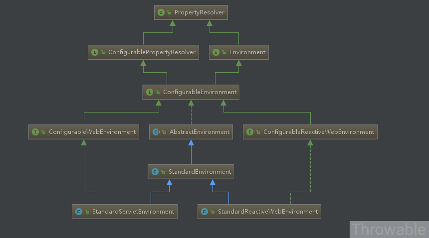

# Environment

`org.springframework.core.env.Environment`是当前应用运行环境的公开接口，主要包括应用程序运行环境的两个关键方面：配置文件(profiles)和属性。Environment继承自接口PropertyResolver，而PropertyResolver提供了属性访问的相关方法。这篇文章从源码的角度分析Environment的存储容器和加载流程，然后基于源码的理解给出一个生产级别的扩展。

Environment体系：

- PropertyResolver：提供属性访问功能。
- ConfigurablePropertyResolver：继承自PropertyResolver，主要提供属性类型转换(基于org.springframework.core.convert.ConversionService)功能。
- Environment：继承自PropertyResolver，提供访问和判断profiles的功能。
- ConfigurableEnvironment：继承自ConfigurablePropertyResolver和Environment，并且提供设置激活的profile和默认的profile的功能。
- ConfigurableWebEnvironment：继承自ConfigurableEnvironment，并且提供配置Servlet上下文和Servlet参数的功能。
- AbstractEnvironment：实现了ConfigurableEnvironment接口，默认属性和存储容器的定义，并且实现了ConfigurableEnvironment种的方法，并且为子类预留可覆盖了扩展方法。
- StandardEnvironment：继承自AbstractEnvironment，非Servlet(Web)环境下的标准Environment实现。
- StandardServletEnvironment：继承自StandardEnvironment，Servlet(Web)环境下的标准Environment实现。