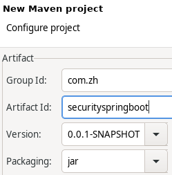
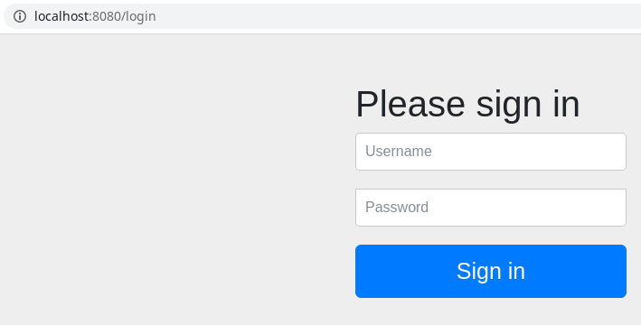
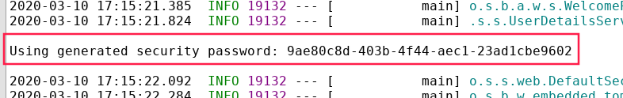
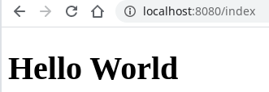

# Spring Boot整合Spring Security

# 1 Security简介
Java主要有两个安全框架：Spring Security 和Shiro。

Shiro是一个轻量级的框架，用的比较多。Spring Security是一个相对重量级的框架，功能比Shiro强大很多。

## 1.1 Spring Security主要功能

- **认证**：辨识登录用户身份
- **授权**：设置登录用户的权限
- **攻击防护**：防止伪造身份

## 1.2 Spring Security过滤器链

Spring Security的核心就是一组过滤器链，项目启动后将会自动配置。

Basic Authentication Filter 用来认证用户的身份，一个在Spring Security中一种过滤器处理一种认证方式。

# 2 入门案例
## 2.1 新建Maven project


初始pom文件内容：

```xml
<project xmlns="http://maven.apache.org/POM/4.0.0" xmlns:xsi="http://www.w3.org/2001/XMLSchema-instance" xsi:schemaLocation="http://maven.apache.org/POM/4.0.0 https://maven.apache.org/xsd/maven-4.0.0.xsd">
  <modelVersion>4.0.0</modelVersion>
  <groupId>com.zh</groupId>
  <artifactId>securityspringboot</artifactId>
  <version>0.0.1-SNAPSHOT</version>
</project>
```

## 2.2 pom加入依赖

在Spring Boot项目添加了spring security依赖后，所有的地址都被spring security所控制。

```xml
<parent>
  <groupId>org.springframework.boot</groupId>
  <artifactId>spring-boot-parent</artifactId>
  <version>2.2.5.RELEASE</version>
</parent>
<dependencies>
  <dependency>
    <groupId>org.springframework.boot</groupId>
    <artifactId>spring-boot-starter-web</artifactId>
  </dependency>
  <dependency>
    <groupId>org.springframework.boot</groupId>
    <artifactId>spring-boot-starter-thymeleaf</artifactId>
  </dependency>
  <dependency>
    <groupId>org.springframework.boot</groupId>
    <artifactId>spring-boot-starter-security</artifactId>
  </dependency>
</dependencies>
```

## 2.3 创建Handler

```java
package com.zh.securityspringboot.controller;

import org.springframework.stereotype.Controller;
import org.springframework.web.bind.annotation.GetMapping;

@Controller
public class HelloHandler {
	@GetMapping("/index")
	public String index() {
		return "index";
	}
}
```

## 2.4 创建index.html
位置：`/securityspringboot/src/main/resources/templates/index.html`
```html
<!DOCTYPE html>
<html>
<head>
<meta charset="UTF-8">
<title>title</title>
</head>
<body>
	<h1>Hello World</h1>
</body>
</html>
```

## 2.5 创建配置文件application.html

```yaml
spring:
  thymeleaf:
    prefix: classpath:/templates/
    suffix: .html
```

## 2.6 创建启动类

```java
package com.zh.securityspringboot;

import org.springframework.boot.SpringApplication;
import org.springframework.boot.autoconfigure.SpringBootApplication;

@SpringBootApplication
public class Application {
	public static void main(String[] args) throws Exception {
		SpringApplication.run(Application.class, args);
	}
}
```

## 2.7 测试Security的整合效果

1. 以Spring Boot App的方式启动项目。
1. 访问测试接口（[http://localhost:8080/index](http://localhost:8080/login)）
   1. 发现页面直接跳转到了登录页面（[http://localhost:8080/login](http://localhost:8080/login)）
   1. 
   1. 这个页面是security提供的登录页面，并不是我们自己定义的。
   1. 用户名默认是user，密码是自动生成的，会在会在项目控制台打印出来：`Using generated security password: 9ae80c8d-403b-4f44-aec1-23ad1cbe9602`
   1. 
3. 使用Security用户名和密码登录之后，便可以显出出来我们访问的页面了。
   1. 

## 2.8 自定义用户名和密码
需要在application.yml文件中加入相应配置：

```yaml
spring:
  thymeleaf:
    prefix: classpath:/templates/
    suffix: .html
  security:
    user:
      name: admin
      password: 123456
```

# 3 Security权限管理
定义两个 HTML 资源： `index.html`、 `admin.html`，同时定义两个角色 ADMIN 和 USER， ADMIN 拥有访问 `index.html `和 `admin.html` 的权限， USER 只有访问` index.html `的权限。

## 3.1 创建权限配置类

WebSecurityConfigurerAdapter 提供了一种便利的方式去创建 WebSecurityConfigurer的实例，只需要重写 WebSecurityConfigurerAdapter 的方法，即可配置拦截什么URL、设置什么权限等安全控制。

```java
package com.zh.securityspringboot.config;

import org.springframework.context.annotation.Configuration;
import org.springframework.security.config.annotation.authentication.builders.AuthenticationManagerBuilder;
import org.springframework.security.config.annotation.web.builders.HttpSecurity;
import org.springframework.security.config.annotation.web.configuration.EnableWebSecurity;
import org.springframework.security.config.annotation.web.configuration.WebSecurityConfigurerAdapter;

@Configuration
@EnableWebSecurity
public class SecurityConfig extends WebSecurityConfigurerAdapter {
	//设置用户和角色的关系
	@Override
	protected void configure(AuthenticationManagerBuilder auth) throws Exception {
		auth.inMemoryAuthentication().passwordEncoder(new MyPasswordEncoder())//自定义密码编码处理类
			.withUser("user").password(new MyPasswordEncoder().encode("000")).roles("USER")
			.and()
			.withUser("admin").password(new MyPasswordEncoder().encode("123")).roles("ADMIN", "USER");
	}

	//设置角色和权限的关系
	@Override
	protected void configure(HttpSecurity http) throws Exception {
		http.authorizeRequests().antMatchers("/admin").hasRole("ADMIN")
				.antMatchers("/index").access("hasRole('ADMIN') or hasRole('USER')")
				.anyRequest().authenticated()	//上边的请求开启权限认证
				.and()
				.formLogin()
				.loginPage("/login")	//配置自定义的登录页面
				.permitAll()	//登录页面不需要权限认证
				.and()
				.logout().permitAll()	//退出连接不需要权限认证
				.and()
				.csrf().disable();	//禁用csrf
	}
}
```

### 3.1.1 final类HttpSecurity常用方法

|                                                         方法 | 说明                                                         |
| -----------------------------------------------------------: | ------------------------------------------------------------ |
|          `OpenIDLoginConfigurer<HttpSecurity> openidLogin()` | 用于基于 OpenId 的验证                                       |
|                  `HeadersConfigurer<HttpSecurity> headers()` | 将安全标头添加到响应                                         |
|                  `HeadersConfigurer<HttpSecurity> headers()` | 配置跨域资源共享（ CORS ）                                   |
| `SessionManagementConfigurer<HttpSecurity> sessionManagement()` | 允许配置会话管理                                             |
|            `PortMapperConfigurer<HttpSecurity> portMapper()` | 允许配置一个`PortMapper(HttpSecurity#(getSharedObject(class)))`，其他提供SecurityConfigurer的对象使用 PortMapper 从 HTTP 重定向到 HTTPS 或者从 HTTPS 重定向到 HTTP。默认情况下，Spring Security使用一个PortMapperImpl映射 HTTP 端口8080到 HTTPS 端口8443，HTTP 端口80到 HTTPS 端口443 |
|                          `JeeConfigurer<HttpSecurity> jee()` | 配置基于容器的预认证。在这种情况下，认证由Servlet容器管理    |
|                        `X509Configurer<HttpSecurity> x509()` | 配置基于x509的认证                                           |
|            `RememberMeConfigurer<HttpSecurity> rememberMe()` | 允许配置“记住我”的验证                                       |
| `ExpressionUrlAuthorizationConfigurer<HttpSecurity>.ExpressionInterceptUrlRegistry authorizeRequests()` | 允许基于使用HttpServletRequest限制访问                       |
|        `RequestCacheConfigurer<HttpSecurity> requestCache()` | 允许配置请求缓存                                             |
| `ExceptionHandlingConfigurer<HttpSecurity> exceptionHandling()` | 允许配置错误处理                                             |
|  `SecurityContextConfigurer<HttpSecurity> securityContext()` | 在HttpServletRequests之间的SecurityContextHolder上设置SecurityContext的管理。 当使用WebSecurityConfigurerAdapter时，这将自动应用 |
|            `ServletApiConfigurer<HttpSecurity> servletApi()` | 将HttpServletRequest方法与在其上找到的值集成到SecurityContext中。 当使用WebSecurityConfigurerAdapter时，这将自动应用 |
|                        `CsrfConfigurer<HttpSecurity> csrf()` | 添加 CSRF 支持，使用WebSecurityConfigurerAdapter时，默认启用 |
|                    `LogoutConfigurer<HttpSecurity> logout()` | 添加退出登录支持。当使用WebSecurityConfigurerAdapter时，这将自动应用。默认情况是，访问URL”/ logout”，使HTTP Session无效来清除用户，清除已配置的任何#rememberMe()身份验证，清除SecurityContextHolder，然后重定向到”/login?success” |
|              `AnonymousConfigurer<HttpSecurity> anonymous()` | 允许配置匿名用户的表示方法。 当与WebSecurityConfigurerAdapter结合使用时，这将自动应用。 默认情况下，匿名用户将使用org.springframework.security.authentication.AnonymousAuthenticationToken表示，并包含角色 “ROLE_ANONYMOUS” |
|              `FormLoginConfigurer<HttpSecurity> formLogin()` | 指定支持基于表单的身份验证。如果未指定`FormLoginConfigurer#loginPage(String)`，则将生成默认登录页面 |
|          `OAuth2LoginConfigurer<HttpSecurity> oauth2Login()` | 根据外部OAuth 2.0或OpenID Connect 1.0提供程序配置身份验证    |
| `ChannelSecurityConfigurer<HttpSecurity>.ChannelRequestMatcherRegistry requiresChannel()` | 配置通道安全。为了使该配置有用，必须提供至少一个到所需信道的映射 |
|              `HttpBasicConfigurer<HttpSecurity> httpBasic()` | 配置 Http Basic 验证                                         |
| `HttpSecurity addFilterAt(Filter filter, Class<? extends Filter> atFilter)` | 在atFilter的位置添加filter。                                 |
| `HttpSecurity addFilterBefore(Filter filter, Class<? extends Filter> beforeFilter)` | 在beforeFilter前边的位置添加filter。                         |
| `HttpSecurity addFilterAfter(Filter filter, Class<? extends Filter> afterFilter)` | 在afterFilter后边的位置添加filter。                          |

## 3.2 创建MyPasswordEncoder

这个类的目的就是对密码进行编码
```java
package com.zh.securityspringboot.config;

import org.springframework.security.crypto.password.PasswordEncoder;

public class MyPasswordEncoder implements PasswordEncoder{

	public String encode(CharSequence rawPassword) {
		return rawPassword.toString();
	}

	public boolean matches(CharSequence rawPassword, String encodedPassword) {
		return encodedPassword.equals(rawPassword.toString());
	}

}
```

## 3.3 修改Handler

```java
package com.zh.securityspringboot.controller;

import org.springframework.stereotype.Controller;
import org.springframework.web.bind.annotation.GetMapping;

@Controller
public class HelloHandler {
	@GetMapping("/index")
	public String index() {
		return "index";
	}

	@GetMapping("/admin")
	public String admin() {
		return "admin";
	}

	@GetMapping("/login")
	public String login() {
		return "login";
	}
}
```

## 3.4 login.html

```html
<!DOCTYPE html>
<html xmlns:th="http://www.thymeleaf.org">
<html lang="en">
<head>
<meta charset="UTF-8">
<title>Title</title>
</head>
<body>
	<form th:action="@{/login}" method="post">
		用户名： <input type="text" name="username" /><br /> 
		密码： <input type="text" name="password" /><br /> 
		<input type="submit" value="登录" />
	</form>
</body>
</html>
```

## 3.5 admin.html

```html
<!DOCTYPE html>
<html lang="en">
<html>
<head>
<meta charset="UTF-8">
<title>Insert title here</title>
</head>
<body>
	<h1>后台管理系统</h1>
	<form action="/logout" method="post">
		<input type="submit" value="退出" />
	</form>
</body>
</html>
```

## 3.6 index.html改造

```html
<!DOCTYPE html>
<html>
<head>
<meta charset="UTF-8">
<title>title</title>
</head>
<body>
	<h1>Hello World</h1>
	<form action="/logout" method="post">
		<input type="submit" value="退出" />
	</form>
</body>
</html>
```

