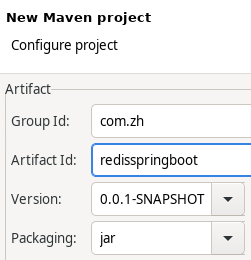

# Spring Boot 整合Spring Data Redis

# 1 概述

## 1.1 Redis概述

Redis简介、安装和集群搭建参见：[https://www.yuque.com/zhishan/bttt5g/uweqhq](https://www.yuque.com/zhishan/bttt5g/uweqhq)<br />java中使用Redis以及Redis与Spring整合参见：[https://www.yuque.com/zhishan/bttt5g/wmdrk2](https://www.yuque.com/zhishan/bttt5g/wmdrk2)

## 1.2 Spring Data Redis概述

Spring-data-redis是spring大家族的一部分，提供了在srping应用中通过简单的配置访问redis服务，对reids底层开发包(Jedis,  JRedis, and RJC)进行了高度封装，RedisTemplate提供了redis各种操作、异常处理及序列化，支持发布订阅，并对spring 3.1 cache进行了实现。

### 1.2.1 Jedis客户端在编程实施方面存在的不足

1. connection管理缺乏自动化，connection-pool的设计缺少必要的容器支持。
2. 数据操作需要关注“序列化”/“反序列化”，因为jedis的客户端API接受的数据类型为string和byte，对结构化数据(json,xml,pojo等)操作需要额外的支持。
3. 事务操作纯粹为硬编码。
4. pub/sub（Redis发布-订阅模式）功能，缺乏必要的设计模式支持，对于开发者而言需要关注的太多。

### 1.2.2 Spring Data Redis针对Jedis提供的功能

- 连接池自动管理，提供了一个高度封装的“RedisTemplate”类。

- 针对jedis客户端中大量api进行了归类封装，将同一类型操作封装为Operation接口：
  - ValueOperations：简单K-V操作
  - SetOperations：set类型数据操作
  - ZSetOperations：zset类型数据操作
  - HashOperations：针对map类型的数据操作
  - ListOperations：针对list类型的数据操作
- 提供了对key的“bound”(绑定)便捷化操作API，可以通过bound封装指定的key，然后进行一系列的操作而无须“显式”的再次指定Key，即BoundKeyOperations：
  - BoundValueOperations
  - BoundSetOperations
  - BoundListOperations
  - BoundSetOperations
  - BoundHashOperations
- 将事务操作封装，有容器控制。
- 针对数据的“序列化/反序列化”，提供了多种可选择策略(RedisSerializer)
  - JdkSerializationRedisSerializer：
    - POJO对象的存取场景，使用JDK本身序列化机制，将pojo类通过ObjectInputStream/ObjectOutputStream进行序列化操作，最终redis-server中将存储字节序列。
    - 是目前最常用的序列化策略。
  - StringRedisSerializer：
    - Key或者value为字符串的场景，根据指定的charset对数据的字节序列编码成string，是“new String(bytes, charset)”和“string.getBytes(charset)”的直接封装。
    - 是最轻量级和高效的策略。
  - JacksonJsonRedisSerializer：
    - jackson-json工具提供了javabean与json之间的转换能力，可以将pojo实例序列化成json格式存储在redis中，也可以将json格式的数据转换成pojo实例。
    - 因为jackson工具在序列化和反序列化时，需要明确指定Class类型，因此此策略封装起来稍微复杂。【需要jackson-mapper-asl工具支持】
    - 针对“序列化和发序列化”中JdkSerializationRedisSerializer和StringRedisSerializer是最基础的策略，原则上，我们可以将数据存储为任何格式以便应用程序存取和解析(其中应用包括app，hadoop等其他工具)，不过在设计时仍然不推荐直接使用“JacksonJsonRedisSerializer”和“OxmSerializer”，因为无论是json还是xml，他们本身仍然是String。如果你的数据需要被第三方工具解析，那么数据应该使用StringRedisSerializer而不是JdkSerializationRedisSerializer。如果你的数据格式必须为json或者xml，那么在编程级别，在redisTemplate配置中仍然使用StringRedisSerializer，在存储之前或者读取之后，使用“SerializationUtils”工具转换转换成json或者xml
  - OxmSerializer：
    - 提供了将javabean与xml之间的转换能力，目前可用的三方支持包括jaxb，apache-xmlbeans；redis存储的数据将是xml工具。不过使用此策略，编程将会有些难度，而且效率最低；不建议使用。【需要spring-oxm模块的支持】
- 基于设计模式，和JMS开发思路，将pub/sub的API设计进行了封装，使开发更加便捷。
- spring-data-redis中，并没有对sharding提供良好的封装，如果你的架构是基于sharding，那么你需要自己去实现，这也是sdr和jedis相比，唯一缺少的特性。

# 2 入门案例
## 2.1 新建Maven project


初始pom文件内容：

```xml
<project xmlns="http://maven.apache.org/POM/4.0.0" xmlns:xsi="http://www.w3.org/2001/XMLSchema-instance" xsi:schemaLocation="http://maven.apache.org/POM/4.0.0 https://maven.apache.org/xsd/maven-4.0.0.xsd">
  <modelVersion>4.0.0</modelVersion>
  <groupId>com.zh</groupId>
  <artifactId>redisspringboot</artifactId>
  <version>0.0.1-SNAPSHOT</version>
</project>
```

## 2.2 pom文件引入依赖

```xml
<parent>
  <groupId>org.springframework.boot</groupId>
  <artifactId>spring-boot-parent</artifactId>
  <version>2.2.5.RELEASE</version>
</parent>
<dependencies>
  <dependency>
    <groupId>org.springframework.boot</groupId>
    <artifactId>spring-boot-starter-web</artifactId>
  </dependency>
  <dependency>
    <groupId>org.springframework.boot</groupId>
    <artifactId>spring-boot-starter-data-redis</artifactId>
  </dependency>
  <dependency>
    <groupId>org.apache.commons</groupId>
    <artifactId>commons-pool2</artifactId>
  </dependency>
</dependencies>
```

## 2.3 创建实体类
实体类需要实现序列化接口：`java.io.Serializable`
```java
package com.zh.redisspringboot.entity;

import java.io.Serializable;
import java.util.Date;

public class Student implements Serializable{
	private Long id;
	private String name;
	private Long score;
	private Date birthday;
	public Student() {
		super();
	}
	public Student(Long id, String name, Long score, Date birthday) {
		super();
		this.id = id;
		this.name = name;
		this.score = score;
		this.birthday = birthday;
	}
	public Long getId() {
		return id;
	}
	public void setId(Long id) {
		this.id = id;
	}
	public String getName() {
		return name;
	}
	public void setName(String name) {
		this.name = name;
	}
	public Long getScore() {
		return score;
	}
	public void setScore(Long score) {
		this.score = score;
	}
	public Date getBirthday() {
		return birthday;
	}
	public void setBirthday(Date birthday) {
		this.birthday = birthday;
	}
}
```

## 2.4 创建StudentHandler
注意：这里用key为stu存到redis，但是从终端连接redis查询发现没有这个key，是因为spring data redis对可以进行了序列化，redis库里边的key和stu是有区别的。
```java
package com.zh.redisspringboot.controller;

import org.springframework.beans.factory.annotation.Autowired;
import org.springframework.data.redis.core.RedisTemplate;
import org.springframework.web.bind.annotation.GetMapping;
import org.springframework.web.bind.annotation.PathVariable;
import org.springframework.web.bind.annotation.PostMapping;
import org.springframework.web.bind.annotation.RequestBody;
import org.springframework.web.bind.annotation.RestController;
import com.zh.redisspringboot.entity.Student;

@RestController
public class StudentHandler {
	
	@Autowired
	private RedisTemplate redisTemplate;
	@PostMapping("/set")
	public void set(@RequestBody Student student) {
		redisTemplate.opsForValue().set("stu", student);
	}
	@GetMapping("/get/{key}")
	public Student get(@PathVariable("key") String key) {
		return (Student)redisTemplate.opsForValue().get(key);
	}
	
	@GetMapping("/delete/{key}")
	public boolean delete(@PathVariable("key") String key) {
		redisTemplate.delete(key);
		return redisTemplate.hasKey(key);
	}
}
```

## 2.7 创建配置文件application.yml

```yaml
spring:
  redis:
    database: 0
    host: localhost
    port: 6379
```

## 2.6 创建启动类

```java
package com.zh.redisspringboot;

import org.springframework.boot.SpringApplication;
import org.springframework.boot.autoconfigure.SpringBootApplication;

@SpringBootApplication
public class Application {
	public static void main(String[] args) throws Exception {
		SpringApplication.run(Application.class, args);
	}
}
```

# 3 RedisTemplate

## 3.1 