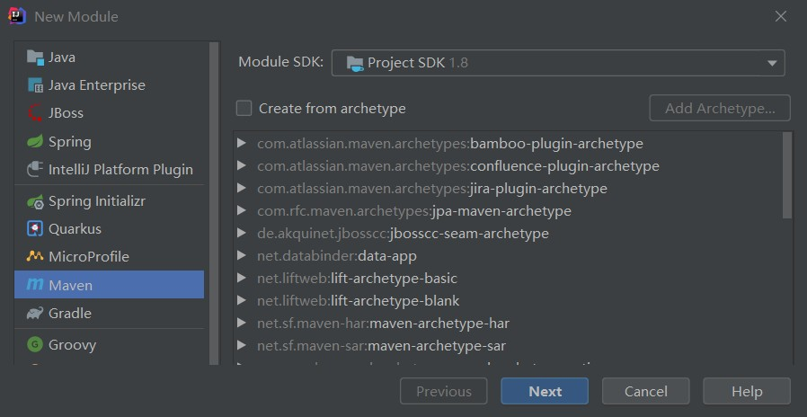
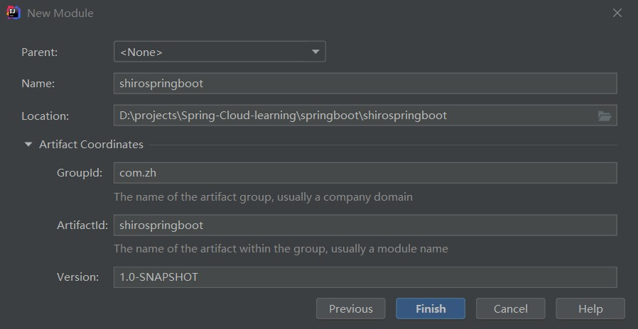

# Spring Boot整合Shiro

# 1 shiro 概述

Apache Shiro是一个功能强大、灵活的，开源的安全框架。它可以干净利落地处理身份验证、授权、企业会话管理和加密。

## 1.1 shiro的作用

- 验证用户身份
- 用户访问权限控制，比如：1、判断用户是否分配了一定的安全角色。2、判断用户是否被授予完成某个操作的权限
- 在非 web 或 EJB 容器的环境下可以任意使用Session API
- 可以响应认证、访问控制，或者 Session 生命周期中发生的事件
- 可将一个或以上用户安全数据源数据组合成一个复合的用户 “view”(视图)
- 支持单点登录(SSO)功能
- 支持提供“Remember Me”服务，获取用户关联信息而无需登录
  …

等等——都集成到一个有凝聚力的易于使用的API。

## 1.2 shiro的应用范围

Shiro 致力在所有应用环境下实现上述功能，小到命令行应用程序，大到企业应用中，而且不需要借助第三方框架、容器、应用服务器等。当然 Shiro 的目的是尽量的融入到这样的应用环境中去，但也可以在它们之外的任何环境下开箱即用。

## 1.3 shiro的特性


应用安全的四大基石:

- **Authentication（认证）：**用户身份识别，通常被称为用户“登录”
- **Authorization（授权）：**访问控制。比如某个用户是否具有某个操作的使用权限。
- **Session Management（会话管理）：**特定于用户的会话管理,甚至在非web 或 EJB 应用程序。
- **Cryptography（加密）：**在对数据源使用加密算法加密的同时，保证易于使用。

## 1.4 shiro的高级概述


在概念层，Shiro 架构包含三个主要的理念：

- Subject：当前用户，Subject 可以是一个人，但也可以是第三方服务、守护进程帐户、时钟守护任务或者其它–当前和软件交互的任何事件。
- SecurityManager：管理所有Subject，SecurityManager 是 Shiro 架构的核心，配合内部安全组件共同组成安全伞。
- Realms：用于进行权限信息的验证，需要自己实现。
  - Realm 本质上是一个特定的安全 DAO：它封装与数据源连接的细节，得到Shiro 所需的相关的数据。在配置 Shiro 的时候，你必须指定至少一个Realm 来实现认证（authentication）和/或授权（authorization）。

# 2 整合

## 2.1 新建简单Maven project





初始pom文件内容：

```xml
<?xml version="1.0" encoding="UTF-8"?>
<project xmlns="http://maven.apache.org/POM/4.0.0"
         xmlns:xsi="http://www.w3.org/2001/XMLSchema-instance"
         xsi:schemaLocation="http://maven.apache.org/POM/4.0.0 http://maven.apache.org/xsd/maven-4.0.0.xsd">
    <modelVersion>4.0.0</modelVersion>

    <groupId>com.zh</groupId>
    <artifactId>shirospringboot</artifactId>
    <version>1.0-SNAPSHOT</version>
</project>
```

## 2.2 pom加入依赖

```xml
<parent>
    <groupId>org.springframework.boot</groupId>
    <artifactId>spring-boot-parent</artifactId>
    <version>2.2.5.RELEASE</version>
</parent>
<dependencies>
    <dependency>
        <groupId>org.springframework.boot</groupId>
        <artifactId>spring-boot-starter-web</artifactId>
    </dependency>
    <dependency>
        <groupId>org.springframework.boot</groupId>
        <artifactId>spring-boot-starter-thymeleaf</artifactId>
    </dependency>
    <dependency>
        <groupId>org.apache.shiro</groupId>
        <artifactId>shiro-spring</artifactId>
        <version>1.3.2</version>
    </dependency>
</dependencies>
```

