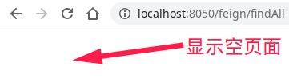

# Feign负载均衡和服务熔断

# 1 Feign简介
## 1.1 什么是 Feign
Feign是简化Java HTTP客户端开发的工具（java-to-httpclient-binder），它的灵感来自于Retrofit、JAXRS-2.0和WebSocket。Feign的初衷是降低统一绑定Denominator到HTTP API的复杂度，不区分是否为restful。

与 Ribbon 一样，Feign 也是由 Netflix 提供的，Feign 是一个声明式、模版化的 Web Service 客户端，它简化了开发者编写 Web 服务客户端的操作，开发者可以通过简单的接口和注解来调用 HTTP API，Spring Cloud Feign，它整合了 Ribbon 和 Hystrix，具有可插拔、基于注解、负载均衡、服务熔断等一系列便捷功能。

相比较于 Ribbon + RestTemplate 的方式，Feign 大大简化了代码的开发，Feign 支持多种注解，包括 Feign 注解、JAX-RS 注解、Spring MVC 注解等，Spring Cloud 对 Feign 进行了优化，整合了 Ribbon 和 Eureka，从而让 Feign 的使用更加方便。

## 1.2 Ribbon 和 Feign 的区别
Ribbon 是一个通用的 HTTP 客户端工具，Feign 是基于 Ribbon 实现的。

## 1.3 Feign 的特点

1. Feign 是一个声明式的 Web Service 客户端。
1. 支持 Feign 注解、Spring MVC 注解、JAX-RS 注解。
1. Feign 基于 Ribbon 实现，使用起来更加简单。
1. Feign 集成了 Hystrix，具备服务熔断的功能。

# 2 入门案例
## 2.1 创建Maven Module


初始pom内容：
```xml
<project xmlns="http://maven.apache.org/POM/4.0.0" xmlns:xsi="http://www.w3.org/2001/XMLSchema-instance" xsi:schemaLocation="http://maven.apache.org/POM/4.0.0 https://maven.apache.org/xsd/maven-4.0.0.xsd">
  <modelVersion>4.0.0</modelVersion>
  <parent>
    <groupId>com.zh</groupId>
    <artifactId>zhspringcloud-parent</artifactId>
    <version>0.0.1-SNAPSHOT</version>
  </parent>
  <artifactId>feign</artifactId>
</project>
```

## 2.2 pom引入依赖
```xml
<dependencies>
  <dependency>
    <groupId>org.springframework.cloud</groupId>
    <artifactId>spring-cloud-starter-netflix-eureka-client</artifactId>
    <version>2.2.2.RELEASE</version>
  </dependency>

  <dependency>
    <groupId>org.springframework.cloud</groupId>
    <artifactId>spring-cloud-starter-openfeign</artifactId>
    <version>2.2.2.RELEASE</version>
  </dependency>
</dependencies>
```

## 2.3 创建配置文件 application.yml
```yaml
server:
  port: 8050
spring:
  application:
    name: feign
eureka:
  client:
    service-url:
      defaultZone: http://localhost:8761/eureka/
  instance:
    prefer-ip-address: true
```

## 2.4 创建启动类
```java
package com.zh.feign;

import org.springframework.boot.SpringApplication;
import org.springframework.boot.autoconfigure.SpringBootApplication;
import org.springframework.cloud.openfeign.EnableFeignClients;

@SpringBootApplication
@EnableFeignClients
public class FeignApplication {
    public static void main(String[] args) {
        SpringApplication.run(FeignApplication.class,args);
    }
}
```
注解说明：

- `@EnableFeignClients` ：启用`feign`客户端


## 2.5 创建实体类
```java
package com.zh.feign.entity;

import lombok.AllArgsConstructor;
import lombok.Data;
import lombok.NoArgsConstructor;

@Data
@AllArgsConstructor
@NoArgsConstructor
public class Student {
	private long id;
    private String name;
    private int age;   
}

```

## 2.6 创建声明式接口
```java
package com.zh.feign.feign;

import org.springframework.cloud.openfeign.FeignClient;
import org.springframework.web.bind.annotation.GetMapping;

import com.zh.feign.entity.Student;

import java.util.Collection;

@FeignClient(value = "provider")
public interface FeignProviderClient {
    @GetMapping("/student/findAll")
    public Collection<Student> findAll();

    @GetMapping("/student/index")
    public String index();
    
    @RequestMapping(value="/student/{id}", method = RequestMethod.GET)
	public Student findById(@PathVariable("id") long id);
}
```
注解说明：

- `@FeignClient(value = "provider")`：
    - 定义服务提供者名字为`provider`的`feign`客户端
    - 如果微服务名provider有多个，如果访问此类中的接口，便会启用负载均衡，默认为轮询的策略。
- `@XxxMapping("/student/findAll")`：其中`/student/findAll`为服务提供者服务接口的映射地址。
- `@PathVariable("id")`：注解一定要指定参数名称，否则出错。
## 2.7 创建Handler
使用注解`@Autowired`使用上面所定义`feign`的客户端
```java
package com.zh.feign.controller;

import com.zh.feign.entity.Student;
import com.zh.feign.feign.FeignProviderClient;
import org.springframework.beans.factory.annotation.Autowired;
import org.springframework.web.bind.annotation.GetMapping;
import org.springframework.web.bind.annotation.RequestMapping;
import org.springframework.web.bind.annotation.RestController;

import java.util.Collection;

@RestController
@RequestMapping("/feign")
public class FeignHandler {

    @Autowired
    private FeignProviderClient feignProviderClient;

    @GetMapping("/findAll")
    public Collection<Student> findAll(){
        return feignProviderClient.findAll();
    }

    @GetMapping("/index")
    public String index(){
        return feignProviderClient.index();
    }
}
```

## 2.8 测试Feign负载均衡

1. 启动注册中心（eurekaserver）、以不同端口的方法（方法参见：《服务网关Zuul-测试Zuul负载均衡》）启动两个服务提供者（eurekaClient）。
1. 访问注册中心（http://localhost:8761/），查看服务注册情况。

a.
1. 启动feign，然后访问注册中心（http://localhost:8761/），查看服务注册情况。
  1. 
4. 调用feign的index接口（[http://localhost:8050/feign/index](http://localhost:8050/feign/index)）查看负载均衡情况
  1. 
  1. 
## 2.9 服务熔断
### 2.9.1 服务熔断的作用

- 解决部分微服务出现问题导致响应时间过长，致使整个微服务无法正常工作的问题。
  - 先把服务提供做都停掉，然后访问feign接口（[http://localhost:8050/feign/index](http://localhost:8050/feign/index)）
  -  
  - 这种网页对于用户来说不友好，我们应该使用熔断机制给一个友好的页面显示。
### 2.9.2 服务熔断的实现
#### 2.9.2.1 application.yml 添加熔断机制
```yaml
feign:
  hystrix:
    enabled: true
```
**注解说明：**

- `feign.hystrix.enabled` ：是否开启熔断器。

 添加熔断机制之后`application.yml`的全部配置信息：
```yaml
server:
  port: 8050
spring:
  application:
    name: feign
eureka:
  client:
    service-url:
      defaultZone: http://localhost:8761/eureka/
  instance:
    prefer-ip-address: true
feign:
  hystrix:
    enabled: true
```

#### 2.9.2.2 定义容错处理逻辑
创建 FeignProviderClient 接口的实现类 FeignError，定义容错处理逻辑，通过 `@Component`  注解将 FeignError 实例注入 IoC 容器中。
```java
package com.zh.feign.feign.impl;

import java.util.Collection;
import org.springframework.stereotype.Component;

import com.zh.feign.entity.Student;
import com.zh.feign.feign.FeignProviderClient;

@Component
public class FeignError implements FeignProviderClient{

	@Override
	public Collection<Student> findAll() {
		return null;
	}

	@Override
	public String index() {
		return "服务器维护中......";
	}
}
```

#### 2.9.2.3 设置FeignProviderClient降级处理方法
在 FeignProviderClient 定义处通过 `@FeignClient`  的 fallback 属性设置映射，设置降级处理方法。
```java
package com.zh.feign.feign;

import org.springframework.cloud.openfeign.FeignClient;
import org.springframework.web.bind.annotation.GetMapping;
import com.zh.feign.entity.Student;
import com.zh.feign.feign.impl.FeignError;
import java.util.Collection;

@FeignClient(value = "provider", fallback = FeignError.class)
public interface FeignProviderClient {
    @GetMapping("/student/findAll")
    public Collection<Student> findAll();

    @GetMapping("/student/index")
    public String index();
}
```

#### 2.9.2.4 测试Feign服务熔断

1. 依次启动注册中心（eurekaserver）、Feign项目（feign）。注意：不要启动服务提供者。
1. 访问注册中心（[http://localhost:8761/](http://localhost:8761/)），查看服务注册情况。
  1. 
3. 访问feign服务接口（[http://localhost:8050/feign/index](http://localhost:8050/feign/index)，[http://localhost:8050/feign/findAll](http://localhost:8050/feign/findAll)）查看服务熔断情况：
  1. 
  1. 
