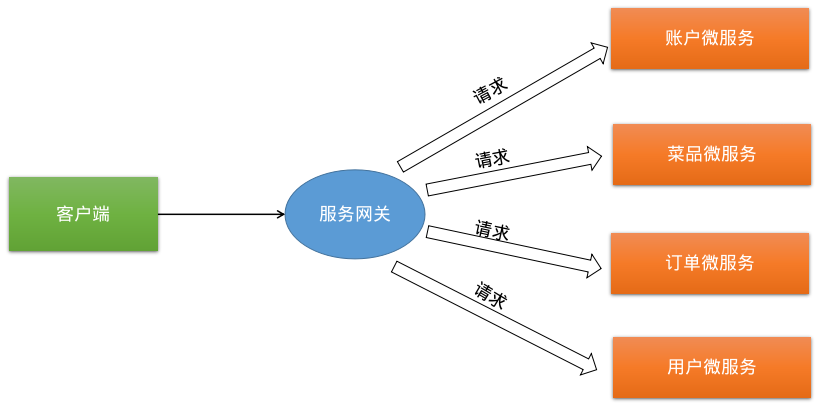
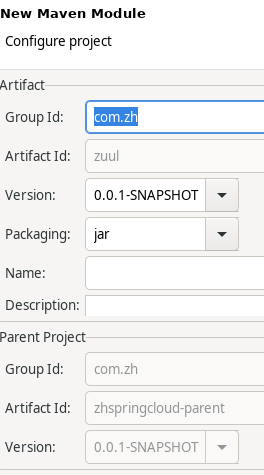
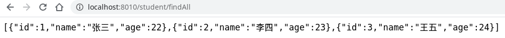
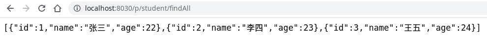
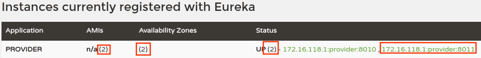

# 服务网关Zuul

# 1 服务网关介绍
网关相当于一个网络服务架构的入口，所有网络请求必须通过网关转发到具体的服务。

Spring Cloud 集成了 Zuul 组件，实现服务网关。


## 1.1 什么是Zuul
Zuul 是 Netflix 提供的一个开源的 API 网关服务器，是客户端和网站后端所有请求的中间层，对外开放一个 API，将所有请求导入统一的入口，屏蔽了服务端的具体实现逻辑，Zuul 可以实现反向代理的功能，在网关内部实现动态路由、身份认证、IP 过滤、数据监控等。

Zuul是对SpringCloud提供的成熟对的路由方案，他会根据请求的路径不同，网关会定位到指定的微服务，并代理请求到不同的微服务接口，他对外隐蔽了微服务的真正接口地址。

重要概念：

- 动态路由表：Zuul支持Eureka路由，手动配置路由，这俩种都支持自动更新
- 路由定位：根据请求路径，Zuul有自己的一套定位服务规则以及路由表达式匹配

- 反向代理：客户端请求到路由网关，网关受理之后，再对目标服务器发送请求，然后目标服务器的响应之后再发给客户端

Zuul可以和Eureka，Ribbon，Hystrix等组件配合使用。

## 1.2 网关和过滤器的区别

网关是对所有服务的请求进行分析过滤，过滤器是对单个服务而言。

## 1.3 常用网关框架有那些

- Nginx
- Zuul
- Gateway

## 1.4 Zuul与Nginx的区别

- Zuul是java语言实现的，主要为java服务提供网关服务，尤其在微服务架构中可以更加灵活的对网关进行操作。
- Nginx是使用C语言实现，性能高于Zuul，但是实现自定义操作需要熟悉lua语言，对程序员要求较高，可以使用Nginx做Zuul集群。
  - 使用Nginx的upstream设置Zuul服务集群，通过location拦截请求并转发到upstream，默认使用轮询机制对Zuul集群发送请求。

## 1.5 动态Zuul网关路由转发

通过path配置拦截请求，通过ServiceId到配置中心获取转发的服务列表，Zuul内部使用Ribbon实现本地负载均衡和转发。

# 2 入门案例
## 2.1 创建Maven Module项目

初始pom文件：

```xml
<project xmlns="http://maven.apache.org/POM/4.0.0" xmlns:xsi="http://www.w3.org/2001/XMLSchema-instance" xsi:schemaLocation="http://maven.apache.org/POM/4.0.0 https://maven.apache.org/xsd/maven-4.0.0.xsd">
  <modelVersion>4.0.0</modelVersion>
  <parent>
    <groupId>com.zh</groupId>
    <artifactId>zhspringcloud-parent</artifactId>
    <version>0.0.1-SNAPSHOT</version>
  </parent>
  <artifactId>zuul</artifactId>
</project>
```

## 2.2 pom增加zuul的依赖
`spring-cloud-starter-netflix-zuul` 项目也需要 `spring-cloud-starter-netflix-eureka-client` 进行注册，所以也要引入`spring-cloud-starter-netflix-eureka-client`。

```xml
<dependencies>
  <dependency>
    <groupId>org.springframework.cloud</groupId>
    <artifactId>spring-cloud-starter-netflix-eureka-client</artifactId>
    <version>2.2.2.RELEASE</version>
  </dependency>

  <dependency>
    <groupId>org.springframework.cloud</groupId>
    <artifactId>spring-cloud-starter-netflix-zuul</artifactId>
    <version>2.2.2.RELEASE</version>
  </dependency>
</dependencies>
```

## 2.3 创建配置文件 application.yml
位置：`/zuul/src/main/resources/application.yml`
```yaml
server:
  port: 8030
spring:
  application:
    name: gateway
eureka:
  client:
    service-url:
      defaultZone: http://localhost:8761/eureka/
zuul:
  routes:
    provider: /p/**
```
**属性说明：**

- `zuul.routes.provider` ：给服务提供者 provider 设置映射
  - 这里的provider是服务提供者的名称，此名称配置在服务提供者的配置文件`application.yml`中。
## 2.4 创建启动类
注意：网关项目的启动类不用加 `@SpringBootApplication` 注解。

```java
package com.zh.zuul;

import org.springframework.boot.SpringApplication;
import org.springframework.boot.autoconfigure.EnableAutoConfiguration;
import org.springframework.cloud.netflix.zuul.EnableZuulProxy;

@EnableZuulProxy
@EnableAutoConfiguration
public class ZuulApplication {
	public static void main(String[] args) {
		SpringApplication.run(ZuulApplication.class, args);
	}
}
```
**注解说明：**

- `@EnableZuulProxy` ：包含了 `@EnableZuulServer` ，设置该类是网关的启动类。
- `@EnableAutoConfiguration` ：可以帮助 Spring Boot 应用将所有符合条件的 `@Configuration`  配置加载到当前 Spring Boot 创建并使用的 IoC 容器中。
## 2.5 测试服务网关

1. 依次启动注册中心EurekaServer、服务提供者EurekaClient、启动网关zuul。
1. 访问注册中心（[http://localhost:8761/](http://localhost:8761/)），查看服务注册情况。
1. 访问服务提供者接口（[http://localhost:8010/student/findAll](http://localhost:8010/student/findAll)）。
  1. 
4. 通过网关访问服务提供者接口（[http://localhost:8030/p/student/findAll](http://localhost:8030/p/student/findAll)）。
  1. 
## 2.6 Zuul 自带了负载均衡功能，修改 provider 的代码
修改服务提供者接口，增加一个返回当前服务提供者端口号的方法。
`/eurekaClient/src/main/java/com/zh/eurekaclient/controller/StudentHandler.java` 增加内容如下：

```java
@Value("${server.port}")
private String port;
@GetMapping("/index")
public String index(){
    return "当前端口："+this.port;
}
```

`/eurekaClient/src/main/java/com/zh/eurekaclient/controller/StudentHandler.java` 完整内容如下：
```java
package com.zh.eurekaclient.controller;

import org.springframework.beans.factory.annotation.Autowired;
import org.springframework.beans.factory.annotation.Value;
import org.springframework.web.bind.annotation.*;

import com.zh.eurekaclient.entity.Student;
import com.zh.eurekaclient.repository.StudentRepository;

import java.util.Collection;

@RestController
@RequestMapping("/student")
public class StudentHandler {
    @Autowired
    private StudentRepository studentRepository;

    @Value("${server.port}")
    private String port;
    
    @GetMapping("/findAll")
    public Collection<Student> findAll(){
        return studentRepository.findAll();
    }

    @GetMapping("/findById/{id}")
    public Student findById(@PathVariable("id") long id){
        return studentRepository.findById(id);
    }

    @PostMapping("/save")
    public void save(@RequestBody Student student){
        studentRepository.saveOrUpdate(student);
    }

    @PutMapping("/update")
    public void update(@RequestBody Student student){
        studentRepository.saveOrUpdate(student);
    }

    @DeleteMapping("/deleteById/{id}")
    public void deleteById(@PathVariable("id") long id){
        studentRepository.deleteById(id);
    }
    
    @GetMapping("/index")
    public String index(){
        return "当前端口："+this.port;
    }
}
```

## 2.7 测试Zuul负载均衡

1. 启动注册中心eurekaserver、服务提供者eurekaClient。
1. 访问服务中心（[http://localhost:8761/](http://localhost:8761/)），查看服务注册情况。
  1. 
3. 等服务提供者eurekaClient启动完成之后，修改`application.yml`配置文件的服务端口号为8011.
3. 在服务提供者eurekaClient中复制一个启动类，该一下名字为`EurekaClientApplication2.java`，其他内容不变，然后启动这个启动类。
3. 访问服务中心（[http://localhost:8761/](http://localhost:8761/)），查看服务注册情况。
  1. 
6. 测试服务提供者eurekaClient返回端口号的接口（[http://localhost:8010/student/index](http://localhost:8010/student/index)，[http://localhost:8011/student/index](http://localhost:8011/student/index)）
  1. 
  1. 
7. 启动网关zuul，实现负载均衡。
7. 通过网关访问服务提供者eurekaClient中返回当前端口号的服务（[http://localhost:8030/p/student/index](http://localhost:8030/p/student/index)），查看负载均衡效果。
  1. 
  1. 

# 3 服务映射地址规则

## 3.1 服务名称映射

```yaml
zuul:
  routes: #配置路由映射
    provider: /p/** #给服务名称为provider的微服务做映射，映射地址为/p
```

## 3.2 path绑定映射

```yaml
zuul:
  routes: # 配置路由映射
    route-map1: # 只用保证唯一即可
      path: /p/** # 映射的路径
      serviceId: provider # 给服务名称为provider的微服务做映射
```

在zuul中启动Ribbon负载均衡：

```yaml
zuul:
  routes: #配置路由映射
    route-map1: #只用保证唯一即可
      path: /p/** #映射的路径
      serviceId: provider # 给服务名称为provider的微服务做映射
ribbon:
  eureka:
    enabled: false # 在eureka中禁用 ribbon 的负载均衡
provider: #给配置serviceId对应的服务指定ribbon负载均衡,从ListOfServers配置的地址中选择,多个逗号分隔
  ribbon:
    listOfServers: http://localhost:9001/,http://localhost:9002/
```

## 3.3 URL绑定映射

```yaml
zuul:
  routes: #配置路由映射
    route-map1: #只用保证唯一即可
      path: /p/** #映射的路径
      url: http://localhost:9000/
```

## 3.4 正则表达式映射

```java
package com.ithzk.spring.cloud;

import org.springframework.boot.SpringApplication;
import org.springframework.boot.autoconfigure.SpringBootApplication;
import org.springframework.cloud.netflix.zuul.EnableZuulProxy;
import org.springframework.cloud.netflix.zuul.filters.discovery.PatternServiceRouteMapper;
import org.springframework.context.annotation.Bean;

@SpringBootApplication
@EnableZuulProxy//启用 zuul,自带熔断
public class ZuulApp {
    public static void main( String[] args ) {
        SpringApplication.run(ZuulApp.class);
    }
    
    // 解析特定匹配路由
    @Bean
    public PatternServiceRouteMapper serviceRouteMapper() {
        return new PatternServiceRouteMapper(
                "(?<name>^.+)-(?<version>v.+$)",// 匹配服务名称格式为：provider-v1
                "${version}/${name}"); //匹配路径为：/v1/provider
    }
}
```


## 3.5 附加前缀映射

zuul可以为所有映射添加前缀，只需增加配置`zuul.prefix`，还可以通过`zuul.stripPrefix=false`去关闭`zuul.prefix`设置的前缀的行为。

例如，在正则表达式映射配置的基础之上增加前缀映射，映射的服务名称为：`provider-v1`，映射的路径为：`/prefix1/v1/provider`

```yaml
zuul:
  prefix: /prefix1 # 附加映射路径的前缀
```

## 3.6 过滤服务代理

Zuul可以自动去发现所有Eureka Server上注册的服务并且去代理，但是有些时候我们并不想让某个或者某些服务被Zuul代理。

```yaml
zuul:
  routes: # 配置路由映射
    provider: /p/** # 给服务名称为provider的微服务做映射, 映射地址为/p
  ignored-services: consumer # 多个不需要代理的服务以逗号分隔
```

# 4 Zuul错误处理

我们利用Zuul作为路由去转发的时候，有时候比如程序内部错误或者是提供服务出现问题，都会返回给我们返回一个错误提示界面，例如500 404之类的报错页面。

如果我们需要自定义一个更友好的符合实际需求的错误信息，可以利用Zuul提供的fallback机制来实现。

实现步骤：

1. 实现Zuul回退接口`org.springframework.cloud.netflix.zuul.filters.route.ZuulFallbackProvider`

2. 把自定义的回退类交由Spring管理。

```java
package com.fei.springcloud.fallback;
 
import java.io.ByteArrayInputStream;
import java.io.IOException;
import java.io.InputStream;
 
import org.springframework.cloud.netflix.zuul.filters.route.ZuulFallbackProvider;
import org.springframework.http.HttpHeaders;
import org.springframework.http.HttpStatus;
import org.springframework.http.MediaType;
import org.springframework.http.client.ClientHttpResponse;
import org.springframework.stereotype.Component;
 
import com.alibaba.fastjson.JSONObject;
 
/**
 * 向用户管理api-user-server路由发起请求失败时的回滚处理
 * hystrix的回滚能力
 * @author Jfei
 *
 */
@Component
public class ZuulFallbackTest implements ZuulFallbackProvider{
 
	
	@Override
	public String getRoute() {
        /*
        指定服务回退：只用返回特定服务的服务名即可
        如果需要所有调用都支持回退，只用返回null或字符串"*"即可。l
        */
		return "provider";
	}
    // 如果访问服务失败，返回什么信息给消费者客户端
	@Override
	public ClientHttpResponse fallbackResponse() {
		return new ClientHttpResponse(){

			@Override
			public HttpStatus getStatusCode() throws IOException {
				return HttpStatus.BAD_REQUEST;
			}
 
			@Override
			public int getRawStatusCode() throws IOException {
				return HttpStatus.BAD_REQUEST.value();
			}
 
			@Override
			public String getStatusText() throws IOException {
				return HttpStatus.BAD_REQUEST.getReasonPhrase();
			}
 
            @Override
			public InputStream getBody() throws IOException {
				return new ByteArrayInputStream(("您访问的服务的访问人数过多，请稍后访问！！！").getBytes("UTF-8"));
			}
 
			@Override
			public HttpHeaders getHeaders() {
				HttpHeaders headers = new HttpHeaders();
				// 需要和body中的内容使用编码一致，否则可能会乱码
		        headers.setContentType(MediaType.APPLICATION_JSON_UTF8);
		        return headers;
			}
            
 			@Override
			public void close() {
			}
		};
	}
}
```

# 5 Zuul过滤器

Zuul本身是一系列过滤器的集成，Zuul也提供了自定义过滤器的功能。

**Zuul提供的四种过滤器**：

- pre：前置过滤器，代表在路由代理之前执行
- route：路由过滤器，代表代理的时候执行
- error：错误过滤器，代表出现错的时候执行
- post：简单过滤器，代表在route 或者是 error 执行完成后执行

**自定义过滤器实现步骤**：

1. 编写一个类实现Zuul提供的接口`com.netflix.zuul.ZuulFilter`；
2. 把自定义的Zuul过滤器交由Spring管理。

```java
package com.zh.testzuul.filter;

import com.netflix.zuul.ZuulFilter;
import org.springframework.cloud.netflix.zuul.filters.support.FilterConstants;
import org.springframework.stereotype.Component;

@Component
public class ZuulFilterTest extends ZuulFilter {

    @Override
    public String filterType() {
        return FilterConstants.ERROR_TYPE;//错误过滤器，也可以直接返回字符串"error"
    }

    /**
     * filter 为链式过滤器，多个filter按顺序执行
     * javaee中根据filter先后配置顺序决定
     * Zuul 根据order决定, 由小到大, 数字越大，优先级越低
     */
    @Override
    public int filterOrder() {
        return 1;
    }

    // 是否执行该过滤器，此处为true，说明需要过滤
    @Override
    public boolean shouldFilter() {
        return true;
    }
	
    // 过滤器的具体逻辑
    @Override
    public Object run() {
        System.out.println("这是Zuul自定义错误过滤器执行信息。");
        return null;
    }
}
```

