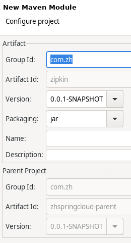
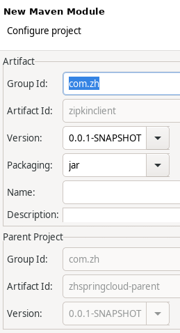
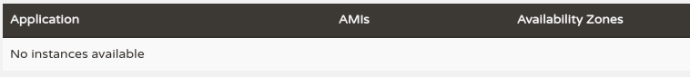
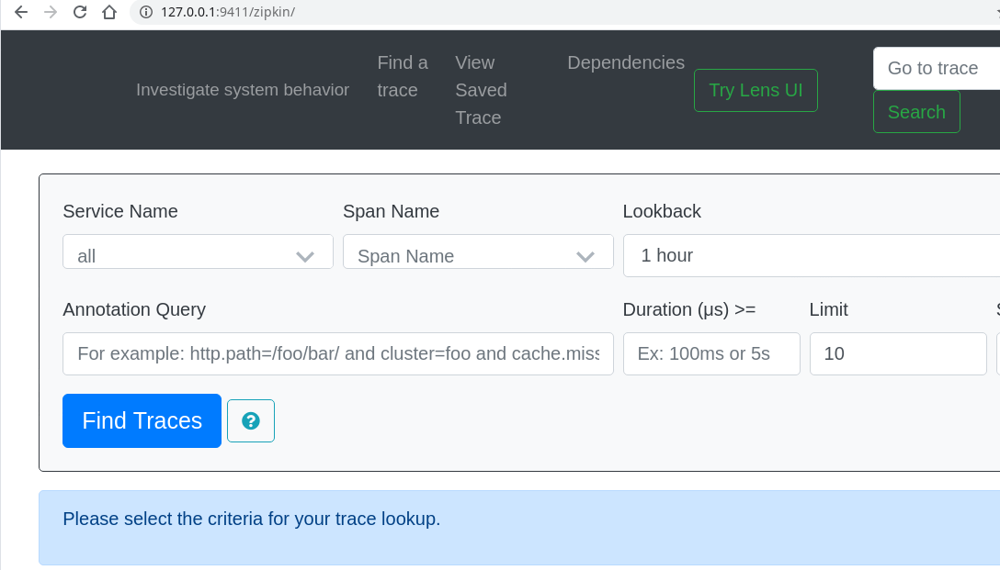
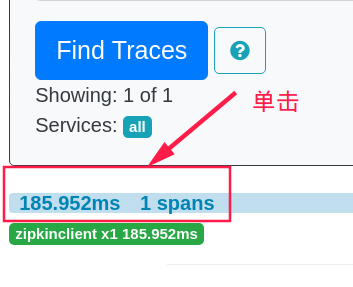
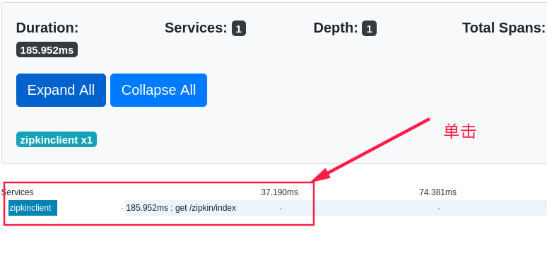
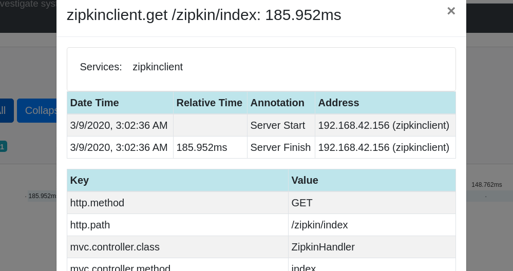

# 服务跟踪Zipkin

# 1 Zipkin简介
Spring Cloud Zipkin是一个可以采集并且跟踪分布式系统中请求数据的组件，让开发者可以更加直观的监控到请求在各个微服务所耗费的时间等。

Zipkin：

- Zipkin Server：采集数据
- Zipkin Client：数据展示

# 2 入门案例
## 2.1 创建Zipkin Server
**注意：**高版本官方以不建议自建Zipkin Server，下载Zipkin Server可执行jar包文件（如zipkin-server-2.12.9-exec.jar）运行：`java -jar zipkin-server-2.12.9-exec.jar`

官网默认Zipkin Server的地址为：[http://127.0.0.1:9411/](http://127.0.0.1:9411/)，这个地址需要在Zipkin Client中配置。

### 2.1.1 创建Maven Module项目


初始pom文件内容：

```xml
<project xmlns="http://maven.apache.org/POM/4.0.0" xmlns:xsi="http://www.w3.org/2001/XMLSchema-instance" xsi:schemaLocation="http://maven.apache.org/POM/4.0.0 https://maven.apache.org/xsd/maven-4.0.0.xsd">
  <modelVersion>4.0.0</modelVersion>
  <parent>
    <groupId>com.zh</groupId>
    <artifactId>zhspringcloud-parent</artifactId>
    <version>0.0.1-SNAPSHOT</version>
  </parent>
  <artifactId>zipkin</artifactId>
</project>
```

### 2.1.2 pom加入依赖
这里的zipkin用2.9.4版本，项目无法启动。

zipkin：[https://zipkin.io/zipkin/](https://zipkin.io/zipkin/)

```xml
<dependencies>
  <dependency>
    <groupId>org.springframework.boot</groupId>
    <artifactId>spring-boot-starter-web</artifactId>
  </dependency>
  <dependency>
    <groupId>io.zipkin.java</groupId>
    <artifactId>zipkin-server</artifactId>
    <version>2.20.1</version>
  </dependency>
  <dependency>
    <groupId>io.zipkin.java</groupId>
    <artifactId>zipkin-autoconfigure-ui</artifactId>
    <version>2.20.1</version>
  </dependency>
</dependencies>
```

### 2.1.3 创建配置文件 application.yml

```yaml
server:
  port: 9090
```

### 2.1.4 创建启动类

```java
package com.zh.zipkin;

import org.springframework.boot.SpringApplication;
import org.springframework.boot.autoconfigure.SpringBootApplication;

import zipkin.server.internal.EnableZipkinServer;

@SpringBootApplication
@EnableZipkinServer
public class ZipkinApplication {
	public static void main(String[] args) throws Exception {
		SpringApplication.run(ZipkinApplication.class, args);
	}
}
```
注解说明:

- `@EnableZipkinServer` ：声明启动 Zipkin Server

## 2.2 创建 Zipkin Client
### 2.2.1 创建Maven Module项目


初始pom文件内容：

```xml
<project xmlns="http://maven.apache.org/POM/4.0.0" xmlns:xsi="http://www.w3.org/2001/XMLSchema-instance" xsi:schemaLocation="http://maven.apache.org/POM/4.0.0 https://maven.apache.org/xsd/maven-4.0.0.xsd">
  <modelVersion>4.0.0</modelVersion>
  <parent>
    <groupId>com.zh</groupId>
    <artifactId>zhspringcloud-parent</artifactId>
    <version>0.0.1-SNAPSHOT</version>
  </parent>
  <artifactId>zipkinclient</artifactId>
</project>
```

### 2.2.2 pom引入依赖

```xml
<dependencies>
  <dependency>
    <groupId>org.springframework.cloud</groupId>
    <artifactId>spring-cloud-starter-zipkin</artifactId>
    <version>2.2.2.RELEASE</version>
  </dependency>
</dependencies>
```

### 2.2.3 创建配置文件 application.yml

```yaml
server:
  port: 8090
spring:
  application:
    name: zipkinclient
  sleuth:
    web:
      client:
        enabled: true
    sampler:
      probability: 1.0
  zipkin:
    base-url: http://localhost:9090/
eureka:
  client:
    service-url:
      defaultZone: http://localhost:8761/eureka/
```
**属性说明:**

- `spring.sleuth.web.client.enabled` ：设置开启请求跟踪
- `spring.sleuth.sampler.probability` ：
    - 设置采样比例，默认是 1.0，指的是多次请求中有百分之多少传到zipkin。例如 1.0 是全部取样，0.5是 50% 取样。
- `srping.zipkin.base-url` ：Zipkin Server 地址，官方默认地址[http://127.0.0.1:9411/](http://127.0.0.1:9411/)

### 2.2.4 创建启动类

```java
package com.zh.zipkinclient;

import org.springframework.boot.SpringApplication;
import org.springframework.boot.autoconfigure.SpringBootApplication;

@SpringBootApplication
public class ZipkinClientApplication {
	public static void main(String[] args) throws Exception {
		SpringApplication.run(ZipkinClientApplication.class, args);
	}
}
```

### 2.2.5 创建Handler

```java
package com.zh.zipkinclient.controller;

import org.springframework.beans.factory.annotation.Value;
import org.springframework.web.bind.annotation.GetMapping;
import org.springframework.web.bind.annotation.RequestMapping;
import org.springframework.web.bind.annotation.RestController;

@RestController
@RequestMapping("/zipkin")
public class ZipkinHandler {

    @Value("${server.port}")
    private String port;

    @GetMapping("/index")
    public String index(){
        return this.port;
    }
}
```

## 2.3 测试跟踪服务Zipkin

1. 依次启动注册中心（eurekaserver）、Zipkin Server（zipkin）、Zipkin Client（zipkinclient）。
1. 访问注册中心（[http://localhost:8761/](http://localhost:8761/)），查看服务注册情况。
   1. 
3. 访问zipkin可视化的UI（[http://127.0.0.1:9411/](http://127.0.0.1:9411/)zipkin）
   1. 
4. 访问Zipkin Client客户端zipkinclient客户端接口（[http://127.0.0.1:8090/zipkin/index](http://127.0.0.1:8090/zipkin/index)）后，然后在访问访问zipkin可视化的UI（[http://127.0.0.1:9411/](http://127.0.0.1:9411/)zipkin），并单击`Find Traces`按钮
   1. 
   1. 
   1. 
