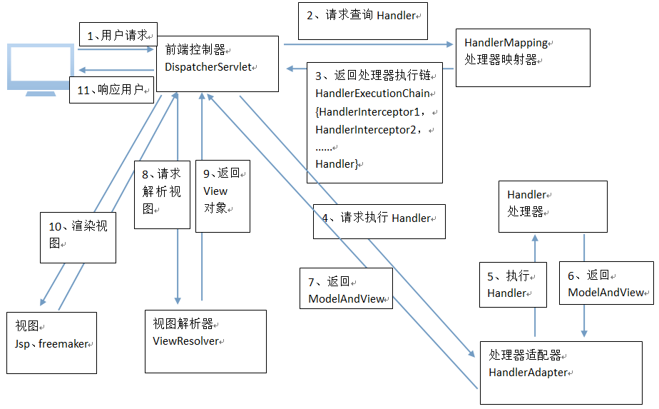

# SpringMVC架构

# 1 SpringMVC架构流程





1. 用户发送请求至前端控制器DispatcherServlet
2. DispatcherServlet收到请求调用HandlerMapping处理器映射器。
3. 处理器映射器根据请求url找到具体的处理器，生成处理器对象及处理器拦截器（如果有则生成）一并返回给DispatcherServlet。
4. DispatcherServlet通过HandlerAdapter处理器适配器调用处理器
5. 执行处理器（Controller，也叫后端控制器）。
6. Controller执行完成返回ModelAndView
7. HandlerAdapter将controller执行结果ModelAndView返回给DispatcherServlet
8. DispatcherServlet将ModelAndView传给ViewReslover视图解析器
9. ViewReslover解析后返回具体View
10. DispatcherServlet对View进行渲染视图（即将模型数据填充至视图中）。
11. DispatcherServlet响应用户

# 2 组件说明


以下组件通常使用框架提供实现：


- **DispatcherServlet**：前端控制器
  - 用户请求到达前端控制器，它就相当于mvc模式中的c，dispatcherServlet是整个流程控制的中心，由它调用其它组件处理用户的请求，dispatcherServlet的存在降低了组件之间的耦合性。
- **HandlerMapping**：处理器映射器
  - HandlerMapping负责根据用户请求找到Handler即处理器，springmvc提供了不同的映射器实现不同的映射方式，例如：配置文件方式，实现接口方式，注解方式等。
- **Handler**：处理器
  - Handler 是继DispatcherServlet前端控制器的后端控制器，在DispatcherServlet的控制下Handler对具体的用户请求进行处理。
  - 由于Handler涉及到具体的用户业务请求，所以一般情况需要程序员根据业务需求开发Handler。
- **HandlerAdapter**：处理器适配器
  - 通过HandlerAdapter对处理器进行执行，这是适配器模式的应用，通过扩展适配器可以对更多类型的处理器进行执行。
- **View Resolver**：视图解析器
  - View Resolver负责将处理结果生成View视图，View Resolver首先根据逻辑视图名解析成物理视图名即具体的页面地址，再生成View视图对象，最后对View进行渲染将处理结果通过页面展示给用户。
- **View**：视图
  - springmvc框架提供了很多的View视图类型的支持，包括：jstlView、freemarkerView、pdfView等。我们最常用的视图就是jsp。
  - 一般情况下需要通过页面标签或页面模版技术将模型数据通过页面展示给用户，需要由程序员根据业务需求开发具体的页面。

说明：在SpringMVC的各个组件中，处理器映射器、处理器适配器、视图解析器称为**SpringMVC的三大组件**。


需要用户实现的组件有处理器Handler和视图View


# 3 默认加载组件


文件位置：`/org/springframework/web/servlet/DispatcherServlet.properties`


```properties
# Default implementation classes for DispatcherServlet's strategy interfaces.
# Used as fallback when no matching beans are found in the DispatcherServlet context.
# Not meant to be customized by application developers.

org.springframework.web.servlet.LocaleResolver=org.springframework.web.servlet.i18n.AcceptHeaderLocaleResolver

org.springframework.web.servlet.ThemeResolver=org.springframework.web.servlet.theme.FixedThemeResolver

org.springframework.web.servlet.HandlerMapping=org.springframework.web.servlet.handler.BeanNameUrlHandlerMapping,\
	org.springframework.web.servlet.mvc.annotation.DefaultAnnotationHandlerMapping

org.springframework.web.servlet.HandlerAdapter=org.springframework.web.servlet.mvc.HttpRequestHandlerAdapter,\
	org.springframework.web.servlet.mvc.SimpleControllerHandlerAdapter,\
	org.springframework.web.servlet.mvc.annotation.AnnotationMethodHandlerAdapter

org.springframework.web.servlet.HandlerExceptionResolver=org.springframework.web.servlet.mvc.annotation.AnnotationMethodHandlerExceptionResolver,\
	org.springframework.web.servlet.mvc.annotation.ResponseStatusExceptionResolver,\
	org.springframework.web.servlet.mvc.support.DefaultHandlerExceptionResolver

org.springframework.web.servlet.RequestToViewNameTranslator=org.springframework.web.servlet.view.DefaultRequestToViewNameTranslator

org.springframework.web.servlet.ViewResolver=org.springframework.web.servlet.view.InternalResourceViewResolver

org.springframework.web.servlet.FlashMapManager=org.springframework.web.servlet.support.SessionFlashMapManager
```


# 4 组件扫描器


使用组件扫描器省去在spring容器配置每个controller类的繁琐。使用`<context:component-scan>`自动扫描配置包下对象的注解。


配置文件：`springmvc.xml`


```xml
<!-- 开启注解扫描 -->
<context:component-scan base-package="com.zh.springmvc" />
```


# 5 注解映射器和适配器

## 5.1 注解式处理器映射器RequestMappingHandlerMapping


注解式处理器映射器，对类中标记`@ResquestMapping`的方法进行映射，根据ResquestMapping定义的url匹配ResquestMapping标记的方法，匹配成功返回HandlerMethod对象给前端控制器，HandlerMethod对象中封装url对应的方法Method。


从spring3.1版本开始，废除了DefaultAnnotationHandlerMapping的使用，推荐使用RequestMappingHandlerMapping完成注解式处理器映射。


配置文件：`springmvc.xml`


```xml
<!--注解映射器 -->
<bean class="org.springframework.web.servlet.mvc.method.annotation.RequestMappingHandlerMapping"/>
```


注解描述：


- `@RequestMapping`：定义请求url到处理器功能方法的映射

## 5.2 注解式处理器适配器RequestMappingHandlerAdapter


注解式处理器适配器，对标记`@ResquestMapping`的方法进行适配。


从spring3.1版本开始，废除了AnnotationMethodHandlerAdapter的使用，推荐使用RequestMappingHandlerAdapter完成注解式处理器适配。


配置文件：`springmvc.xml`


```xml
<!--注解适配器 -->
<bean class="org.springframework.web.servlet.mvc.method.annotation.RequestMappingHandlerAdapter"/>
```

## 5.3 `<mvc:annotation-driven>`


注意：springmvc使用`<mvc:annotation-driven>`自动加载RequestMappingHandlerMapping和RequestMappingHandlerAdapter，可用在springmvc.xml配置文件中使用`<mvc:annotation-driven>`替代注解处理器和适配器的配置。

## 5.4 springmvc中注解扫描和注解驱动要不要配置, 有什么区别?

- 注解驱动和注解扫描没有任何关系，不要混淆我们的概念；
- **注解扫描**是替我们开启 `@Controller` , `@Service` 等这样的注解；
- **注解驱动**：是替我们自动的配置最新版的处理器映射器和处理器适配器，这样就不用让springmvc自动去找 `dispatcher.properties` 配置文件了, 就会加快我们系统的速度。

# 6 视图解析器


配置文件：`springmvc.xml`


```xml
<!-- 视图解析器 -->
<bean class="org.springframework.web.servlet.view.InternalResourceViewResolver">
    <property name="viewClass" value="org.springframework.web.servlet.view.JstlView"/>
    <!-- 前缀，注意配置中的“/” -->
    <property name="prefix" value="/WEB-INF/jsp/"/>
    <!-- 后缀 -->
    <property name="suffix" value=".jsp"/>
</bean>
```
