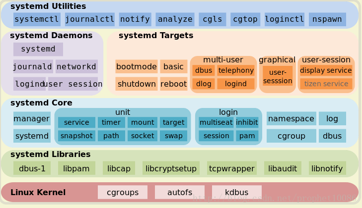

# systemd和systemctl

# 1 概述

## 1.1 linux服务管理方式

- service
    - service命令用于对系统服务进行管理，比如启动（start）、停止（stop）、重启（restart）、查看状态（status）等。
    - service命令本身是一个shell脚本，它在`/etc/init.d/`目录查找指定的服务脚本，然后调用该服务脚本来完成任务。
- systemctl
    - systemd
        - systemd是Linux系统最新的初始化系统(init)
        - systemd的作用是提高系统的启动速度，尽可能启动较少的进程，尽可能更多进程并发启动。
    - systemd对应的进程管理命令是systemctl

## 1.2 systemctl命令兼容了service

即systemctl也会去`/etc/init.d`目录下，查看，执行相关程序：

```shell
# 启动redis
systemctl redis start
# 停止redis
systemctl redis stop
# 开机自启动
systemctl enable redis
```

# 2 systemd 概述

Systemd 是一系列工具的集合，其作用也远远不仅是启动操作系统，它还接管了后台服务、结束、状态查询，以及日志归档、设备管理、电源管理、定时任务等许多职责，并支持通过特定事件（如插入特定 USB 设备）和特定端口数据触发的 On-demand（按需）任务。

Systemd 的后台服务还有一个特殊的身份——它是系统中 PID 值为 1 的进程。

Systemd 可以管理所有系统资源，不同的资源统称为 Unit（单位）。

## 2.1 systemd特点

- **更少的进程**
    - Systemd 提供了 服务按需启动的能力，使得特定的服务只有在真定被请求时才启动。

- **允许更多的进程并行启动**
    - 在 SysV-init 时代，将每个服务项目编号依次执行启动脚本。
    - Ubuntu 的 Upstart 解决了没有直接依赖的启动之间的并行启动。
    - Systemd 通过 Socket 缓存、DBus 缓存和建立临时挂载点等方法进一步解决了启动进程之间的依赖，做到了所有系统服务并发启动。
    - 对于用户自定义的服务，Systemd 允许配置其启动依赖项目，从而确保服务按必要的顺序运行。

- **使用 CGroup 跟踪和管理进程的生命周期**
    - 在 Systemd 之前的主流应用管理服务都是使用进程树来跟踪应用的继承关系的，而进程的父子关系很容易通过两次 fork 的方法脱离。
    - Systemd 则提供通过 CGroup 跟踪进程关系，引补了这个缺漏。通过 CGroup 不仅能够实现服务之间访问隔离，限制特定应用程序对系统资源的访问配额，还能更精确地管理服务的生命周期。

- **统一管理服务日志**
    - Systemd 是一系列工具的集合， 包括了一个专用的系统日志管理服务：Journald。这个服务的设计初衷是克服现有 Syslog 服务的日志内容易伪造和日志格式不统一等缺点，Journald 用二进制格式 保存所有的日志信息，因而日志内容很难被手工伪造。Journald 还提供了一个 journalctl 命令来查看日志信息，这样就使得不同服务输出的日志具有相同的排版格式， 便于数据的二次处理。

## 2.2 systemd架构



# 3 systemd的unit文件

Systemd 可以管理所有系统资源，不同的资源统称为 Unit（单位）。

在 Systemd 的生态圈中，Unit 文件统一了过去各种不同系统资源配置格式，例如服务的启/停、定时任务、设备自动挂载、网络配置、虚拟内存配置等。而 Systemd 通过不同的文件后缀来区分这些配置文件。

Unit 是 Systemd 管理系统资源的基本单元，可以认为每个系统资源就是一个 Unit，并使用一个 Unit 文件定义。在 Unit 文件中需要包含相应服务的描述、属性以及需要运行的命令。

## 3.1 unit文件

Systemd 支持的 12 种 Unit 文件类型：

- `.automount`：用于控制自动挂载文件系统，相当于 SysV-init 的 autofs 服务
- `.device`：对于 `/dev` 目录下的设备，主要用于定义设备之间的依赖关系
- `.mount`：定义系统结构层次中的一个挂载点，可以替代过去的 `/etc/fstab` 配置文件
- `.path`：用于监控指定目录或文件的变化，并触发其它 Unit 运行
- `.scope`：这种 Unit 文件不是用户创建的，而是 Systemd 运行时产生的，描述一些系统服务的分组信息
- `.service`：
    - 封装守护进程的启动、停止、重启和重载操作，是最常见的一种 Unit 文件
    - 一般服务类型(service unit)，主要是系统服务
- `.slice`：用于表示一个 CGroup 的树，通常用户不会自己创建这样的 Unit 文件
- `.snapshot`：用于表示一个由 systemctl snapshot 命令创建的 Systemd Units 运行状态快照
- `.socket`：
    - 监控来自于系统或网络的数据消息，用于实现基于数据自动触发服务启动
    - 内部程序数据交换的插槽服务 (socket unit)，主要是 IPC (Inter-process communication) 的传输讯息插槽文件 (socket file) 功能。 这种类型的服务通常在监控讯息传递的插槽文件，当有透过此插槽文件传递讯息来说要链接服务时，就依据当时的状态将该用户的要求传送到对应的 daemon， 若 daemon 尚未启动，则启动该 daemon 后再传送用户的要求。
    - 使用 socket 类型的服务一般是比较不会被用到的服务，因此在开机时通常会稍微延迟启动的时间。
- `.swap`：定义一个用户做虚拟内存的交换分区
- `.target`：
    - 用于对 Unit 文件进行逻辑分组，引导其它 Unit 的执行。它替代了 SysV-init 运行级别的作用，并提供更灵活的基于特定设备事件的启动方式
    - Target 就是一个 Unit 组，包含许多相关的 Unit 。启动某个 Target 的时候，Systemd 就会启动里面所有的 Unit。从这个意义上说，Target 这个概念类似于”状态点”，启动某个 Target 就好比启动到某种状态。
- `.timer`：用于配置在特定时间触发的任务，替代了 Crontab 的功能

## 3.2 unit放在目录

- `/usr/lib/systemd/system`
    - centos
    - manjaro
- `/etc/systemd/system`
    - ubuntu

Unit 文件按照 Systemd 约定，应该被放置指定的三个系统目录之一中：

- `/etc/systemd/system`：系统或用户自定义的配置文件
    - Systemd 默认从目录`/etc/systemd/system/`读取配置文件。但是里面存放的大部分文件都是符号链接，指向目录 `/usr/lib/systemd/system/`，真正的配置文件存放在那个目录。
- `/run/systemd/system`：软件运行时生成的配置文件
- `/usr/lib/systemd/system`：系统或第三方软件安装时添加的配置文件。
    - CentOS 7：Unit 文件指向该目录
    - ubuntu 16：被移到了`/lib/systemd/system`

注意：这三个目录是有优先级的，越靠上的优先级越高。因此，在三个目录中有同名文件的时候，只有优先级最高的目录里的那个文件会被使用。

## 3.3 Unit 文件结构

以`docker.service`为例

```properties
[Unit]
Description=Docker Application Container Engine
Documentation=https://docs.docker.com
After=network-online.target docker.socket firewalld.service
Wants=network-online.target
Requires=docker.socket

[Service]
Type=notify
# the default is not to use systemd for cgroups because the delegate issues still
# exists and systemd currently does not support the cgroup feature set required
# for containers run by docker
ExecStart=/usr/bin/dockerd -H fd://
ExecReload=/bin/kill -s HUP $MAINPID
LimitNOFILE=1048576
# Having non-zero Limit*s causes performance problems due to accounting overhead
# in the kernel. We recommend using cgroups to do container-local accounting.
LimitNPROC=infinity
LimitCORE=infinity
# Uncomment TasksMax if your systemd version supports it.
# Only systemd 226 and above support this version.
#TasksMax=infinity
TimeoutStartSec=0
# set delegate yes so that systemd does not reset the cgroups of docker containers
Delegate=yes
# kill only the docker process, not all processes in the cgroup
KillMode=process
# restart the docker process if it exits prematurely
Restart=on-failure
StartLimitBurst=3
StartLimitInterval=60s

[Install]
WantedBy=multi-user.target
```

由此可见，Systemd 服务的 Unit 文件可以分为三个配置区段：

- Unit 和 Install 段：所有 Unit 文件通用，用于配置服务（或其它系统资源）的描述、依赖和随系统启动的方式
- Service 段：服务（Service）类型的 Unit 文件（后缀为`.service`）特有的，用于定义服务的具体管理和操作方法

### 3.3.1 Unit 段

- Description：描述这个 Unit 文件的信息
- Documentation：指定服务的文档，可以是一个或多个文档的 URL 路径
- Requires：依赖的其它 Unit 列表，列在其中的 Unit 模板会在这个服务启动时的同时被启动。并且，如果其中任意一个服务启动失败，这个服务也会被终止
- Wants：与 Requires 相似，但只是在被配置的这个 Unit 启动时，触发启动列出的每个 Unit 模块，而不去考虑这些模板启动是否成功
- After：与 Requires 相似，但是在后面列出的所有模块全部启动完成以后，才会启动当前的服务
- Before：与 After 相反，在启动指定的任务一个模块之间，都会首先确证当前服务已经运行
- Binds To：与 Requires 相似，失败时失败，成功时成功，但是在这些模板中有任意一个出现意外结束或重启时，这个服务也会跟着终止或重启
- Part Of：一个 Bind To 作用的子集，仅在列出的任务模块失败或重启时，终止或重启当前服务，而不会随列出模板的启动而启动
- OnFailure：当这个模板启动失败时，就会自动启动列出的每个模块
- Conflicts：与这个模块有冲突的模块，如果列出的模块中有已经在运行的，这个服务就不能启动，反之亦然

### 3.3.2 Install 段

这部分配置的目标模块通常是特定运行目标的 .target 文件，用来使得服务在系统启动时自动运行。这个区段可以包含三种启动约束：

- WantedBy：和 Unit 段的 Wants 作用相似，只有后面列出的不是服务所依赖的模块，而是依赖当前服务的模块。它的值是一个或多个 Target，当前 Unit 激活时（enable）符号链接会放入 `/etc/systemd/system`目录下面以 `<Target 名> + .wants` 后缀构成的子目录中，如`/etc/systemd/system/multi-user.target.wants/`

    - ```shell
        [zh@zh-inspironn4050 system]$ pwd
        /etc/systemd/system
        [zh@zh-inspironn4050 system]$ ls multi-user.target.wants/
        apparmor.service        org.cups.cupsd.path     ufw.service
        avahi-daemon.service    remote-fs.target        vmware-hostd.service
        cronie.service          snapd.apparmor.service  vmware-networks.service
        ModemManager.service    snapd.service           vmware-usbarbitrator.service
        NetworkManager.service  tlp.service
        ```

- RequiredBy：和 Unit 段的 Wants 作用相似，只有后面列出的不是服务所依赖的模块，而是依赖当前服务的模块。它的值是一个或多个 Target，当前 Unit 激活时，符号链接会放入 `/etc/systemd/system`目录下面以 `<Target 名> + .required` 后缀构成的子目录中

- Also：当前 Unit enable/disable 时，同时 enable/disable 的其他 Unit

- Alias：当前 Unit 可用于启动的别名

#### SysV-init 运行级别与 Systemd Target 对应的 Unit 文件

| SysV-init Level | systemd Target                          | 说明                                     |
| --------------- | --------------------------------------- | ---------------------------------------- |
| 0               | `runlevel0.target -> poweroff.target`   | 关闭系统                                 |
| 1               | `runlevel1.target -> rescue.target`     | 单用户模式                               |
| 2               | `runlevel2.target -> multi-user.target` | 用户定义/域特定运行级别，默认等同于级别3 |
| 3               | `runlevel3.target -> multi-user.target` | 多用户模式                               |
| 4               | `runlevel4.target -> multi-user.target` | 用户定义/域特定运行级别，默认等同于级别3 |
| 5               | `runlevel5.target -> graphical.target`  | 多用户，图形模式                         |
| 6               | `runlevel6.target -> reboot.target`     | 重启                                     |
| emergency       | `emergency.target`                      | 急救模式                                 |

获取当前正在使用的运行目标：`systemctl list-units --type=target`

```shell
[zh@zh-inspironn4050 system]$ systemctl list-units --type=target
  UNIT                   LOAD   ACTIVE SUB    DESCRIPTION                
  basic.target           loaded active active Basic System               
  cryptsetup.target      loaded active active Local Encrypted Volumes    
  getty.target           loaded active active Login Prompts              
  graphical.target       loaded active active Graphical Interface        
  local-fs-pre.target    loaded active active Local File Systems (Pre)   
  local-fs.target        loaded active active Local File Systems         
  multi-user.target      loaded active active Multi-User System          
  network-online.target  loaded active active Network is Online          
  network.target         loaded active active Network                    
  nss-user-lookup.target loaded active active User and Group Name Lookups
  paths.target           loaded active active Paths                      
  remote-fs.target       loaded active active Remote File Systems        
  slices.target          loaded active active Slices                     
  sockets.target         loaded active active Sockets                    
  sound.target           loaded active active Sound Card                 
  swap.target            loaded active active Swap                       
  sysinit.target         loaded active active System Initialization      
  timers.target          loaded active active Timers                     
lines 1-19
```

### 3.3.3 Service 段

用来 Service 的配置，只有 Service 类型的 Unit 才有这个区块。它的主要字段分为服务生命周期和服务上下文配置两个方面。

#### 3.3.3.1 服务生命周期控制相关

- Type：定义启动时的进程行为，它有以下几种值：
    - Type=simple：默认值，执行ExecStart指定的命令，启动主进程

    - Type=forking：以 fork 方式从父进程创建子进程，创建后父进程会立即退出

    - Type=oneshot：一次性进程，Systemd 会等当前服务退出，再继续往下执行

    - Type=dbus：当前服务通过D-Bus启动

    - Type=notify：当前服务启动完毕，会通知Systemd，再继续往下执行

    - Type=idle：若有其他任务执行完毕，当前服务才会运行
- RemainAfterExit：值为 true 或 false（默认）。
    - 当配置为 true 时，Systemd 只会负责启动服务进程，之后即便服务进程退出了，Systemd 也仍然会认为这个服务还在运行中。这个配置主要是提供给一些并非常驻内存，而是启动注册后立即退出，然后等待消息按需启动的特殊类型服务使用的。
- ExecStart：启动当前服务的命令
- ExecStartPre：启动当前服务之前执行的命令
- ExecStartPos：启动当前服务之后执行的命令
- ExecReload：重启当前服务时执行的命令
- ExecStop：停止当前服务时执行的命令
- ExecStopPost：停止当其服务之后执行的命令
- RestartSec：自动重启当前服务间隔的秒数
- Restart：定义何种情况 Systemd 会自动重启当前服务，可能的值包括 always（总是重启）、on-success、on-failure、on-abnormal、on-abort、on-watchdog
- TimeoutStartSec：启动服务时等待的秒数，这一配置对于使用 Docker 容器而言显得尤为重要，因其第一次运行时可能需要下载镜像，严重延时会容易被 Systemd 误判为启动失败杀死。通常，对于这种服务，将此值指定为 0，从而关闭超时检测
- TimeoutStopSec：停止服务时的等待秒数，如果超过这个时间仍然没有停止，Systemd 会使用 SIGKILL 信号强行杀死服务的进程

#### 3.3.3.2 服务上下文配置相关

- Environment：为服务指定环境变量
- EnvironmentFile：指定加载一个包含服务所需的环境变量的列表的文件，文件中的每一行都是一个环境变量的定义
- Nice：服务的进程优先级，值越小优先级越高，默认为 0。其中 -20 为最高优先级，19 为最低优先级
- WorkingDirectory：指定服务的工作目录
- RootDirectory：指定服务进程的根目录（/ 目录）。如果配置了这个参数，服务将无法访问指定目录以外的任何文件
- User：指定运行服务的用户
- Group：指定运行服务的用户组
- MountFlags：服务的 Mount Namespace 配置，会影响进程上下文中挂载点的信息，即服务是否会继承主机上已有挂载点，以及如果服务运行执行了挂载或卸载设备的操作，是否会真实地在主机上产生效果。可选值为 shared、slaved 或 private
    - shared：服务与主机共用一个 Mount Namespace，继承主机挂载点，且服务挂载或卸载设备会真实地反映到主机上
    - slave：服务使用独立的 Mount Namespace，它会继承主机挂载点，但服务对挂载点的操作只有在自己的 Namespace 内生效，不会反映到主机上
    - private：服务使用独立的 Mount Namespace，它在启动时没有任何任何挂载点，服务对挂载点的操作也不会反映到主机上
- LimitCPU / LimitSTACK / LimitNOFILE / LimitNPROC 等：限制特定服务的系统资源量，例如 CPU、程序堆栈、文件句柄数量、子进程数量等
- 注意：如果在 ExecStart、ExecStop 等属性中使用了 Linux 命令，则必须要写出完整的绝对路径。对于 ExecStartPre 和 ExecStartPost 辅助命令，若前面有个 “-” 符号，表示忽略这些命令的出错。因为有些 “辅助” 命令本来就不一定成功，比如尝试清空一个文件，但文件可能不存在。

## 3.4 Unit 文件占位符

在 Unit 文件中，有时会需要使用到一些与运行环境有关的信息，例如节点 ID、运行服务的用户等。这些信息可以使用占位符来表示，然后在实际运行被动态地替换实际的值。

- `%n`：完整的 Unit 文件名字，包括`.service`后缀名
- `%p`：Unit 模板文件名中@符号之前的部分，不包括@符号
- `%i`：Unit 模板文件名中@符号之后的部分，不包括@符号和 `.service`后缀名
- `%t`：存放系统运行文件的目录，通常是 “run”
- `%u`：运行服务的用户，如果 Unit 文件中没有指定，则默认为 root
- `%U`：运行服务的用户 ID
- `%h`：运行服务的用户 Home 目录，即`%{HOME}`环境变量的值
- `%s`：运行服务的用户默认 Shell 类型，即`%{SHELL}`环境变量的值
- `%m`：实际运行节点的 Machine ID，对于运行位置每个的服务比较有用
- `%b`：Boot ID，这是一个随机数，每个节点各不相同，并且每次节点重启时都会改变
- `%H`：实际运行节点的主机名
- `%v`：内核版本，即`uname -r`命令输出的内容
- `%%`：在 Unit 模板文件中表示一个普通的百分号

## 3.5 Unit 模板

在现实中，往往有一些应用需要被复制多份运行。例如，用于同一个负载均衡器分流的多个服务实例，或者为每个 SSH 连接建立一个独立的 sshd 服务进程。

Unit 模板文件的写法与普通的服务 Unit 文件基本相同，不过 Unit 模板的文件名是以 @ 符号结尾的。通过模板启动服务实例时，需要在其文件名的 @ 字符后面附加一个参数字符串。

Systemd 在运行服务时，总是会先尝试找到一个完整匹配的 Unit 文件，如果没有找到，才会尝试选择匹配模板。例如上面的命令，System 首先会在约定的目录下寻找名为 apache@8080.service 的文件，如果没有找到，而文件名中包含 @ 字符，它就会尝试去掉后缀参数匹配模板文件。对于 apache@8080.service，systemd 会找到 apache@.service 模板文件，并通过这个模板文件将服务实例化。