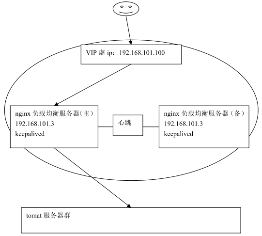

# Nginx高可用

# 1 概述


实现理念：要实现nginx的高可用，需要实现备份机。


## 1.1 为什么需要高可用


nginx作为负载均衡器，所有请求都到了nginx，可见nginx处于非常重点的位置，如果nginx服务器宕机后端web服务将无法提供服务，影响严重。


## 1.2 实现高可用的原理


- 为了屏蔽负载均衡服务器的宕机，需要建立一个备份机。
- 主服务器和备份机上都运行高可用（High Availability）监控程序，通过传送诸如“I am alive”这样的信息来监控对方的运行状况。
- 当备份机不能在一定的时间内收到这样的信息时，它就接管主服务器的服务IP并继续提供负载均衡服务；
- 当备份管理器又从主管理器收到“I am alive”这样的信息时，它就释放服务IP地址，这样的主服务器就开始再次提供负载均衡服务。

# 2 keepalived+nginx实现主备

## 2.1 什么是keepalived


keepalived是集群管理中保证集群高可用的一个服务软件，用来防止单点故障。

Keepalived的作用是检测web服务器的状态，如果有一台web服务器死机，或工作出现故障，Keepalived将检测到，并将有故障的web服务器从系统中剔除，当web服务器工作正常后Keepalived自动将web服务器加入到服务器群中，这些工作全部自动完成，不需要人工干涉，需要人工做的只是修复故障的web服务器。


## 2.2 keepalived工作原理


keepalived是以VRRP协议为实现基础的，VRRP全称Virtual Router Redundancy Protocol，即虚拟路由冗余协议。

虚拟路由冗余协议，可以认为是实现路由器高可用的协议，即将N台提供相同功能的路由器组成一个路由器组，这个组里面有一个master和多个backup，master上面有一个对外提供服务的vip（VIP = Virtual IP Address，虚拟IP地址，该路由器所在局域网内其他机器的默认路由为该vip），master会发组播，当backup收不到VRRP包时就认为master宕掉了，这时就需要根据VRRP的优先级来选举一个backup当master。这样的话就可以保证路由器的高可用了。

keepalived主要有三个模块，分别是core、check和VRRP。

- core：为keepalived的核心，负责主进程的启动、维护以及全局配置文件的加载和解析。
- check：负责健康检查，包括常见的各种检查方式。
- VRRP：是来实现VRRP协议的。


## 2.3 keepalived+nginx实现主备过程


两台nginx，一主一备：192.168.101.3和192.168.101.4

两台tomcat服务器：192.168.101.5、192.168.101.6


1. **初始状态**：


2. **主机宕机**：


3. **主机恢复**：



## 2.4 安装keepalived

CentOS：6.7

### 2.4.1 安装依赖

```shell
su - root
yum -y install kernel-devel*
yum -y install openssl-*
yum -y install popt-devel
yum -y install lrzsz
yum -y install openssh-clients
```

### 2.4.2 安装keepalived

首先复制安装包到`/usr/local`。

```shell
cd /usr/local
tar –zxvf keepalived-1.2.2.tar.gz
mv keepalived-1.2.2 keepalived
cd keepalived
./configure --prefix=/usr/local/keepalived -enable-lvs-syncd --enable-lvs --with-kernel-dir=/lib/modules/2.6.32-431.el6.x86_64/build
make
make install
```

### 2.4.3 配置服务和加入开机启动

```shell
cp /usr/local/keepalived/etc/rc.d/init.d/keepalived /etc/init.d/ 
cp /usr/local/keepalived/etc/sysconfig/keepalived /etc/sysconfig/
mkdir -p /etc/keepalived
cp /usr/local/keepalived/etc/keepalived/keepalived.conf /etc/keepalived/
ln -s /usr/local/keepalived/sbin/keepalived /sbin/
chkconfig keepalived on
```

### 2.4.4 修改配置文件

`vi /etc/keepalived/keepalived.conf`：

```
global_defs {
   notification_email {#指定keepalived在发生切换时需要发送email到的对象，一行一个
     #acassen@firewall.loc
     #failover@firewall.loc
     #sysadmin@firewall.loc
   }
   notification_email_from Alexandre.Cassen@firewall.loc#指定发件人
   #smtp_server 192.168.200.1#指定smtp服务器地址
   #smtp_connect_timeout 30 #指定smtp连接超时时间
   router_id LVS_DEVEL#运行keepalived机器的一个标识
}

vrrp_instance VI_1 {
    state BACKUP#指定那个为master，那个为backup
    interface eth1#设置实例绑定的网卡
    virtual_router_id 51#同一实例下virtual_router_id必须相同
    priority 100#定义优先级，数字越大，优先级越高,备机要小于主
	advert_int 1#MASTER与BACKUP负载均衡器之间同步检查的时间间隔，单位是秒
	nopreempt#设置为不抢占,从启动后主不会自动切换回来, 注：这个配置只能设置在backup主机上，而且这个主机优先级要比另外一台高
    
    authentication {#设置认证
        auth_type PASS
        auth_pass 1111
    }
    virtual_ipaddress {#设置vip
        192.168.56.70#虚拟IP
    }
}

virtual_server 192.168.56.70 8080 {
    delay_loop 6#健康检查时间间隔
    lb_algo rr #调度算法rr|wrr|lc|wlc|lblc|sh|dh
    lb_kind DR #负载均衡转发规则NAT|DR|RUN
    #nat_mask 255.255.255.0 #需要验证
    persistence_timeout 1#会话保持时间
    protocol TCP#使用的协议

    real_server 192.168.56.201 8080 {
        weight 10 #默认为1,0为失效
        SSL_GET {
            url { #检查url，可以指定多个
              path /
              digest ff20ad2481f97b1754ef3e12ecd3a9cc #检查后的摘要信息
            }
            url {
              path /mrtg/
              digest 9b3a0c85a887a256d6939da88aabd8cd
            }
            connect_timeout 3#连接超时时间
            nb_get_retry 3#重连次数
            delay_before_retry 3#重连间隔时间
        }
    }
}
```

### 2.4.5 后续步骤

- 按照上面步骤安装备机器
  - 注意：备的配置文件不相同。
- 启动：`service keepalived start`
  - 主机和备份机都要启动。
- 验证：`ip a`

### 2.4.6 keepalived的问题

**keepalived的问题**：因为keepalive只能监控机器的死活，所以当软件死掉后，keepalived仍然不会切换。

解决方案：（可以写一个脚本来监控软件（tomcat和keepalived）的存活状态）

```shell
#!/bin/bash
while true;
do
    A=`ps -ef|grep tomcat |wc -l`
	B=`ps -ef|grep keepalived |wc -l`
	echo $A
	# 如果tomcat挂掉，则重启tomcat，如果启动失败杀死keepalived
	if [ $A -eq 1 ];then
	    echo 'restart tomcat!!!!'
	    /usr/local/server/apache-tomcat-6.0.37/bin/startupsss.sh
	    # 验证tomcat是否重启成功
		if [ $A -eq 1 ];then
			if [ $B -gt 1 ];then
				   echo 'tomcat dead  !!!! kill keepalived'
				   killall keepalived
			fi
		fi				
	fi
	# 如果tomcat存活，但keepalived死掉，则尝试启动keepalived
	if [ $A -eq 2 ];then
		if [ $B -eq 1 ];then
			   echo 'tomcat live  !!!! start keepalived'
			   service keepalived start
		fi
	fi
	sleep 3
done
```