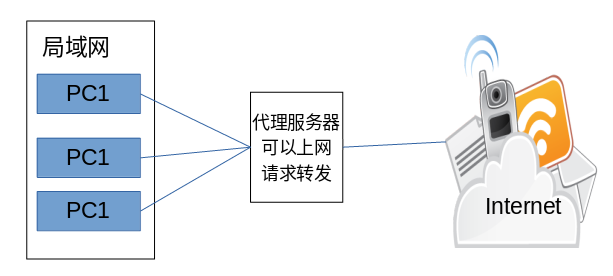
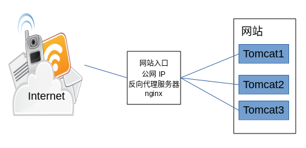
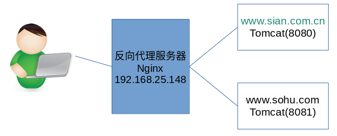

# Nginx反向代理、负载均衡

# 1 什么是反向代理


## 1.1 正向代理


决定哪台PC机可以上网




## 1.2 反向代理


- 决定哪台服务器提供服务。
- 返回代理服务器不提供服务器。
- 也是请求的转发。




# 2 Nginx实现反向代理


## 2.1 实现的功能


- 两个域名指向同一台nginx服务器，用户访问不同的域名显示不同的网页内容。
  - 两个域名是`www.sian.com.cn`和`www.sohu.com`
  - nginx服务器使用虚拟机`192.168.25.148`




## 2.2 配置步骤


第一步：安装两个tomcat，分别运行在8080和8081端口。


第二步：启动两个tomcat。


第三步：反向代理服务器的配置


> 指出：server中的listen都是80

关键配置文件内容：


```
upstream tomcat1 {
	server 192.168.25.148:8080;
}
server {
    listen       80;
    server_name  www.sina.com.cn;

    #charset koi8-r;

    #access_log  logs/host.access.log  main;

    location / {
        proxy_pass   http://tomcat1;
        index  index.html index.htm;
    }
}
upstream tomcat2 {
	server 192.168.25.148:8081;
}
server {
    listen       80;
    server_name  www.sohu.com;

    #charset koi8-r;

    #access_log  logs/host.access.log  main;

    location / {
        proxy_pass   http://tomcat2;
        index  index.html index.htm;
    }
}
```


第四步：nginx重新加载配置文件


第五步：配置域名


在hosts文件中添加域名和ip的映射关系


> 192.168.25.148 www.sina.com.cn
> 192.168.25.148 www.sohu.com


# 3 负载均衡策略
## 3.1 轮询
如果一个服务由多条服务器提供，需要把负载分配到不同的服务器处理，需要负载均衡。

> upstream	tomcat2 {
	server	192.168.25.148:8081;
> 	server	192.168.25.148:8082;
}

## 3.2 weight权重
可以根据服务器的实际情况调整服务器权重。权重越高分配的请求越多，权重越低，请求越少。默认是都是1
> upstream	tomcat2 {
	server	192.168.25.148:8081;
> 	server	192.168.25.148:8082 weight=2;
}

## 3.3 ip_hash
在负载均衡系统中，如果客户端已经在某台服务器中登陆，如果我们在访问系统,Nginx会给客户端重新分配一台服务器，这台服务器很有可能不是原先的那台服务器，这显然是不妥的，因为这样就意味着客户端又要重新登陆一次系统.所以需要通过ip_hash指令来解决这个问题。
ip_hash指令的原理：Nginx通过哈希算法(键值对)给每个客户端指定一个对应的服务器，当一个用户已经在一台服务器上登陆，当它再次访问Nginx服务器时，Nginx会从哈希集合中拿到用户上次登陆的那个服务器，然后跳转到服务器。
注:如果指定了ip_hash的规则，则权重失效。两个规则互斥。

> upstream	tomcat2 {
	ip_hash;
> 	server	192.168.25.148:8081;
> 	server	192.168.25.148:8082;
}

**ip_hash可能会导致负载不均衡的问题**：
> ip-hash 我记得假如你负载有2 台机器，A机器和B机器。有2个客户端来请求分别 C1 和C2，当C1发送请求之后被负载到Ａ机器，C2发送请求之后被负载到B机器，以后的C1 活动就在A中进行，C2 的活动就在B中进行。
> 在有少量ip访问时，ip_hash确实无法负载均衡，可能全部ip算出来的hash值都会落到同一台后端机器上，但这种情况下负载不高的话也确实不需要强调均衡。在后端服务器故障的情况下，nginx会把负载转到其他机器上的，故障机会临时从集群中排除的。

**优点**：

> -  配置简单，对应用无侵入性，不需要修改代码；
> -  只要hash属性是均匀的，多台web-server的负载是均衡的；
> -  便于服务器水平扩展；
> -  安全性较高


**缺点**：
> - 服务器重启会造成session丢失；
> - 水平扩展过程中也会造成部分session丢失；
> - 客户机ip变化的话会造成session丢失；
> - 存在单点负载高的风险。


## 3.4 支持扩展自定义策略


