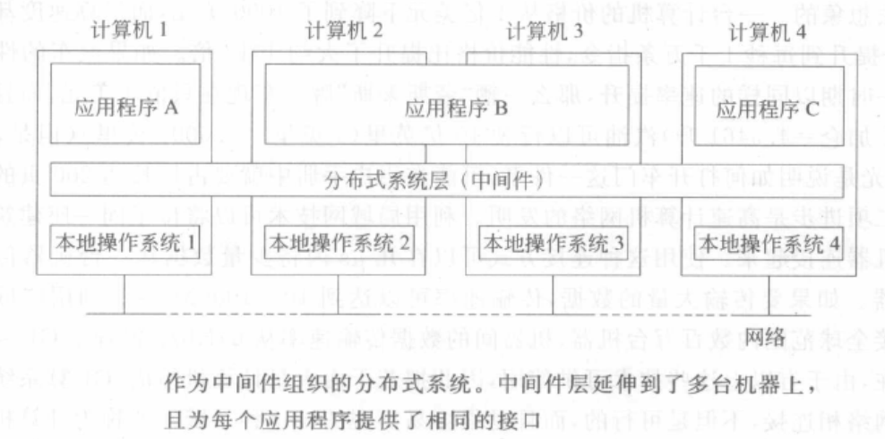
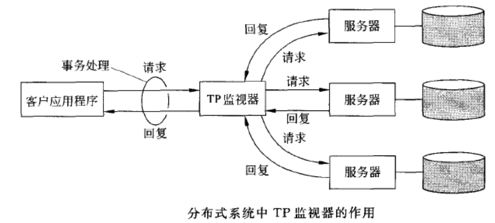

# 分布式系统概述

# 1 分布式系统的定义

**分布式系统**是若干独立计算机的集合，这些计算机对于用户来说就像是单个相关系统。

- 硬件：机器本身是独立的。
- 软件：对用户来说他们就像是与单个系统打交道。

**分布式系统**是其组件（硬件或软件）分布在连网的计算机上，组件之间通过传递消息进行通信和动作协调的系统。

# 2 分布式系统的特性

- 各个计算机之间的差别以及计算机之间的通信方式的差别对用户是隐藏，银狐看不到分布式系统的内部组织结构。
- 用户和应用程序无论在何时何地都能够以一种一致和统一的方式与分布式系统进行交互。
- 分布式系统的扩展或者升级应该是相对比较容易的。
  - 分布式系统由独立的计算机组成，但同时隐藏了其中单个计算机在系统里所承担任务的细节。即使分布式系统中某些部分可能暂时发生故障，但其整体在通常情况下总是保持可用的。用户和应用程序不会觉察到那些部分正在进行替换和维修，以及加入了那些新的部分来为更多的用户和应用程序提供服务。

**中间件（middleware）**：为了使种类各异的计算机和网络都呈现为单个的系统，分布式系统常常通过一个“软件层”组织起来，该“软件层”在逻辑上位于由用户和应用程序组成的高层与由操作系统组成的底层之间。

# 3 分布式的目标

## 3.1 使资源可访问

分布式系统的最主要的目标是使用户能够方便地访问远程资源，并且以一种受控的方式与其他用户共享这些资源。

## 3.2 透明性

分布式系统的重要目标之一是将它的进程和资源实际上在多台计算机上分布这样一个事实隐藏起来。

**透明的（transparent）**：如果一个分布式系统能够在用户和应用程序面前呈现为单个计算机系统，则称其为透明的。

**透明的类型**：

- 访问：隐藏数据表示形式的不同以及资源访问方式的不同。
- 位置：隐藏资源所在的位置。
- 迁移：隐藏资源是否移动到另一个位置。
- 重定位：隐藏资源是否在使用过程中移动到另一个位置。
- 复制：隐藏是否都资源进行复制。
- 并发：隐藏资源是否由若干相互竞争的用户共享。
- 故障：隐藏资源的故障和恢复。

**透明度**：在设计实现分布式系统时，把实现分布的透明性作为目标是正确的，但是应该将它和其他方面的问题（比如性能）结合起来考虑。

## 3.3 开放性

## 3.4 可扩展性

系统的可扩展性至少可以通过三个方面来度量：

- 在规模上可扩展：可以方便地把更多的用户和资源加入到系统中去。
- 在地域上可扩展：如果系统的用户和资源可以相隔极为遥远，这种系统就称为地域上可扩展的系统。
- 在管理上可扩展：即使该分布式系统跨越多个独立的管理机构，仍然可以方便地对其进行管理。

### 3.4.1 可扩展性问题

### 3.4.2 扩展技术

由于分布式系统中的可扩展问题表现为服务器和网络能力优先所造成的性能问题，因此基本上只有三种扩展技术：

- **隐藏通信等待时间**：
  - 基本想法：尽量避免等待远程服务对请求的响应。
  - 异步通信（asynchronous communication）：当对远程计算机的某个服务发出请求时，在发出请求端，除了等待服务器响应之外，还可以利用这段时间做其他工作。当响应到来时，应用程序产生中断，并且调用专门的处理程序对前面发出的请求进行处理。
  - 启动新的控制线程来执行请求：虽然该控制线程因为等待响应而受到阻塞，但是进程中其他线程可以继续执行。

- **分布（distribution）技术**：把某个组件分割成多个部分，然后再将它们分散到系统中去。
- **复制技术**：对组件进行复制，并将副本分布到系统各处。
  - 复制不仅能够增加可用性，而且还有助于组件间的负载平衡，从而使性能得到提高。
  - 对于地域上比较分散的系统来说，再请求者附近有一份副本可以很大程度上隐藏通信等待时间的问题。
  - 缓存（cashing）是复制的一种特殊形式，缓存一般是再访问资源的客户附近制作该资源的副本。
  - 缓存和复制的缺点：由于资源存在多个副本，修改其中的一个会导致它与其他副本不相同，从而导致**一致性（consistency）方面的问题**。

# 4 分布式系统的类型

## 4.1 分布式计算系统

**集群计算（cluster computing）**：底层硬件是由类似的工作站或PC集组成，通过告诉的局域网紧密连接起来的。而且每个结点运行的是相同的操作系统。

**网络计算（grid computing）**：组成分布式系统的这种子分组通常构件成一个计算机系统联盟，其中的每个系统归属于不同的管理域，而且再硬件、软件和部署网络技术上也差别很大。

### 4.1.1 集群计算系统

### 4.1.2 网络计算系统

## 4.2 分布式信息系统

### 4.2.1 事务处理系统

**嵌套式事务处理（nested transaction）**：是由多个子事务处理构成的。最顶层的事务处理分支成其下一级的事务处理（这些子事务处理与其他事务处理在不同的机器上并行地运算），以获得较高的性能或简化程序设计。而这些下一级的事务处理又可以运行一个或多个子事务处理，或者再分支成其自己的下一级事务处理。

由于事务处理可以嵌套任意多层，就需要有深思熟虑的管理方法来保证正确性。

再分布式系统中，嵌套式事务处理很重要，因为它们提供了一种很自然的方法，可以把一个事务处理分布到多台机器上。它们是按照原始事务处理工作的逻辑分支进行的。

**事务处理监视器（transaction processing monitor**）：或称为TP监视器（TP monitor）。在企业中间件系统的早期，负责处理分布式（或嵌套式）事务处理的组件再服务器或数据库级上构成了集成应用的核心。

- 其主要任务是通过提供如下图所示的事务处理变成模式，允许应用程序访问多个服务器/数据库。

### 4.2.2 企业应用集成

应用程序与其关联的数据库越独立，就越需要有工具来把这些数据库无关的应用程序集成到一起。特别是，应用程序组件之间可以直接进行通信，而不仅限于通过由事务处理系统所支持的请求/回复。

应用程序间的通信需求导致了不同的通信模式：

- 远程过程调用（remote procedure call，RPC）：通过一个本地过程调用，有效地往另一个应用程序组件发送一个请求。本地过程调用可以使其请求封装成一个消息，并发送给被调用者。同样，过程调用的结果被发送回来并返回给应用程序。
  - 缺点：
    - 调用者和被调用者必须正在运行；
    - 它们必须正确地知道如何引用对方。
- 远程方法调用（remote method invocation，RMI）：RMI与RPC实质上是相同的，只不过它操作的是对象而不是应用程序。
  - 缺点：
    - 调用者和被调用者必须正在运行；
    - 它们必须正确地知道如何引用对方。
- 面向消息的中间件（message-oriented middleware， MOM）：应用程序只需发送一个消息给逻辑意义上的联系点（通常用目标来描述）。

### 4.2.3 分布式普适系统

## 4.3 分布式嵌入系统

