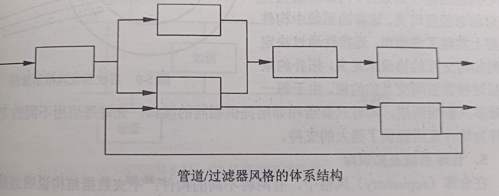
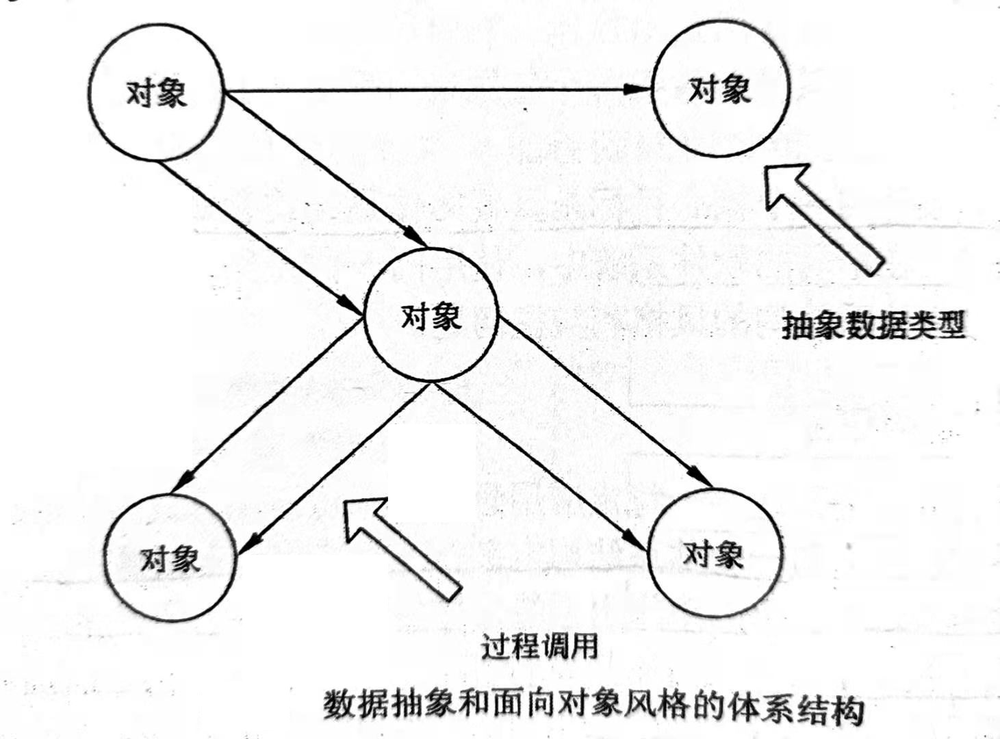

# 软件架构设计

在本部分，**软件“体系结构”和“架构”具有相同的含义**。

# 1 软件架构概念

## 1.1 软件架构的定义

软件架构是具有一定形式的结构化元素，即构件的集合，包括处理构件、数据构建和连接构件。

- 处理构件：负责对数据进行加工；
- 数据构件：被加工的信息；
- 连接构件：把架构的不同部分连接起来。 

软件架构包括一个或一组软件构件、软件构件的外部的可见特性及其相互关系。

- 软件外部的可见特性：是指软件构件提供的服务、性能、特性、错误处理、共享资源使用等。 
- 在架构设计的环境中，软件构件可以简单到程序模块或者面向对象的类，也可以扩展到包含数据库和能够完成客户与服务器网络配置的“中间件”。

软件架构处理算法与数据结构之上关于整体系统结构设计和描述方面的一些问题，如全局组织和全局控制结构、关于通信、同步与数据存取的协议，设计构建功能定义，物理分布和合成，设计方案的选择、评估与实现等。

架构并非可运行软件。确切地说，它是一种表达，使软件工程师能够：

- 分析设计在满足狗顶需求方面的有效性。
- 在设计变更相对容易的阶段，考虑架构可能的选择方案。
- 降低与软件构造相关的风险。

## 1.2 软件架构设计与生命周期

# 2 基于架构的软件开发方法

# 3 软件架构风格

软件架构设计的一个核心目标是重复的架构模式，即达到架构级的软件重用。

- 也就是说，在不同的软件系统中，使用同一架构。

## 3.1 软件架构风格概述

- 软件架构风格是描述某一特定应用领域中系统组织方式的惯用模式（idiomatic paradigm）。
- 架构风格定义了一个系统家族，即一个架构定义一个词汇表和一组约束
  - 词汇表：包含构件和连接件。
  - 约束：定义构件和连接件的组合方式。
- 架构风格反映了领域中众多系统所共有的结构和语义特性，并指导如何将各个模块和子系统有效地组织成一个完整的系统。
  - 按照这种方式理解，软件架构风格定义了用于描述系统的术语表和一组指导构件系统的规则。

**通用架构风格分类**：

- 数据流风格：批处理序列，管道/过滤器。
- 调用/返回风格：主程序/子程序，面向对象风格，层次结构。
- 独立构件风格：进程通信，事件系统。
- 虚拟机风格：解释器，基于规则的系统。
- 仓库风格：数据库系统，超文本系统，黑板系统。

## 3.2 经典软件架构风格

### 3.2.1 管道/过滤器

在管道/过滤器风格中，**每个构件都有一组输入和输出**，构件读输入的数据流，经过内部处理，然后产生输出数据流。因此，这里的构件称为**过滤器**，这种风格的连接件就像数据流传输的**管道**，将一个过滤器的输出传到另一个过滤器的输入。此风格中特别重要的过滤器必须是独立的实体，它**不能与其他的过滤器共享数据**，而且**一个过滤器不知道它上游和下游的标识**。

> 一个典型的管道/过滤器架构的粒子是以UNIX shell编写的程序：UNIX既提供一种符号，以连接各组成部分（UNIX的进程），又提供某种进程运行机制以实现管道。
>
> 另一个著名的例子就是传统的编译器：传统的编译器一直被认为是一种管道系统，在该系统中，一个阶段（包括词法分析、语法分析、语义分析和代码生成）的输出是另一个阶段的输入。

风格的优点：

- 使得构件具有良好的隐蔽性和高内聚、低耦合的特点。
- 允许设计者将整个系统的I/O行为看成是多个过滤器行为的简单合成。
- 支持软件重用。只要提供适合在两个过滤器之间传递的数据，任何两个过滤器都可被连接起来。
- 系统维护简单，可扩展性好。新的过滤器可以添加到现有系统中来；旧的可以被改进的过滤器替换掉。
- 允许对一些属性，如吞吐量、死锁等进行分析。
- 支持并行执行。每个过滤器是作为一个单独的任务完成，因此可与其他任务并行执行。

风格缺点：

- 通常导致进程成为批处理的结构。这是因为虽然过滤器可增量式地处理数据，但它们是独立的，所以设计者必须将每个过滤器看成一个完整的从输入到输出的转换。
- 不适合处理交互的应用。当需要增量地显示改变时，这个问题尤为严重。
- 因为在出局传输上没有通用的标准，每个过滤器都增加了解析和合成数据的工作，这样就导致了系统性能下降，并增加了编写过滤器的复杂性。

### 3.1.2 面向对象风格

面向对象风格建立在数据抽象和面向对象的基础上，数据的标识方法和它们的相应操作封装在一个抽象数据类型或对象中。这种风格的构件是对象，或者说是抽象数据类型的实例。

风格优点：

- 因为对象对其他对象隐藏它的表示，所以可以改变一个对象的表示，而不影响其他的对象。
- 设计者可将一些数据存取操作的问题分解成一些交互的代理程序的集合。

风格缺点：

- 为了使一个对象和另一个雕像通过过程调用等进行交互，必须知道对象的标识。只要一个对象的标识改变了，就必须修改所有其他明确调用它的对象。
- 必须修改所有显示调用的其他对象，并消除由此带来的一些副作用。

### 3.1.3 事件驱动系统

基于事件驱动系统风格的思想是构件不直接调用一个过程，而是触发或广播一个或多个事件。系统中的其他构件中的过程在一个或多个事件中注册，当一个事件被触发，系统自动调用在这个事件中注册的所有过程，这样，一个事件的触发就导致了一个模块中的过程的调用。

从架构上说，这种风格的构件是一些模块，这些模块既可以是一些过程，又可以是一些事件的集合。过程可以用通用的方式调用，也可以在系统事件中注册一些过程，当发生这些事件时，过程被调用。

**主要特点**：事件的出发者并不知道那些构件会受到这些事件影响。由于不能假定构件的处理顺序，甚至不知道那些过程会被调用，因此，许多隐式调用的系统也包含显示调用作为构件交互的补充形式。

优点：

- 为软件重用提供了强大的支持。当需要将一个构件加入到现存系统中时，只需将它注册到系统的事件中。
- 为改进系统带来了方便。当用一个构件代替另一个构件时，不会影响到其他构件的接口。

缺点：

- 构件放弃了对系统计算的控制。一个构件触发了一个事件时，不能确定其他构件是否会响应它，而且，即使它知道事件注册了哪些构件的过程，它也不能保证这些过程被调用的顺序。
- 数据交换的问题。有时数据可被一个事件传递，但在另一些情况下，基于事件的系统必须依靠一个共享的仓库进行交互。在这些情况下，全局性能和资源管理便成了问题。
- 既然过程的语义必须依赖于被触发事件的上下文约束，关于正确性的推理就存在问题。

### 3.1.4 分层系统

层次系统组织成一个层次结构，每一层为上层服务，并作为下层的客户。在一些层次系统中，除了一些精心挑选的输出函数外，内部的层只对相邻的层可见。这样的系统中构件在一些层实现了虚拟机（在另一些层次系统中层是部分不透明的），连接件通过决定层间如何交互的协议来定义。这种风格支持基于可增加抽象层的设计。这样，允许将一个复杂问题分解成一个增量步骤序列的实现。由于每一层最多只影响两层，同时只要给相邻层提供相同的接口，允许每层用不同的方法实现，同样为软件重用提供了强大的支持。

> 层次系统最广泛的应用是分层通信协议。在这一应用领域中，每一层提供一个抽象的功能，作为上层通信的基础。较低的层次定义低层的交互，最底层通常只定义硬件物理连接。

优点：

- 支持基于抽象程度递增的系统设计，使设计者可以把一个复杂系统按递增的步骤进行分解。
- 支持功能增强，因为每一层至多和相邻的上下层交互，因此功能的改变最多影响相邻的上下层。
- 支持重用。只要提供的服务接口定义不变，同一层的不同实现可以交换使用。这样，就可以定义一组标准的接口，而允许各种不同的实现方法。

缺点：

- 并不是每个系统都可以很容易地划分为分层的模式，甚至即使一个系统的逻辑结构使层次的，出于对系统性能的考虑，架构设计师不得不把一些低级或高级的功能综合起来。
- 很难找到一个合适的、正确的层次抽象方法。

### 3.1.5 仓库系统及知识库

在仓库（repository）风格中，有两种不同的构件：

- 中央数据结构说明当前状态
- 独立构件在中央数据存储上执行。

按控制策略的选取分类，可以产生两个主要的子类：

- 仓库是传统型数据库：若输人流中某类时间触发进程执行的选择；
- 仓库是黑板系统：若中央数据结构的当前状态触发进程执行的选择。

黑板系统的传统应用是信号处理领域，主要有3部分组成：

- 知识源：知识源中包含独立的、与应用程序相关的知识，知识源之间不直接进行通讯，同门之间的交互只通过黑板来完成。
- 黑板数据结构：黑板数据是按照与应用程序相关的层次来组织的解决问题的数据，知识源通过不断地改变黑板数据来解决问题。
- 控制：控制完全由黑板的状态驱动，黑板状态的改变决定使用的特定知识。

### 3.1.6 C2风格

C2（Componet-Connector）架构风格可以概括为：通过连接件绑定在一起的按照一组规则运作的并行构件网络。

C2风格中的系统组织规则：

- 系统中的构件和连接件都有一个顶部和一个底部。
- 构件的顶部应连接到某连接件的底部，构件的地步则应连接到某连接件的顶部，而构件与构件之间的直接连接是不允许的。
- 一个连接件可以和任意数目的其他构件和连接件连接。
- 当两个连接件进行直接连接时，必须由其中一个的顶部连接到另一个的顶部。

C2风格具有以下特点：

- 系统中的构件可实现应用需求，并能将任意复杂度的功能封装在一起；
- 所有构件之间的通讯是通过以连接件为中介的异步消息交换机制来实现的; 
- 构件相对独立，构件之间依赖性较少。系统中不存在某些构件将在同一地址空间内执行，或某些构件共享特定控制线程之类的相关性假设。

