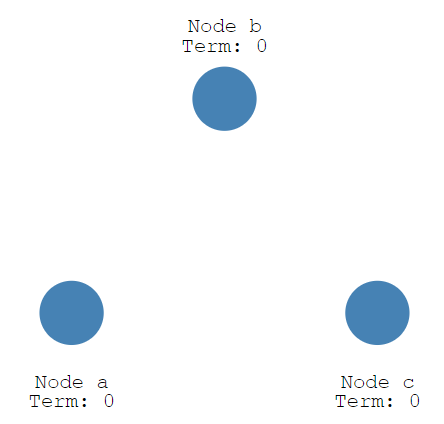

Raft:http://thesecretlivesofdata.com/raft/

Raft is a protocol for implementing distributed consensus.

Let's look at a high level overview of how it works.

A node can be in 1 of 3 states:The *Follower* state,the *Candidate* state,or the *Leader* state.

## This process is called *Leader Election*.

All our nodes start in the follower state.If followers don't hear from a leader then they can become a candidate.The candidate then requests votes from other nodes.Nodes will reply with their vote.The candidate becomes the leader if it gets votes from a majority of nodes.

## This process is called *Log Replication*.

All changes to the system now go through the leader.Each change is added as an entry in the node's log.This log entry is currently uncommitted so it won't update the node's value.To commit the entry the node first replicates it to the follower nodes...then the leader waits until a majority of nodes have written the entry.The entry is now committed on the leader node and the node state is "5".The leader then notifies the followers that the entry is committed.The cluster has now come to consensus about the system state.